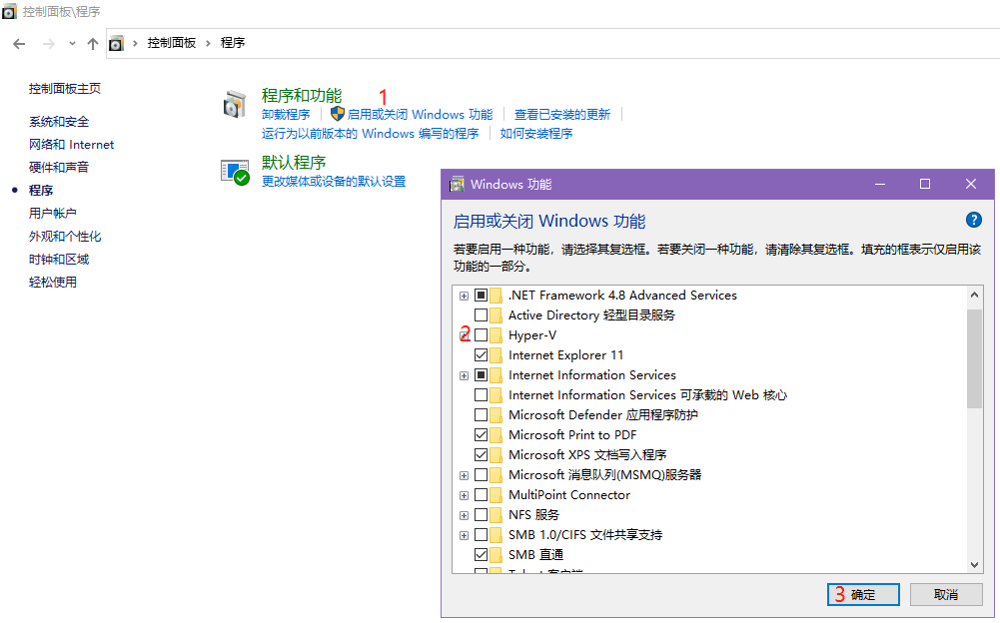
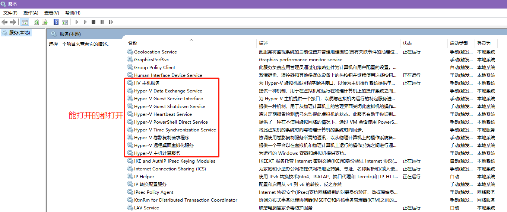
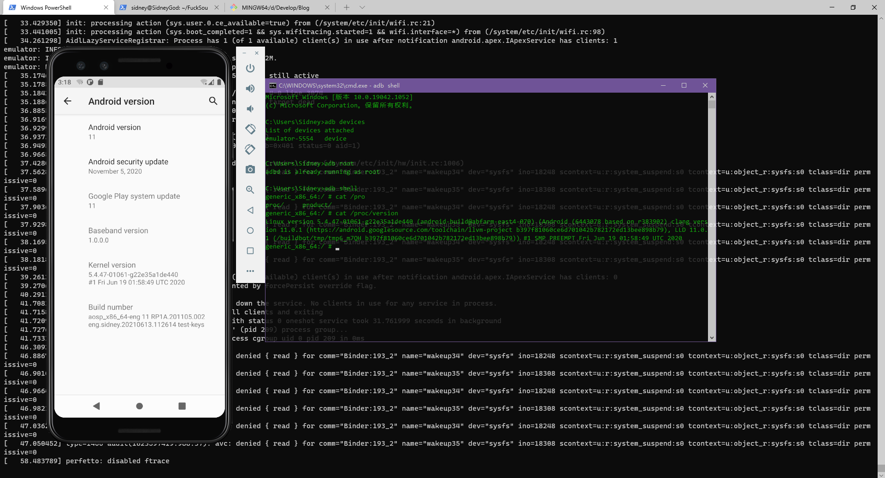
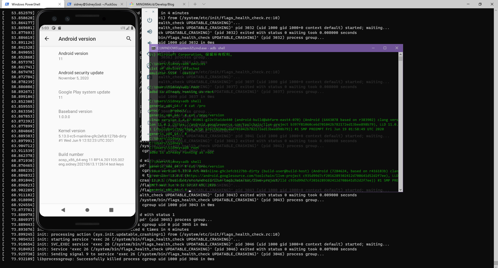

手里就一台笔记本，可不想把系统换成Linux的，毕竟有很多操作还是很不方便，但是又想学习学习Android源码，所以，总得找点什么凑活着用的办法，于是我把目光放到了Win10上的Linux子系统上了，也就是WSL，毕竟虚拟机太废内存划不来，亲测

CPU：AMD Ryzen 7 4800H with Radeon Graphics 2.90 GHz

RAM：16G

ROM：512G SSD + 2T HDD

GPU：GTX 1650

跑起来不说多么流畅，反正不卡，可能编译慢点，咱也不差那点时间，硬盘预留个256G的空间就够了。话不多说，记录一下这次操作的经历..

<!--more-->

# 1 安装WSL2

网上教程比较多，直接看微软官方教程即可：[在 Windows 10 上安装 WSL | Microsoft Docs]([在 Windows 10 上安装 WSL | Microsoft Docs](https://docs.microsoft.com/zh-cn/windows/wsl/install-win10#manual-installation-steps))

我这里按照教程装了Ubuntu-18.04，推荐也安装个Windows Terminal，还是挺好用的，可以看看这个：[Windows Terminal 完美配置 PowerShell 7.1 - 知乎 (zhihu.com)](https://zhuanlan.zhihu.com/p/137595941)

按照这个方法安装完了呢，WSL2所有东西都是默认放在C盘的，咱可是要做大事的人，C盘怕是放不太下，啥？你就一个盘，好的，当我没说。

## 1.1 WSL2挪位

我C盘就200G显然不能够干大事，所以就转移到E盘了，于是，咱们打开powershell或者Windows Terminal：

```powershell
# 导出导入Ubuntu18
## 路径太长 看着不舒服 换一下
PS C:\Users\Sidney\AppData\Local\Packages\CanonicalGroupLimited.Ubuntu18.04onWindows_79rhkp1fndgsc\LocalState> cd ~
PS C:\Users\Sidney> wsl --shutdown
PS C:\Users\Sidney> wsl -l -v
  NAME            STATE           VERSION
* Ubuntu-18.04    Stopped         2
## 导出
PS C:\Users\Sidney> wsl --export Ubuntu-18.04  E:\wsl2\ubuntu18\ubuntu18.tar
PS C:\Users\Sidney> wsl --unregister Ubuntu-18.04
## 导入
PS C:\Users\Sidney> wsl --import Ubuntu-18.04 E:\wsl2\ubuntu18 E:\wsl2\ubuntu18\ubuntu18.tar
## 设置默认用户 就是之前安装wsl时创建的用户。此时会在 E:\wsl2\ubuntu18 下多一个ext4.vhdx 的文件
## 最好给一个完全控制权限 不然必须要管理员模式才能用
PS C:\Users\Sidney> ubuntu1804.exe config --default-user sidney

# 下面的可以不用执行，主要的是创建要给link
## 设置WSL要移动的位置
PS C:\Users\Sidney> $newLocation = "E:\wsl2\ubuntu18"
## 这里具体位置可能不同 找到CanonicalGroupLimited.Ubuntu18.04onWindows开头就不会错了
PS C:\Users\Sidney> cd ~\AppData\Local\Packages\CanonicalGroupLimited.Ubuntu18.04onWindows_79rhkp1fndgsc\LocalState
## 彻底关闭wsl
PS C:\Users\Sidney\AppData\Local\Packages\CanonicalGroupLimited.Ubuntu18.04onWindows_79rhkp1fndgsc\LocalState> wsl --shutdown
## 下面这些命令 需要启用hype-v相关服务 不然会报没这个命令啥的 如果不需要 移动完了再关掉就行了
## 主要是两个地方 一个是 启用或关闭Windows功能 另一个是 服务 后面放张图
PS C:\Users\Sidney\AppData\Local\Packages\CanonicalGroupLimited.Ubuntu18.04onWindows_79rhkp1fndgsc\LocalState> Optimize-VHD .\ext4.vhdx -Mode Full
## 创建目标位置
PS C:\Users\Sidney\AppData\Local\Packages\CanonicalGroupLimited.Ubuntu18.04onWindows_79rhkp1fndgsc\LocalState> mkdir $newLocation -Force
## 这就挪过去了
PS C:\Users\Sidney\AppData\Local\Packages\CanonicalGroupLimited.Ubuntu18.04onWindows_79rhkp1fndgsc\LocalState> mv ext4.vhdx $newLocation
PS C:\Users\Sidney\AppData\Local\Packages\CanonicalGroupLimited.Ubuntu18.04onWindows_79rhkp1fndgsc\LocalState> cd ..
PS C:\Users\Sidney\AppData\Local\Packages\CanonicalGroupLimited.Ubuntu18.04onWindows_79rhkp1fndgsc\LocalState> rm LocalState
## 这实际上就类似于Linux上的link
PS C:\Users\Sidney\AppData\Local\Packages\CanonicalGroupLimited.Ubuntu18.04onWindows_79rhkp1fndgsc\LocalState> New-Item -ItemType SymbolicLink -Path "LocalState" -Target $newLocation
```

至此已经完成了wsl的迁移，已经可以用了

贴两张图

一个是 启用或关闭Windows功能，`Win + R` -- 输入"control"，回车 -- 程序



另一个是 服务，`Win + R` -- 输入"services.msc"，回车



接下来需要考虑一件事，把Android源码放在哪？如果放在宿主机，Win10上，最好开启大小写敏感，以及得考虑后面权限的事情，我怕麻烦，最后决定就放wsl里面好了

```powershell
# 开启大小写敏感
fsutil file SetCaseSensitiveInfo E:\workspace\AOSP enable
fsutil file SetCaseSensitiveInfo E:\workspace\CCACHE enable
# 关闭大小写敏感
fsutil file SetCaseSensitiveInfo E:\workspace\AOSP disable
fsutil file SetCaseSensitiveInfo E:\workspace\CCACHE disable
```

如果想要看代码，可以在wsl里面再弄个opengrok：[Build OpenGrok To Read the Fuck Source Code | Sidney God](https://sidneygod.github.io/posts/ad7ab3b5/)

## 1.2 WSL2配置

我也是后来才想起来的，这儿么点配置，编译Android有点费事不说，还有可能编不了，我们需要对wsl做点什么：[Manage Linux Distributions | Microsoft Docs](https://docs.microsoft.com/en-us/windows/wsl/wsl-config)

```powershell
# 在Windows的user根目录创建.wslconfig文件 啥？你问我为啥有vim cat..命令？我装了git啊
PS C:\Users\Sidney> vim ~\.wslconfig
[wsl2]
#memory=8GB # Limits VM memory in WSL 2 to 4 GB
processors=4 # Makes the WSL 2 VM use two virtual processors
swap=16GB  # 你不设置 貌似没有swap
swapFile=%USERPROFILE%\AppData\Local\Temp\swap.vhdx
localhostForwarding=true

[interop]
enabled=false
appendWindowsPath=false

# 然后需要重启才能生效
PS C:\Users\Sidney> wsl --shutdown

# 最好再用管理员模式打开powershell输入以下命令
net stop LxssManager
net start LxssManager
```

## 1.3 WSL2扩容

WSL2使用虚拟硬件磁盘(VHD)来存储Linux文件。如果达到其最大大小，则可能需要对其进行扩展。WSL2 VHD使用ext4文件系统,此VHD会自动调整大小以满足你的存储需求，并且其最大大小为256GB。如果你的分发版大小增长到大于256GB，则会显示错误，指出磁盘空间不足。 可以通过扩展 VHD 大小来纠正此错误。若要将最大 VHD 大小扩展到超过 256GB，请执行以下操作：

以管理员模式打开powershell

```powershell
PS C:\WINDOWS\system32> diskpart

Microsoft DiskPart 版本 10.0.19041.964

Copyright (C) Microsoft Corporation.
在计算机上: SIDNEYGOD
# 找不到咱的虚拟磁盘
DISKPART> list vol

  卷 ###      LTR  标签         FS     类型        大小     状态       信息
  ----------  ---  -----------  -----  ----------  -------  ---------  --------
  卷     0     E   Data         NTFS   磁盘分区        1863 GB  正常
  卷     1     C   System       NTFS   磁盘分区         200 GB  正常         启动
  卷     2     D   Software     NTFS   磁盘分区         275 GB  正常
  卷     3         SYSTEM_DRV   FAT32  磁盘分区         260 MB  正常         系统
  卷     4         WINRE_DRV    NTFS   磁盘分区        1000 MB  正常         已隐藏
DISKPART> list vdisk

没有要显示的虚拟磁盘。
# 但是咱知道在哪啊 选中
DISKPART> Select vdisk file="E:\wsl2\ubuntu18\ext4.vhdx"
# 扩展
DISKPART> expand vdisk maximum="358400"
# 退出
DISKPART> exit
```

## 1.4 WSL2压缩

上面扩容完了有时候又会觉得分的太大，浪费，又想收回来，所以又得要个压缩空间的法子，同样是管理员模式打开powershell

```shell
# 关闭wsl
wsl.exe --shutdown
# 查看当前子系统是不是在stopped状态
wsl.exe --list --verbose
# 进入磁盘管理
diskpart
# 选中要操作的虚拟磁盘
select vdisk file="E:\wsl2\ubuntu18\ext4.vhdx"
# 压缩
compact vdisk
# 等一会
100 百分比已完成
# 退出
exit
```

到这里算是把wsl折腾完了

# 2 编译Android

我这里为啥没选Android S呢，完全是因为编不懂，编system的时候总是segment fault，并且当时也忘了设置swap试试，所以就试试Android R了，结果还是比较满意的

## 2.1 prepare

Ubuntu换源，基础的东西装一下。首先，Java得要安装吧，百度一下

```bash
# 换源
sudo mv /etc/apt/sources.list /etc/apt/sources.list.bak
sudo vim /etc/apt/sources.list

deb http://mirrors.aliyun.com/ubuntu/ bionic main restricted universe multiverse
deb http://mirrors.aliyun.com/ubuntu/ bionic-security main restricted universe multiverse
deb http://mirrors.aliyun.com/ubuntu/ bionic-updates main restricted universe multiverse
deb http://mirrors.aliyun.com/ubuntu/ bionic-proposed main restricted universe multiverse
deb http://mirrors.aliyun.com/ubuntu/ bionic-backports main restricted universe multiverse
deb-src http://mirrors.aliyun.com/ubuntu/ bionic main restricted universe multiverse
deb-src http://mirrors.aliyun.com/ubuntu/ bionic-security main restricted universe multiverse
deb-src http://mirrors.aliyun.com/ubuntu/ bionic-updates main restricted universe multiverse
deb-src http://mirrors.aliyun.com/ubuntu/ bionic-proposed main restricted universe multiverse
deb-src http://mirrors.aliyun.com/ubuntu/ bionic-backports main restricted universe multiverse
# 主要是libesd0-dev
deb http://us.archive.ubuntu.com/ubuntu/ xenial main universe
deb-src http://us.archive.ubuntu.com/ubuntu/ xenial main universe

sudo apt update
sudo apt upgrade

# 装Java，不要装11..
sudo add-apt-repository ppa:linuxuprising/java
sudo apt update
apt list | grep oracle-java
sudo apt install oracle-java17-installer
sudo apt install oracle-java17-set-default
```

然后git配置一下，我发现这个git是有缺陷的，有需要最好重新安装一下

然后把Android编译需要的东西安装一下

```bash
sudo apt-get install gcc python bc git-core gnupg flex bison gperf libsdl1.2-dev \
libesd0-dev squashfs-tools build-essential zip curl \
libncurses5-dev zlib1g-dev pngcrush schedtool libxml2 libxml2-utils \
xsltproc lzop libc6-dev schedtool g++-multilib lib32z1-dev lib32ncurses5-dev \
lib32readline6-dev gcc-multilib libswitch-perl libssl1.0.0 libssl-dev
```

查询想要下载的分支：https://android.googlesource.com/platform/manifest/+refs，需要翻墙能力，或者用github也行：[aosp-mirror/platform_manifest (github.com)](https://github.com/aosp-mirror/platform_manifest)

我最终选的是android11-release

## 2.2 Compile AOSP

这里主要参考了：https://gitee.com/SidneyGod/ImagePlace/blob/master/attachments/exercises-210203.pdf

关于Android源码的下载，由于墙的原因，必然只能找镜像的，清华源，北外源，中科大源都是ok的

[AOSP | 镜像站使用帮助 | 清华大学开源软件镜像站 | Tsinghua Open Source Mirror](https://mirrors.tuna.tsinghua.edu.cn/help/AOSP/)

[AOSP | 镜像站使用帮助 | 北京外国语大学开源软件镜像站 | BFSU Open Source Mirror](https://mirrors.bfsu.edu.cn/help/AOSP/)

[AOSP 镜像使用帮助 — USTC Mirror Help 文档](http://mirrors.ustc.edu.cn/help/aosp.html)

建议repo啥的，直接都用这些源提供的就好

```bash
# 这就不解释了 直接加到PATH里面就好了
curl https://mirrors.tuna.tsinghua.edu.cn/git/git-repo -o repo
chmod +x repo
# 创建aosp目录
mkdir -p ~/FuckSourceCode/1-android11-release
cd ~/FuckSourceCode/1-android11-release
## 这里一定要加--depth=1，省点空间，还快一点
repo init -u git://mirrors.ustc.edu.cn/aosp/platform/manifest -b android11-release --depth=1 --no-tags
## -j4就可以了 太多会被服务器拉黑的
repo sync -j4 --fail-fast --force-sync
## 然后就是常规的编译
source build/envsetup.sh
lunch aosp_x86_64-eng
make -j4
# 经过漫长的几把王者荣耀 编译完成 展示一下主要的东西
sidney@SidneyGod:~/FuckSourceCode/1-android11-release$ ls out/target/product/generic_x86_64/ -la
total 6757124
drwxr-xr-x 20 sidney sidney       4096 Jun 12 22:07 .
drwxr-xr-x  3 sidney sidney       4096 Jun  6 17:00 ..
-rw-r--r--  1 sidney sidney        356 Jun 12 22:07 VerifiedBootParams.textproto
-rw-r--r--  1 sidney sidney        383 Jun  6 17:06 advancedFeatures.ini
-rw-r--r--  1 sidney sidney   18874368 Jun  6 17:06 encryptionkey.img
-rw-r--r--  1 sidney sidney   14157728 Jun 12 22:03 kernel-ranchu
-rw-r--r--  1 sidney sidney    2927776 Jun 12 22:03 ramdisk-qemu.img
drwxr-xr-x 15 sidney sidney       4096 Jun 12 22:05 system
-rw-r--r--  1 sidney sidney 3232759808 Jun 12 22:08 system-qemu.img
-rw-r--r--  1 sidney sidney  576716800 Jun 12 22:03 userdata.img
-rw-r--r--  1 sidney sidney   68157440 Jun 12 22:05 vendor-qemu.img
```

编译完了当然要看看咱们的成果了，由于咱是在WSL里面弄的，肯定不能敲一个emulator命令了事

首先，它需要一个模拟器，去下载Android Studio并且创建一个模拟器，这一部不详细说了

比如我这里创建的模拟器和下载的image是

```powershell
PS C:\Users\Sidney> emulator -list-avds
Pixel_3_Edited_API_30
# 不带playstore的
PS C:\Users\Sidney> ls D:\Develop\Environments\sdk\system-images\android-30\google_apis\x86_64\

    目录: D:\Develop\Environments\sdk\system-images\android-30\google_apis\x86_64

Mode                 LastWriteTime         Length Name
----                 -------------         ------ ----
d-----          2021/6/7     22:09                data
-a----         2021/6/12     22:08            383 advancedFeatures.ini
-a----         2021/6/12     22:08           2271 build.prop
-a----         2021/6/12     22:08       18874368 encryptionkey.img
-a----         2021/6/12     22:08       14157728 kernel-ranchu
-a----          2021/6/7     22:09        2984443 NOTICE.txt
-a----          2021/6/7     22:09          18153 package.xml
-a----         2021/6/12     22:08        2927776 ramdisk.img
-a----          2021/6/7     22:09            294 source.properties
-a----         2021/6/12     22:08     3232759808 system.img
-a----         2021/6/12     22:08      576716800 userdata.img
-a----         2021/6/12     22:08       68157440 vendor.img
-a----         2021/6/12     22:08            356 VerifiedBootParams.textproto
```

可以看到核心也就这么几个文件，把这些文件备份一下，拷入我们编译出来的image

```bash
# 忘了说，其实对于宿主机win10的磁盘都是以挂载的形式存在于wsl中的 所以直接cp过去就完了
# 这里要注意 有qemu的image就用qemu的，bootimage是kernel-ranchu
cp out/target/product/generic_x86_64/VerifiedBootParams.textproto /mnt/d/Develop/Android/MySystemImg/
cp out/target/product/generic_x86_64/advancedFeatures.ini /mnt/d/Develop/Android/MySystemImg/
cp out/target/product/generic_x86_64/encryptionkey.img /mnt/d/Develop/Android/MySystemImg/
cp out/target/product/generic_x86_64/kernel-ranchu /mnt/d/Develop/Android/MySystemImg/
cp out/target/product/generic_x86_64/ramdisk-qemu.img /mnt/d/Develop/Android/MySystemImg/ramdisk.img
cp out/target/product/generic_x86_64/system-qemu.img /mnt/d/Develop/Android/MySystemImg/system.img
cp out/target/product/generic_x86_64/userdata.img /mnt/d/Develop/Android/MySystemImg/
cp out/target/product/generic_x86_64/vendor-qemu.img /mnt/d/Develop/Android/MySystemImg/vendor.img
cp out/target/product/generic_x86_64/system/build.prop /mnt/d/Develop/Android/MySystemImg/

# 拷贝完了 理论上咱编的system就能起来了
emulator -avd Pixel_3_Edited_API_30 -writable-system -wipe-data -show-kernel -skip-adb-auth -no-cache
```

看一下，效果还是可以的



只不过这里的kernel其实是源码里自带的，没有源码，所以略显僵硬，注意这里的内核版本

```shell
C:\Users\Sidney>adb shell
generic_x86_64:/ # cat /proc/version
Linux version 5.4.47-01061-g22e35a1de440 (android-build@abfarm-east4-070) (Android (6443078 based on r383902) clang version 11.0.1 (https://android.googlesource.com/toolchain/llvm-project b397f81060ce6d701042b782172ed13bee898b79), LLD 11.0.1 (/buildbot/tmp/tmp6_m7QH b397f81060ce6d701042b782172ed13bee898b79)) #1 SMP PREEMPT Fri Jun 19 01:58:49 UTC 2020
```

下面继续整个内核源码

## 2.3 Compile Kernel

貌似从Android11开始，内核整了个gki，[Android 通用内核  | Android 开源项目  | Android Open Source Project (google.cn)](https://source.android.google.cn/devices/architecture/kernel/android-common?hl=zh-cn)

关于内核的版本我选择了与参考文档不一样的版本，不是common-android11-5.4，而是common-android-mainline，毕竟根据Android官方文档介绍，common-android-mainline看起来才是祖宗，于是乎

```bash
sidney@SidneyGod:~/FuckSourceCode$ mkdir 2-common-android-mainline
sidney@SidneyGod:~/FuckSourceCode$ cd 2-common-android-mainline
sidney@SidneyGod:~/FuckSourceCode/2-common-android-mainline$ repo init -u http://mirrors.tuna.tsinghua.edu.cn/git/AOSP/kernel/manifest -b common-android11-5.4 --depth=1
sidney@SidneyGod:~/FuckSourceCode/2-common-android-mainline$ repo sync -j4
```

代码下载完成后，并不能直接进行编译，而是需要改一个地方

```diff
sidney@SidneyGod:~/FuckSourceCode/2-common-android-mainline$ cd common
sidney@SidneyGod:~/FuckSourceCode/2-common-android-mainline/common$ git diff

diff --git a/arch/x86/configs/gki_defconfig b/arch/x86/configs/gki_defconfig
index d120cc284..9147503b3 100644
--- a/arch/x86/configs/gki_defconfig
+++ b/arch/x86/configs/gki_defconfig
@@ -1,5 +1,5 @@
 CONFIG_LOCALVERSION="-mainline"
-CONFIG_KERNEL_LZ4=y
+CONFIG_KERNEL_BZIP2=y
# CONFIG_USELIB is not set
 CONFIG_AUDIT=y
 CONFIG_NO_HZ=y
```

貌似是因为Ubuntu18不支持LZ4打包，改成BZIP2就可以了，于是：

```bash
# 这两句其实编译得还算挺快的了
sidney@SidneyGod:~/FuckSourceCode/2-common-android-mainline$ SKIP_MRPROPER=1 BUILD_CONFIG=common/build.config.gki.x86_64 build/build.sh
sidney@SidneyGod:~/FuckSourceCode/2-common-android-mainline$ SKIP_MRPROPER=1 BUILD_CONFIG=common-modules/virtual-device/build.config.virtual_device.x86_64 build/build.sh

# 完了之后呢 回到刚才的android11-release目录 把源码自带的kernel备份一下
sidney@SidneyGod:~/FuckSourceCode/2-common-android-mainline$ cd ../1-android11-release
sidney@SidneyGod:~/FuckSourceCode//1-android11-release$ cp prebuilts/qemu-kernel/x86_64/5.4 prebuilts/qemu-kernel/x86_64/5.4.bak
# 再回到kernel目录
sidney@SidneyGod:~/FuckSourceCode/1-android11-release$ cd ../2-common-android-mainline
# 把android11-release中kernel的东西删掉
sidney@SidneyGod:~/FuckSourceCode/2-common-android-mainline$ rm -rf ../1-android11-release/prebuilts/qemu-kernel/x86_64/5.4/kernel-qemu2
sidney@SidneyGod:~/FuckSourceCode/2-common-android-mainline$ rm -rf ../1-android11-release/prebuilts/qemu-kernel/x86_64/5.4/ko/*
# 将刚刚编译好的kernel拷贝到android11-release中
sidney@SidneyGod:~/FuckSourceCode/2-common-android-mainline$ cp out/android-mainline/dist/bzImage /home/sidney/FuckSourceCode/1-android11-release/prebuilts/qemu-kernel/x86_64/5.4/kernel-qemu2
sidney@SidneyGod:~/FuckSourceCode/2-common-android-mainline$ out/android-mainline/dist/*.ko /home/sidney/FuckSourceCode/1-android11-release/prebuilts/qemu-kernel/x86_64/5.4/ko/
# 再回到android11-release目录 整编一下aosp
sidney@SidneyGod:~/FuckSourceCode/2-common-android-mainline$ cd ../1-android11-release
sidney@SidneyGod:~/FuckSourceCode/1-android11-release$ make -j4
```

最后的步骤当然和前面的一摸一样了，把编译出来的image拷贝到宿主机中

```bash
# 这里要注意 不要漏任何一个image 否则总会有一些奇奇怪怪的错误出现
cp out/target/product/generic_x86_64/VerifiedBootParams.textproto /mnt/d/Develop/Android/MySystemImg/
cp out/target/product/generic_x86_64/advancedFeatures.ini /mnt/d/Develop/Android/MySystemImg/
cp out/target/product/generic_x86_64/encryptionkey.img /mnt/d/Develop/Android/MySystemImg/
cp out/target/product/generic_x86_64/kernel-ranchu /mnt/d/Develop/Android/MySystemImg/
cp out/target/product/generic_x86_64/ramdisk-qemu.img /mnt/d/Develop/Android/MySystemImg/ramdisk.img
cp out/target/product/generic_x86_64/system-qemu.img /mnt/d/Develop/Android/MySystemImg/system.img
cp out/target/product/generic_x86_64/userdata.img /mnt/d/Develop/Android/MySystemImg/
cp out/target/product/generic_x86_64/vendor-qemu.img /mnt/d/Develop/Android/MySystemImg/vendor.img
cp out/target/product/generic_x86_64/system/build.prop /mnt/d/Develop/Android/MySystemImg/

# 拷贝完了 理论上咱编的system就能起来了
emulator -avd Pixel_3_Edited_API_30 -writable-system -wipe-data -show-kernel -skip-adb-auth -no-cache
```

再上效果图



再看看这里的内核版本

```bash
C:\Users\Sidney>adb shell
generic_x86_64:/ # cat /proc/version
Linux version 5.13.0-rc5-mainline-g9c2efcb127bb-dirty (build-user@build-host) (Android (7284624, based on r416183b) clang version 12.0.5 (https://android.googlesource.com/toolchain/llvm-project c935d99d7cf2016289302412d708641d52d2f7ee), LLD 12.0.5 (/buildbot/src/android/llvm-toolchain/out/llvm-project/lld c935d99d7cf2016289302412d708641d52d2f7ee)) #1 SMP PREEMPT Wed Jun 9 12:52:23 UTC 2021
```

到这里就说明成功了，至此，kernel和system都可以顺利编译了

另外，如果拷贝完image到宿主机后，发现无法开机，并报下面的错，那可能是image没编好，kernel不适配，重新整编一下就好了

```
[    1.785501] init: Failed to insmod '/lib/modules/dummy-cpufreq.ko' with args ''
[    1.789747] init: LoadWithAliases was unable to load dummy_cpufreq
[    1.793175] init: [libfs_mgr]ReadFstabFromDt(): failed to read fstab from dt
[    1.797138] init: Using Android DT directory /proc/device-tree/firmware/android/
[    1.824079] init: bool android::init::BlockDevInitializer::InitDevices(std::set<std::string>): partition(s) not found in /sys, waiting for their uevent(s): metadata, super, vbmeta
[   11.844727] init: Wait for partitions returned after 10011ms
[   11.848915] init: bool android::init::BlockDevInitializer::InitDevices(std::set<std::string>): partition(s) not found after polling timeout: metadata, super, vbmeta
[   11.855918] init: Failed to mount required partitions early ...
[   11.859722] init: InitFatalReboot: signal 6
```

# Android12编译后起不来

首先AndroidS和AndroidR的操作基本没啥区别，只不过lunch时候的选项可能需要改一下，因为用`aosp_x86_64-eng`编译完成后没有qemu的image和`userdata.img`，就像stack overflow上这样[android 12 latest release: Emulator build not running for android-12.0.0_r2 aosp release - Stack Overflow](https://stackoverflow.com/questions/69553871/android-12-latest-release-emulator-build-not-running-for-android-12-0-0-r2-aosp/69780243#69780243)

```
Error: out/target/product/generic_arm64/userdata-qemu.img': No such file or directory
```

解决方案我也贴上去了，就是需要在`build/make/target/product/AndroidProducts.mk`下面加一句

```diff
diff --git a/target/product/AndroidProducts.mk b/target/product/AndroidProducts.mk
index 7d9d90e..419cccb 100644
--- a/target/product/AndroidProducts.mk
+++ b/target/product/AndroidProducts.mk
@@ -84,3 +84,4 @@ COMMON_LUNCH_CHOICES := \
     aosp_arm-eng \
     aosp_x86_64-eng \
     aosp_x86-eng \
+    sdk_phone_x86_64-eng \
```

然后lunch的时候选择`sdk_phone_x86_64-eng`就好了..

# Android12 kernel无效

Android12的kernel不在`prebuilts/qemu-kernel/x86_64/`，这里面也没有5.10，而是在

`kernel/prebuilts/5.10/x86_64/kernel-5.10`和`kernel/prebuilts/common-modules/virtual-device/5.10/x86-64/*.ko`，对应的bzImage和ko文件挪到这里就好了，注意不要把bp文件给删了
