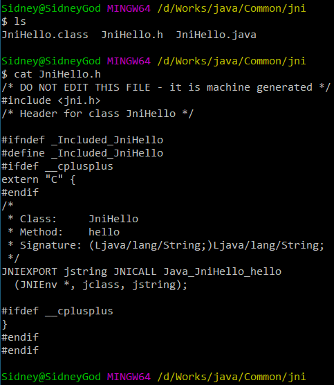
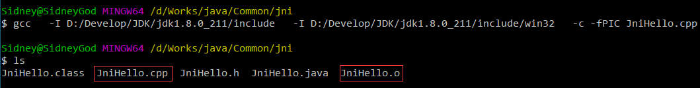
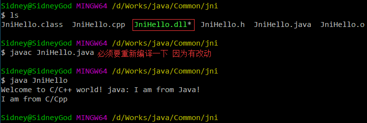
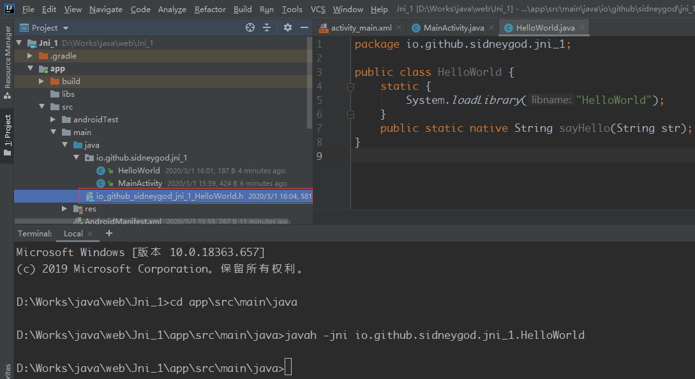
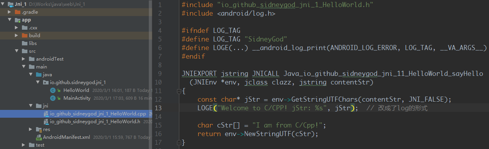
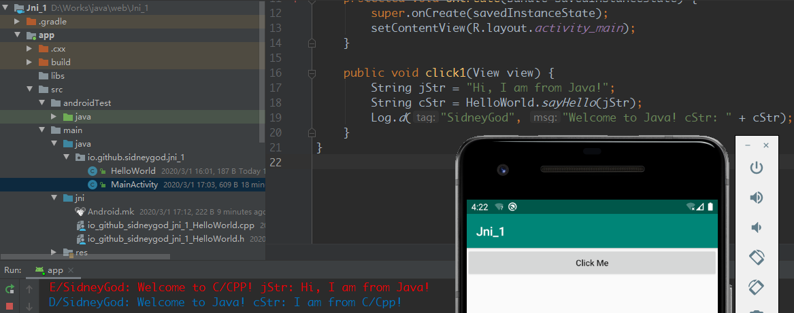
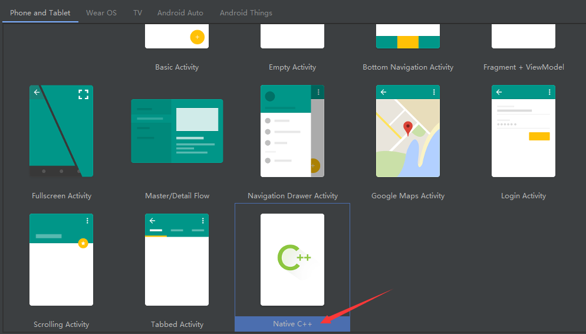
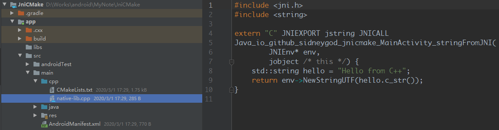
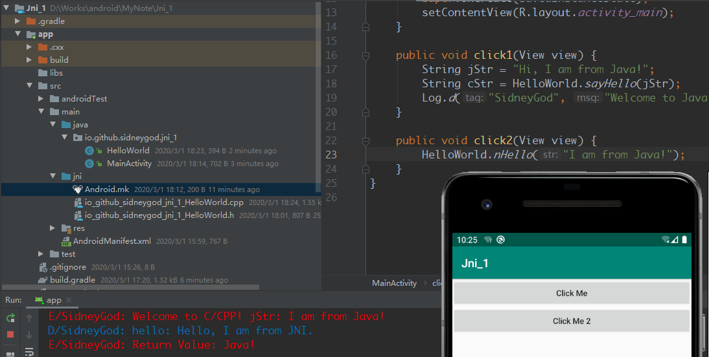

# 1 JNI

JNI(Java Native Interface)，提供了若干API实现了Java和其他语言(主要是C/C++)的通信。简单来说就是Java想要调用C/C++的接口必须遵循JNI的规范

牵涉到一个很重要的头文件`jni.h`，这个头文件的位置：`\jdk1.8.0_211\include\jni.h`，如果是Linux，或许是`/usr/lib/jvm/java-8-openjdk-amd64/include/jni.h`。这个头文件定义了数据类型，JNIInterface(定义了很多函数指针，就是一些接口)

那么为什么要有JNI这个东西，Java虽说是与平台无关的，但是支撑它的虚拟机不是啊，那玩意还得用native语言来完成，这不就是一个理由了

## 1.1 hello world

1. 创建一个`JniHello.java`, 并声明一个native函数`sayHello()`<!--more-->

```java
public class JniHello {
    // define a native function
    public static native String hello(String str);

    public static void main(String[] args) {

    }
}
```

2. 生产C/C++头文件

```bash
# 先编译 生成class文件
javac JniHello.java
# 生成头文件
javah JniHello
```



3. 编写对应的C/C++函数，实现`JniHello.h`中声明的方法

```c++
// JniHello.cpp 这里c和cpp文件是有区别的
#include "JniHello.h"
#include <iostream>

JNIEXPORT jstring JNICALL Java_JniHello_hello
  (JNIEnv *env, jclass clazz, jstring contentStr)
{
    // 必须是指针 可到jni.h去查
    const char* jstr = env->GetStringUTFChars(contentStr, JNI_FALSE);
    std::cout << "Welcome to C/C++ world! java: " << jstr << std::endl;

    // 创建字符串并返回
    char cStr[] = "I am from C/Cpp";
    return env->NewStringUTF(cStr);
}
```

4. 生成目标文件

```bash
# 一定要带上这两个目录 且看好是/而不是\，毕竟win容易出这个错
gcc \
  -I D:/Develop/JDK/jdk1.8.0_211/include \
  -I D:/Develop/JDK/jdk1.8.0_211/include/win32 \
  -c -fPIC JniHello.cpp
# 如果出现 fatal error: jni.h: No such file or directory 肯定是因为没带目录
```



5. 生成C/C++共享库

```bash
# 库文件名格式(name可以随便改): <name> + .dll
g++ -shared JniHello.o -o JniHello.dll
# 为什么是g++而不是gcc，因为会报错..其实貌似是因为gcc不识别c++?
# 因为是windows所以是<name> + .dll，如果是Linux就是lib + <name> + .so了
```

总之执行完后，目录下会多出一个`JniHello.dll`文件

6. Java文件中加载共享库并调用函数

```java
public class JniHello {
    static {
        // JniHello + .dll
        System.loadLibrary("JniHello");
    }
    
    // define a native function
    public static native String hello(String str);
    
    public static void main(String[] args) {
        // call hello
        String str = hello("I am from Java!");
        System.out.println(str);
    }
}
```

7. 编译运行Java文件



以上就是在Windows下，纯手撸java调c的过程了，前提是要配置好gcc或其他C/C++编译器

## 1.2 JNI原理

计算机系统中，每种语言都有一个执行环境(Runtime)用于解释执行语言中的语句，不同种的语言一般是不能存在同一种环境的。人鬼殊途

### 1.2.1 JavaVM

Java执行环境是JVM，其实是主机环境中的一个进程，每个JVM在本地环境都有一个JavaVM结构体，该结构体在创建JVM时返回

```c
JNI_CreateJavaVM(JavaVM **pvm, void **penv, void *args);
```

JavaVM是JVM在JNI层的代表，JNI全局仅仅有一个JavaVM结构体，其中封装了一些函数指针(函数表结构)，JavaVM中封装的这些函数指针主要是针对JVM操作接口。另外，在C和CPP中JavaVM中定义有所不同

```c
/*
 * JNI Invocation Interface.
 */
#ifdef __cplusplus
typedef JavaVM_ JavaVM;
#else
typedef const struct JNIInvokeInterface_ *JavaVM;
#endif
```

在CPP中对JavaVM进行了一次封装，少一个参数，所以推荐使用CPP

### 1.2.2 JNIEnv

在`jni.h`中还声明一样东西

```c
/*
 * JNI Native Method Interface.
 */
#ifdef __cplusplus
typedef JNIEnv_ JNIEnv;
#else
typedef const struct JNINativeInterface_ *JNIEnv;
#endif
```

JNIEnv是当前Java线程执行环境，一个JVM对应一个JavaVM结构体，而一个JVM可以创建多个Java线程，每一个Java线程对应一个JNIEnv结构，他们保存在线程本地存储TLS中。因此，不同线程的JNIEnv是不同的，不能共用。JNIEnv也是一个函数表，在本地代码中通过JNIEnv的函数表来操作Java数据或调用Java方法。

从这里也可看出来，c和cpp在使用env时的区别了

# 2 Android JNI

Android中使用JNI需要NDK(Native Develop Kit)，先体验一把

## 2.1 Java call C/CPP

### 2.1.1 传统方式

1. 创建`HelloWorld.java`并点击一下**Build**

   ```java
   package io.github.sidneygod.jni_1;
   
   public class HelloWorld {
       static {
           System.loadLibrary("HelloWorld");
       }
       public static native String sayHello(String str);
   }
   ```

2. 生成c/cpp头文件

   可以直接找到对应的`HelloWorld.class`文件，然后使用`javah -jni HelloWorld`

   也可以这样，在IDE的Terminal中，进入`app/src/main/java/`，输入对应的指令

   `javah -jni io.github.sidneygod.jni_1.HelloWorld`

   

   3. 在main下创建jni目录，编写对应的c/cpp文件

   这里不在赘述c/cpp文件，记得把刚刚的头文件也给拷过来，比较烦人的是，不能用cout..所以改成了ndk的log

   

   4. 编写`Android.mk`文件

   在jni目录创建`Android.mk`文件

   ```makefile
   LOCAL_PATH := $(call my-dir)
   include $(CLEAR_VARS)
   LOCAL_MODULE := HelloWorld
   LOCAL_SRC_FILES := io_github_sidneygod_jni_1_HelloWorld.cpp
   # 为了能打印log
   LOCAL_LDLIBS := -lm -llog
   include $(BUILD_SHARED_LIBRARY)
   ```

   5. 修改app下的`build.gradle`

   ```groovy
   apply plugin: 'com.android.application'
   
   android {
       ...
       defaultConfig {
           ...
           ndk {
               // 这个moduleName和mk文件的LOCAL_MODULE一致
               moduleName "HelloWorld"
               // 打印日志需要的
               ldLibs "log", "z", "m"
               // 指定生成对应版本的库文件 不加这句话默认生成全部
               abiFilters "arm64-v8a", "armeabi-v7a", "x86_64", "x86"
           }
       }
       buildTypes {
           ...
           externalNativeBuild {
               ndkBuild {
                   path 'src/main/jni/Android.mk'
               }
           }
       }
   }
   ```

   改完了需要sync一下

   6. 编译运行

   

   和预想中的一毛一样..生成的库文件就在`build/intermediates/ndkBuild/debug/obj/local/x86/libHelloWorld.so`

   ### 2.1.2 CMake工具

   直接新建一个Native C++项目

   

   然后会自动生成一个demo，直接运行就可以了..

   

   可以看到多了个`CMakeLists.txt`, 看一下`build.gradle`文件

   ```groovy
   apply plugin: 'com.android.application'
   
   android {
       compileSdkVersion 29
       buildToolsVersion "29.0.3"
       defaultConfig {
           ...
           externalNativeBuild {
               cmake {
                   cppFlags ""
               }
           }
       }
       ...
       externalNativeBuild {
           cmake {
               path "src/main/cpp/CMakeLists.txt"
               version "3.10.2"
           }
       }
   }
   ```

   出现了两次`externalNativeBuild`

   第一次: 填写CMake参数, 详情参考[CMake|Android NDK](https://developer.android.google.cn/ndk/guides/cmake.html)

   第二次: 指明`CMakeLists.txt`路径

   看看这个`CMakeLists.txt`到底是什么鬼

   ```cmake
   cmake_minimum_required(VERSION 3.4.1)
   ...
   add_library(
                native-lib
                SHARED
                native-lib.cpp )
   ...
   find_library(
                 log-lib
                 log )
   ...
   target_link_libraries(
                          native-lib
                          ${log-lib} )
   ```

- `cmake_minimum_required()`: 指定CMake最小版本

- `add_library`: 创建一个静态或者动态库
  - `native-lib`: 是库的名字
  - `SHARED`: 是库的类别 动态还是静态
  - `native-lib.cpp`: 库原文件路径
- `find_library()`: 找到一个预编译的库, 将之作为变量存起来
  - `log-lib`: 设置路径变量名称
  - `log`: 制定NDK库的名字
- `target_link_libraries()`: 指定CMake链接到的目标库
  - `native-lib`: 指定的目标库
  - `${log-lib}`: 将目标库链接到NDK中的日志库

[CMake文档-英文](http://cmake.org/documentation) [CMake手册-中文](https://www.zybuluo.com/khan-lau/note/254724)

**注意: 与Instant Run不兼容**

## 2.2 C/Cpp call Java

### 2.2.1 函数签名

首先看一眼`jni.h`中对JNINativeMethod的定义

```c
typedef struct {
    char *name;
    char *signature;
    void *fnPtr;
} JNINativeMethod;
```

函数名, 函数指针都好理解, 多出来一个函数签名, 这是因为Java允许方法重载, 光靠名字是分别不出来是哪个方法的

查看一个类中函数的签名

```bash
# 一定要写对class文件的目录
javap -s JniHello.class
```

然后就可以看到一坨..

```java
Compiled from "JniHello.java"
public class JniHello {
  public JniHello();
    descriptor: ()V

  public static native java.lang.String hello(java.lang.String);
    descriptor: (Ljava/lang/String;)Ljava/lang/String;

  public static void main(java.lang.String[]);
    descriptor: ([Ljava/lang/String;)V

  static {};
    descriptor: ()V
}
```

第一个`()V`：默认构造函数的签名

第二个`(Ljava/lang/String;)Ljava/lang/String;`：是那个native函数的签名

第三个`([Ljava/lang/String;)V`：是main函数的签名

第四个`()V`：是哪个静态代码块的

JNI规范定义的函数签名信息(<font color=red>**注意这个”;” 不加是识别不出来的..**</font>)

```
(参数1类型标识;参数2类型标识;...;)返回值类型标识;
```

- 当类型是引用类型时: L+包名+类名, `Ljava/lang/String`
- 当类型是基本类型时: 除了boolean是Z, long是J, 其他全是基本类型首字母大写, V就是void
- 数组
  - 一般数组: [签名
  - `int[]`: [i
  - `String[]`: [LJava/lang/Object

### 2.2.2 实例

把那个啥上面传统方式的改一下

先在`HelloWorld.java`中加两个函数

```java
public class HelloWorld {
    static {
        System.loadLibrary("HelloWorld");
    }
    public static native String sayHello(String str);
    
    // 新增native函数
    public static native void nHello(String str);
    // native要调用的函数
    public static String hello(String str) {
        Log.d("SidneyGod", "hello: " + str);
        return "Java!";
    }
}
```

再去完善cpp文件新增的函数nHello

```c++
JNIEXPORT void JNICALL Java_io_github_sidneygod_jni_11_HelloWorld_nHello
  (JNIEnv *env, jclass clazz, jstring contentStr)
{
    const char* jStr = env->GetStringUTFChars(contentStr, JNI_FALSE);
    LOGE("Welcome to C/CPP! jStr: %s", jStr);

    // 获取HelloWorld的class 包名 + 类名
    jclass helloWorld = env->FindClass("io/github/sidneygod/jni_1/HelloWorld");

    // 获取HelloWorld的静态方法hello 类, 方法名, 方法签名
    jmethodID hello = env->GetStaticMethodID(
                          helloWorld,
                          "hello",
                          "(Ljava/lang/String;)Ljava/lang/String;");
    // 创建字符串
    jstring cStr = env->NewStringUTF("Hello, I am from JNI.");
    // 调用Java静态方法 类, 方法, 方法参数...
    jstring ret = (jstring) env->CallStaticObjectMethod(helloWorld, hello, cStr);
    // 打印返回值
    LOGE("Return Value: %s", env->GetStringUTFChars(ret, JNI_FALSE));
}
```

其他基本上没什么变化，在click2中调用`nHello()`，就会触发调用HelloWorld的`hello()`函数



