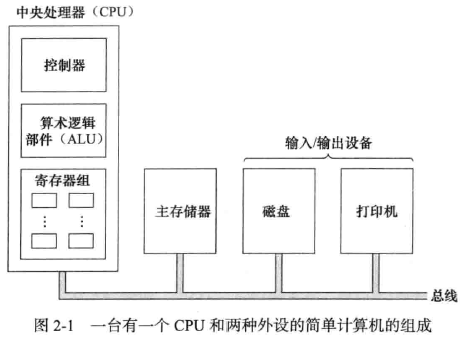
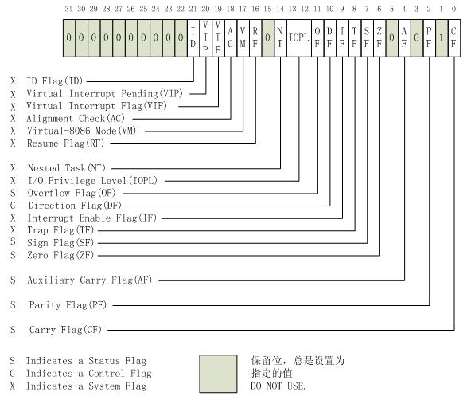
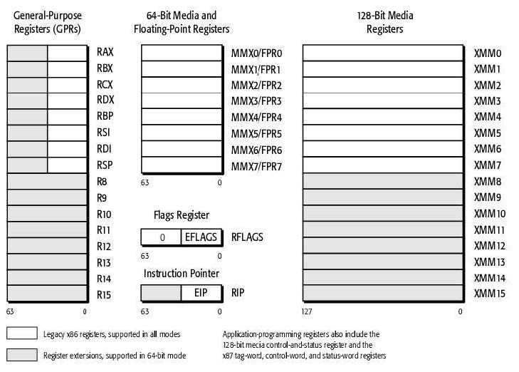

第二天的内容本该是，学习一些汇编指令和Makefile，在这之前我觉得有必要好好看看CPU结构，自古操作系统和组成原理就分不开啊

面向总线的计算机组成示意图。中央处理器，从主存储器中逐条进行取指令，分析指令和执行指令。计算机各组件通过总线连在一起，总线是一些平行导线的集合，用来传递地址，数据和控制信号，可以在CPU之外连接CPU，存储器及IO设备；也可以在CPU内部连接CPU的各个组成部分。

<!--more-->



# 1 CPU简介

控制单元：控制各个子系统的操作，控制是通过从控制单元发送到其他子系统的信号来进行

算术逻辑单元：对数据进行算数，逻辑和移位运算

寄存器：用来临时存放数据的高速独立的存储单元

1 数据寄存器

数据寄存器主要用来保存操作数和运算结果等信息，从而节省读取操作数所需占用总线和访问存储器的时间。命名为R1到Rn

2 指令寄存器

CPU从内存中取出指令，存在指令寄存器中(IR)，解释并执行指令

3 程序计数器

保存着当前正在执行的指令，当前指令执行完成后，计数器将自动加1，指向下一条指令的内存地址

**通用32位CPU常用寄存器及其作用**

- 4个数据寄存器(EAX、EBX、ECX和EDX)
- 2个变址和指针寄存器(ESI和EDI)
- 2个指针寄存器(ESP和EBP)
- 6个段寄存器(ES、CS、SS、DS、FS和GS)
- 1个指令指针寄存器(EIP)
- 1个标志寄存器(EFlags)

<table>
<thead>
  <tr>
    <th>31~16</th>
    <th>15~8</th>
    <th>7~0</th>
  </tr>
</thead>
<tbody>
  <tr>
    <td></td>
    <td>AH</td>
    <td>AL</td>
  </tr>
  <tr>
    <td></td>
    <td>BH</td>
    <td>BL</td>
  </tr>
  <tr>
    <td></td>
    <td>CH</td>
    <td>CL</td>
  </tr>
  <tr>
    <td></td>
    <td>DH</td>
    <td>DL</td>
  </tr>
  <tr>
    <td></td>
    <td colspan="2">BP</td>
  </tr>
  <tr>
    <td></td>
    <td colspan="2">SP</td>
  </tr>
  <tr>
    <td></td>
    <td colspan="2">SI</td>
  </tr>
  <tr>
    <td></td>
    <td colspan="2">DI</td>
  </tr>
</tbody>
</table>

32位CPU有4个32位的通用寄存器EAX、EBX、ECX和EDX。对低16位数据的存取，不会影响高16位的数据。这些低16位寄存器分别命名为：AX、BX、CX和DX，它和先前的CPU中的寄存器相一致。4个16位寄存器又可分割成8个独立的8位寄存器(AX：AH-AL、BX：BH-BL、CX：CH-CL、DX：DH-DL)，每个寄存器都有自己的名称，可独立存取。程序员可利用数据寄存器的这种“可分可合”的特性，灵活地处理字/字节的信息。

寄存器AX称为累加器(Accumulator)，用累加器进行的操作可能需要更少时间。累加器可用于乘、除、输入/输出等操作，它们的使用频率很高；

寄存器BX称为基地址寄存器(BaseRegister)。它可作为存储器指针来使用；

寄存器CX称为计数寄存器(CountRegister)。在循环和字符串操作时，要用它来控制循环次数；在位操作中，当移多位时，要用CL来指明移位的位数；

寄存器DX称为数据寄存器(DataRegister)。在进行乘、除运算时，它可作为默认的操作数参与运算，也可用于存放I/O的端口地址。

32位CPU有2个32位通用寄存器EBP和ESP。其低16位对应先前CPU中的BP和SP，对低16位数据的存取，不影响高16位的数据。BP为基指针(BasePointer)寄存器，用它可直接存取堆栈中的数据；SP为堆栈指针(StackPointer)寄存器，用它只可访问栈顶。指针寄存器不可分割成8位寄存器。作为通用寄存器，也可存储算术逻辑运算的操作数和运算结果。

32位CPU有2个32位通用寄存器ESI和EDI。其低16位对应先前CPU中的SI(源变址寄存器，suorce index)和DI(目的变址寄存器，destination index)，对低16位数据的存取，不影响高16位的数据。它们主要用于存放存储单元在段内的偏移量，用它们可实现多种存储器操作数的寻址方式，为以不同的地址形式访问存储单元提供方便。变址寄存器不可分割成8位寄存器。作为通用寄存器，也可存储算术逻辑运算的操作数和运算结果。它们可作一般的存储器指针使用。在字符串操作指令的执行过程中，对它们有特定的要求，而且还具有特殊的功能。

**段寄存器**是根据内存分段的管理模式而设置的。内存单元的物理地址由段寄存器的值和一个偏移量组合而成的，这样可用两个较少位数的值组合成一个可访问较大物理空间的内存地址。

CS——代码段寄存器(CodeSegmentRegister)，其值为代码段的段值；

DS——数据段寄存器(DataSegmentRegister)，其值为数据段的段值；

ES——附加段寄存器(ExtraSegmentRegister)，其值为附加数据段的段值；

SS——堆栈段寄存器(StackSegmentRegister)，其值为堆栈段的段值；

FS——附加段寄存器(ExtraSegmentRegister)，其值为附加数据段的段值；

GS——附加段寄存器(ExtraSegmentRegister)，其值为附加数据段的段值。

在16位CPU系统中，它只有4个段寄存器，所以，程序在任何时刻至多有4个正在使用的段可直接访问；在32位微机系统中，它有6个段寄存器，所以，在此环境下开发的程序最多可同时访问6个段。

32位CPU把指令指针扩展到32位，并记作EIP，EIP的低16位与先前CPU中的IP作用相同。指令指针EIP、IP(InstructionPointer)是存放下次将要执行的指令在代码段的偏移量。在具有预取指令功能的系统中，下次要执行的指令通常已被预取到指令队列中，除非发生转移情况。所以，在理解它们的功能时，不考虑存在指令队列的情况。

**标志寄存器(EFlags register)**



进位标志CF(CarryFlag)主要用来反映运算是否产生进位或借位。如果运算结果的最高位产生了一个进位或借位，那么，其值为1，否则其值为0。使用该标志位的情况有：多字(字节)数的加减运算，无符号数的大小比较运算，移位操作，字(字节)之间移位，专门改变CF值的指令等。

奇偶标志PF(ParityFlag)用于反映运算结果中“1”的个数的奇偶性。如果“1”的个数为偶数，则PF的值为1，否则其值为0。利用PF可进行奇偶校验检查，或产生奇偶校验位。在数据传送过程中，为了提供传送的可靠性，如果采用奇偶校验的方法，就可使用该标志位。

辅助进位标志AF(AuxiliaryCarryFlag)。在发生下列情况时，辅助进位标志AF的值被置为1，否则其值为0：在字操作时，发生低字节向高字节进位或借位时；在字节操作时，发生低4位向高4位进位或借位时。

零标志ZF(ZeroFlag)用来反映运算结果是否为0。如果运算结果为0，则其值为1，否则其值为0。在判断运算结果是否为0时，可使用此标志位。

符号标志SF(SignFlag)用来反映运算结果的符号位，它与运算结果的最高位相同。在微机系统中，有符号数采用补码表示法，所以，SF也就反映运算结果的正负号。运算结果为正数时，SF的值为0，否则其值为1。

溢出标志OF(OverflowFlag)用于反映有符号数加减运算所得结果是否溢出。如果运算结果超过当前运算位数所能表示的范围，则称为溢出，OF的值被置为1，否则，OF的值被清为0。

**64/128位寄存器图**



一般寄存器了解完了还得去了解寻址方式，这里就大致了解一下得了..

立即寻址(直接操作立即数，即常数)，直接寻址(通过内存地址获得立即数)，寄存器寻址(通过寄存器获得立即数)，寄存器间接寻址(通过寄存器中内存地址获取立即数)，变址寻址(通过寄存器中内存地址加上一个偏移量得到新的内存地址获取立即数)，基址变址寻址(通过俩寄存器存的内存地址，一个是基址，另一个是变址，再加上一个偏移量得到内存地址获取立即数)

> 冯诺依曼结构：
>
> 1 计算机主要由运算器，控制器，存储器，I/O设备等五大部件组成；
>
> 2 各部件的作用是
>
> 2.1 存储器存放数据和指令，两者表现形式上没有什么区别，但是计算机应能区分是数据还是指令；
>
> 2.2 控制器应能自动取出指令来执行；
>
> 2.3 运算器应能进行加减乘除基本算数运算，并且也能进行一些逻辑运算和附加运算(移位运算)；
>
> 2.4 操作人员可以通过IO设备与计算机交互

# 2 新的指令

这个时候再来看新一天的代码就会比较清晰了

```assembly
; hello-os
; TAB=4
        ORG     0x7c00          ; 指明程序的装载地址
; 下面的代码用于描述标准FAT12格式的软盘
        JMP     entry
        DB      0x90
; 略... 
entry:
        MOV     AX,0            ; 初始化寄存器
        MOV     SS,AX
        MOV     SP,0x7c00
        MOV     DS,AX
        MOV     ES,AX
        MOV     SI,msg          ; 将标号msg的地址存入SI中
putloop:
        MOV     AL,[SI]
        ADD     SI,1            ; 给SI加1
        CMP     AL,0
        JE      fin
        MOV     AH,0x0e         ; 显示一个文字
        MOV     BX,15           ; 指定字符颜色
        INT     0x10            ; 调用显卡BIOS
        JMP     putloop
fin:
        HLT                     ; 让CPU停止，等待指令
        JMP     fin             ; 无限循环

msg:
        DB      0x0a, 0x0a      ; 换行两次
        DB      "hello, world"
        DB      0x0a            ; 换行
        DB      0
; 略...
```

**ORG**: 即origin，在开始执行的时候告诉nask，程序要从指定的地址开始，也就是要把程序装载到内存中的指定地址（启动区内容的装载地址：0x7c00-0x7dff）

**JMP**：即jump，跳转指令；

**entry:**：标签的声明，用于指定JMP指令的跳转目的地（入口）；

**MOV**：即move，赋值指令。

**ADD**：加法指令
**CMP**：即compare，比较指令
**JE**：即jump if equal，条件跳转指令之一，如果比较结果相等，则跳转到指定的地址；而如果比较结果不等，则不跳转，继续执行下一条指令
**fin**：是个标号，表示结束（finish）的意思。
**INT**：软件中断指令（interrupt），用来调用BIOS中的函数指令。暂时当作是函数调用来理解
**HLT**：即halt，让CPU停止动作的指令，但并非彻底停止，而是进入待机状态。如果无HLT指令，CPU会在JMP fin无限循环，所以不写HLT指令也可以，但这样会使CPU无意义的空转，CPU负荷过大，耗费电能，所以加上HLT指令后使CPU处于休眠状态，降低能耗。

# 3 BIOS中断向量表

对于这些本就定义好的东西，记录下来就好，这玩意还是啥时候用啥时候百度的好..

| 中断    | 描述                                                         |
| ------- | ------------------------------------------------------------ |
| INT 00h | CPU: 除零错,或商不合法时触发                                 |
| INT 01h | CPU: 单步陷阱,TF标记为打开状态时,每条指令执行后触发          |
| INT 02h | CPU: 非可屏蔽中断, 如 开机自我测试 时发生内存错误触发。      |
| INT 03h | CPU: 第一个未定义的中断向量, 约定俗成仅用于调试程序          |
| INT 04h | CPU: 算数溢出。通常由INTO指令在置溢出位时触发。              |
| INT 05h | 在按下Shift-Print Screen或BOUND指令检测到范围异常时触发。    |
| INT 06h | CPU: 非法指令。                                              |
| INT 07h | CPU: 没有数学协处理器时尝试执行浮点指令触发。                |
| INT 08h | IRQ0: 可编程中断控制器每 55 毫秒触发一次，即每秒 18.2 次。   |
| INT 09h | IRQ1: 每次键盘按下、按住、释放。                             |
| INT 0Ah | IRQ2:                                                        |
| INT 0Bh | IRQ3: COM2/COM4。                                            |
| INT 0Ch | IRQ4: COM1/COM3。                                            |
| INT 0Dh | IRQ5: 硬盘控制器（PC/XT 下）或 LPT2。                        |
| INT 0Eh | IRQ6: 需要时由软碟控制器呼叫。                               |
| INT 0Fh | IRQ7: LPT1。                                                 |
| INT 10h | 显示服务 - 由BIOS或操作系统设定以供软件调用。<br/>AH=00h设定显示模式<br/>AH=01h设定游标形态<br/>AH=02h设定游标位置<br/>AH=03h获取游标位置与形态<br/>AH=04h获取光笔位置<br/>AH=05h设定显示页<br/>AH=06h清除或卷轴画面(上)<br/>AH=07h清除或卷轴画面(下)<br/>AH=08h读取游标处字符与属性<br/>AH=09h更改游标处字符与属性<br/>AH=0Ah更改游标处字符<br/>AH=0Bh设定边界颜色<br/>AH=0Eh在TTY模式下写字符<br/>AH=0Fh取得目前显示模式<br/>AH=13h写字符串 |
| INT 11h | 返回设备列表。                                               |
| INT 12h | 获取常规内存容量。                                           |
| INT 13h | 低阶磁盘服务。<br/>AH=00h复位磁盘驱动器。<br/>AH=01h检查磁盘驱动器状态。<br/>AH=02h读扇区。<br/>AH=03h写扇区。<br/>AH=04h校验扇区。<br/>AH=05h格式化磁道。<br/>AH=08h取得驱动器参数。<br/>AH=09h初始化硬盘驱动器参数。<br/>AH=0Ch寻道。<br/>AH=0Dh复位硬盘控制器。<br/>AH=15h取得驱动器类型。<br/>AH=16h取得软驱中盘片的状态。 |
| INT 14h | 串口通信例程。AH=00h初始化串口。AH=01h写出字符。AH=02h读入字符。AH=03h状态。 |
| INT 15h | 其它（系统支持例程）。<br/>AH=4FH键盘拦截。<br/>AH=83H事件等待。<br/>AH=84H读游戏杆。<br/>AH=85HSysRq 键。<br/>AH=86H等待。<br/>AH=87H块移动。<br/>AH=88H获取扩展内存容量。<br/>AH=C0H获取系统参数。<br/>AH=C1H获取扩展BIOS 数据区段。<br/>AH=C2H指针设备功能。<br/>AH=E8h, AL=01h (AX = E801h)获取扩展内存容量（自从 1944 年引入的新功能），可获取到 64MB 以上的内存容量。<br/>AH=E8h, AL=20h (AX = E820h)查询系统地址映射。该功能取代了 AX=E801h 和 AH=88h。 |
| INT 16h | 键盘通信例程。<br/>AH=00h读字符。<br/>AH=01h读输入状态。<br/>AH=02h读 Shift 键（修改键）状态。<br/>AH=10h读字符（增强版）。<br/>AH=11h读输入状态（增强版）。<br/>AH=12h读 Shift 键（修改键）状态（增强版）。 |
| INT 17h | 打印服务。<br/>AH=00h打印字符。<br/>AH=01h初始化打印机。<br/>AH=02h检查打印机状态。 |
| INT 18h | 执行磁带上的 BASIC 程序：“真正的”IBM 兼容机在 ROM 里内置 BASIC 程序，当引导失败时由 BIOS 调用此例程解释执行。（例：打印“Boot disk error. Replace disk and press any key to continue...”这类提示信息） |
| INT 19h | 加电自检之后载入操作系统。                                   |
| INT 1Ah | 实时钟服务。<br/>AH=00h读取实时钟。<br/>AH=01h设置实时钟。<br/>AH=02h读取实时钟时间。<br/>AH=03h设置实时钟时间。<br/>AH=04h读取实时钟日期。<br/>AH=05h设置实时钟日期。<br/>AH=06h设置实时钟闹铃。<br/>AH=07h重置实时钟闹铃。 |
| INT 1Bh | Ctrl+Break，由 IRQ 9 自动调用。                              |
| INT 1Ch | 预留，由 IRQ 8 自动调用。                                    |
| INT 1Dh | 不可调用：指向视频参数表（包含视频模式的数据）的指针。       |
| INT 1Eh | 不可调用：指向软盘模式表（包含关于软驱的大量信息）的指针。   |
| INT 1Fh | 不可调用：指向视频图形字符表（包含从 80h 到 FFh 的 ASCII 字符的数据）的信息。 |
| INT 41h | 地址指针：硬盘参数表（第一硬盘）。                           |
| INT 46h | 地址指针：硬盘参数表（第二硬盘）。                           |
| INT 4Ah | 实时钟在闹铃时调用。                                         |
| INT 70h | IRQ8: 由实时钟调用。                                         |
| INT 74h | IRQ12: 由鼠标调用                                            |
| INT 75h | IRQ13: 由数学协处理器调用。                                  |
| INT 76h | IRQ14: 由第一个 IDE 控制器所呼叫                             |
| INT 77h | IRQ15: 由第二个 IDE 控制器所呼叫                             |

# 4 制作boot

因为启动区只需要前512字节，所以只留下前面操作512字节的代码就好了，并将文件名改为`ipl.asm`

```assembly
; hello-o
; TAB=4
        ORG     0x7c00
        JMP     entry
        DB      0x90
        DB      "HELLOIPL"
        DW      512
        DB      1
        DW      1
        DB      2
        DW      224
        DW      2880
        DB      0xf0
        DW      9
        DW      18
        DW      2
        DD      0
        DD      2880
        DB      0,0,0x29
        DD      0xffffffff
        DB      "HELLO-OS   "
        DB      "FAT12   "
        TIMES  18  DB 0
entry:
        MOV     AX,0
        MOV     SS,AX
        MOV     DS,AX
        MOV     ES,AX
        MOV     SP,0x7c00
        MOV     SI,msg
putloop:
        MOV     AL,[SI]
        ADD     SI,1
        CMP     AL,0
        JE      fin
        MOV     AH,0x0e
        MOV     BX,15
        INT     0x10
        JMP     putloop
fin:
        HLT
        JMP     fin
msg:
        DB      0x0a, 0x0a
        DB      "hello, world"
        DB      0x0a
        DB      0
        TIMES  0x1fe-($-$$)  DB 0
        DB      0x55, 0xaa
```

执行命令`nasm ipl.asm -o ipl.bin -l ipl.lst`得到，其中bin文件只是将后缀名字改了，而lst文件是一个文本文件，记录着如何将指令翻译成机器语言的。然后书上说用作者写的工具`edimg.exe`制作img文件，在Linux显然没法弄了。但是咧，可以用`dd if=ipl.bin of=myos.img bs=512 count=1 conv=notrunc`，就弄好了，然后依然是执行`qemu-system-i386 -drive file=myos.img,format=raw,if=floppy`，还好，能跑起来..也就是说，不要后面那段0也是可以跑起来的，虽然不知道会不会有什么隐患..

扯完了这个，再看另一本书《一个64位操作系统的设计与实现》的boot程序

```assembly
	org	0x7c00	          ; 开始的位置是一样的
BaseOfStack	equ	0x7c00    ; equ是伪指令，可以理解位 BaseOfStack = 0x7c00
Label_Start:
	mov	ax,	cs            ; cs=0 所以和entry那块是一样的，ax,ds,es,ss置为0
	mov	ds,	ax
	mov	es,	ax
	mov	ss,	ax
	mov	sp,	BaseOfStack   ; 和 MOV SP,0x7c00是一个道理
;=======	clear screen
	mov	ax,	0600h         ; 即AH=06h清除或卷轴画面(上)
	mov	bx,	0700h         ; 滚动后屏幕放入的属性 00000111，白色，bit0~2，颜色；bit3，亮度；bit4~6，背景颜色；bit7，闪烁
	mov	cx,	0             ; 滚动范围的左上角行列号
	mov	dx,	0184fh        ; 滚动范围的右上角行列号
	int	10h
;=======	set focus
	mov	ax,	0200h         ; 设定光标位置 (0,0)
	mov	bx,	0000h         ; 设定游标行数
	mov	dx,	0000h         ; 列数
	int	10h
;=======	display on screen : Start Booting......
	mov	ax,	1301h         ; AH=13打印字符串  AL=01 光标位置会放到字符串后面
	mov	bx,	000fh         ; BH代表页码  BL表示字符属性参考AH=06
	mov	dx,	0000h         ; 游标行列号
	mov	cx,	10            ; 字符串长度
	push	ax            ; 真的就是入栈？？？
	mov	ax,	ds
	mov	es,	ax
	pop	ax
	mov	bp,	StartBootMessage  ; 放入字符串咯
	int	10h
;=======	reset floppy
	xor	ah,	ah
	xor	dl,	dl
	int	13h              ; 重置磁盘
	jmp	$
StartBootMessage:	db	"Start Boot"
	times	510 - ($ - $$)	db	0
	dw	0xaa55
```

除了没有FAT12那个描述，其它基本上都是差不多的..这段程序通过

```bash
nasm my64.asm -o my64.bin -l my64.lst
dd if=my64.bin of=my64.img bs=512 count=1 conv=notrunc
qemu-system-i386 -drive file=my64.img,format=raw,if=floppy
```

也跑起来了..

# 5 Makefile

接下来是Makefile的一些介绍，推荐看经典啊

[makefile介绍 — 跟我一起写Makefile 1.0 文档](https://seisman.github.io/how-to-write-makefile/introduction.html)

