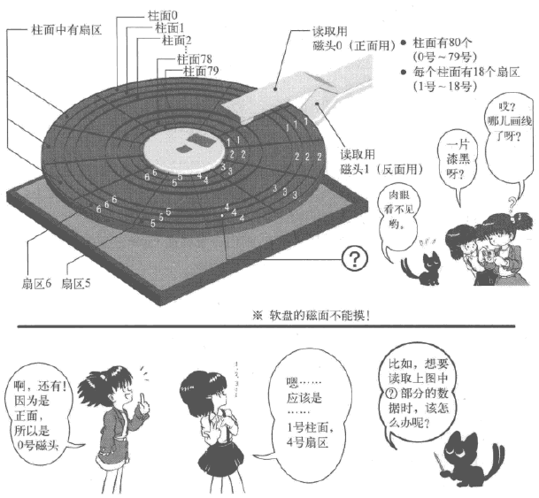
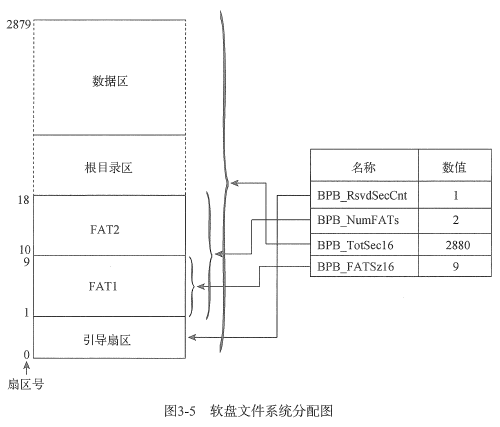
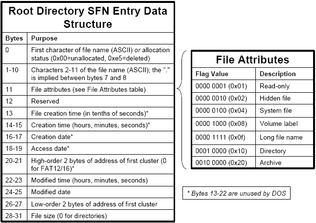
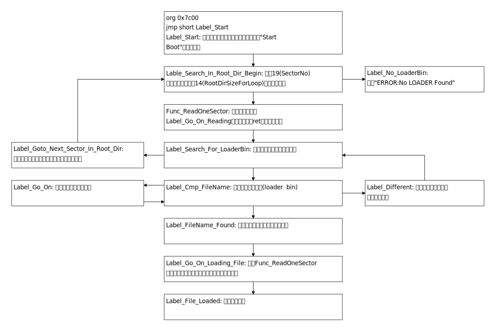
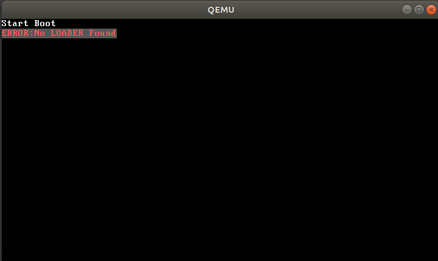

说是第三天，我看了该一个星期了..发现之前看得有点浮躁，最近看了费曼读书法有了新的想法，不怕慢，就不没看明白，所以听费曼的，每次看卡壳了，就返回去重新看..

看到这里，突然觉得还是以《64位》为主比较好，《32位》太老了，用的还是nask转换起来有点累，并且《64位》介绍得细啊，所以我悟了，《32位》用来打辅助吧..

# 1 软盘与FAT12

先来看软盘，一个PC里面可以有多个软盘，一个软盘里面包含2个磁头，80个柱面，18个扇区。因为软盘正反面都可以存储数据，所以有俩磁头去读取数据。柱面参考下图(注意编号0\~79)，英文是cylinder；扇区参考下图(注意编号1\~18)，英文是sector

<!-- more -->



两本书用的都是FAT12文件系统来装载Loader程序和内核程序，将软盘格式化成FAT12文件系统时，FAT类文件系统会对软盘里的扇区进行结构化处理，把软盘**扇区划分为引导扇区，FAT表，根目录区和数据区**4部分

- 引导扇区

这一部分其实第一天的程序helloos2就已经介绍个大概了，再抄一遍《64位》里面的表格

| 名称            | 偏移 | 长度 | 内容                                  | 本引导程序数据            |
| --------------- | ---- | ---- | ------------------------------------- | ------------------------- |
| BS_jmpBoot      | 0    | 3    | 跳转指令                              | jmp short Label_Start nop |
| BS_OEMName      | 3    | 8    | 生产厂商名                            | ‘MINEboot’                |
| BPB_BytesPerSec | 11   | 2    | 每扇区字节数                          | 512                       |
| BPB_SecPerClus  | 13   | 1    | 每簇扇区数                            | 1                         |
| BPB_RsvdSecCnt  | 14   | 2    | 保留扇区数                            | 1                         |
| BPB_NumFATs     | 16   | 1    | FAT表的份数                           | 2                         |
| BPB_RootEntCnt  | 17   | 2    | 根目录可容纳的目录份数                | 224                       |
| BPB_TotSec16    | 19   | 2    | 总扇区数                              | 2880                      |
| BPB_Media       | 21   | 1    | 介质描述符                            | 0xF0                      |
| BPB_FATs16      | 22   | 2    | 每FAT扇区数                           | 9                         |
| BPB_SecPerTrk   | 24   | 2    | 每磁道扇区数                          | 18                        |
| BPB_NumHeads    | 26   | 2    | 磁头数                                | 2                         |
| BPB_HiddSec     | 28   | 4    | 隐藏扇区数                            | 0                         |
| BPB_TotSec32    | 32   | 4    | 若BPB_TotSec16为0，则由该值记录扇区数 | 0                         |
| BS_DrvNum       | 36   | 1    | int 13h的驱动器号                     | 0                         |
| BS_Reserved1    | 37   | 1    | 未使用                                | 0                         |
| BS_BootSig      | 38   | 1    | 扩展引导标记(29h)                     | 0x29                      |
| BS_VolID        | 39   | 4    | 卷序列号                              | 0                         |
| BS_VolLab       | 43   | 11   | 卷标                                  | ‘boot loader’             |
| BS_FileSysType  | 54   | 8    | 描述文件系统类型                      | ‘FAT12’                   |
| 引导代码        | 62   | 448  | 引导代码，数据及其他信息              |                           |
| 结束标志        | 510  | 2    | 结束标志0xAA55                        | 0xAA55                    |

其中，

BPB_Media，对于不可移动存储介质而言，标准值是0xF8，对于可移动存储介质，常用值是0xF0。此域合法值是0xF0，0xF8，0xF9，0xFB，0xFC，0xFD，0xFE，0xFF。

BS_VolLab，就是Windows或Linux系统中显示的磁盘名

按照上述描述，可将软盘扇区描绘成下图，其中FAT2是对FAT1的备份



- FAT表

FAT12文件系统是以簇为单位来分配数据区的存储空间，每个簇的大小为$$BPB\_BytesPerSec × BPB\_SecPerClus$$字节，**数据区的簇号与FAT表的表项是一一对应关系**。文件在FAT类文件系统存储单位是簇，即使文件长度只有1字节，也是分配了一个簇。

> 在该实例中，1簇=1扇区，数据区有2880-1(MBR)-9(FAT1)-9(FAT2)-14(RootDir)=2847扇区(簇)，而FAT1表的大小是9\*512B=4608B，每个表项占12bit，一共有4608/1.5=3072个表项，其中有两个表项不用，也就是3070个FAT表项，对应2847个簇是绰绰有余了

FAT表由FAT表项构成。每个FAT表项的大小有12位、16位、和32位三种情况。每个FAT表项都有一个固定的编号，这个编号从0开始。

<table>
<thead>
  <tr>
    <th>FAT项</th>
    <th>实例值</th>
    <th>描述</th>
  </tr>
</thead>
<tbody>
  <tr>
    <td>0</td>
    <td>FF0H</td>
    <td rowspan="2">磁盘标识字，低字节与BPB_Media数值保持一致<br>第一个簇已经被占用</td>
  </tr>
  <tr>
    <td>1</td>
    <td>FFFH</td>
  </tr>
  <tr>
    <td>2</td>
    <td>003H</td>
    <td rowspan="6">0x000：可用簇<br>0x002 ~ 0xFEF：已用簇标识下一个簇的簇号<br>0xFF0 ~ 0xFF6：保留簇<br>0xFF7：坏簇<br>0xFF8 ~ 0xFFF：文件的最后一个簇</td>
  </tr>
  <tr>
    <td>3</td>
    <td>004H</td>
  </tr>
  <tr>
    <td>...</td>
    <td>...</td>
  </tr>
  <tr>
    <td>N</td>
    <td>FFFH</td>
  </tr>
  <tr>
    <td>N+1</td>
    <td>000H</td>
  </tr>
  <tr>
    <td>...</td>
    <td>...</td>
  </tr>
</tbody>
</table>
FAT表的0号和1号FAT表项有专门的用途。0号FAT表项通常用来存放分区所在的介质类型；1号FAT表项用来存储文件系统的肮脏标志，表明文件系统被非法卸载或者磁盘表面存在错误。

每一个FAT表项都会映射FAT数据区的一个簇中。因为0号FAT表项和1号FAT表项有特殊用途，无法与数据区中的簇形成映射，所以从2号FAT表项开始跟数据区中的第一个簇映射，正因为如此，**数据区中的第一个簇也就编号为2号簇，这也是没有0号簇和1号簇的原因**。然后3号簇跟3号FAT表项映射，4号簇跟4号FAT表项映射，以此类推，直到数据区中的最后一个簇。比如说FAT[2]中实例值是003H(指向FAT[3])，表示对应数据区2号簇，实际上第(2-2=0)号扇区，并要在FAT[3]中找更后面的数据，实例值指的就是下一个FAT项

在编写程序的时候我们直接跳过FAT[0]和FAT[1]即可，并不使用它们，不必要理会其中的值。

- 根目录区和数据区

根目录和数据区都保存着与文件相关的数据，只不过根目录只能保存目录项信息，而数据区不但可以保存目录项信息，还可以保存文件内的数据。此处所提及的**目录项是由一个32B**组成的结构体，它既可以 表示成一个目录，又可以表示成一个文件，其中**字段DIR_FstClus描述了文件在磁盘存放的具体位置**

|      名称       |   偏移   |  长度  |          描述          |
| :-------------: | :------: | :----: | :--------------------: |
|  **DIR_Name**   | **0x00** | **11** | **文件名8B，扩展名3B** |
|    DIR_Attr     |   0x0B   |   1    |        文件属性        |
|      保留       |   0x0C   |   10   |         保留位         |
|   DIR_WrtTime   |   0x16   |   2    |    最后一次写入时间    |
|   DIR_WrtDate   |   0x18   |   2    |    最后一次写入日期    |
| **DIR_FstClus** | **0x1A** |   2    |      **起始簇号**      |
|  DIR_FileSize   |   0x1C   |   4    |        文件大小        |



[The FAT File System (c-jump.com)](http://www.c-jump.com/CIS24/Slides/FAT/lecture.html#F01_0140_root_directory)

# 2 boot.asm

了解了FAT文件系统知识后，再来瞅瞅《64位》中boot程序，感觉比《32位》那个解释得更加详细一点

引导代码boot.bin文件是放在引导扇区中的，LOADER.BIN文件是放在数据区中的一个个簇中，而文件的文件名是放在根目录区中的目录项的，根目录区的目录项就保存着文件起始簇号，而数据区中的每个簇都与FAT1表中每个FAT项对应的，每个FAT项的值标明了下一个簇号。

所以想将数据区的文件加载到内存，需要先去根目录区找文件名，根据文件名定位根目录区目录项，接着拿到起始簇号/FAT表项，根据起始簇号/FAT表项接着读下一个簇/FAT表项，直到FAT表项的值为0xfff

整坨代码大概是这么个关系



## 2.1 FAT12文件系统数据

```assembly
; 告诉编译器这段代码要加载到0x7c00处的
; 编译器在编译代码的时涉及到变量寻址(标号)会自动加上0x7c00这个基址
; 但是并不会影响到CS DS ES SS
    org 0x7c00

BaseOfStack    equ  0x7c00  ; 相当于C语言的 #define

BaseOfLoader    equ 0x1000
OffsetOfLoader  equ 0x00

RootDirSectors  equ 14
SectorNumOfRootDirStart equ 19
SectorNumOfFAT1Start    equ 1
SectorBalance   equ 17
    ; 段内短转移，以当前ip的相对跳转地址的偏依量作为转移量，但偏移量只允许在-128 ~ +127字节之间
    jmp short Label_Start  ; 下面只是磁盘的元数据 真正程序开始是Label_Start
    nop  ; fat12文件头格式中的BS_jmpBoot固定格式
    BS_OEMName  db  'MINEboot'
    BPB_BytesPerSec dw  512
    BPB_SecPerClus  db  1
    BPB_RsvdSecCnt  dw  1
    BPB_NumFATs db  2
    BPB_RootEntCnt  dw  224
    BPB_TotSec16    dw  2880
    BPB_Media   db  0xf0
    BPB_FATSz16 dw  9
    BPB_SecPerTrk   dw  18
    BPB_NumHeads    dw  2
    BPB_HiddSec dd  0
    BPB_TotSec32    dd  0
    BS_DrvNum   db  0
    BS_Reserved1    db  0
    BS_BootSig  db  0x29
    BS_VolID    dd  0
    BS_VolLab   db  'boot loader'
    BS_FileSysType  db  'FAT12   '
```

`BaseOfLoader equ 0x1000`和`OffsetOfLoader equ 0x00`组合成了Loader的起始地址，这个组合必须经过实模式的地址变换公式才能生成物理地址，即`BaseOfLoader << 4 + OffsetOfLoader = 0x10000`

`RootDirSectors equ 14`定义了根目录占用的扇区数，这个数值是根据FAT12文件系统提供的起始物理地址计算而得，即`(BPB_RootEntCnt * 32 + BPB_BytesPerSec - 1) / BPB_BytesPerSec = (224 * 32 + 512 - 1) / 512 = 14`

`SectorNumOfRootDirStart equ 19`定义了根目录的起始扇区号，这个数值是根据`保留扇区数 + FAT表扇区数 * FAT表份数 = 1 + 9 * 2 = 19`，因为扇区标号是从0开始计数，所以根目录起始扇区为19

`SectorNumOfFAT1Start equ 1`表示FAT1表的起始扇区号，在FAT1表前有一个保留扇区

`SectorBalance equ 17`用于平衡文件的起始簇号与数据区起始簇号的差值。数据区中的第一个簇为2号簇，所以把必须将FAT表项值减2以计算FAT表项对应的数据区起始扇区号，实际上是(19 - 2)

代码是在程序一开始就定义的，但是程序是从上往下顺序执行的，代码中有想当一部分是数据，并不是代码，所以我们一开始就需要使用无条件跳转指令`jmp short Label_Start`，跳转到`Label_Start`标签处开始执行代码。

## 2.2 初始化

```assembly
Label_Start:
    mov ax, cs  ; 最开始cs是等于0的
    mov ds, ax  ; ds es ss不能通过立即数赋值 需要ax中转
    mov es, ax
    mov ss, ax
    mov sp, BaseOfStack  ; 栈指针设到0x7c00

;=======    clear screen
    mov ax, 0600h
    mov bx, 0700h
    mov cx, 0
    mov dx, 0184fh
    int 10h           ; 0x10中断的AH=0x06号功能 清屏

;=======    set focus
    mov ax, 0200h
    mov bx, 0000h
    mov dx, 0000h
    int 10h           ; 0x10中断的AH=0x2号功能 设置游标位置

;=======    display on screen : Start Booting......
    mov ax, 1301h
    mov bx, 000fh
    mov dx, 0000h
    mov cx, 10
    push    ax
    mov ax, ds
    mov es, ax
    pop ax
    mov bp, StartBootMessage  ; 字符串定义在最后 Start Boot
    int 10h          ; 0x10中断的AH=0x13号功能 写字符串

;=======    reset floppy
    xor ah, ah      ; ah=0
    xor dl, dl      ; dl=0
    int 13h         ; 0x13中断的AH=0号功能 复位磁盘
```

这段没啥好说的..看第二天的就好了

## 2.3 查找loader.bin文件

核心目标，从根目录中搜索出引导加载程序(文件名为loader.bin)

```assembly
;=======    search loader.bin
    mov word [SectorNo], SectorNumOfRootDirStart  ; 根目录从第19个扇区开始

Lable_Search_In_Root_Dir_Begin:
    cmp word [RootDirSizeForLoop], 0  ; RootDirSizeForLoop初始值为根目录扇区数 一个扇区一个扇区找
    jz  Label_No_LoaderBin  ; 找到剩0 就表示找不到
    dec word [RootDirSizeForLoop]  ; RootDirSizeForLoop--
    mov ax, 00h
    mov es, ax  ; 不能直接通过立即数赋值 需要通过ax中转以下 es=00h
    mov bx, 8000h  ; bx=8000h
    mov ax, [SectorNo]  ; ax=19
    mov cl, 1  ; cl=1
    ; call命令实际上是两条命令结合 push ip和mov ip, Func_ReadOneSector
    ; 然后push ip又可以拆成两条指令 add sp, 2 和 mov sp, ip
    ; 简单来说就是将当前的ip存到栈sp+2位置(向上增长，因为看到下面bp-2了)，并且将ip指向Func_ReadOneSector
    ; 而ip的值表示下一条指令 也就是说下一条指令执行Func_ReadOneSector的东西
    call Func_ReadOneSector
    mov si, LoaderFileName  ; 通过ds:si指向文件名源地址
    mov di, 8000h  ; es:di也指向了扇区内容起始地址
    cld  ; DF复位=0，这样通过LODSB从ds:si加载内容到al后 si就会递增1
    mov dx, 10h  ; dx记录一个扇区可容纳的目录项个数 一个扇区最多有512B/32B=16=0x10个目录项

Label_Search_For_LoaderBin:
    cmp dx, 0
    jz  Label_Goto_Next_Sector_In_Root_Dir
    dec dx  ; 上面三句就是一个扇区所有目录项都找完了 可以去下一个扇区找了
    mov cx, 11  ; 文件名的长度11B 包括文件名和扩展名 但不包括分隔符 .

Label_Cmp_FileName:
    cmp cx, 0
    jz  Label_FileName_Found
    dec cx  ; 一样的道理 这里是比较文件名
    lodsb  ; 从ds:si读取一个字节到寄存器AL 然后si+=1(取决于DF)
    cmp al, byte [es:di]  ; 一个字符一个字符去比较
    jz  Label_Go_On  ; 如果相等
    jmp Label_Different  ; 如果不相等

Label_Go_On:
    inc di  ; di+=1
    jmp Label_Cmp_FileName  ; 也就是比较下一个字符

Label_Different:
    and di, 0ffe0h  ; 将di后5位置0 消除比较文件名带来的影响
    add di, 20h  ; di+=32B 下一个目录项
    mov si, LoaderFileName  ; 重置要搜索的文件名的指针
    jmp Label_Search_For_LoaderBin  ; 继续找

Label_Goto_Next_Sector_In_Root_Dir:
    add word  [SectorNo], 1  ; 扇区号+1
    jmp Lable_Search_In_Root_Dir_Begin  ; 去下一个扇区去找

;=======    display on screen : ERROR:No LOADER Found
Label_No_LoaderBin:
    mov ax, 1301h
    mov bx, 008ch
    mov dx, 0100h
    mov cx, 21
    push    ax
    mov ax, ds
    mov es, ax
    pop ax
    mov bp, NoLoaderMessage
    int 10h  ; 如果找不到就在屏幕输出 ERROR:No LOADER Found
    jmp $  ; 死循环在这里
```

这里的Func_ReadOneSector可以先理解为一个函数，用于读取磁盘扇区内容的函数，参数是ax=磁盘起始扇区号，cl读入的扇区数量；返回值FALGS\.CF，其中0表示没错误，并且扇区内容加载到es:bx上

1 为什么要使用循环去读取磁盘？AL不是能够直接指定读取多少个扇区麽

> 指定处理的扇区数，范围在0x01\~0xff(在指定0x02以上的数值时，要特别注意能够连续处理多个扇区的条件，如果是FD的话，似乎不能跨越多个磁道，也不能超过64KB界限)

2 FAT12文件系统的文件名是不分大小写的，即是将小写字母命名的文件赋值到FAT12文件系统内，文件系统也会为其创建大写字母的文件名和目录项。而小写字母文件名只作为其显示名，而真正的数据内容皆保存在对应的大写字母目录项。所以这里应该搜索大写字母的文件名字符串。

3 关于**lodsb**指令，参考64-ia-32-architectures-software-developer-vol-2-manual的chapter 3.2指令介绍

LODS/LODSB/LODSW/LODSD/LODSQ—Load String

分别将源操作数中的字节、字或双字加载到AL、AX或EAX寄存器中。源操作数是一个内存位置，其地址从DS:ESI或DS:SI寄存器中读取（取决于指令的地址大小属性，分别为32或16）。DS段可以被段覆盖前缀覆盖。

字节、字或双字从内存位置传送到 AL、AX 或 EAX 寄存器后，(E)SI寄存器根据EFLAGS寄存器中DF标志的设置自动递增或递减。（如果DF标志为0，（E）SI寄存器递增；如果DF标志为1，ESI寄存器递减。）（E）SI寄存器递增或递减1为字节操作，递减2为字运算，或双字运算乘以4。

4 关于操作

```assembly
and di, 0ffe0h  ; 将di后5位置0 消除找文件名带来的影响
add di, 20h  ; +32 下一个目录项
```

因为文件名是11B，最大也就是`1011b`，一个目录项的大小是32B，也就是`100000b`，再看di初始值是`mov di, 8000h`，也就是说每个目录项的起始地址低5位都是0，而查找时加上11B顶多只会影响到低4位，所以将低5位置0是没有毛病的，乃至于只将低4位置0都是ok的，只要di的起始地址低4位别有1就好

## 2.4 加载扇区内容到内存

如果在根目录中发现了文件名(loader.bin)，那就表示磁盘中有这个文件，那么接下来的任务就是读出文件的数据到内存，最终将整个文件加载到内存中

```assembly
;=======    found loader.bin name in root director struct
Label_FileName_Found:  ; 如果找到了 那么现在es:di指向的是 包含文件的目录项+11B
    mov ax, RootDirSectors  ; 根目录扇区数14
    and di, 0ffe0h  ; 清除文件名的影响 现在es:di指向的是包含文件的目录项
    add di, 01ah  ; 目录项偏移0x1A(DIR_FstClus)得到起始簇号(数据区的，数据区第一个簇是2)
    mov cx, word [es:di]  ; 起始簇号(这里1簇只包含1个扇区 也可以理解为起始扇区号)占2B
    push cx  ; 将起始簇号(也是FAT表项值)暂存到栈中
    add cx, ax  ; cx += 14
    add cx, SectorBalance  ; cx += 17  实际上是+19(FAT占的扇区)-2(数据区从2开始的)得到实际的起始扇区号
    mov ax, BaseOfLoader  ; ax = 0x1000
    mov es, ax
    mov bx, OffsetOfLoader  ; 通过es:bx=0x1000<<4+0x00=0x10000得到loader的起始地址
    mov ax, cx  ; 存储文件的实际起始扇区号 放在ax中

Label_Go_On_Loading_File:
    push ax  ; 接着上面的说咯 将起始扇区号和加载文件内容起始地址保存起来 但是要注意cx也进栈了 并且没有出栈
    push bx  ; 所以出栈顺序应当是 bx(内存加载起始地址)->ax(存储文件的实际起始扇区号)->cx(起始簇号)
    mov ah, 0eh  ; 打印一个字符
    mov al, '.'
    mov bl, 0fh
    int 10h  ; 调用中断int 10h在屏幕上打印一个"."
    pop bx
    pop ax  ; 保存的起始扇区号和加载文件内容起始地址取出来

    mov cl, 1  ; 读一个扇区
    call Func_ReadOneSector  ; 将一个扇区的内容读出来
    pop ax  ; 这里就是cx了 取出此扇区在FAT中的序号(和数据区的簇号是一一对应的)
    call Func_GetFATEntry
    cmp ax, 0fffh  ; 读出来FAT项值是否为0xFFF，如果是文件尾
    jz  Label_File_Loaded  ; 就表示loader.bin文件加载到内存完毕
    push ax  ; 将FAT表项值入栈
    mov dx, RootDirSectors
    add ax, dx
    add ax, SectorBalance  ; 得到下一个起始扇区号
    add bx, [BPB_BytesPerSec]  ; bx再向前进一个扇区 存储下一个
    jmp Label_Go_On_Loading_File  ; 继续下一个扇区

Label_File_Loaded:
    jmp $  ; 因为还没有写loader.bin所以就停在这里
```

这里又提到了另一个函数Func_GetFATEntry，这个函数的作用是根据当前FAT表项索引来获取当前FAT表项值(下一个表项索引或文件结尾标志0xfff)。这里会根据FAT表项指向的数据区的簇的内容加载到内存0x10000

## 2.5 读取磁盘扇区模块

上面提到读取磁盘扇区的函数，该模块的作用就是读取软盘，每次读取一个扇区

```assembly
;=======    read one sector from floppy
Func_ReadOneSector:
    push bp  ; 将原来的bp保存在栈sp=sp+2位置
    mov bp, sp  ; 把当前的sp位置存在bp中 这两步就被称之为压栈操作
    sub esp, 2  ; 再找栈要2B的空间 局部变量
    mov byte [bp - 2], cl  ; 把cl的值存在刚才申请的栈空间中
    push bx  ; bx将要被使用 先将bx保存在sp=sp+2位置
    mov bl, [BPB_SecPerTrk]  ; bl = 18
    div bl  ; ax / bl = al...ah
    inc ah  ; ah+1 余数+1得到柱面的开始扇区号
    mov cl, ah  ; 起始扇区号存到cl
    mov dh, al  ; 将al存到dh
    shr al, 1  ; al>>1 商右移1位得到柱面号
    mov ch, al  ; 柱面号存到ch
    and dh, 1  ; dh&1 商和1与运算得到磁头号
    ; pop实际上是push的逆运算 mov bx, sp 和 sub sp, 2
    ; 意思就是将当前栈顶的值取出来放bx中，再将栈顶收缩
    pop bx
    mov dl, [BS_DrvNum]  ; 驱动器号 0表示A盘
    ; 到这里参数都准备好了 ch=柱面号 cl=起始扇区号 dh=磁头号 dl=驱动器号 es:bx=读取内容存放的缓冲区位置
Label_Go_On_Reading:
    mov ah, 2  ; 表示要读磁盘
    mov al, byte [bp - 2]  ; 要读多少个扇区 从栈中将数据取出来
    int 13h  ; 0x13中断的AH=02号功能 读取扇区
    jc  Label_Go_On_Reading  ; 如果读盘错误CF值会被置为1 跳过去继续读
    add esp, 2  ; 栈顶+2 回收栈空间
    pop bp  ; 将进入函数之前的bp取回来 再修正栈
    ; 这条指令等于pop ip，也就是将存在当前栈顶的ip(调用函数之前的位置)取回来，再将修正栈顶
    ; 也就等于是子函数结束 回到调用函数的位置 继续执行
    ret
```

这个`Func_ReadOneSector`其实就可以理解为C语言中的函数，功能就是通过BIOS中断`int 13h`的主功能号`AH=02h`实现软盘扇区的读取操作

> INT 13h, AH=02h功能：读取磁盘扇区
>
> AL=读入的扇区数(必须非0)
>
> CH=磁道号(柱面号)的低8位
>
> CL=扇区号1\~63(bit 0\~5)，磁道号(柱面号)的高2位(bit 6\~7，只对硬盘有效)
>
> DH=磁头号
>
> DL=驱动器号(如果操作的是硬盘驱动器，bit 7必须被置位)
>
> ES:BX=数据缓冲区
>
> 返回值:
>
> FLAGS.CF=0，没有错误，AH=0
>
> FLAGS.CF=1，有错误，错误号码存入AH内(与重置功能一样)

**问题1，调用函数之前AX，CL的值代表什么，怎么来的？**

AX代表的是待读取的磁盘起始扇区号，CL代表的是读入的扇区数量，都来自另一段程序，下面会继续解释

**问题2，为什么要这么计算？**

因为磁盘扇区号是LBA(Logical Block Address，逻辑块寻址)格式的，而`INT 13h, AH=02h`中断服务程序只能受理CHS(Cylinder/Header/Sector，柱面/磁头/扇区)格式的磁盘扇区号，所以需要通过下面的公式将LBA格式转为CHS格式
$$
LBA扇区号 \div 每磁道扇区数 = 
\begin{cases}
商Q \rightarrow 
  \begin{cases}
    柱面号 = Q >> 1 \\ 
    磁头号 = Q \& 1
   \end{cases}
\\ 
余数R \rightarrow 起始扇区号 = R + 1
\end{cases}
$$
**问题3，返回值FLAGS.CF代表啥？**

表示进位标识符，jc指令与之搭配使用，当carry flag值为1时就会跳转。如果调用这个函数出错CF就会置为1。这里就是如果出错就一直读，个人觉得没有《32位》处理得好，读错了就尝试5次

**问题4，`ES:BX`代表什么？**

这个表示内存地址，表明把从软盘上读出的数据装载到内存的哪个位置。如果用一个寄存器BX来表示内存地址的话，只能表示0\~0xffff的值，最大才64K，现在谁家内存条这么小？当然了，你可能会现在不是有ebx或者rbx麽，用这个当然没问题，但问题是设计BIOS的时代没有啊，所以设计了起辅助作用的段寄存器，在指定内存地址时，可以用这个段寄存器。所以使用段及寄存器时，以`ES:BX`这种方式来表示`ES * 16 + BX`的内存地址地址，这样就可以指定1M以内的内存地址，这在当时就满足要求了，当然现在为了兼容也要遵守这一规则

## 2.6 FAT表项解析模块

如果从扇区中找到了loader.bin，那就根据FAT表提供的簇号顺序依次加载到扇区数据到内存中，这个加载过程会涉及FAT表项的解析工作

```assembly
;=======    get FAT Entry
Func_GetFATEntry:
    push es
    push bx
    push ax  ; 常规的保护操作
    mov ax, 00
    mov es, ax  ; 这里将es置为00，因为外面的es是0x1000
    pop ax  ; 这里的ax就是FAT表项
    mov byte [Odd], 0  ; 标志位Odd置0
    mov bx, 3  ; bx=3
    mul bx  ; ax = ax * bx(3)
    mov bx, 2  ; bx=2
    div bx  ; ax/bx(2)=ax...dx，ax=ax*3/2扩大1.5倍得到该FAT表项占用的字节数
    cmp dx, 0  ; ax是否为偶数，是偶数直接去Label_Even，Odd=0
    jz  Label_Even
    mov byte [Odd], 1  ; 不是的话 先将标志位Odd置为1

Label_Even:
    xor dx, dx  ; 将dx置0
    mov bx, [BPB_BytesPerSec]  ; bx=512
    div bx  ; ax/512=ax(FAT表中的偏移扇区号)...dx(在扇区中的位置)
    push dx
    mov bx, 8000h  ; es:bx=读取内容存放的缓冲区位置
    add ax, SectorNumOfFAT1Start  ; ax=ax+1 得到该FAT表项的起始扇区号
    mov cl, 2  ; 读取FAT表项所在的扇区，一次读两个，避免在边界发生错误，因为一个FAT表项可能跨越两个扇区
    call Func_ReadOneSector

    pop dx
    add bx, dx  ; bx=bx+dx 缓冲区起始地址+要读的内容长度(在扇区中的位置)
    mov ax, [es:bx]  ; 读出FAT表项内容到ax中
    cmp byte [Odd], 1  ; 是不是奇数
    jnz Label_Even_2  ; Odd != 1跳到Label_Even_2
    shr ax, 4  ; ax右移四位 也就是0.5B 把属于前一个表项的部分移除掉

Label_Even_2:
    and ax, 0fffh  ; 只保留低12bit，也就是截取该FAT表项
    pop bx
    pop es
    ret  ; 函数调用结束 返回调用位置 返回值AX=要找的FAT表项值
```

**1 这里AX代表什么？**

作为参数的时候是当前FAT表项索引，作为返回值的时候是下一个表项号

**2 为啥要把ax放大1.5倍？**

因为FAT12文件系统的每个FAT表项占用12bit，即每3B存两个FAT表项，所以需要先根据表项号转化成占用字节数，通过字节数除以每扇区字节数可以得到偏移的扇区号，以及FAT表项在该扇区中的偏移位置，再根据这个扇区号往后面读取两个扇区，根据奇偶位处理表项错位问题，这样就能得到下一扇区的表项号。

## 2.7 Other

这就是一些定义一些变量常量什么的

```assembly
;=======    tmp variable
RootDirSizeForLoop  dw  RootDirSectors
SectorNo        dw  0
Odd         db  0

;=======    display messages
StartBootMessage:   db  "Start Boot"
NoLoaderMessage:    db  "ERROR:No LOADER Found"
LoaderFileName:     db  "LOADER  BIN",0

;=======    fill zero until whole sector
    times   510 - ($ - $$)  db  0
    dw  0xaa55
```

NASM编译器中的单引号和双引号作用相同，并非C语言规定的双引号会在结尾添加字符`'\0'`，在NASM中必须自行添加


好了都解释完了，编译一下，并在qemu上跑一下

```bash
nasm boot.asm -o boot.bin -l boot.lst
dd if=boot.bin of=boot.img bs=512 count=1 conv=notrunc
qemu-system-x86_64 -drive file=boot.img,format=raw,if=floppy
```

启动效果是这个死样子


