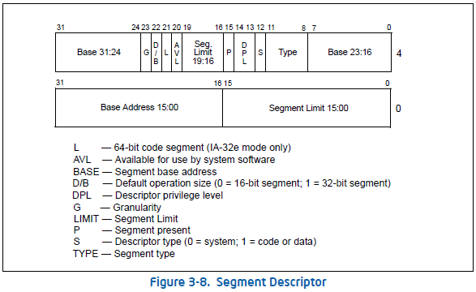

# 1 执行环境介绍

在find loader那一节之后，发现后面的代码真的看不懂了，直接抄也没有意义，于是补了一下相关的知识..希望能继续下去

## 1.1 CPU工作模式

参考Intel手册卷3第2.2 MODES OF OPERATION

32位的支持三种工作模式和一种准工作模式

- 实地址模式(Real-address mode)，处理器上电(power-up)或复位(reset)后处于该模式。这个模式实际上是为了兼容8086，因为地址线只有20根，限制了寻址只能是1M大小，也就是通过$段寄存器 << 4 + 偏移地址$方式寻址。进入这个模式，也就只使用20根地址线，主要是因为A20M#引脚被屏蔽了

- 保护模式(Protected mode)，这个是80386时期引入的，也就是32位处理器原本的工作模式。在这个模式下不再使用$段寄存器 << 4 + 偏移地址$的方式寻址，而是通过段描述符的方式描述基址和限长，并通过描述符中的属性设置实现对内存段的访问限制和数据保护。
- 虚拟8086模式(Virtual-8086 mode)，是一种准工作模式，目的是为了在保护模式下能够执行8086程序<!--more-->
- 系统管理模式(System management mode)，80386时期引入，提供了一种对操作系统或执行程序透明的机制实现平台特定功能，如电源管理或系统安全或oem差异化的feature。对操作系统透明(这个透明的意思在计算机组成原理里就可以理解为不知道为什么，它就..)，换句话说，就是操作系统不知道何时进入SMM的，也不知道SMM曾经执行过。进入SMM是通过给CPU引脚SMI#上电，或者可编程中断控制器(APIC)接收到SMI，进入SMM后，一切被都屏蔽，包括所有的中断，处理器切换到单独的地址空间(System Management RAM)，同时保存当前运行的程序或任务的上下文。然后可以透明地执行SMM特定的代码。可以通过设置SMBASE的寄存器来设置SMRAM的空间。SMM处理程序只能由系统固件实现。只能通过执行RSM指令退出，退出后，处理器将被置于SMI之前的状态。 

64位除了支持32位的几个模式，还支持IA-32e modes

- IA-32e模式(IA-32e mode)，在IA-32e模式下，处理器支持两种子模式：兼容模式和64位模式。64位模式提供64位线性寻址并支持大于64GBytes的物理地址空间。兼容模式允许大多数传统的保护模式应用程序不变地运行。AMD称之为长模式，参考AMD手册卷1第1.2节

## 1.2 基础执行环境

处理器上运行的任何程序或资源都会被赋予一组资源，用于执行指令，存储代码、数据和状态信息。就是一些寄存器和内存的使用

- 地址空间(Address space)，32位CPU，理论上单进程可以寻址$2^{32}$bytes，也就是4GB线性地址(虚拟地址)空间，而可用的地址线有36根(Intel)，所以支持最大物理内存是$2^{36}$bytes，也就是64GB；64位CPU，理论上单进程可以寻址$2^{64}$bytes线性地址，也就是???TB，只是实际上只有46根地址线(听说已经来到了48根)，所以支持最大物理地址是$2^{46}$byte，也就是???TB
- 基本程序执行寄存器(Basic program execution registers)，32位CPU，有8个通用寄存器(GPR)，6个段寄存器(SR)，1个EFLAGS寄存器，1个EIP(指令)寄存器；64位CPU有16个GPR，6个SR，1个EFLAGS(其中高32位保留，不使用)，一个RIP
- x87 FPU寄存器，32位和64位都是8个，主要用于浮点计算的
- MMX寄存器，32位和64位都是8个，主要用于矩阵运算？用于支持64bit的SIMD(single-instruction，multiple-data)单指令多数据
- XMM寄存器，32位和64位都是8个，对MMX的扩展，用于支持128位的SIMD
- YMM寄存器，32位和64位都是8个，对MMX的扩展，用于支持256位的SIMD，[PC平台主要SIMD扩展发展简史 - TaigaComplex - 博客园 (cnblogs.com)](https://www.cnblogs.com/TaigaCon/p/7835340.html)
- 边界寄存器(Bounds)，BND0-BND3寄存器存放的是内存缓冲区的上限指针，这些寄存器用于支持MPX指令。
- BNDCFGU和BNDSTATUS寄存器，可以看出一个是配置寄存器，一个是状态寄存器，用于支持MPX指令。
- 堆栈(Stack)，为了支持过程或子例程调用以及过程或子例程之间的参数传递，在执行环境中包括堆栈和堆栈管理资源。它通过段寄存器SS指定位置，而实际指向的是一段内存或者Cache

以上的运行环境是在CPU core级别的环境，另外处理器还提供了下列系统级别的运行环境，在多核处理器的环境中，处理器内部的多个CPU core共享这些运行环境。这个系统级别的运行环境主要包括：

- I/O端口，IA-32架构提供了64KB的地址空间，这些地址空间是被系统中的所有CPU core共用的。参考Intel手册卷1第18.3 I/O ADDRESS SPACE
- 控制寄存器，包括5个控制寄存器CR0-CR4，这些控制寄存器控制着当前的运行模式，并且是否使能处理器的某些功能，64位多一个CR8(task priority register，TPR)
- 内存管理寄存器(又被称为DTR，描述表寄存器)，包括GDTR(global descriptor table register)、IDTR(interrupt descriptor table register)、TR(task register)和LDTR(local descriptor table register)，这些寄存器用来指明在保护模式下，内存中数据结构的位置。
- Debug寄存器，有8个寄存器，监视处理器调试操作
- 内存类型范围寄存器(MTRR)，用于指明系统内存的类型和区间
- MSR(Machine specific registers)，主要用于控制处理器的配置并且汇报处理器的状态
- Machine check registers，主要用于硬件错误的检测，它其实也是属于MSR寄存器
- Performance monitoring counters，主要用于监测处理器的性能

### 1.2.1 通用寄存器

32位CPU有4个32位的通用寄存器EAX、EBX、ECX和EDX。对低16位数据的存取，不会影响高16位的数据。这些低16位寄存器分别命名为：AX、BX、CX和DX，它和先前的CPU中的寄存器相一致。4个16位寄存器又可分割成8个独立的8位寄存器(AX：AH-AL、BX：BH-BL、CX：CH-CL、DX：DH-DL)，每个寄存器都有自己的名称，可独立存取。程序员可利用数据寄存器的这种“可分可合”的特性，灵活地处理字/字节的信息。

寄存器AX称为累加器(Accumulator)，用累加器进行的操作可能需要更少时间。累加器可用于乘、除、输入/输出等操作，它们的使用频率很高；

寄存器BX称为基地址寄存器(BaseRegister)。它可作为存储器指针来使用；

寄存器CX称为计数寄存器(CountRegister)。在循环和字符串操作时，要用它来控制循环次数；在位操作中，当移多位时，要用CL来指明移位的位数；

寄存器DX称为数据寄存器(DataRegister)。在进行乘、除运算时，它可作为默认的操作数参与运算，也可用于存放I/O的端口地址。

32位CPU有2个32位通用寄存器EBP和ESP。其低16位对应先前CPU中的BP和SP，对低16位数据的存取，不影响高16位的数据。BP为基指针(BasePointer)寄存器，用它可直接存取堆栈中的数据；SP为堆栈指针(StackPointer)寄存器，用它只可访问栈顶。指针寄存器不可分割成8位寄存器。作为通用寄存器，也可存储算术逻辑运算的操作数和运算结果。

32位CPU有2个32位通用寄存器ESI和EDI。其低16位对应先前CPU中的SI(源变址寄存器，suorce index)和DI(目的变址寄存器，destination index)，对低16位数据的存取，不影响高16位的数据。它们主要用于存放存储单元在段内的偏移量，用它们可实现多种存储器操作数的寻址方式，为以不同的地址形式访问存储单元提供方便。变址寄存器不可分割成8位寄存器。作为通用寄存器，也可存储算术逻辑运算的操作数和运算结果。它们可作一般的存储器指针使用。在字符串操作指令的执行过程中，对它们有特定的要求，而且还具有特殊的功能。

> - **EAX** — Accumulator for operands and results data
> - **EBX** — Pointer to data in the DS segment
> - **ECX** — Counter for string and loop operations
> - **EDX** — I/O pointer
> - **ESI** — Pointer to data in the segment pointed to by the DS register; source pointer for string operations
> - **EDI** — Pointer to data (or destination) in the segment pointed to by the ES register; destination pointer for
>   string operations
> - **ESP** — Stack pointer (in the SS segment)
> - **EBP** — Pointer to data on the stack (in the SS segment)

64位除此之外还有R8D-R15D/R8-R15 represent eight new general-purpose registers.

### 1.2.2 指令指针寄存器

32位CPU把指令指针扩展到32位，并记作EIP，EIP的低16位与先前CPU中的IP作用相同。指令指针EIP、IP(InstructionPointer)是存放下次将要执行的指令在代码段的偏移量。在具有预取指令功能的系统中，下次要执行的指令通常已被预取到指令队列中，除非发生转移情况。所以，在理解它们的功能时，不考虑存在指令队列的情况。

EIP寄存器不能通过软件直接访问；它由控制传输指令（例如 JMP、Jcc、CALL 和 RET）、中断和异常隐式控制。读取 EIP 寄存器的唯一方法是执行 CALL 指令，然后从过程堆栈中读取返回指令指针的值。

### 1.2.3 段寄存器

**段寄存器**是根据内存分段的管理模式而设置的。内存单元的物理地址由段寄存器的值和一个偏移量组合而成的，这样可用两个较少位数的值组合成一个可访问较大物理空间的内存地址。

CS - 代码段寄存器(CodeSegmentRegister)，其值为代码段的段值，保存正在执行的指令，处理器使用CS:IP组合的逻辑地址从代码段中获取指令；

DS - 数据段寄存器(DataSegmentRegister)，其值为数据段的段值；

ES - 附加段寄存器(ExtraSegmentRegister)，其值为附加数据段的段值；

FS - 附加段寄存器(ExtraSegmentRegister)，其值为附加数据段的段值；

GS - 附加段寄存器(ExtraSegmentRegister)，其值为附加数据段的段值。DS、ES、FS和GS寄存器指向四个数据段。四个数据段的可用性允许对不同类型的数据结构进行高效和安全的访问。例如，可能会创建四个单独的数据段：一个用于当前模块的数据结构，另一个用于从更高级别模块导出的数据，第三个用于动态创建的数据结构，第四个用于与另一个共享的数据程序。要访问附加数据段，应用程序必须根据需要将这些段的段选择器加载到DS、ES、FS和GS寄存器中。

SS - 堆栈段寄存器(StackSegmentRegister)，其值为堆栈段的段值；存储当前正在执行的程序、任务或处理程序的过程堆栈。所有堆栈操作都使用SS寄存器来查找堆栈段。与CS寄存器不同，SS寄存器可以显式加载，这允许应用程序建立多个堆栈并在它们之间切换

在16位CPU系统中，它只有4个段寄存器(CS, DS, SS, and ES)，所以，程序在任何时刻至多有4个正在使用的段可直接访问；在32位微机系统中，它有6个段寄存器，所以，在此环境下开发的程序最多可同时访问6个段。

**每个段寄存器都分为两个部分，一个是可见部分(visible)，仅包括16bit的段选择子；一个是隐藏部分(hidden)，包括32bit的基址(base address)表示段从哪里开始，32bit的段长(limit)表示基址的长度，16bit的访问控制信息(attributes)表示当前段寄存器是可读可写可执行。所以段寄存器是96位的**

### 1.2.4 EFLAGS寄存器

64位称作RFLAGS寄存器，RFLAGS寄存器的高32位保留，RFLAGS的低32位与EFLAGS相同。EFLAGS包含一组状态标志、一个控制标志和一组系统标志。在处理器初始化之后（通过置位RESET引脚或INIT引脚），EFLAGS寄存器的状态为00000002H。该寄存器的位 1、3、5、15 和 22 至 31 被保留。软件不应使用或依赖任何这些位的状态。

EFLAGS寄存器中的某些标志可以使用专用指令直接修改，没有允许直接检查或修改整个寄存器的指令。以下指令可用于将标志组移入和移出过程堆栈或EAX寄存器：LAHF、SAHF、PUSHF、PUSHFD、POPF 和 POPFD。在EFLAGS寄存器的内容传输到过程堆栈或EAX寄存器后，可以使用处理器的位操作指令（BT、BTS、BTR 和 BTC）检查和修改标志。

当调用中断或异常处理程序时，处理器会自动将EFLAGS寄存器的状态保存在过程堆栈中。当使用任务切换处理中断或异常时，EFLAGS寄存器的状态将保存在TSS中以用于挂起的任务。

#### Status flags

EFLAGS寄存器的状态标志（bit 0、2、4、6、7和11）指示算术指令的结果，例如 ADD、SUB、MUL和DIV指令。参考AMD手册卷1第3.1.4节Flags Register

- CF(bit 0)，进位标志(Carry flag)，主要用来反映运算是否产生进位或借位。如果运算结果的最高位产生了一个进位或借位，那么，其值为1，否则其值为0。使用该标志位的情况有：多字(字节)数的加减运算，无符号数的大小比较运算，移位操作，字(字节)之间移位，专门改变CF值的指令等。
- PF(bit 2)，奇偶标志(Parity flag)，用于反映运算结果中“1”的个数的奇偶性。如果“1”的个数为偶数，则PF的值为1，否则其值为0。利用PF可进行奇偶校验检查，或产生奇偶校验位。在数据传送过程中，为了提供传送的可靠性，如果采用奇偶校验的方法，就可使用该标志位。
- AF(bit 4)，辅助进位标志(Auxiliary Carry flag)，如果算术运算或二进制编码的十进制 (BCD) 运算从结果的第3位生成进位（在加法的情况下）或借位（在减法的情况下），则硬件设置辅助进位标志。否则，AF清零。 
- ZF(bit 6)，零标志(Zero flag)，如果最后一次算术运算的结果为零，则硬件将零标志设置为1。否则（对于非零结果），硬件将该标志清零。比较和测试指令也会影响零标志。零标志通常用于测试算术或逻辑运算的结果是否为零，或测试两个操作数是否相等。
- SF(bit 7)，符号标志(Sign flag)，设置为等于最后一次运算结果的最高有效位，即有符号整数的符号位。（0表示正值，1表示负值。）
- OF(bit 11)，溢出标志(Overflow flag)，硬件将溢出标志设置为1，以指示最后一个有符号整数运算结果的最高有效（符号）位与两个源操作数的符号不同。否则，硬件将该标志清除为0。设置溢出标志意味着正或负结果的幅度太大（溢出）或太小（下溢）以适合其定义的数据类型。在DIV指令之后和移位多于一位之后，OF标志是未定义的。逻辑指令清除溢出标志。

#### DF Flag

DF(bit 10)，方向标志(Direction flag)确定处理字符串的顺序。软件可以将方向标志**设置为1**，以指定**递减下一条字符串指令**（LODSx、STOSx、MOVSx、SCASx、CMPSx、OUTSx 或 INSx）的数据指针。 将方向标志**清除为0指定递增**数据指针。 指针存储在rSI或rDI寄存器中。软件可以分别**使用STD和CLD指令设置或清除**标志。

#### System Flags and IOPL Field

EFLAGS寄存器中的系统标志和IOPL字段控制操作系统或执行操作，它们不应被应用程序修改。参考AMD手册卷2第3.1.6节RFLAGS Register

- TF(bit 8)，追踪标志(Trap)，置1为启用单步调试模式；清零以禁用单步模式。在单步调试模式下，处理器在每条指令后生成一个调试异常。这允许在每条指令之后检查程序的执行状态。如果应用程序使用POPF、POPFD或IRET指令设置TF标志，则在POPF、POPFD或IRET之后的指令后会产生调试异常。
- IF(bit 9)，中断使能标志(Interrupt enable)，置为1以启用可屏蔽中断(INTR中断)，清零会导致处理器忽略可屏蔽中断。IF标志不影响异常或不可屏蔽中断（NMI中断）。CPL(当前特权级别)、IOPL(IO权限级别)和控制寄存器CR4中VME(虚拟8086模式扩展)及PVI(保护模式虚拟中断)标志的状态决定了IF标志是否可以被CLI、STI、POPF、POPFD和IRET修改。
- IOPL(bit 13:12)，IO特权等级字段(I/O privilege level field)，IOPL字段指定执行I/O地址空间指令所需的权限级别（寻址I/O空间而不是内存映射I/O的指令，例如 IN、OUT、INS、OUTS等）。当前权限级别(CPL)必须等于或高于（低于数值）IOPL(CPL <= IOPL)指定的权限。如果CPL低于（高于）IOPL指定的值（CPL > IOPL），则当软件尝试执行 I/O 指令时，处理器会导致一般保护异常 (#GP)。当启用虚拟 8086 模式扩展 (CR4.VME=1) 时，虚拟 8086 模式使用 IOPL 来控制虚拟中断和 IF 位。保护模式虚拟中断机制 (PVI) 还使用 IOPL 来控制虚拟中断和启用 PVI 时的 IF 位（CR4.PVI=1）
- NT(bit 14)，嵌套任务标志(Nested task)，IRET 读取 NT 位以确定当前任务是否嵌套在另一个任务中。当 NT 设置为 1 时，当前任务嵌套在另一个任务中。当 NT 清除为 0 时，当前任务处于顶层（非嵌套）。处理器在调用以 CALL 指令、中断或异常启动的任务时设置此标志。它在从使用 IRET 指令启动的任务返回时检查并修改此标志。可以使用 POPF/POPFD 指令显式设置或清除该标志；但是，更改此标志的状态可能会在应用程序中产生意外异常。
- RF(bit 16)，恢复标志(Resume)，主要功能是允许在由指令断点条件引起的调试异常之后重新启动指令。置为 1 时，会暂时禁用指令断点报告，以防止发生重复的调试异常 (#DB)。处理器在每条指令成功执行后清除 RF 位，除非指令是：设置RF位的IRET；通过任务门执行的JMP、CALL或INTn。
- VM(bit 17)，虚拟8086模式(Virtual-8086 mode)，软件将VM置为1以启用虚拟8086模式，清零以禁用虚拟8086模式(返回保护模式)。系统软件只能使用任务开关或IRET更改此位。它不能使用POPFD指令修改位。
- AC(bit 18)，对齐检查或访问控制(Alignment check or access control)，当CR0.AM=1时，软件通过将 AC 位设置为 1 来启用自动对齐检查。可以通过将 AC 或 CR0.AM 清除为 0 来禁用对齐检查。当启用自动对齐检查并且当前特权级别(CPL)为3（最低特权）时，对未对齐操作数的内存引用会导致对齐检查异常 (#AC)。当启用超级用户模式访问阻止功能 (CR4.SMAP=1) 时，只有当 RFLAGS.AC=1 时，才允许某些超级用户模式数据访问用户模式可访问的页面。
- VIF(bit 19)，虚拟中断(Virtual Interrupt)，
- VIP(bit 20)，虚拟中断挂起(Virtual interrupt pending)，由软件置位以指示中断正在挂起；清零表示没有待处理的中断。此标志与 VIF 标志结合使用。这个标志是只读的。处理器仅在控制寄存器 CR4 中的 VME 标志或 PVI 标志置位且 IOPL 小于 3 时才识别 VIP 标志。VME 标志启用虚拟 8086 模式扩展；PVI 标志启用保护模式虚拟中断。
- ID(bit 21)，身份标志(Identification)，软件修改该位的能力表明处理器实现支持 CPUID 指令。

### 1.2.5 内存管理寄存器

当启用保护模式(CR0.PE=1)时，分段机制使用描述符表。这些表包含描述段的位置、大小和特权属性的描述符条目。保护模式下的所有内存引用访问一个描述符表条目。
x86分段机制支持三种类型的描述符表：全局描述符表(GDT)，本地描述符表(LDT)，中断描述符表(IDT)。软件通过初始化其对应的**描述符表寄存器**来建立描述符表在内存中的位置。

先把这些表当成一个数组，这些寄存器的作用就是存储这些数组..细节到内存管理再详细看。

#### GDTR

GDTR寄存器保存基地址(Base address)（在保护模式下为32位；在IA-32e模式下为64位）和GDT的16位表限(table limit)。基地址指定GDT第0字节的线性地址；表限指定表中的字节数。
LGDT和SGDT指令分别加载和存储GDTR寄存器。在处理器上电或复位时，基地址设置为默认值0，限制设置为0FFFFH。作为保护模式操作的处理器初始化过程的一部分，必须将新基址加载到GDTR中。

#### LDTR

LDTR寄存器保存LDT的16位段选择器、基地址（在保护模式下为32位；在IA-32e模式下为64位）、段限(Segment limit)和描述符属性。基地址指定LDT段第0字节的线性地址； 段限指定段中的字节数。

LLDT和SLDT指令分别加载和存储LDTR寄存器的段选择器部分。包含LDT的段必须在GDT中具有段描述符。当LLDT指令在LDTR中加载段选择器时：LDTR描述符中的基地址、段限和描述符属性会自动加载到LDTR中。

#### IDTR

IDTR寄存器保存基地址（在保护模式下为32位；在IA-32e模式下为64位）和IDT的16位表限(table limit)。基地址指定IDT第0字节的线性地址；表限指定表中的字节数。

LIDT和SIDT指令分别加载和存储IDTR寄存器。在处理器上电或复位时，基地址设置为默认值0，限制设置为0FFFFH。然后，作为处理器初始化过程的一部分，可以更改寄存器中的基址和限制。

#### TR

TR寄存器保存当前任务的TSS(task-state segment)的16位段选择器、基地址（在保护模式下为32位；在IA-32e模式下为64位）、段限制和描述符属性。选择器引用GDT中的TSS描述符。基地址指定TSS第0字节的线性地址；段限制指定TSS中的字节数。
LTR和STR指令分别加载和存储任务寄存器的段选择器部分。当LTR指令在任务寄存器中加载段选择器时，来自TSS描述符的基地址、限制和描述符属性会自动加载到任务寄存器中。在处理器上电或复位时，基地址设置为默认值0，限制设置为0FFFFH。
当任务切换发生时，任务寄存器会自动加载新任务的TSS段选择器和描述符。在将新的TSS信息写入寄存器之前，不会自动保存任务寄存器的内容。

### 1.2.6 控制寄存器

决定了处理器的工作模式和当前执行任务的特性，在64位模式下，控制寄存器扩展到64位。参考AMD手册卷2第3.1节System-Control Registers

- CR0 — 包含控制处理器的操作模式和状态的系统控制标志以及处理器特性的控制标志。

- CR2 — 该寄存器由页面转换机制使用。 当页面错误异常发生时，它由处理器加载页面错误虚拟地址。
- CR3 — 该寄存器也被页面转换机制使用。 它包含最高级别页转换表的基地址，还包含指定表的缓存控制。
- CR4 — 该寄存器包含对各种操作模式功能的附加控制。
- CR8 — 该寄存器仅在64位模式下可用，可以使用REX前缀在64位模式下访问。CR8 用于区分外部中断的优先级，称为任务优先级寄存器 (TPR)。

Control registers CR1, CR5–CR7, and CR9–CR15 are reserved.

参考Intel手册卷2第2.5节CONTROL REGISTERS

**CR0.PG** Paging (bit 31 of CR0) — Enables paging when set; disables paging when clear. When paging is disabled, all linear addresses are treated as physical addresses. The PG flag has no effect if the PE flag (bit 0 of register CR0) is not also set; setting the PG flag when the PE flag is clear causes a general-protection exception (#GP).

**CR0.PE** Protection Enable (bit 0 of CR0) — Enables protected mode when set; enables real-address mode when clear. This flag does not enable paging directly. It only enables segment-level protection. To enable paging, both the PE and PG flags must be set.

**CR3.PCD** Page-level Cache Disable (bit 4 of CR3) — 置1时，禁止某个页写入缓存，直接写内存。比如，做页表用的页，已经存储在`TLB`中了，可能不需要再缓存了。This bit is not used if paging is disabled, with PAE paging, or with 4-level paging or 5-level paging if CR4.PCIDE=1.

**CR3.PWT** Page-level Write-Through (bit 3 of CR3) — 置1时，写Cache的时候也要将数据写入内存中。This bit is not used if paging is disabled, with PAE paging, or with 4-level paging or 5-level paging if CR4.PCIDE=1.

**CR4.PSE** Page Size Extensions (bit 4 of CR4) — Enables 4-MByte pages with 32-bit paging when set; restricts 32-bit paging to pages of 4 KBytes when clear.

**CR4.PAE** Physical Address Extension (bit 5 of CR4) — When set, enables paging to produce physical addresses with more than 32 bits. When clear, restricts physical addresses to 32 bits. PAE must be set before entering IA-32e mode.

**CR4.PGE** Page Global Enable (bit 7 of CR4) — Enables the global page feature when set; disables the global page feature when clear. The global page feature allows frequently used or shared pages to be marked as global to all users (done with the global flag, bit 8, in a page-directory-pointer-table entry, a page-directory entry, or a page-table entry). Global pages are not flushed from the translation-lookaside buffer (TLB) on a task switch or a write to register CR3. When enabling the global page feature, paging must be enabled (by setting the PG flag in control register CR0) before the PGE flag is set. Reversing this sequence may affect program correctness, and processor performance will be impacted.

**CR4.UMIP** User-Mode Instruction Prevention (bit 11 of CR4) — When set, the following instructions cannot be executed if CPL > 0: SGDT, SIDT, SLDT, SMSW, and STR. An attempt at such execution causes a generalprotection exception (#GP).

**CR4.LA57** 57-bit linear addresses (bit 12 of CR4) — When set in IA-32e mode, the processor uses 5-level paging to translate 57-bit linear addresses. When clear in IA-32e mode, the processor uses 4-level paging to translate 48-bit linear addresses. This bit cannot be modified in IA-32e mode.

**CR4.PCIDE** PCID-Enable Bit (bit 17 of CR4) — Enables process-context identifiers (PCIDs) when set. Applies only in IA-32e mode (if IA32_EFER.LMA = 1).

**CR4.PKE** Enable protection keys for user-mode pages (bit 22 of CR4) — 4-level paging and 5-level paging associate each user-mode linear address with a protection key. When set, this flag indicates (via CPUID.(EAX=07H,ECX=0H):ECX.OSPKE [bit 4]) that the operating system supports use of the PKRU register to specify, for each protection key, whether user-mode linear addresses with that protection key
can be read or written. This bit also enables access to the PKRU register using the RDPKRU and WRPKRU instructions.

**CR4.PKS** Enable protection keys for supervisor-mode pages (bit 24 of CR4) — 4-level paging and 5-level paging associate each supervisor-mode linear address with a protection key. When set, this flag allows use of the IA32_PKRS MSR to specify, for each protection key, whether supervisor-mode linear addresses with that protection key can be read or written.

**CR8.TPL** Task Priority Level (bit 3:0 of CR8) — This sets the threshold value corresponding to the highestpriority interrupt to be blocked. A value of 0 means all interrupts are enabled. This field is available in 64-bit mode. A value of 15 means all interrupts will be disabled.

## 1.3 内存管理

很久以前，计算机只能运行单个进程，所以直接用物理内存地址就ok了，大家的程序都从0开始没有问题；后来计算机可以同时运行多个程序了，大家的程序还是都从0开始，这时候不就相互影响了吗，这时候就有了**分段机制**，隔离单个代码、数据和堆栈模块的机制，以便多个程序（或任务）可以在同一处理器上运行而不会相互干扰；再后来发现这种分段机制对内存的使用不够精细，因为段是一块一块的，后来就有了**分页机制**，按需分页虚拟内存系统的机制，其中程序执行环境的部分根据需要映射到物理内存中。

IA-32架构的内存管理工具分为两部分：分段和分页，如下图，其中分段是必须的，分页是可选的。如果不使用分页，则将处理器的线性地址空间直接映射到处理器的物理地址空间。

### 1.3.1 内存模型

程序不直接寻址物理内存，需要通过下面三种内存模型之一来访问

- 平面内存模型(Flat memory model)，又称之为线性内存模型，最好理解的一种，内存对于一个程序来说就是一个单一的，连续的地址空间。代码，数据，堆栈都包含在这个空间当中。线性地址空间中任何字节的地址都被称之为**线性地址**。The linear address space contains all the segments and system tables defined for a system.
- 分段内存模型(Segmented memory model)，内存在程序中表现为一组称为段(常说的代码段，数据段，堆栈段)的独立地址空间。为寻址段中的一个字节，程序需要发出一个**逻辑地址**(通常又称作远指针)，**由一个段选择器和一个偏移地址构成**，表示查找某个段的某个字节。在IA-32处理器上运行的程序最多可以寻址16383($2^{14}-1$)个不同大小和类型的段，每个段可以大到$2^{32}$byte。在内部，为系统定义的所有段都映射到处理器的线性地址空间。为了访问内存位置，处理器因此将每个逻辑地址转换为线性地址。这种转换对应用程序是透明的。使用分段内存的主要原因是为了增加程序和系统的可靠性。例如，将程序的堆栈放在单独的段中可以防止堆栈分别增长到代码或数据空间并覆盖指令或数据。
- 实地址模式内存模型(Real-address mode memory model)，8086的内存模型，是用分段特性实现的。段是64KB(数据总线只有16根，$2^{16}$)固定大小，但是地址线有20根，所以最大线性地址空间是1MB($2^{20}$)。16位的段寄存器必然访问不到1M的空间，所以也是采用“段基址+段内偏移地址”访问的

这里有线性地址，逻辑地址了，还缺一个**物理地址**，就是挂载CPU地址总线上的内存空间划分的地址呗，就和8086的1M是一个道理，这个前面也提到了32位一般36根，64位是46根，但是想要使用扩展的地址线，需要将CR4.PAE置1或者CR4.PSE置1。

**逻辑地址翻译成线性地址**，处理器需要：

1 使用段选择子(segment selector)中的偏移量(offset)在GDT或LDT中定位段的段描述符(segment descriptor)并将其读入处理器（仅当新的段选择器加载到段寄存器中时才需要此步骤）

2 查看段描述符以检查段的访问权限和范围，以确保该段可访问且偏移量在该段的限制内。

3 将段描述符中的段基地址与偏移量相加，形成一个线性地址。

如果不使用分页，则处理器将线性地址直接映射到物理地址（即线性地址在处理器的地址总线上输出）。如果线性地址空间被分页，则使用第二级地址转换将线性地址转换为物理地址。

再说这个段选择子，A segment selector is a 16-bit identifier for a segment. 它不直接指向段，而是指向定义段的段描述符。由Index，Table Indicator，Requested Privilege Level三项组成

**Index(bit 15~3)**，选择GDT或LDT中的8192($2^{13}$)个描述符之一($index \times 8 + DT.base$)。处理器将索引值乘以8（段描述符中的字节数）并将其结果加上GDT或LDT的基地址（分别来自GDTR或LDTR寄存器）

**TI(bit 2)**，指定使用哪个描述表，0是GDT，1是LDT

**RPL(bit 1~0)**，指定选择子的权限级别。特权级别的范围可以从0到3，其中0是最高特权级别。

处理器不使用GDT的第一个条目。指向GDT的该条目的段选择子（即索引为0且TI标志设置为0的段选择子）用作“空段选择子”。当段寄存器（除了CS或SS寄存器）加载有空选择子时，处理器不会产生异常。但是，当使用包含空选择子的段寄存器访问内存时，它确实会产生异常。**空选择子可用于初始化未使用的段寄存器**。**使用空段选择子加载CS或SS寄存器会导致生成一般保护异常(#GP)**。段选择子作为指针变量的一部分对应用程序可见，但选择子的值通常由链接编辑器或链接加载器而不是应用程序分配或修改。

### 1.3.2 段描述符

这段直接看Intel手册卷3第3.4.5 Segment Descriptors就好了..

为什么只能同时使用6个寄存器？

> For a program to access a segment, the segment selector for the segment must have been loaded in one of the segment registers. So, although a system can define thousands of segments, only 6 can be available for immediate use. Other segments can be made available by loading their segment selectors into these registers during program execution.

段描述符，当然就是描述段的了。当段选择子被加载到段寄存器的可见部分时，处理器还会从段选择子指向的段描述符中加载段寄存器的隐藏部分：基地址、段限和访问控制信息。两类指令可以加载段选择子

1. Direct load instructions such as the MOV, POP, LDS, LES, LSS, LGS, and LFS instructions. These instructions explicitly reference the segment registers.
2. Implied load instructions such as the far pointer versions of the CALL, JMP, and RET instructions, the SYSENTER and SYSEXIT instructions, and the IRET, INT n, INTO, INT3, and INT1 instructions. These instructions change the contents of the CS register (and sometimes other segment registers) as an incidental part of their operation.

The MOV instruction can also be used to store the visible part of a segment register in a general-purpose register.

接下来才是主题，段选择子且当成一个数组的index，那么段描述符就是这个数组中的一项了。具体的定义是：**A segment descriptor is a data structure in a GDT or LDT that provides the processor with the size and location of a segment, as well as access control and status information**.段描述符通常由编译器、链接器、加载器或操作系统或执行程序创建，而不是由应用程序创建。

首先，我们知道段寄存器有96位，减去16位的段选择子，还剩80位，而attribute对应的就是高4字节的23:8(凑成16bit)；而base是三段(低4字节31:16+高4字节7:0+高4字节31:24)凑成32位；而limit由低4字节15:00+高4字节19:16，才20bit，也就是还缺12bit，这缺的根据G flag，在高位补0，或在低位补1。

- Base Address(高4字节bit 31:24+高4字节bit 7:0+低4字节bit 31:16)

  将三个基地址字段凑一块形成一个32位的值，定义段的字节在0~4GB线性空间的位置

- Segment Limit(高4字节bit 19:16+低4字节bit 15:0)

  用于指定段的大小(应该是能访问段的大小)，由两截组成，高四位19:16加上低四位15:00，凑成20位。IA-32 architecture stacks always grow downwards, making this mechanism convenient for expandable stacks.

- G flag(高4字节bit 23)

  limit的粒度(granularity)标志。置0，limit以byte为单位，20位的limit则寻址范围是1MB(0x000FFFFF)；置1，limit以4KB为单位，20位的limit则寻址范围是4GB(0xFFFFFFFF)

- D/B flag(高4字节bit 22)

  根据段描述符是**代码段**、**向下扩展数据段**还是**堆栈段**执行不同的功能。（对于32位代码和数据段，此标志应始终设置为1，对于16位代码和数据段，应始终设置为0。）

  - Executable code segment：这个flag称为D flag，表示段中指令引用的有效地址和操作数的默认长度。置1，假定为32位地址和32位或8位操作数(采用32位寻址方式)；置0，假定为16位地址和16位或8位操作数(采用16位寻址方式)。指令前缀 66H 可用于选择默认值以外的操作数大小，前缀 67H 可用于选择默认值以外的地址大小
  - Stack segment (data segment pointed to by the SS register)：这个flag称为B flag，指定用于隐式堆栈操作（例如入栈、出栈和调用）的堆栈指针的大小。B=1，隐式堆栈访问指令（如：PUSH POP CALL）使用32位堆栈指针寄存器ESP；B=0，隐式堆栈访问指令（如：PUSH POP CALL）使用16位堆栈指针寄存器SP。
  - Expand-down data segment：这个flag称为B flag，指定段的上限。B=1，上限为0xFFFFFFFF(4GB)；B=0，上限为0xFFFF(64KB)

- L flag(高4字节bit 21)

  值为1时，以64位模式执行代码；值为0时，以兼容模式执行。当不在64位模式下或对于非代码段时，bit 21是保留的，应始终设置为0。如果设置了L位，则必须清除D位

- AVL flag(高4字节bit 20)

  供系统软件使用或作为保留段

- P flag(高4字节bit 15)

  置1表示该段存在内存中；置0表示该段不在内存中。(如果P=0，其他标志都不用看了，不起作用)

- DPL field(高4字节bit 14:13)

  表示段描述符特权级，只有想要加载这个段描述符的**选择子的请求特权级别高于或者等于DPL**才能加载这个段

- S flag(高4字节bit 12)

  置0，表示系统段描述符；置1，表示代码段或数据段

- Type field(高4字节bit 11:8)

  用于指定该段的访问类型(读写执行)和增长方向。代码，数据，系统段的编码方式不一样

也就是说，这里描述符根据S flag和Type Field分为好几种，也就是

当S=1(bit 12)，为数据段或代码段，这个时候从type的取值(bit 11)可以区分是data还是code：

当S=0，表示系统描述符：Local descriptor-table (LDT) segment descriptor，Task-state segment (TSS) descriptor，Call-gate descriptor，Interrupt-gate descriptor，Trap-gate descriptor，Task-gate descriptor

再来说特权等级：CPL，DPL，RPL，参考Intel卷3第5.5 PRIVILEGE LEVELS

CPL，Current privilege level。它存储在CS和SS段寄存器的位0和1中。通常，CPL等于从中提取指令的代码段的特权级别。也就是CS或SS的段选择子中的RPL

DPL，Descriptor privilege level。访问该段所需要的特权级别是什么

RPL，Requested privilege level。用什么权限去访问一个段

### 1.3.3 分页机制

Intel手册卷3 CHAPTER 4 PAGING

通过上面一通操作，已经拿到了一个线性地址了，现在需要通过分页模型将这个线性地址与物理地址对应起来。简单介绍下分页的思想

一级分页，假设将线性地址分为两部分table(页表)，offset(页内偏移)，然后能页表里面包含entry(页项)，每个entry存的是一个起始地址(一个起始地址是32位也就是4B)，CPU从table中拿到对应的entry存储物理地址加上偏移，就得到实际的物理地址了。假设offset的范围是0~4KB，那么offset需要12位($2^{12}=4096$)来表示，假设是32位PC，剩下的20位用来表达entry，那么此时一个32位的线性地址能够表达$2^{20}\times 2^{12}=2^{32}$，可以映射4G，但是需要$2^{20}\times 4B=4MB$的物理内存来保存entry

二级分页，将线性地址分为三部分directory(页表目录)，table(页表)，offset(页内偏移)，假设offset的范围还是0~4KB用12位来表达，假设剩下来的20位，directory和table各占10位，那么此时一个32位线性地址能够表达$2^{10}\times 2^{10}\times 2^{12}=2^{32}$，但是只需要$2^{10}\times4B+2^{10}\times4B=8KB$来保存整个页表关系

N级页表..

通过上面解释可以看到，同样的32位线性地址，划分不同级别的页表所需要存储的页表关系的物理内存不一样，简单来说高级的分页占用的物理内存越小，但是CPU访问次数越多

Intel手册中提到了四种分页模式：32bit paging，PAE paging，4-level paging，5-level paging。其中前两个专门用于32位，后面两个专门用于64位

可以看到，经典的page size就是4KB了，至于每个entry存储的细节就不看了..具体的去手册找好了

分页级数太高会导致CPU处理变慢，解决效率问题，那就只有加缓存，于是有个新的东西TLB(Translation Lookaside Buffers)。首先了解几个名词：线性地址的高位（称为**页号**）决定了物理地址（称为**页帧**）的高位；线性地址的低位（称为**页偏移**）决定了物理地址的低位。页码和页偏移量之间的边界由page size决定。而TLB就是存储页号和页帧的映射。

# 2 中断机制

The processor provides two mechanisms for interrupting program execution, interrupts and exceptions:
• An interrupt is an asynchronous event that is typically triggered by an I/O device.
• An exception is a synchronous event that is generated when the processor detects one or more predefined conditions while executing an instruction. The IA-32 architecture specifies three classes of exceptions: faults, traps, and aborts.

处理器提供了两个打断程序执行的机制，中断和异常

- **<big>中断</big>**是异步事件，通常由IO设备触发。Interrupts occur at random times during the execution of a program, in response to signals from hardware. System hardware uses interrupts to handle events external to the processor, such as requests to service peripheral devices. Software can also generate interrupts by executing the INT n instruction.Interrupts occur at random times during the execution of a program, in response to signals from hardware. System hardware uses interrupts to handle events external to the processor, such as requests to service peripheral devices. Software can also generate interrupts by executing the INT n instruction.
  - External (hardware generated) interrupts：外部中断通过处理器上的引脚或通过本地APIC(Advanced Programmable Interrupt Controller)接收。当本地APIC启用时，LINT[1:0]引脚可以通过APIC的本地向量表(LVT)进行编程，以与任何处理器的异常或中断向量相关联。当本地APIC全局/硬件禁用时，这些引脚分别配置为INTR和NMI引脚。通过INTR引脚或通过本地APIC传递给处理器的任何外部中断称为**可屏蔽硬件中断**，EFLAGS寄存器中的IF标志允许将所有可屏蔽的硬件中断作为一组进行屏蔽。通过NMI引脚以及系统总线或APIC串行总线上以NMI传递模式传递给处理器的任何外部中断称为**不可屏蔽中断**，EFLAGS寄存器的IF标志对这个无效
  - Software-generated interrupts：通过INT指令+中断号直接触发对应的中断
- **<big>异常</big>**是同步事件，处理器在执行指令时检测到一个或多个预定义条件生成的。异常分为三类：错误，陷阱，中止。Exceptions occur when the processor detects an error condition while executing an instruction, such as division by zero. The processor detects a variety of error conditions including protection violations, page faults, and internal machine faults.
  - Program-Error Exceptions：The processor generates one or more exceptions when it detects program errors during the execution in an application program or the operating system or executive.
  - Software-Generated Exceptions: The INTO, INT1, INT3, and BOUND instructions permit exceptions to be generated in software.
  - Machine-Check Exceptions: 

无论是外部中断，INT指令，触发异常，都是为了给CPU传一个中断号(也叫向量号)。为了帮助处理异常和中断，每个架构定义的异常和每个需要处理器特殊处理的中断条件都被分配了一个唯一的标识号，称为向量号。向量号的范围是0\~255，其中0\~31被系统保留，32\~255可以由用户自己定义。

**当处理器拿到向量号后会以此作为索引去中断描述符表(IDT)查询对应的中断描述符，通过计算中断描述符得到处理异常或中断程序的入口点，之后处理器会挂起当前执行的程序或任务，执行中断或异常处理，执行完毕后再唤醒之前执行的程序**

> INTR只有一个引脚，怎么知道各种外设的中断呢？这个引脚级联了一堆中断控制器8259A..详情百度一下

## 2.1 中断描述符表

interrupt descriptor table，就是一个大小为256的数组，这个数组保存的中断描述符。操作系统将这个数组保存到内存中，再通过LIDT指令将内存操作数中保存的基地址和限制(可以理解成中断描述表在内存的起始地址)加载到IDTR寄存器中。该指令只有在CPL为0时才能执行，一般操作系统的初始化代码在创建IDT时使用。通过SIDT指令将存储在IDTR中的基值和限值复制到内存中。

根据中断向量号去IDT中索引中断描述符，具体操作：取出IDTR中的IDT地址，加上**中断向量号*8**，得到的地址指向所要的中断描述符

就是下图这个感觉..

再说这数组中的数据中断描述符，分为三种：Task-gate descriptor，Interrupt-gate descriptor，Trap-gate descriptor

看起来和段描述差不多，其中task gate就与GDT或LDT中的task gate操作是差不多的；interrupt gate和trap gate与call gate差不多，中断门和陷阱门的区别是中断门不允许中断嵌套，处理中断的时候将EFLAGS.IF置1，屏蔽中断，陷阱门允许中断嵌套，不处理EFLAGS.IF值

也就是说从IDT中拿到中断描述符大致有两种处理方式，一种是类似任务门的(Intel手册卷3第7.3 TASK SWITCHING)，一种是类似调用门的(Intel手册卷3第5.8.2 Gate Descriptors到5.8.6 Returning from a Called Procedure)。这两种方式都已经能够拿到处理异常或中断程序的入口地址了

## 2.2 中断/陷阱门

根据中断描述符中的段选择子去GDT或LDT中索引段描述符，具体操作：取出GDTR/LDTR中的GDT/LDT地址。加上段选择子高13位*8，得到的地址为中断处理程序所在段的段基址；段基址加上中断描述符的段内偏移量得到的地址便为中断服务程序的地址。就是下图这个感觉：

拿到中断程序地址之后呢？最简单的办法就是，**直接把中断描述符里的中断程序地址取出来，放在自己的CS:IP寄存器中**，因为这里存的值就是下一跳指令的地址，只要放进去了，到下一个CPU指令周期时，就会去那里继续执行了，但CPU并没有这样简单粗暴。CPU据中断向量号去IDT中获取中断描述符，取出选择子中的DPL与当前特权级CPL进行比较，**若特权级发生变化，则需要切换栈**。（不同特权级有着不同的栈，如Linux使用了0，3特权级，则有两个栈，一个内核栈，一个用户栈）

> a. The segment selector and stack pointer for the stack to be used by the handler are obtained from the TSS for the currently executing task. On this new stack, the processor pushes the stack segment selector and stack pointer of the interrupted procedure.
> b. The processor then saves the current state of the EFLAGS, CS, and EIP registers on the new stack (see Figure 6-4).
> c. If an exception causes an error code to be saved, it is pushed on the new stack after the EIP value.

处理器临时保存当前的旧栈SS和ESP的值，从TSS（每一个任务有一个TSS结构，其中保存着不同特权级栈的SS和ESP值）中获取与DPL特权级相同的栈信息加载到SS和ESP寄存器。再将旧栈SS和ESP的值压入新栈中。若没有特权级变化，则跳过此步骤。

然后处理器将EFLAGS、CS和EIP寄存器的当前状态保存在新堆栈上。

若该中断有错误码，压入错误码。

要从异常或中断处理程序过程返回，处理程序必须使用IRET（或IRETD）指令。IRET指令与RET指令类似，只是它将保存的标志恢复到EFLAGS寄存器中。EFLAGS寄存器的IOPL字段只有在CPL为0时才恢复。只有在CPL小于或等于IOPL时才改变IF标志。如果在调用处理程序过程时发生堆栈切换，则IRET指令在返回时切换回被中断过程的堆栈。

## 2.3 任务门

这个在Linux上貌似没有使用..手册上提到使用task gate有三个优点

- 被中断的程序或任务的整个上下文会自动保存
- 新的TSS允许处理程序在处理异常或中断时使用新的特权级别0堆栈。如果在当前权限级别0堆栈损坏时发生异常或中断，通过任务门访问处理程序可以通过为处理程序提供新的权限级别0堆栈来防止系统崩溃
- 处理程序可以通过给它一个单独的地址空间来进一步与其他任务隔离。这是通过给它一个单独的LDT来完成的

优点即是缺点，使用单独的任务处理中断的缺点是必须在任务切换时保存的机器状态量使其比使用中断门慢，从而导致中断延迟增加。

这个逻辑与普通的task切换相同，错误码会被拷贝到新的TSS中..

