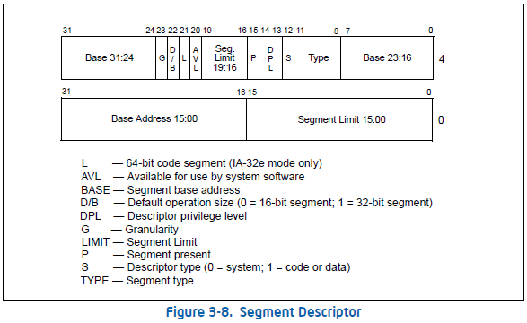
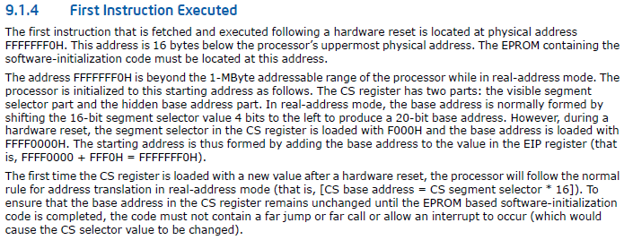
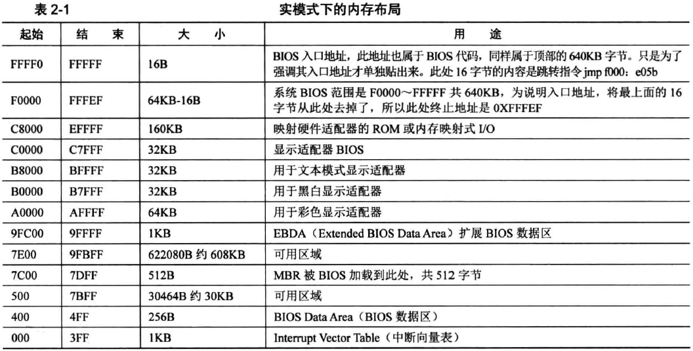
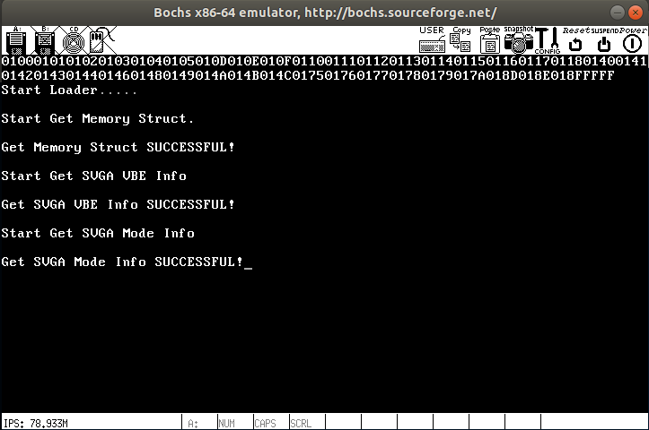
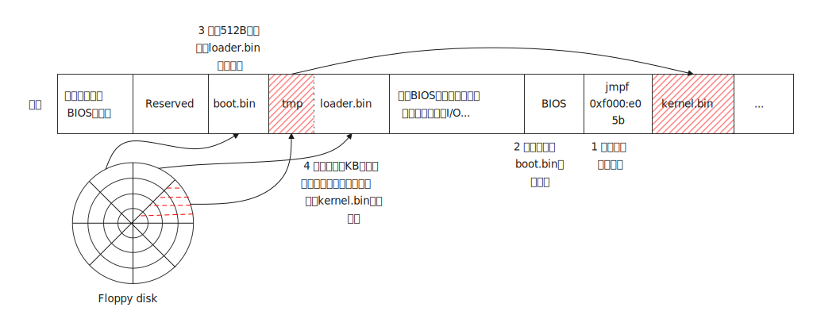

《64位》比《32位》多了一步loader.bin似乎，《32位》的下一步直接就是导入C语言，开始搞系统了，《64位》还得再来个loader，接着干吧..这一节很重要，承上启下，甚至于内容也是

这次把书上的源码上传的gitee了: [00_一个64位操作系统的设计与实现/一个64位操作系统的设计与实现-源代码/第二部分 初级篇/第3章/程序/程序3-4 · Sidney/MakeOS - 码云 - 开源中国 (gitee.com)](https://gitee.com/SidneyGod/make-os/tree/master/00_一个64位操作系统的设计与实现/一个64位操作系统的设计与实现-源代码/第二部分 初级篇/第3章/程序/程序3-4)

书上说，Loader的作用很大，大概包括：

- 检测硬件信息

  主要是通过BIOS中断服务程序来获取和检测硬件信息。BIOS上电自检的大部分信息只能在实模式下获取，内核运行在非实模式下，所以需要在进入内核前将信息检测出来，再作为参数提供给内核程序使用。比如获取ROM，RAM，设备寄存器和内存空洞等资源的物理地址范围交给内存管理单元模块维护；通过VBE功能检测出显示器支持的分辨率，显示模式，刷新率以及显存物理地址以配置合理的显示模式

- 处理器模式切换

  BIOS运行的实模式到32位操作系统用的保护模式，再到64位操作系统用的IA-32e模式(长模式)

- 向内核传递数据

  向内核传递两种数据，控制信息：控制内核执行流程或限制内核某些功能；硬件数据信息：检测出来的硬件数据信息，保存在固定的内存地址中，并将数据其实内存地址和数据长度作为参数传递给内核。

<!--more-->

# 1 源码分析

然后就是分析loader源码了，六百多行吧..但是其实和boot差不多，又是一个找kernel的过程，这下没画图了，感觉还好..

## 1.1 初始化

```assembly
; 程序从物理地址0x10000(1M)处 也就是boot加载loader的地址
org 10000h
jmp Label_Start
; 相当于C语言中的include 也就是FAT12文件的系统结构
%include    "fat12.inc"

BaseOfKernelFile    equ 0x00
OffsetOfKernelFile  equ 0x100000  ; kernel真正加载的位置

BaseTmpOfKernelAddr equ 0x00
; 内核程序临时转存空间 因为内核程序读取操作是通过BIOS中断服务int 13h实现的
; BIOS在实模式下只支持上限为1MB的物理地址空间寻址，所以需要先搬到临时转存空间
; 再通过特殊方式搬运到1MB以上的内存空间
OffsetTmpOfKernelFile   equ 0x7E00

; 真正用途 存储物理内存结构
MemoryStructBufferAddr  equ 0x7E00

; 32位段描述表
[SECTION gdt]
LABEL_GDT:      dd  0,0  ; 空描述符
LABEL_DESC_CODE32:  dd  0x0000FFFF,0x00CF9A00  ; 代码段
LABEL_DESC_DATA32:  dd  0x0000FFFF,0x00CF9200  ; 数据段
GdtLen  equ $ - LABEL_GDT  ; GDT长度
GdtPtr  dw  GdtLen - 1  ; 这个就是 limit
        dd  LABEL_GDT  ; GDT基址
SelectorCode32  equ LABEL_DESC_CODE32 - LABEL_GDT  ; 代码段选择子
SelectorData32  equ LABEL_DESC_DATA32 - LABEL_GDT  ; 数据段选择子

; 64位段描述表
[SECTION gdt64]
LABEL_GDT64:        dq  0x0000000000000000
LABEL_DESC_CODE64:  dq  0x0020980000000000
LABEL_DESC_DATA64:  dq  0x0000920000000000
GdtLen64    equ $ - LABEL_GDT64
GdtPtr64    dw  GdtLen64 - 1
            dd  LABEL_GDT64
SelectorCode64  equ LABEL_DESC_CODE64 - LABEL_GDT64
SelectorData64  equ LABEL_DESC_DATA64 - LABEL_GDT64
```

这里的转存空间只是临时用，用完可以另作他用了

## 1.2 BITS伪指令

此处追加定义了一个名为`.s16`的段，BITS伪指令可以通知NASM编译器生成的代码，将运行在16位或32位的处理器上，语法是`BITS 16`或`BITS 32`

当NASM编译器处于16位下，使用32位数据指令需要在指令前加前缀`0x66`，使用32位地址指令时需要在指令前加入前缀`0x67`。而在32位下，使用16位指令也需要加指令前缀

```assembly
[SECTION .s16]  ; 定义一个名为 .s16 的段
[BITS 16]  ; 通知NASM编译器生成的代码将运行在16位宽的处理器上
Label_Start:
    mov ax, cs
    mov ds, ax
    mov es, ax
    mov ax, 0x00
    mov ss, ax
    mov sp, 0x7c00

;=======    display on screen : Start Loader......
    mov ax, 1301h
    mov bx, 000fh
    mov dx, 0200h       ;row 2
    mov cx, 12
    push ax
    mov ax, ds
    mov es, ax
    pop ax
    mov bp, StartLoaderMessage
    int 10h  ; 屏幕上输出"Start Loader"
```

## 1.3 打开A20功能

这个在第0天提到了，就是A20M# pin，参考Intel manual volume 3 chapter 8.7.13.4。

> **A20M# pin** — On an IA-32 processor, the A20M# pin is typically provided for compatibility with the Intel 286 processor. Asserting this pin causes bit 20 of the physical address to be masked (forced to zero) for all external bus memory accesses. Processors supporting Intel Hyper-Threading Technology provide one A20M# pin, which affects the operation of both logical processors within the physical processor.
> The functionality of A20M# is used primarily by older operating systems and not used by modern operating systems. On newer Intel 64 processors, A20M# may be absent.

意思就是历史原因，最初处理器只有20根地址线，使得处理器只能寻址1MB以内物理地址空间，但是现在的处理器已经远超20位地址线了，但是为了兼容，出现了开启或禁止1MB以上地址空间开关(也就是只用20根地址线，还是用更多)。

```assembly
;=======    open address A20
    push ax
    in  al, 92h  ; 从92端口读入A20地址线的状态
    or  al, 00000010b  ; 将第2位置1
    out 92h, al  ; 写回92号端口 打开A20
    pop ax
    cli  ; 关中断 因为保护模式下中断处理的机制不同，不关中断会出现错误
    db  0x66  ; 声明在16位情况下使用32位宽数据指令
    ; 加载到gdtr，因为现在段描述符表在内存中，我们必须要让CPU知道段描述符表在哪个位置
    ; 通过使用lgdt就可以将源加载到gdtr寄存器中
    lgdt [GdtPtr]
    mov eax, cr0
    or  eax, 1
    mov cr0, eax  ; 这3句将寄存器CR0的第0位置1开启保护模式
    mov ax, SelectorData32
    mov fs, ax  ; 这2句 将数据段的选择子加载到FS段寄存器
    mov eax, cr0
    and al, 11111110b
    mov cr0, eax  ; 这3句 将cr0的bit0置0，也就是关掉保护模式，重新进入实模式
    sti  ; 与cli对应，恢复外部中断
;=======    reset floppy
    xor ah, ah
    xor dl, dl
    int 13h  ; 重置软盘
```

开启A20功能可以通过键盘(8042键盘控制器上恰好有空闲的端口引脚，输出端口P2，引脚P21)，但是键盘是低速设备，开启较慢。所以**可以使用A20快速门，使用IO端口0x92处理A20信号线(注意0x92的0位用于向机器发送复位信号，置位会导致重启)**。还可以通过BIOS中断程序INT 15h主功能号AX=2401可开启A20地址线，功能号AX=2400可禁用A20地址线，功能号AX=2403可查询A20地址线当前状态。还有一种方法是通过读0xee端口来开启A20信号线，写该端口则会禁止。

当进入保护模式后，为FS段加载新的数据段值，一旦完成数据段加载就从保护模式退出，并开启外部中断，目的是为了让FS段寄存器可以在实模式下寻址能力超过1MB(扩展到32位4GB)，可以借助FS段寄存器的特殊寻址能力将内核程序转移到1MB以上的内存地址空间中。注意，在物理平台下，当段寄存器拥有这种特殊能力之后，如果对其重新赋值就会失去特殊能力，转变成原始的实模式段寄存器

## 1.4 寻找kernel.bin

这段内容与`boot.asm`中找`loader.bin`类似

```assembly
;=======    search kernel.bin
    mov word [SectorNo], SectorNumOfRootDirStart  ; 依旧是从第19个扇区开始
Lable_Search_In_Root_Dir_Begin:
    cmp word [RootDirSizeForLoop], 0  ; RootDirSizeForLoop初始值为根目录扇区数 每找完一个扇区就-- 若等于0表示没找到
    jz  Label_No_LoaderBin  ; 找不到就跳到Label_No_LoaderBin
    dec word [RootDirSizeForLoop]  ; RootDirSizeForLoop--
    mov ax, 00h
    mov es, ax  ; 不能通过立即数给es赋值，需要通过ax中转一下 es=00H
    mov bx, 8000h  ; bx=8000H
    mov ax, [SectorNo]  ; ax=19
    mov cl, 1  ; cl=1
    call Func_ReadOneSector  ; 调用Func_ReadOneSector 读取一个扇区的内容到bx开始的内存地址
    mov si, KernelFileName  ; 将文件名"kernel.bin"加载到ds:si中
    mov di, 8000h  ; 将es:di指向扇区内容起始地址
    cld  ; 清除EFLAGS.DF置0，这样通过LODSB从ds:si加载内容到al后，si就会递增1
    mov dx, 10h  ; dx记录一个扇区可容纳的目录项个数。一个扇区最多有512B/32B=16=0x10个目录项

Label_Search_For_LoaderBin:
    cmp dx, 0
    jz  Label_Goto_Next_Sector_In_Root_Dir
    dec dx  ; 上面三句就是一个扇区所有目录项都找完了 可以去下一个扇区找了
    mov cx, 11  ; 文件名的长度11B 包括文件名和扩展名 但不包括分隔符"."

Label_Cmp_FileName:
    cmp cx, 0  ; 文件名都比较完了 都相等 那当然就是找到了 跳到Label_FileName_Found
    jz  Label_FileName_Found
    dec cx
    lodsb  ; 从ds:si读取一个字节到寄存器AL 然后si+=1(取决于EFLAGS.DF)
    cmp al, byte [es:di]  ; 一个字符一个字符去比较
    jz  Label_Go_On  ; 如果相等 继续
    jmp Label_Different  ; 如果不相等

Label_Go_On:
    inc di  ; di++
    jmp Label_Cmp_FileName

Label_Different:
    and di, 0FFE0h
    add di, 20h
    mov si, KernelFileName
    jmp Label_Search_For_LoaderBin

Label_Goto_Next_Sector_In_Root_Dir:
    add word    [SectorNo], 1
    jmp Lable_Search_In_Root_Dir_Begin
    
;=======    display on screen : ERROR:No KERNEL Found
Label_No_LoaderBin:  ; 没找到kernel.bin就会跳到这，结束
    mov ax, 1301h
    mov bx, 008Ch
    mov dx, 0300h       ; row 3
    mov cx, 21
    push    ax
    mov ax, ds
    mov es, ax
    pop ax
    mov bp, NoLoaderMessage  ; 屏幕上输出"ERROR:No KERNEL Found"
    int 10h
    jmp $
```

## 1.5 加载kernel.bin

找到`kernel.bin`，就将其读到内存中，与`boot.asm`找到`loader.bin`后的操作差不多，只是这里更加曲折一点，是先读取到0x7e00~0x7fff这段中，再通过FS段寄存器挪到0x100000之上的物理内存空间。但是这里段寄存器被重新赋值了，导致在实际物理平台上会出问题，书上说第7章再解决这个问题..

```assembly
;=======    found kernel.bin name in root director struct
Label_FileName_Found:  ; 找到了kernel.bin就到这..
    mov ax, RootDirSectors
    and di, 0FFE0h
    add di, 01Ah
    mov cx, word [es:di]
    push cx
    add cx, ax
    add cx, SectorBalance  ; 得到实际起始扇区号
    mov eax, BaseTmpOfKernelAddr ; eax=00H
    mov es, eax
    mov bx, OffsetTmpOfKernelFile   ; bx=7E00H
    mov ax, cx  ; 将存储文件实际扇区号放到ax中

Label_Go_On_Loading_File:
    push ax
    push bx
    mov ah, 0Eh
    mov al, '.'
    mov bl, 0Fh
    int 10h  ; 每读一个扇区就在屏幕上打印一个 .
    pop bx
    pop ax

    mov cl, 1
    call Func_ReadOneSector  ; 将一个扇区的内容读到0x7E00~0x7FF这段内存中
    pop ax
;;;;;;;;;;;;;;;;;;;;;;;
    push cx
    push eax
    push fs
    push edi
    push ds
    push esi

    mov cx, 200h  ; 200h = 512
    mov ax, BaseOfKernelFile  ; 00H
    mov fs, ax
    ; 目的地址 fs:edi = 0x00:0x100000，此处使用了FS段寄存器的超能力，它可以寻址到4G
    mov edi, dword [OffsetOfKernelFileCount]  ; OffsetOfKernelFile 0x100000
    mov ax, BaseTmpOfKernelAddr  ; 00H
    mov ds, ax
    ; 源地址 ds:esi = 0x00:0x7e00
    mov esi, OffsetTmpOfKernelFile  ; 7E00H

Label_Mov_Kernel:
    ; 一个字节一个字节将0x7e00之后的512字节东西挪到0x100000
    mov al, byte [ds:esi]
    mov byte [fs:edi], al
    inc esi
    inc edi
    loop Label_Mov_Kernel  ; 执行loop指令前，先要将cx--，若cx不为0则跳到Label_Mov_Kernel

    mov eax, 0x1000  ; loader.bin起始于内存地址0x1000:0x00
    mov ds, eax
    ; 每移动512字节内容后，保存新的内存地址到内存OffsetOfKernelFileCount字段处
    mov dword [OffsetOfKernelFileCount],  edi

    pop esi
    pop ds
    pop edi
    pop fs
    pop eax
    pop cx
;;;;;;;;;;;;;;;;;;;;;;;
    call    Func_GetFATEntry
    cmp ax, 0FFFh  ; 直到读到文件尾
    jz  Label_File_Loaded  ; 文件已加载..
    push ax
    mov dx, RootDirSectors
    add ax, dx
    add ax, SectorBalance
    jmp Label_Go_On_Loading_File  ; 继续下一个扇区
```

## 1.6 加载完毕

加载完毕后会在屏幕上打印一个字符`G`

```assembly
Label_File_Loaded:
    mov ax, 0B800h
    mov gs, ax
    mov ah, 0Fh             ; 0000: 黑底    1111: 白字
    ; 将’G’这个字符放到了内存中gs:((80 * 0 + 39) * 2)的这个地方，这个gs在这里是0B800h以这里为起点，向后偏移一段区域的内存专门用于存储在屏幕上显示的字，每个字占位两个字节，每行最多显示80个字符，所以就有上面的公式：((80 * 0 + 39) * 2)这表示第0行的39列显示该字符
    mov al, 'G'
    mov [gs:((80 * 0 + 39) * 2)], ax    ; 屏幕第 0 行, 第 39 列。

; 当Loader引导加载程序完成内核程序的加载工作后，软盘驱动器将不再使用
KillMotor:  ; 关闭全部软盘驱动器
    push dx
    mov dx, 03F2h
    mov al, 0
    out dx, al
    pop dx
```

这段代码首先将GS段寄存器的基地址设置在0B800H地址处；并将AH寄存器赋值为0FH，表示黑底白字；将AL寄存器赋值为字母'G'，要打印的字符；然后将AX寄存器的值填充到0B800H向后偏移$(80\times 0+39)\times2$处，每个字符占2个字节，每行最多显示80个字符，所以就是0行39列显示'G'。**从内存地址0B800H开始，是一段专门用于显示字符的内存空间，其中每个字符占用两个字节的内存空间，低字节保存显示的字符，高字节保存字符的颜色属性**。该方法相比于INT 10H中断相比更符合操作显卡内存的习惯，后面会通过像素内存在屏幕上作画或播放视频。

I/O端口3F2H控制着软盘驱动器不少硬件功能

| 位   | 名称     | 说明                                             |
| ---- | -------- | ------------------------------------------------ |
| 7    | MOT_EN3  | 控制软驱D马达，1：启动；0：关闭                  |
| 6    | MOT_EN2  | 控制软驱C                                        |
| 5    | MOT_EN1  | 控制软驱B                                        |
| 4    | MOT_EN0  | 控制软驱A                                        |
| 3    | DMA_INT  | 1：允许DMA和中断请求；0：禁止DMA和中断请求       |
| 2    | RESET    | 1：允许软盘控制器发送控制信息；0：复位软盘驱动器 |
| 1    | DRV_SEL1 | 00\~11用于选择软盘驱动器A\~D                     |
| 0    | DRV_SEL0 | 同上                                             |

## 1.7 获取内存信息

当内核程序不再借助临时转存空间后，这块临时转存空间将用于保存物理内存地址空间信息

物理地址空间信息由一个结构体数组构成，计算机平台地址划分情况都能从这个结构体数组成反映出来，它记录的地址空间类型包括可用物理内存地址空间、设备寄存器地址空间、内存空洞等。系统会在初始化内存管理单元时解析该结构数组

```assembly
;=======    get memory address size type
    mov ax, 1301h
    mov bx, 000Fh
    mov dx, 0400h       ;row 4
    mov cx, 24
    push ax
    mov ax, ds
    mov es, ax
    pop ax
    mov bp, StartGetMemStructMessage
    int 10h  ; 打印 "Start Get Memory Struct."

    ; 当内核程序不再借助临时转存空间后，这块临时转存空间 0x7E00~0x7FFF将用于保存物理地址空间信息
    mov ebx, 0  ; 指向内存区域，第一次调用时ebx=0，被称为continuation value
    mov ax, 0x00
    mov es, ax
    mov di, MemoryStructBufferAddr  ; 设置填充地址es:di=0x00:0x7e00

Label_Get_Mem_Struct:
    mov eax, 0x0E820  ; 功能号
    mov ecx, 20       ; 固定读取20字节
    mov edx, 0x534D4150  ; 固定值SMAP
    int 15h  ; 使用INT 15H来获取物理地址空间信息
    jc  Label_Get_Mem_Fail  ; 没有进位表示读取成功

    add di, 20  ; 推进填充地址
    cmp ebx, 0  ; 输出时，ebx表示下一个内存区域，当ebx=0 && CF=0时，表示当前是内存最后一个区域
    jne Label_Get_Mem_Struct  ; 循环读取
    jmp Label_Get_Mem_OK

Label_Get_Mem_Fail:
    mov ax, 1301h
    mov bx, 008Ch
    mov dx, 0500h       ;row 5
    mov cx, 23
    push ax
    mov ax, ds
    mov es, ax
    pop ax
    mov bp, GetMemStructErrMessage
    int 10h  ; 输出 Get Memory Struct ERROR
    jmp $

Label_Get_Mem_OK:
    mov ax, 1301h
    mov bx, 000Fh
    mov dx, 0600h       ;row 6
    mov cx, 29
    push ax
    mov ax, ds
    mov es, ax
    pop ax
    mov bp, GetMemStructOKMessage
    int 10h ; 输出 Get Memory Struct SUCCESSFUL!
```

INT 15H：每执行一次这个指令将会将一个描述内存区域的数据结构保存到`ES:DI`，然后返回一个ebx，用于确定下一个能够探测的内存区域，当ebx=0时，表示当前已经时最后一个内存区域了。那么ebx的初始值呢，就是设置成ebx=0。其中可能遇到检查发生错误的情况，这个指令就会直接将CF设置为1。

输入时各个寄存器作用：

| 寄存器 | 作用                                                         |
| ------ | ------------------------------------------------------------ |
| eax    | 功能码，当输入e820h时能够探测内存                            |
| ebx    | 主要用于指向内存区域，第一次调用时ebx=0，被称为continuation value |
| es:di  | 用于指令执行后，在指向的内存写入描述内存区域的数据结构ARDS(Address Range Descriptor Structure) |
| ecx    | 用于限制指令填充的ARDS的大小，实际上大多数情况这个是无效的，无论ecx设置为多少，BIOS始终会填充20字节的ARDS |
| edx    | 0534D4150h，表示4个ASCII字符('SMAP')，只是个签名，输入时在edx，输出时将会在eax中 |

输出时各个寄存器结果:

| 寄存器 | 结果                                                         |
| ------ | ------------------------------------------------------------ |
| CF     | 当没有发生错误时，CF=0，否则CF=1                             |
| eax    | 0534D4150h                                                   |
| ebx    | 指向下一个内存区域，而不是调用之前的内存区域，当ebx=0且CF=0时，表示当前是最后一个内存区域。 |
| es:di  | 和调用之前一样，如果要保存多个ARDS，需要手动修改es:di        |
| ecx    | 返回写入的ARDS的大小                                         |

看一下Linux对E820H的定义

```c
// bionic/libc/kernel/uapi/asm-x86/asm/e820.h
struct e820entry {
    __u64 addr; /* start of memory segment */
    __u64 size; /* size of memory segment */
    __u32 type; /* type of memory segment 能被OS使用的；保留的(不能被OS使用的)*/
} __attribute__((packed));

struct e820map {
    __u32 nr_map;
    struct e820entry map[E820_X_MAX];
};
```

BIOS查找出一个一个的内存布局entry，并放入到一个保存地址范围描述符结构的缓冲区中

## 1.8 获取SVGA信息

这一段并不重要..

获取SVGA(Super Video Graphics Array) VBE相关信息，这玩意不百度不知道，一百度，tmd又是一门难搞的技术..参考《最新VESA SVGA图形图像编程秘技》

```assembly
;=======    get SVGA information
    mov ax, 1301h
    mov bx, 000Fh
    mov dx, 0800h       ;row 8
    mov cx, 23
    push    ax
    mov ax, ds
    mov es, ax
    pop ax
    mov bp, StartGetSVGAVBEInfoMessage
    int 10h

    mov ax, 0x00
    mov es, ax
    mov di, 0x8000  ; 指向存放VbeInfoBlock结构体的缓冲区指针
    mov ax, 4F00h  ; 返回VBE控制器信息
    int 10h
    cmp ax, 004Fh  ; VBE返回状态
    jz  .KO

;=======    Fail
    mov ax, 1301h
    mov bx, 008Ch
    mov dx, 0900h       ;row 9
    mov cx, 23
    push ax
    mov ax, ds
    mov es, ax
    pop ax
    mov bp, GetSVGAVBEInfoErrMessage
    int 10h  ; 输出 "Get SVGA VBE Info ERROR"
    jmp $

.KO:
    mov ax, 1301h
    mov bx, 000Fh
    mov dx, 0A00h       ;row 10
    mov cx, 29
    push ax
    mov ax, ds
    mov es, ax
    pop ax
    mov bp, GetSVGAVBEInfoOKMessage
    int 10h  ; 输出 "Get SVGA VBE Info SUCCESSFUL!"
```

VBE功能调用的共同点：

AH必须等于4F，表示是VBE标准；

AL是VBE功能号，其中$0\le AL \le 0BH$；

BL等于子功能号，可以没有子功能；

调用INT 10H；

返回值。

VBE功能调用返回值一般均在AX中：

$AL = 4FH$：支持该功能；

$AL \ne 4FH$：不支持该功能；

$AH = 00H$：功能调用成功；

$AH=01H$：功能调用失败；

$AH=02H$：当前硬件配置不支持该功能；

$AH=03H$：当前显示模式不支持该功能

这里使用的就是INT 10H AH=00H：返回VBE信息

输入：

AX=4F00H

ES:DI=指向VBE信息块的指针

输出：

AX=VBE返回值

其中VbeInfoBlock的定义参考Linux，**VBE 1.x版本的信息块大小为256B；VBE 2.0+及后续版本VbeInfoBlock大小为512B**

```c
// common/drivers/gpu/drm/radeon/atombios.h
typedef struct _VBE_INFO_BLOCK
{
    VBE_VERSION_UNION           UpdatableVBE_Info;
    UCHAR                       Reserved[222];  // 保留
    UCHAR                       OemData[256];   // VESA2.0版以上定义
} VBE_INFO_BLOCK;

typedef union _VBE_VERSION_UNION
{
    VBE_2_0_INFO_BLOCK_UPDATABLE    VBE_2_0_InfoBlock;
    VBE_1_2_INFO_BLOCK_UPDATABLE    VBE_1_2_InfoBlock;
} VBE_VERSION_UNION;

typedef struct _VBE_2_0_INFO_BLOCK_UPDATABLE
{
    VBE_1_2_INFO_BLOCK_UPDATABLE CommonBlock;
    USHORT                       OemSoftRev;  // VBE软件的OEM修订版本号，BCD码
    PTR_32_BIT_UNION             OemVendorNamePtr;  // 指向显示卡制造厂商的字符串指针
    PTR_32_BIT_UNION             OemProductNamePtr;  // 指向显示卡制造商的字符串的指针
    PTR_32_BIT_UNION   OemProductRevPtr;  // 指向显示卡修订版本号或唱片等级的字符串的指针
} VBE_2_0_INFO_BLOCK_UPDATABLE;

typedef struct _VBE_1_2_INFO_BLOCK_UPDATABLE
{
    UCHAR               VbeSignature[4];  // 字符串"VESA"  offset:0
    USHORT              VbeVersion;       // VBE版本号，BCD码  offset:4
    PTR_32_BIT_UNION    OemStringPtr;     // 指向OEM厂商的标志串的指针  offset:6
    UCHAR               Capabilities[4];  // 显示卡特性  offset:10
    PTR_32_BIT_UNION    VideoModePtr;     // 指向所支持显示模式列表的指针  offset:14
    USHORT              TotalMemory;      // 显示内存大小，单位为64KB
} VBE_1_2_INFO_BLOCK_UPDATABLE;
```

## 1.9 输出SVGA信息

上面只是获取到了VBE信息，完了还得打印出来了呢

```assembly
;=======    Get SVGA Mode Info
    mov ax, 1301h
    mov bx, 000Fh
    mov dx, 0C00h       ;row 12
    mov cx, 24
    push ax
    mov ax, ds
    mov es, ax
    pop ax
    mov bp, StartGetSVGAModeInfoMessage
    int 10h  ; 输出 "Start Get SVGA Mode Info"

    mov ax, 0x00
    mov es, ax
    mov si, 0x800e  ; es:si=0x0000:0x800e
    mov esi, dword [es:si]  ; 取出指针存入esi
    mov edi, 0x8200  ; es:di=0x0000:0x8200

Label_SVGA_Mode_Info_Get:  ; 循环获取所有的svga_mode_info
    mov cx, word [es:esi]
;=======    display SVGA mode information
    push    ax
    mov ax, 00h
    mov al, ch
    call Label_DispAL  ; 显示16进制数值在屏幕上 后面再看
    mov ax, 00h
    mov al, cl
    call Label_DispAL
    pop ax

    cmp cx, 0FFFFh  ; 如果是最后要给word则跳到Finish
    jz  Label_SVGA_Mode_Info_Finish

    mov ax, 4F01h
    int 10h  ; 4F01H显示特定模式信息，获取成功则向ES:DI填充256字节

    cmp ax, 004Fh
    jnz Label_SVGA_Mode_Info_FAIL   
    add esi, 2  ; 获取list中下一个word
    add edi, 0x100  ; 刚填充了256字节，继续前进256字节
    jmp Label_SVGA_Mode_Info_Get

Label_SVGA_Mode_Info_FAIL:
    mov ax, 1301h
    mov bx, 008Ch
    mov dx, 0D00h       ;row 13
    mov cx, 24
    push ax
    mov ax, ds
    mov es, ax
    pop ax
    mov bp, GetSVGAModeInfoErrMessage
    int 10h  ; 输出 "Get SVGA Mode Info ERROR"

Label_SET_SVGA_Mode_VESA_VBE_FAIL:
    jmp $

Label_SVGA_Mode_Info_Finish:
    mov ax, 1301h
    mov bx, 000Fh
    mov dx, 0E00h       ;row 14
    mov cx, 30
    push ax
    mov ax, ds
    mov es, ax
    pop ax
    mov bp, GetSVGAModeInfoOKMessage
    int 10h  ; 输出 "Get SVGA Mode Info SUCCESSFUL!"
```

**问题1：为什么是0x800e？为什么是dword？为什么从0x8200开始？**

因为VideoModePtr在VBE_INFO_BLOCK的偏移就是14，就是e；VideoModePtr大小是4B；因为VBE 2.0+版本之后的VbeInfoBlock大小是512B，所以还是往后挪256B稳妥点

**问题2：INT 10H AX=4F10H**

这个功能号的作用是返回VBE特定模式信息

输入：

AX=4F01H

CX=模式号

ES:DI=指向VBE特定模式信息块的指针

输出：

AX=VBE返回值

其中特定模式信息块数据结构如下：

```c
// common/drivers/gpu/drm/radeon/atombios.h
typedef struct _VESA_MODE_INFO_BLOCK
{  // 共256B
// Mandatory information for all VBE revisions
    USHORT ModeAttributes;  // dw  ?   ; mode attributes
    UCHAR  WinAAttributes;  // db  ?   ; window A attributes
    UCHAR  WinBAttributes;  // db  ?   ; window B attributes
    USHORT WinGranularity;  // dw  ?   ; window granularity
    USHORT WinSize;         // dw  ?   ; window size
    USHORT WinASegment;     // dw  ?   ; window A start segment
    USHORT WinBSegment;     // dw  ?   ; window B start segment
    ULONG  WinFuncPtr;      // dd  ?   ; real mode pointer to window function
    USHORT BytesPerScanLine;// dw  ?   ; bytes per scan line

//; Mandatory information for VBE 1.2 and above
    USHORT XResolution;      // dw  ?   ; horizontal resolution in pixels or characters
    USHORT YResolution;      // dw  ?   ; vertical resolution in pixels or characters
    UCHAR  XCharSize;        // db  ?   ; character cell width in pixels
    UCHAR  YCharSize;        // db  ?   ; character cell height in pixels
    UCHAR  NumberOfPlanes;   // db  ?   ; number of memory planes
    UCHAR  BitsPerPixel;     // db  ?   ; bits per pixel
    UCHAR  NumberOfBanks;    // db  ?   ; number of banks
    UCHAR  MemoryModel;      // db  ?   ; memory model type
    UCHAR  BankSize;         // db  ?   ; bank size in KB
    UCHAR  NumberOfImagePages;// db    ?   ; number of images
    UCHAR  ReservedForPageFunction;//db  1   ; reserved for page function

//; Direct Color fields(required for direct/6 and YUV/7 memory models)
    UCHAR  RedMaskSize; // db ? ; size of direct color red mask in bits
    UCHAR  RedFieldPosition; // db ? ; bit position of lsb of red mask
    UCHAR  GreenMaskSize; // db ? ; size of direct color green mask in bits
    UCHAR  GreenFieldPosition; // db  ? ; bit position of lsb of green mask
    UCHAR  BlueMaskSize; // db  ? ; size of direct color blue mask in bits
    UCHAR  BlueFieldPosition; // db  ? ; bit position of lsb of blue mask
    UCHAR  RsvdMaskSize; // db ? ; size of direct color reserved mask in bits
    UCHAR  RsvdFieldPosition;  // db ? ; bit position of lsb of reserved mask
    UCHAR  DirectColorModeInfo;  // db ? ; direct color mode attributes

//; Mandatory information for VBE 2.0 and above
    ULONG  PhysBasePtr; // dd ? ; physical address for flat memory frame buffer
    ULONG  Reserved_1; // dd 0 ; reserved - always set to 0
    USHORT Reserved_2; // dw 0 ; reserved - always set to 0

//; Mandatory information for VBE 3.0 and above
    USHORT LinBytesPerScanLine;  // dw ? ; bytes per scan line for linear modes
    UCHAR  BnkNumberOfImagePages;// db ? ; number of images for banked modes
    UCHAR  LinNumberOfImagPages; // db ? ; number of images for linear modes
    UCHAR  LinRedMaskSize; // db ? ; size of direct color red mask(linear modes)
    UCHAR  LinRedFieldPosition;  // db ? ; bit position of lsb of red mask(linear modes)
    UCHAR  LinGreenMaskSize;  // db ? ; size of direct color green mask(linear modes)
    UCHAR  LinGreenFieldPosition;// db ? ; bit position of lsb of green mask(linear modes)
    UCHAR  LinBlueMaskSize; // db ? ; size of direct color blue mask(linear modes)
    UCHAR  LinBlueFieldPosition; // db ? ; bit position of lsb of blue mask(linear modes)
    UCHAR  LinRsvdMaskSize;  // db ? ; size of direct color reserved mask(linear modes)
    UCHAR  LinRsvdFieldPosition; // db  ?   ; bit position of lsb of reserved mask(linear modes)
    ULONG  MaxPixelClock;   // dd  ?   ; maximum pixel clock(in Hz) for graphics mode
    UCHAR  Reserved;        // db  190 dup (0)
} VESA_MODE_INFO_BLOCK;
```

至于每个属性啥意思，这就不列了，《最新VESA SVGA图形图像编程秘技》这本书上有..当然了《64位》这本书第7章也有说

**问题3：Label_DispAL作用**

这是放在后面的一段辅助函数，作用是将16进制数值显示在屏幕上，原理和Label_File_Loaded一样

输入：

AL=要显示的十六进制数

```assembly
;=======    display num in al
Label_DispAL:
    push    ecx
    push    edx
    push    edi

    mov edi, [DisplayPosition]  ; 字符的屏幕偏移量 初始值是0
    mov ah, 0Fh  ; 字符属性 黑底白字
    mov dl, al  ; 保存字符值到dl
    shr al, 4  ; 右移4位 取字符高位
    mov ecx, 2  ; 计算高位一次 计算低位一次 一共要loop两次
.begin:
    and al, 0Fh
    cmp al, 9  ; 这里实际上比较的是高4位 右移了
    ja  .1  ; 如果大于9直接跳到 .1
    add al, '0'  ; 如果小于或等于9 与字符'0'相加
    jmp .2
.1:
    sub al, 0Ah  ; 先减去 0AH
    add al, 'A'  ; 再加上 字符'A'
.2:
    mov [gs:edi], ax  ; 将AX保存到gs为基址，DisplayPosition为偏移的显示字符内存空间中
    add edi, 2  ; 下一个字符

    mov al, dl
    loop .begin
    mov [DisplayPosition], edi  ; 保存字符偏移量到内存

    pop edi
    pop edx
    pop ecx
    ret
```

## 1.10 设置SVGA模式

根据查询的信息配置芯片显示模式

```assembly
;=======    set the SVGA mode(VESA VBE)
    mov ax, 4F02h
    mov bx, 4180h ; mode: 0x180 or 0x143
    int 10h
    cmp ax, 004Fh
    jnz Label_SET_SVGA_Mode_VESA_VBE_FAIL
```

INT 10H AX=4F02H，设置VESA VBE模式

输入：

AX=4F02H

BX=模式号

输出：

AX=VBE返回值

其中模式号说明如下：

VESA 2.0版本以上增加了BX中D14、D15两个位定义

D0~D8：9位模式号

D9~D13：保留，必须为0

D14：置0，使用普通窗口页面缓存模式，使用VBE功能05H切换显示页面；置1，使用大的线性缓存区，其地址可从VBE功能01H的返回信息ModeInfo中获得

D15：置0，清除显示缓存；置1，不清除显示缓存


讲道理这个模式号，能百度到，但是资料好像不多..书上提供的两个0x180和0x143

| 模式  | 列   | 行   | 物理地址  | 像素点位宽 |
| ----- | ---- | ---- | --------- | ---------- |
| 0x180 | 1440 | 900  | E0000000H | 32 bit     |
| 0x143 | 800  | 600  | E0000000H | 32 bit     |

这里D15 D14是01b

## 1.11 切换模式

### 1.11.1 切换保护模式

检测完硬件信息后，就该脱离实模式到保护模式了

在**实模式**下，程序可以操作任何地址空间，而且无法限制程序的执行权限。这种模式给设置硬件功能带来许多方便，但是给程序执行的安全性和稳定性带来了灾难性的后果。并且实模式寻址能力有限，所以需要切换到保护模式

在**保护模式**下，处理器按照程序执行级别分为0、1、2、3四个等级(由高到低)，目前Linux只使用了两个0内核级，3应用程序级。保护模式还引入了分页功能，有了分页，段机制就显得多余，然后又有了IA-32e模式(长模式)

**IA-32e模式**简化段级保护措施的复杂性，升级内存寻址能力，同时还扩展页管理单元的组织结构和页面大小，推出新的系统调用方式和高级可编程中断控制器

在切换保护模式前，必须创建一段可在保护模式下执行的代码及必要的系统数据结构(IDT/GDT/LDT描述表可一个，任务状态段TSS结构，至少一个页目录和页表，至少一个异常/中断处理模块)，初始化GDTR寄存器、IDTR寄存器、控制寄存器CR1~4、MTTRs内存范围类型寄存器

```assembly
;=======    init IDT GDT goto protect mode 
    cli  ; 关中断
    db  0x66
    lgdt [GdtPtr]  ; 将GDT加载到GDTR中，这里的GDT就是初始化里面的

    ; 已使用cli禁止外部中断，所以在切换到保护模式过程中不会产生中断和异常，不必完整初始化IDT，
    ; 只要有相应的结构体即可。能够保证处理器在模式切换过程中不会产生一场，即使没有IDT也可以
;   db  0x66
;   lidt [IDT_POINTER]

    mov eax, cr0
    or  eax, 1    ; CR0.PE，也可以同时开启CR0.PG，开启分页
    mov cr0, eax  ; 执行后，就已经进入到保护模式

    ; jmp 代码段选择子:偏移 = jmp 0x08:xxxx，目的是改变处理器的执行流水线，
    ; 进而使处理器加载执行保护模式的代码段
    jmp dword SelectorCode32:GO_TO_TMP_Protect
```

详细解释一下，GDT

```assembly
; 32位段描述表
[SECTION gdt]
LABEL_GDT:      dd  0,0  ; 空描述符，offset +0H
LABEL_DESC_CODE32:  dd  0x0000FFFF,0x00CF9A00  ; 代码段，offset +8H
LABEL_DESC_DATA32:  dd  0x0000FFFF,0x00CF9200  ; 数据段，offset +10H
GdtLen  equ $ - LABEL_GDT  ; GDT长度
GdtPtr  dw  GdtLen - 1  ; 这个就是 limit
        dd  LABEL_GDT  ; GDT基址
SelectorCode32  equ LABEL_DESC_CODE32 - LABEL_GDT  ; 代码段选择子
SelectorData32  equ LABEL_DESC_DATA32 - LABEL_GDT  ; 数据段选择子
```

首先第一项LABEL_GDT必须是空描述符，dd两个，也就是占8字节

然后来看CODE32和DATA32，根据之前学习的段描述



其中CODE32：

0x00CF9A00，0000 0000 1100 1111 1001 1010 0000 0000

0x0000FFFF，0000 0000 0000 0000 1111 1111 1111 1111

得出Base=00000000H，Seg Limit=FFFFFH，G=1，D/B=1，P=1，S=1，Type=1010b

所以基址是0x00000000处；由于G=1，所以段限是0xffffffff，也就是4GB寻址能力；S=1且Type=1010b，表示代码段，可执行可读

其中DATA32：

0x00CF9200，0000 0000 1100 1111 1001 0010 0000 0000

0x0000FFFF，0000 0000 0000 0000 1111 1111 1111 1111

得出Base=00000000H，Seg Limit=FFFFFH，G=1，D/B=1，P=1，S=1，Type=0010b

所以基址是0x00000000处；由于G=1，所以段限是0xffffffff，也就是4GB寻址能力；S=1且Type=0010b，表示数据段，可读可写

GdtLen，每个表项占8字节，三个也就是24B

GdtPtr，前面是表界限，后面是表基地址

SelectorCode32，代码段选择子，这里具体数值就是0x8

SelectorData32，数据段选择子，这里具体数值就是0x10


完了再说IDT，虽然不需要IDT，但是还是要为IDT开辟存储空间

```assembly
;=======    tmp IDT
IDT:
    times   0x50    dq  0  ; Define Quadra Word，8B
IDT_END:
IDT_POINTER:
        dw  IDT_END - IDT - 1
        dd  IDT
```

DB 定义的变量为字节型 Define Byte

DW 定义的变量为字类型（双字节）Define Word

DD 定义的变量为双字型（4字节）Define Double Word

DQ 定义的变量为4字型（8字节）Define Quadra Word

DT 定义的变量为10字节型 Define Ten Byte


书上总结的模式切换步骤，参考Intel卷3第9.9.1节Switching to Protected Mode

1. 执行CLI禁止可屏蔽硬件中断，对于不可屏蔽中断NMI只能借助外部电路才能禁止(模式切换过程中必须保证不能产生异常或中断)
2. 执行LGDT将GDT的基地址和长度加载到GDTR寄存器
3. 执行MOV CR0置CR0.PE标志位(可同时置位CR0.PG)
4. 一旦MOV CR0执行结束，紧随其后必须执行一条跳转指令(JMP)或调用(CALL)指令，以切换到保护模式的代码段去执行
5. 通过执行JMP或CALL指令，可以改变处理器执行流水线，进而使处理器加载执行保护模式的代码段
6. 如果开启分页机制，那么MOV CR0指令和JMP/CALL指令必须位于identity mapped页面内，至于JMP/CALL指令的目标地址则无需是identity mapped
7. 如需使用LDT，则必须借助LLDT指令将GDT内的LDT段选择子加载到LDTR寄存器中
8. 执行LTR将一个TSS段描述符的选择子加载到TR任务寄存器
9. 进入保护模式后，数据段寄存器仍旧保留着实模式的段数据，必须重新加载数据段选择子或使用JMP/CALL指令执行新任务，便可将其更新位保护模式
10. 执行LIDT，将保护模式下的IDT表的基地址和长度加载到IDTR
11. 执行STI指令是能可屏蔽硬件中断，并执行必要的硬件操作使能NMI不可屏蔽中断

> 1. Disable interrupts. A CLI instruction disables maskable hardware interrupts. NMI interrupts can be disabled with external circuitry. (Software must guarantee that no exceptions or interrupts are generated during the mode switching operation.)
> 2. Execute the LGDT instruction to load the GDTR register with the base address of the GDT.
> 3. Execute a MOV CR0 instruction that sets the PE flag (and optionally the PG flag) in control register CR0.
> 4. Immediately following the MOV CR0 instruction, execute a far JMP or far CALL instruction. (This operation is typically a far jump or call to the next instruction in the instruction stream.)
> 5. The JMP or CALL instruction immediately after the MOV CR0 instruction changes the flow of execution and serializes the processor.
> 6. If paging is enabled, the code for the MOV CR0 instruction and the JMP or CALL instruction must come from a page that is identity mapped (that is, the linear address before the jump is the same as the physical address after paging and protected mode is enabled). The target instruction for the JMP or CALL instruction does not need to be identity mapped.
> 7. If a local descriptor table is going to be used, execute the LLDT instruction to load the segment selector for the LDT in the LDTR register.
> 8. Execute the LTR instruction to load the task register with a segment selector to the initial protected-mode task or to a writable area of memory that can be used to store TSS information on a task switch.
> 9. After entering protected mode, the segment registers continue to hold the contents they had in real-address mode. The JMP or CALL instruction in step 4 resets the CS register. Perform one of the following operations to update the contents of the remaining segment registers.
>    — Reload segment registers DS, SS, ES, FS, and GS. If the ES, FS, and/or GS registers are not going to be used, load them with a null selector.
>    — Perform a JMP or CALL instruction to a new task, which automatically resets the values of the segment registers and branches to a new code segment.
> 10. Execute the LIDT instruction to load the IDTR register with the address and limit of the protected-mode IDT.
> 11. Execute the STI instruction to enable maskable hardware interrupts and perform the necessary hardware operation to enable NMI interrupts.

### 1.11.2 切换IA-32e模式

和进入保护模式差不多，只不过还要开启分页机制，参考Intel卷3第9.8.5 Initializing IA-32e Mode：

> 1. Starting from protected mode, disable paging by setting CR0.PG = 0. Use the MOV CR0 instruction to disable paging (the instruction must be located in an identity-mapped page).
> 2. Enable physical-address extensions (PAE) by setting CR4.PAE = 1. Failure to enable PAE will result in a #GP fault when an attempt is made to initialize IA-32e mode.
> 3. Load CR3 with the physical base address of the Level 4 page map table (PML4) or Level 5 page map table(PML5).
> 4. Enable IA-32e mode by setting IA32_EFER.LME = 1.
> 5. Enable paging by setting CR0.PG = 1. This causes the processor to set the IA32_EFER.LMA bit to 1. The MOV CR0 instruction that enables paging and the following instructions must be located in an identity-mapped page (until such time that a branch to non-identity mapped pages can be effected).

1. 在保护模式下，使用MOV CR0.PG指令关闭分页机制
2. 置位CR4.PAE，开启物理地址扩展功能。若失败则产生#GP
3. PML4或PML5的物理基地址加载到CR3寄存器中
4. 置位IA32_EFER.LME，打开IA-32e模式
5. 置位CR0.PG开启分页机制，此时处理器会自动置位IA32_EFER.LMA。当执行MOV CR0指令开启分页时，其后续指令必须位于identity-mapped page(直到处理器进入IA-32e模式后，才能使用非identity-mapped page)

在切到IA-32e模式之前应当先检查支不支持

```assembly
[SECTION .s32]
[BITS 32]
GO_TO_TMP_Protect:
;=======    go to tmp long mode
    mov ax, 0x10
    mov ds, ax
    mov es, ax
    mov fs, ax
    mov ss, ax
    mov esp, 7E00h
    call support_long_mode
    test eax, eax  ; 目的操作数和源操作数按位与，与and不同的是test不改变目的操作数
    jz no_support  ; 等于0时跳转 jmp $

;=======    test support long mode or not
support_long_mode:
    mov eax, 0x80000000
    cpuid
    cmp eax, 0x80000001
    setnb al  
    jb support_long_mode_done
    mov eax, 0x80000001
    cpuid
    bt edx, 29  ; bit test，将edx bit 29拷贝至CF
    setc al  ; Set byte if carry，若CF=1，则al=1；否则al=0
support_long_mode_done:
    movzx eax, al  ; 将al全0扩展到eax，高位补0
    ret
```

进入保护模式首要任务是初始化各个寄存器以及栈指针，然后检测处理器是否支持IA-32e模式，这里是根据cpuid来判断的

CPUID指令分为两组，一组返回基本信息，一组返回扩展信息，Intel手册里面描述这个指令很复杂

```assembly
mov eax, 0
cpuid
```

执行完CPUID指令后，EAX中返回的值就是返回基本信息时，功能代码的最大值，在执行CPUID指令要求返回基本信息时，EAX中的值必须小于或等于该值。

```assembly
mov eax, 80000000h
cpuid
```

执行完CPUID指令后，EAX中返回的值就是返回扩展信息时，功能代码的最大值，在执行CPUID指令要求返回扩展信息时，EAX中的值必须小于或等于该值。

如果这个号码大于等于0x80000001就说明可以支持long_mode，那么我们就直接跳转到support_long_mode_done，如果不行的话，需要检查这个号码的第29位，如果29位符合预期，那么说明也是可以支持的，否则就不行。

如果支持IA-32e模式，接下来就将为IA-32e模式配置临时页目录项和页表项。页目录首地址设置在0x90000地址处

```assembly
;=======    init temporary page table 0x90000
    mov dword   [0x90000],  0x91007
    mov dword   [0x90004],  0x00000
    mov dword   [0x90800],  0x91007
    mov dword   [0x90804],  0x00000

    mov dword   [0x91000],  0x92007
    mov dword   [0x91004],  0x00000

    mov dword   [0x92000],  0x000083
    mov dword   [0x92004],  0x000000
    mov dword   [0x92008],  0x200083
    mov dword   [0x9200c],  0x000000
    mov dword   [0x92010],  0x400083
    mov dword   [0x92014],  0x000000
    mov dword   [0x92018],  0x600083
    mov dword   [0x9201c],  0x000000
    mov dword   [0x92020],  0x800083
    mov dword   [0x92024],  0x000000
    mov dword   [0x92028],  0xa00083
    mov dword   [0x9202c],  0x000000
```

然后就是开启IA-32e模式

```assembly
;=======    load GDTR
    db  0x66
    lgdt [GdtPtr64]  ; 加载64位的GDT到GDTR
    mov ax, 0x10
    mov ds, ax
    mov es, ax
    mov fs, ax
    mov gs, ax
    mov ss, ax
    mov esp,    7E00h

;=======    open PAE
    mov eax, cr4
    bts eax, 5  ; Bit Test and Set，先将指定位的值存储到CF标志中然后设置该位 CR4.PAE
    mov cr4, eax
;=======    load    cr3
    mov eax,    0x90000  ; 1001 0000...0000
    mov cr3,    eax  ; 位12~位63，page directory base
;=======    enable long-mode
    mov ecx, 0C0000080h  ; IA32_EFER
    rdmsr  ; 将MSR寄存器组中IA32_EFER值读到edx:eax
    bts eax, 8  ; IA32_EFER.LME=1
    wrmsr  ; 写回
;=======    open PE and paging
    mov eax, cr0
    bts eax, 0  ; CR0.PE=1
    bts eax, 31 ; CR0.PG=1
    mov cr0, eax

    ; 使用JMP/CALL将CS段寄存器的更新为IA-32e模式的代码段描述符
    jmp SelectorCode64:OffsetOfKernelFile
```

IA32_EFER寄存器位于MSR寄存器组内，它的第8位是LME标志位，为了操作IA32_EFER寄存器必须借助特殊汇编指令RDMSR/WRMSR

在访问MSR寄存器前，必须向ECX寄存器(在64位模式下RCX寄存器高32位被忽略)传入寄存器地址。而目标寄存器则是由EDX:EAX组成的64位寄存器代表，其中EDX寄存器保存MSR寄存器高32位，EAX寄存器保存低32位

RDMSR/WRMSR必须在0特权级或实模式下执行。在使用这两条指令前，应该使用CPUID指令(CPUID.01H:EDX[5]=1)来检测处理器是否支持MSR寄存器组

这里的0C0000080h在Intel卷4有提到 Table 2-3. MSRs in Processors Based on Intel® Core™ Microarchitecture (Contd.)

C000_0080H IA32_EFER Unique Extended Feature Enables

IA32_EFER寄存器布局

| 63:12    | 11                               | 10                       | 9        | 8                        | 7:1      | 0                    |
| -------- | -------------------------------- | ------------------------ | -------- | ------------------------ | -------- | -------------------- |
| Reserved | Execute-disable bit enable (NXE) | IA-32e mode active (LMA) | Reserved | IA-32e mode enable (LME) | Reserved | SysCall enable (SCE) |

伴随着loader最后一条指令，处理器控制权已经交给了kernel.bin了，等着下一节的探索..

# 2 实践

代码看完了当然要动手了，这下文件比较多，主要是4个

```bash
fat12.inc   # fat12格式文件
boot.asm    # 之前的boot.asm文件，主要功能是找loader.bin
loader.asm  # 这次的源码，主要功能是找kernel.bin，并开启临时IA-32e模式，进入kernel
Makefile    # 后面源文件越来越多，不能一个个敲 nasm boot.asm -o boot.bin
```

简单看下Makefile

```makefile
all: boot.bin loader.bin
loader.bin:
	nasm loader.asm -o loader.bin
boot.bin:
	nasm boot.asm -o boot.bin
clean:
	rm -rf *.bin *.asm~ Makefile~ loader.bin boot.bin
```

执行make的时候会生成boot.bin和loader.bin，执行make clean的时候会删除bin文件和临时文件

```bash
# 生成bin文件
make

# 创建一个1.44MB的img软盘镜像
sidney@ubuntu:~/Work/MyOS/day04$ bximage 
========================================================================
                                bximage
                  Disk Image Creation Tool for Bochs
          $Id: bximage.c 11315 2012-08-05 18:13:38Z vruppert $
========================================================================

Do you want to create a floppy disk image or a hard disk image?
Please type hd or fd. [hd] fd

Choose the size of floppy disk image to create, in megabytes.
Please type 0.16, 0.18, 0.32, 0.36, 0.72, 1.2, 1.44, 1.68, 1.72, or 2.88.
 [1.44] 1.44
I will create a floppy image with
  cyl=80
  heads=2
  sectors per track=18
  total sectors=2880
  total bytes=1474560

What should I name the image?
[a.img] boot.img

Writing: [] Done.

I wrote 1474560 bytes to boot.img.

The following line should appear in your bochsrc:
  floppya: image="boot.img", status=inserted

# 创建boot.img，dd 命令的 conv=notrunc 字段很重要，保证软盘文件不截断
dd if=boot.bin of=boot.img bs=512 count=1 conv=notrunc

# 将boot.img挂载到/media，这个/media可以随便创建一个目录
sudo mount boot.img /media/

# 由于boot.img已经拥有了FAT12文件系统（说白了，就是可以解析FAT表项的能力，代码实现于Func_GetFATEntry部分），
# 并且mount命令可以实现FAT数据区与根目录区的联系，从而达到只需要操作media文件夹实质就是操作boot.img的效果
#（说白了，如果我们往挂载好之后的media分区复制数据，其实就是把数据复制到boot.img）
sudo cp loader.bin /media/

# 还没有写kernel，先弄个假的进去
cp loader.bin kernel.bin
sudo cp kernel.bin /media/
# 数据都写进boot.img就不需要挂载了
sudo umount /media

# 注意这里不是用qemu-system-i386了，执行完一直在闪烁？
qemu-system-x86_64 -drive file=boot.img,format=raw,if=floppy
```

讲道理，应该算成功了..

## 2.1 安装bochs

在**1.3 打开A20功能**那段代码sti后面加一个`jmp $`看段寄存器状态，百度了下，qemu好像没招，乖乖安装bochs..

下载：[bochs-2.7.tar.gz](https://sourceforge.net/projects/bochs/files/bochs/2.7/bochs-2.7.tar.gz/download)

```bash
tar zxvf bochs-2.7.tar.gz
cd bochs-2.7

./confugure --help

./configure --with-x11 --with-wx --enable-ltdl-install --enable-idle-hack --enable-plugins --enable-a20-pin --enable-x86-64 --enable-smp --enable-long-phy-address --enable-large-ramfile --enable-repeat-speedups --enable-fast-function-calls --enable-handlers-chaining --enable-trace-linking --enable-configurable-msrs --enable-show-ips --enable-cpp --enable-debugger --enable-debugger-gui --enable-iodebug --enable-all-optimizations --enable-readline --enable-logging --enable-stats --enable-assert-checks --enable-fpu --enable-vmx --enable-svm --enable-protection-keys --enable-cet --enable-3dnow --enable-alignment-check --enable-monitor-mwait --enable-perfmon --enable-memtype --enable-avx --enable-evex --enable-x86-debugger --enable-pci --enable-pcidev --enable-usb --enable-usb-ohci --enable-usb-ehci --enable-usb-xhci --enable-ne2000 --enable-pnic --enable-e1000 --enable-raw-serial --enable-clgd54xx --enable-voodoo --enable-cdrom --enable-sb16 --enable-es1370 --enable-gameport --enable-busmouse --enable-xpm

make -j8

# 编译时会报一些错 简单改改就好了
cp ./bx_debug/parser.cpp ./bx_debug/parser.cc
cp misc/bximage.cpp misc/bximage.cc
cp iodev/hdimage/hdimage.cpp iodev/hdimage/hdimage.cc
cp iodev/hdimage/vmware3.cpp iodev/hdimage/vmware3.cc
cp iodev/hdimage/vmware4.cpp iodev/hdimage/vmware4.cc
cp iodev/hdimage/vpc.cpp iodev/hdimage/vpc.cc
cp iodev/hdimage/vbox.cpp iodev/hdimage/vbox.cc
cp misc/bxhub.cpp misc/bxhub.cc
cp iodev/network/netutil.cpp iodev/network/netutil.cc

sudo make install
bochs -help cpu
```

然后根据书上在用户家目录创建bochs的配置文件

```bash
vim ~/.bochsrc

plugin_ctrl: unmapped=1, biosdev=1, speaker=1, extfpuirq=1, parallel=1, serial=1, iodebug=1
config_interface: textconfig
display_library: x
cpu: model=corei7_haswell_4770,count=1:1:1,ips=4000000,quantum=16,reset_on_triple_fault=1
cpu: cpuid_limit_winnt=0,ignore_bad_msrs=1,mwait_is_nop=0,msrs="msrs.def"
cpuid: x86_64=1,level=6,mmx=1,sep=1,simd=avx512,apic=x2apic,aes=1,movbe=1,xsave=1,sha=1,adx=1,xsaveopt=1,
cpuid: avx_f16c=1,avx_fma=1,bmi=bmi2,1g_pages=1,pcid=1,fsgsbase=1,smep=1,smap=1,mwait=1,vmx=1,family=6
cpuid: model=0x1a, stepping=5, vendor_string="GenuineIntel",brand_string="Intel(R) Core(TM) i7-4770 CPU (Haswell)"

#memory: guest=2048, host=2048

romimage: file=/usr/local/share/bochs/BIOS-bochs-latest
vgaromimage: file=/usr/local/share/bochs/VGABIOS-lgpl-latest

vga: extension=vbe, update_freq=5
#voodoo: enabled=1, model=voodoo1

keyboard: type=mf, serial_delay=250, paste_delay=100000, user_shortcut=none
mouse: type=ps2,enabled=0,toggle=ctrl+mbutton
pci: enabled=1, chipset=i440fx
clock: sync=none, time0=local, rtc_sync=0
#cmosimage: file=cmos.img, rtc_init=time0
private_colormap: enabled=0

floppya: type=1_44, 1_44="boot.img", status=inserted, write_protected=0
# no floppyb
ata0: enabled=1, ioaddr1=0x1f0, ioaddr2=0x3f0, irq=14
ata0-master: type=none
ata0-slave: type=none
ata1: enabled=1, ioaddr1=0x170, ioaddr2=0x370, irq=15
ata1-master: type=none
ata1-slave: type=none
ata2: enabled=0, ioaddr1=0x1e8, ioaddr2=0x3e0, irq=11
ata3: enabled=0, ioaddr1=0x168, ioaddr2=0x360, irq=9
boot: floppy
floppy_bootsig_check: disabled=0

log: bochsout.log
logprefix: %t-%e-@%i-%d
panic: action=ask
error: action=report
info: action=report
debug: action=ignore, pci=report
debugger_log: -

com1: enabled=1, mode=null
com2: enabled=0
com3: enabled=0
com4: enabled=0

parport1: enabled=1, file=none
parport2: enabled=0

sound: waveoutdrv=sdl, waveindrv=alsa, midioutdrv=dummy
speaker: enabled=1, mode=system, volume=15
sb16: enabled=0
es1370: enabled=0

usb_ehci: enabled=1
usb_xhci: enabled=1

magic_break: enabled=0

#debug_symbols: file="kernel.sym"
print_timestamps: enabled=0
port_e9_hack: enabled=0
fullscreen: enabled=0

megs: 2048
```

bochs的调试命令

| 命令         | 说明                   | 举例                |
| ------------ | ---------------------- | ------------------- |
| b address    | 在某物理地址上设置断点 | b 0x7c00            |
| c            | 继续执行，直到遇到断点 | c                   |
| s            | 单步执行               | s                   |
| info cpu     | 查看寄存器信息         | info cpu            |
| r            | 查看**通用**寄存器信息 |                     |
| sreg         | 查看**段**寄存器信息   |                     |
| creg         | 查看**控制**寄存器信息 |                     |
| xp /nuf addr | 查看内存物理地址内容   | xp /10bx 0x100000   |
| x /nuf addr  | 查看线性地址内容       | x /40wd 0x9000      |
| u start end  | 反汇编一段内存         | u 0x100000 0x100010 |

## 2.2 第一条指令

还是按照qemu的一套动作来

```bash
make  # 编译
cp loader.bin kernel.bin  # 没有kernel.bin，随便拷贝一个
bximage  # 创建floppy disk
# 将boot.bin写到floppy disk中
dd if=boot.bin of=boot.img bs=512 count=1 conv=notrunc
# 将boot.img挂载到/media
sudo mount boot.img /media/ -t vfat -o loop
sudo cp loader.bin /media/
sudo cp kernel.bin /media/
sync  # 将loader.bin和kernel.bin写到floppy disk中
sudo umount /media

bochs  # 启动bochs
```

这个时候先不要急着执行c或s，想想第0天的内容，Intel卷3第9.1.1 Processor State After Reset，寄存器初始化的状态全在那张表了 Table 9-1. IA-32 and Intel 64 Processor States Following Power-up, Reset, or INIT

执行几条命令看看

```bash
# 这是bochs刚开始的时候，下一条指令是 jmpf 0xf000:e05b
# Next at t=0中t是执行的指令个数，也叫做内部时钟
# 0x0000fffffff0  物理地址
# f000:fff0 逻辑地址，好像算不出来上面的物理地址？
# jmpf 0xf000:e05b  汇编指令
# ea5be000f0  机器码
Next at t=0
(0) [0x0000fffffff0] f000:fff0 (unk. ctxt): jmpf 0xf000:e05b          ; ea5be000f0

# 查看控制寄存器 CR0=0x60000010 没毛病
<bochs:2> creg
# 小写的表示标志位是0，大写的表示标志位是1
CR0=0x60000010: pg CD NW ac wp ne ET ts em mp pe
CR2=page fault laddr=0x0000000000000000
CR3=0x000000000000
    PCD=page-level cache disable=0
    PWT=page-level write-through=0
CR4=0x00000000: pks cet pke smap smep keylock osxsave pcid fsgsbase smx vmx la57 umip osxmmexcpt osfxsr pce pge mce pae pse de tsd pvi vme
CR8: 0x0
EFER=0x00000000: ffxsr nxe lma lme sce
XCR0=0x00000001: cet_s cet_u pkru hi_zmm zmm_hi256 opmask bndcfg bndregs ymm sse FPU

# 查看段寄存器 cs:0xf000，base=0xffff0000，limit=0x0000ffff和书上说的一样
<bochs:1> sreg
es:0x0000, dh=0x00009300, dl=0x0000ffff, valid=7
	Data segment, base=0x00000000, limit=0x0000ffff, Read/Write, Accessed
cs:0xf000, dh=0xff0093ff, dl=0x0000ffff, valid=7
	Data segment, base=0xffff0000, limit=0x0000ffff, Read/Write, Accessed
ss:0x0000, dh=0x00009300, dl=0x0000ffff, valid=7
	Data segment, base=0x00000000, limit=0x0000ffff, Read/Write, Accessed
ds:0x0000, dh=0x00009300, dl=0x0000ffff, valid=7
	Data segment, base=0x00000000, limit=0x0000ffff, Read/Write, Accessed
fs:0x0000, dh=0x00009300, dl=0x0000ffff, valid=7
	Data segment, base=0x00000000, limit=0x0000ffff, Read/Write, Accessed
gs:0x0000, dh=0x00009300, dl=0x0000ffff, valid=7
	Data segment, base=0x00000000, limit=0x0000ffff, Read/Write, Accessed
ldtr:0x0000, dh=0x00008200, dl=0x0000ffff, valid=1
tr:0x0000, dh=0x00008b00, dl=0x0000ffff, valid=1
gdtr:base=0x0000000000000000, limit=0xffff
idtr:base=0x0000000000000000, limit=0xffff

# 查看通用寄存器 rip: 00000000_0000fff0，eflags 0x00000002
<bochs:3> r
CPU0:
rax: 00000000_00000000
rbx: 00000000_00000000
rcx: 00000000_00000000
rdx: 00000000_00000000
rsp: 00000000_00000000
rbp: 00000000_00000000
rsi: 00000000_00000000
rdi: 00000000_00000000
r8 : 00000000_00000000
r9 : 00000000_00000000
r10: 00000000_00000000
r11: 00000000_00000000
r12: 00000000_00000000
r13: 00000000_00000000
r14: 00000000_00000000
r15: 00000000_00000000
rip: 00000000_0000fff0
eflags 0x00000002: id vip vif ac vm rf nt IOPL=0 of df if tf sf zf af pf cf
```

从这些寄存器的值来看，和Intel手册上的东西是一一对应了，那么问题来了

**1 为啥逻辑地址是`f000:fff0`，物理地址是`fffffff0`？**

实际上这个问题在第0天说过了，也就是Intel手册卷3第9.1.4 First Instruction Executed



大致意思就是上电后第一条指令，因为CS段寄存器基址是FFFF0000H，段选择子是F000H，在实模式下，一般来说基址是段选择子左移4位得来的，但这里显然不是，而是按照初始的基址。

硬件复位后第一次向CS寄存器加载新值时，处理器将遵循实地址模式下的正常地址转换规则(即[CS基地址=CS段选择器*16])，也就是到CS=0x7c00那个时候

**2 第一条指令到底是啥呢？为什么是`jmpf 0xf000:e05b`？**

回答这个问题之前，先看看实模式下1M内存的布局，截取自《操作系统真象还原》



第一条指令是`jmpf 0xf000:e05b`，在的地方刚好占了16B，也就是说第一条指令基本就是跳转，干不了别的事，跳转到哪？各家的BIOS程序开始，bochs是`0xf000:e05b`，别家的可不一样。至于BIOS做了什么，在第0天已经说过了，这里看个下面几条指令就过了

```bash
<bochs:1> s
Next at t=1
(0) [0x0000000fe05b] f000:e05b (unk. ctxt): xor ax, ax                ; 31c0
<bochs:2> s       
Next at t=2
(0) [0x0000000fe05d] f000:e05d (unk. ctxt): out 0x0d, al              ; e60d
<bochs:3> s
Next at t=3
(0) [0x0000000fe05f] f000:e05f (unk. ctxt): out 0xda, al              ; e6da
<bochs:4> s
Next at t=4
(0) [0x0000000fe061] f000:e061 (unk. ctxt): mov al, 0xc0              ; b0c0
<bochs:5> s
Next at t=5
(0) [0x0000000fe063] f000:e063 (unk. ctxt): out 0xd6, al              ; e6d6
```

S是单步调试，这里out命令实际上是给各个硬件端口设值，不关注

什么？你说BIOS程序是怎么加载到内存的？这个在第0天也提到过，硬件完成的，写在ROM中由硬件映射到低端1M内存中

然后BIOS会识别512B MBR(就是我们写的boot.asm)，并加载到7C00H~7DFF中，不再赘述

## 2.3 执行MBR

跳过BIOS的操作，直接在0x7c00处打个断点，并单步调试看看

```bash
<bochs:55> b 0x7c00  # 设断点
<bochs:56> c         # 执行到断点处
(0) Breakpoint 1, 0x0000000000007c00 in ?? ()
Next at t=14034563
(0) [0x000000007c00] 0000:7c00 (unk. ctxt): jmp .+60  (0x00007c3e)    ; eb3c
<bochs:57> s
Next at t=14034564
(0) [0x000000007c3e] 0000:7c3e (unk. ctxt): mov ax, cs                ; 8cc8
<bochs:58> s
Next at t=14034565
(0) [0x000000007c40] 0000:7c40 (unk. ctxt): mov ds, ax                ; 8ed8
<bochs:59> s
Next at t=14034566
(0) [0x000000007c42] 0000:7c42 (unk. ctxt): mov es, ax                ; 8ec0
<bochs:60> s
Next at t=14034567
(0) [0x000000007c44] 0000:7c44 (unk. ctxt): mov ss, ax                ; 8ed0
<bochs:61> s
Next at t=14034568
(0) [0x000000007c46] 0000:7c46 (unk. ctxt): mov sp, 0x7c00            ; bc007c
```

这里和boot.asm开头那段是一样的

```assembly
Label_Start:
    mov ax, cs  ; 最开始cs是等于0的
    mov ds, ax  ; ds es ss不能通过立即数赋值 需要ax中转
    mov es, ax
    mov ss, ax
    mov sp, BaseOfStack  ; 栈指针设到0x7c00
```

然后在boot.asm中是将loader.bin加载到0x10000地址处，从上面的表中可以看到从0x7E00到0x9FBFF都是保留区域，中间留的一些空后面用作临时转存kernel的东西了，当加载loader.bin之后，直接跳转过去`jmp	BaseOfLoader:OffsetOfLoader`，所以下一个断点就是0x10000咯，和boot.asm是一样的东西，不看了

## 2.4 loader.bin

书上loader.bin上的一些小测试，第一个在开启A20 pin之后，查看fs段的limit，需要在开启A20 pin那节sti命令后面加个`jmp $`

```shell
<bochs:2> sreg
es:0x1000, dh=0x00009301, dl=0x0000ffff, valid=1
	Data segment, base=0x00010000, limit=0x0000ffff, Read/Write, Accessed
cs:0x1000, dh=0x00009301, dl=0x0000ffff, valid=1
	Data segment, base=0x00010000, limit=0x0000ffff, Read/Write, Accessed
ss:0x0000, dh=0x00009300, dl=0x0000ffff, valid=7
	Data segment, base=0x00000000, limit=0x0000ffff, Read/Write, Accessed
ds:0x1000, dh=0x00009301, dl=0x0000ffff, valid=1
	Data segment, base=0x00010000, limit=0x0000ffff, Read/Write, Accessed
fs:0x0010, dh=0x00cf9300, dl=0x0000ffff, valid=1
	Data segment, base=0x00000000, limit=0xffffffff, Read/Write, Accessed
gs:0x0000, dh=0x00009300, dl=0x0000ffff, valid=1
	Data segment, base=0x00000000, limit=0x0000ffff, Read/Write, Accessed
ldtr:0x0000, dh=0x00008200, dl=0x0000ffff, valid=1
tr:0x0000, dh=0x00008b00, dl=0x0000ffff, valid=1
gdtr:base=0x0000000000010040, limit=0x17
idtr:base=0x0000000000000000, limit=0x3ff
```

可以看到开启A20 pin后，fs的limit变了，寻址能力变成4G了


打印SVGA相关信息，这个必须要在设置VGA模式(set the SVGA mode(VESA VBE))之前加个`jmp $`，因为设置完貌似就清屏了，啥信息也没有了，实际测试如下..



当按书上的源码执行完后，bochs的界面应当发生改变，并且bochs的log中有**CPU is in long mode (active)**以表示我们真的进入了64位模式

# 3 阶段小结

一张图算是对前面几节的总结了，刚开机干的事还是比较简单的


