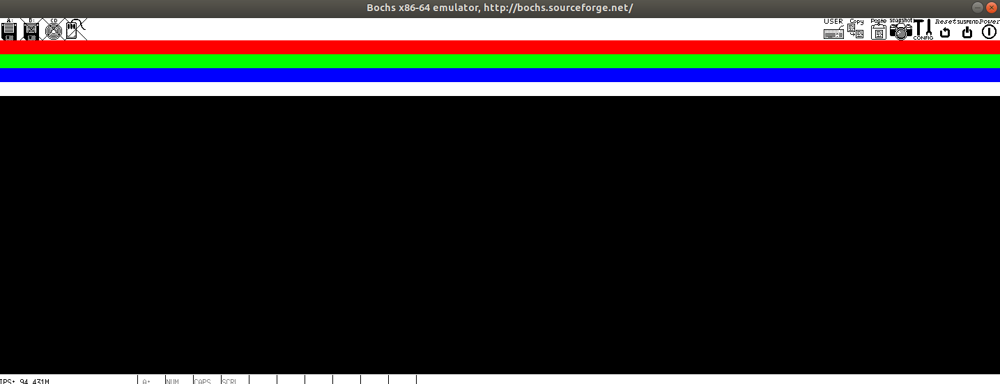

上一节loader程序装载完kernel后，执行了`jmp SelectorCode64:OffsetOfKernelFile`命令跳转到kernel部分了，意味着Loader将处理的控制权交给了Kernel

> **处理器把控制权交给kernel后，kernel最先执行的是内核执行头程序。内核执行头程序是一段精心设计的汇编代码，而且必须借助特殊的编译链接方法才能得到最先执行。**
>
> 内核头程序负责为操作系统创建段结构和页表结构，设置某些结构的默认处理函数、配置关键寄存器等工作。在完成上述工作后，依然要借助远跳指令才能进入系统内核主程序。
>
> 如何将内核执行头程序编译生成到整个内核程序文件的起始处？手动编写内核程序的链接脚本，在内核程序的链接过程中，链接器会按照链接脚本描述的地址空间布局，把编译好的各个程序片段填充到内核程序文件中。

看完有点懵，都是内核程序为啥要咱手动指定谁先谁后？大概是因为内核头是汇编写的，内核是c写的..要让head先执行就得在lds中指定第一条指令是啥..编译部分参考哈: [ld - 链接脚本学习笔记与实践过程 - 知乎 (zhihu.com)](https://zhuanlan.zhihu.com/p/504742628)

<!-- more -->

# 1 链接脚本

来瞅瞅这个`Kernel.lds`文件

```assembly
/* OUTPUT_FORMAT(DEFAULT, BIG, LITTLE)，给链接过程提供 默认，大端，小端 三种格式 */
OUTPUT_FORMAT("elf64-x86-64","elf64-x86-64","elf64-x86-64")
OUTPUT_ARCH(i386:x86-64)  /* 指定输出文件的处理器体系结构 */
ENTRY(_start)  /* 将标识符 _start 作为程序的入口地址，即程序第一条指令地址，后面直接在head.S里面找它 */
SECTIONS
{
    /* 符号 . 是一个定位器或位置指针，用于定位程序的地址或调整程序的布局位置，将定位器设置在地址0xffff800000100000处 
     * 这里0xffff800000000000是线性地址，对应物理地址0，偏移100000也就和预期一样了*/
	. = 0xffff800000000000 + 0x100000;
	.text :
	{
		_text = .;  /* 文本段起始地址0xffff800000100000 */
		*(.text)    /* 所有输入文件的文本段 */
		_etext = .;  /* 结尾线性地址  */
	}
	. = ALIGN(8);  /* 将地址按向后8字节对齐 */
	.data :
	{
		_data = .;
		*(.data)
		
		_edata = .;
	}
	.bss :
	{
		_bss = .;
		*(.bss)
		_ebss = .;
	}
	_end = .;
}
```

SECTIONS部分描述了各程序段在输出文件中的部署以及它们在内存中的布局。ld命令链接各程序文件时，链接顺序大体是按照输入文件顺序来的，所以在系统内核程序的链接命令中，`head.o`必须作为第一个链接文件，也就是Makefile文件里面将header与kernel编译成system时，`head.o`要放在`kernel.o`前面

# 2 内核头

接着链接脚本来看内核头文件`head.S`(这的S一定得是大写！)，第一条指令是文本段里面`_start`开头的，这块的汇编用的AT&T格式的，因为要使用GNU提供的汇编器GAS，之前用的是Intel的，稍微有那么点区别

```assembly
.section .text  # 此处是文本段
.globl _start  # 告诉编译器_start全局可见，不然链接器报warning
_start:  # 内核第一条指令从此处开始
    mov    $0x10,  %ax  # 将立即数0x10传给ax，和Intel汇编反了
    mov    %ax,    %ds
    mov    %ax,    %es
    mov    %ax,    %fs
    mov    %ax,    %ss  # 利用ax初始化各个段
    mov    $0x7E00,    %esp

    # 加载全局描述符表和中断描述符表 和Intel汇编不同lgdt [GdtPtr]
    lgdt    GDT_POINTER(%rip)
    lidt    IDT_POINTER(%rip)

    mov    $0x10,  %ax
    mov    %ax,    %ds
    mov    %ax,    %es
    mov    %ax,    %fs
    mov    %ax,    %gs
    mov    %ax,    %ss
    movq    $0x7E00,    %rsp

    # 00000000 00010000 00010000 00000000
    movq    $0x101000,    %rax
    movq    %rax,         %cr3  # 用了高20位作为页目录地址 顶层页表位置
    
    # 由于GAS不支持ljmp和lcall，所以这里是伪造调用lcall后的现场
    # 先通过Relative rip寻址找到 entry64 地址，放到rax中
    # 然后通过lretq恢复调用现场，即回到目标代码段的程序中
    movq    switch_seg(%rip),    %rax
    pushq    $0x08  # 是段选择子，对应下面gdt中的 1 KERNEL Code 64-bit Segment
    pushq    %rax
    lretq

switch_seg:
    .quad    entry64
entry64:
    movq    $0x10,    %rax
    movq    %rax,    %ds
    movq    %rax,    %es
    movq    %rax,    %gs
    movq    %rax,    %ss
    movq    $0xffff800000007E00,    %rsp        /* rsp address */

    movq    go_to_kernel(%rip),    %rax        /* movq address */
    pushq    $0x08
    pushq    %rax
    lretq

go_to_kernel:
    .quad    Start_Kernel  # 这里就是内核程序入口了
```


再回过头来看看全局描述表和段信息的定义

```assembly
.section .data  # 此处是数据段
.globl GDT_Table
GDT_Table:
    .quad 0x0000000000000000  /*0  NULL   descriptor 00*/
    .quad 0x0020980000000000  /*1  KERNEL Code       64-bit Segment 08*/
    .quad 0x0000920000000000  /*2  KERNEL Data       64-bit Segment 10*/
    .quad 0x0020f80000000000  /*3  USER   Code       64-bit Segment 18*/
    .quad 0x0000f20000000000  /*4  USER   Data       64-bit Segment 20*/
    .quad 0x00cf9a000000ffff  /*5  KERNEL Code       32-bit Segment 28*/
    .quad 0x00cf92000000ffff  /*6  KERNEL Data       32-bit Segment 30*/
    # fill repeat, size, value 重复10次，每次8B，值是0
    .fill 10,8,0     /*8 ~ 9 TSS (jmp one segment <7>) in long-mode 128-bit 40*/
GDT_END:
GDT_POINTER:
GDT_LIMIT:    .word    GDT_END - GDT_Table - 1
GDT_BASE:     .quad    GDT_Table

.globl IDT_Table
IDT_Table:
    .fill  512,8,0
IDT_END:
IDT_POINTER:
IDT_LIMIT:    .word    IDT_END - IDT_Table - 1
IDT_BASE:     .quad    IDT_Table

.globl    TSS64_Table
TSS64_Table:
    .fill  13,8,0
TSS64_END:
TSS64_POINTER:
TSS64_LIMIT:    .word    TSS64_END - TSS64_Table - 1
TSS64_BASE:     .quad    TSS64_Table
```

- 64bit kernel code段

  .quad 0x0020980000000000

  <font color="red">0000 0000</font> 0010 0000 1001 1000 <font color="red">0000 0000</font>

  <font color="red">0000 0000 0000 0000</font> <font color="green">0000 0000 0000 0000</font>

  Base: 0000 0000 0000 0000 0000 0000 0000 0000，G=0，E=0，这是设置成平坦模式，段大小范围从1 byte到1 MByte，步长为一个字节

  Limit: 0000 0000 0000 0000

- 64bit user code段

  .quad 0x0020f80000000000

  <font color="red">0000 0000</font> 0010 0000 1111 1000 <font color="red">0000 0000</font>，G=0，E=0..

  <font color="red">0000 0000 0000 0000</font> <font color="green">0000 0000 0000 0000</font>

  Base: 0000 0000 0000 0000 0000 0000 0000 0000

  Limit: 0000 0000 0000 0000

- 32bit kernel code段

  .quad 0x00cf9a000000ffff

  <font color="red">0000 0000</font> 1100 1111 1001 1010 <font color="red">0000 0000</font>，G=1，E=1，4GB寻址能力

  <font color="red">0000 0000 0000 0000</font> <font color="green">1111 1111 1111 1111</font>

  Base: 0000 0000 0000 0000 0000 0000 0000 0000

  Limit: 1111 1111 1111 1111

这里有必要提一点的是，虽然code和data段描述符在32和64差不多；但是idt和tss的描述符64和32就不一样了，而是128bit，不过暂时看起来是用不上的


创建并初始化页表以及页表项

```assembly
.align 8  # 将下一条语句进行内存对齐 和C语言中结构体内存对齐类似
.org    0x1000  # 固定页目录起始位置，实际线性地址 0xffff800000000000 + 0x100000 + 0x1000;
__PML4E:
    .quad    0x102007  # 设置目录项属性
    .fill    255,8,0
    .quad    0x102007
    .fill    255,8,0
.org    0x2000
__PDPTE:
    .quad    0x103003
    .fill    511,8,0
.org    0x3000
__PDE:
    .quad    0x000083
    .quad    0x200083
    .quad    0x400083
    .quad    0x600083
    .quad    0x800083
    .quad    0xe0000083        /*0x a00000*/
    .quad    0xe0200083
    .quad    0xe0400083
    .quad    0xe0600083        /*0x1000000*/
    .quad    0xe0800083
    .quad    0xe0a00083
    .quad    0xe0c00083
    .quad    0xe0e00083
    .fill    499,8,0
```

显然这是一个4级分页，每个页表项是8B，每个页大小是2MB。页表项设置可参考 Intel手册第三卷 4.5 4-LEVEL PAGING AND 5-LEVEL PAGING

- PML4E

  .quad    0x102007

  0000 0000 0001 0000 0010 0000 0000 0111

  P(bit0)：1，must be 1 to reference a PML4 table

  R/W(bit1)：1，Read/write; if 0, writes may not be allowed to the 256-TByte region controlled by this entry

  U/S(bit2)：1，User/supervisor; if 0, user-mode accesses are not allowed to the 256-TByte region controlled by this entry

  M-1:12：1 0000 0010，Physical address of 4-KByte aligned PML4 table referenced by this entry

- PDPTE

  .quad    0x103003

  0000 0000 0001 0000 0011 0000 0000 0011

  P(bit 0)：must be 1 to reference a page directory

  R/W(bit1)：1，Read/write; if 0, writes may not be allowed to the 1-GByte page referenced by this entry

  U/S(bit2)：0，User/supervisor; if 0, user-mode accesses are not allowed to the 1-GByte page referenced by this entry

  (M–1):12：1 0000 0011，Physical address of 4-KByte aligned page directory referenced by this entry

- PDE

  .quad    0xe0000083

  1110 0000 0000 0000 0000 0000 1000 0011

  P(bit 0)：1，must be 1 to map a 2-MByte page

  R/W(bit1)：1，Read/write; if 0, writes may not be allowed to the 2-MByte page referenced by this entry

  U/S(bit2)：0，User/supervisor; if 0, user-mode accesses are not allowed to the 2-MByte page referenced by this entry

  (M–1):21：1110 0000 0000，Physical address of the 2-MByte page referenced by this entry

PDE中的俩注释就是将物理地址0xe0000000映射到0x00a00000；将物理地址0xe0600000映射到0x1000000

# 3 内核主函数

内核主函数相当于应用程序的主函数，不同之处在于这个内核主函数一般来说不会返回。内核主函数负责调用系统各个模块初始化函数，这些模块初始化结束后，会创建第一个进程init，并将控制权交给init进程(太激动了，终于到C了..不用再受汇编摧残了..)

下面的程序使得进入kernel显示彩条，为了在屏幕上显示颜色，则必须通过帧缓冲存储器(Frame Buffer)来完成，帧缓存的每个存储单元对应屏幕上的一个像素，整个帧缓存对应一幅帧图像，帧缓存是对每个像素点操作，详见VBE..

此前loader设置显示芯片的显示模式(模式号：0x180，分辨率：1440*900，颜色深度：32bit)，`head.S`将帧缓存物理基地址(0xe0000000)映射到0xffff800000a00000处。

32bit像素点帧缓存格式：0\~7位表示蓝色，8\~15代表绿色，16\~23位代表红色，24\~31保留

屏幕坐标原点(0, 0)位于左上角

```c
void Start_Kernel(void) {
    int *addr = (int *) 0xffff800000a00000;
    int i;
    for (i = 0; i < 1440 * 20; i++) {  // 红色条高度是20
        *((char *) addr + 0) = (char) 0x00;
        *((char *) addr + 1) = (char) 0x00;
        *((char *) addr + 2) = (char) 0xff;
        *((char *) addr + 3) = (char) 0x00;
        addr += 1;
    }
    for (i = 0; i < 1440 * 20; i++) {
        *((char *) addr + 0) = (char) 0x00;
        *((char *) addr + 1) = (char) 0xff;
        *((char *) addr + 2) = (char) 0x00;
        *((char *) addr + 3) = (char) 0x00;
        addr += 1;
    }
    for (i = 0; i < 1440 * 20; i++) {
        *((char *) addr + 0) = (char) 0xff;
        *((char *) addr + 1) = (char) 0x00;
        *((char *) addr + 2) = (char) 0x00;
        *((char *) addr + 3) = (char) 0x00;
        addr += 1;
    }
    for (i = 0; i < 1440 * 20; i++) {
        *((char *) addr + 0) = (char) 0xff;
        *((char *) addr + 1) = (char) 0xff;
        *((char *) addr + 2) = (char) 0xff;
        *((char *) addr + 3) = (char) 0x00;
        addr += 1;
    }

    while (1);  // 一个死循环 啥也不干
}
```

最后瞅瞅编译文件Makefile

```makefile
all: system
	objcopy -I elf64-x86-64 -S -R ".eh_frame" -R ".comment" -O binary system kernel.bin

system:	head.o main.o 
	ld -b elf64-x86-64 -o system head.o main.o -T Kernel.lds

main.o:	main.c
	gcc  -mcmodel=large -fno-builtin -m64 -c main.c

head.o:	head.S
	gcc -E  head.S > head.s
	as --64 -o head.o head.s

clean:
	rm -rf *.o *.s~ *.s *.S~ *.c~ *.h~ system  Makefile~ Kernel.lds~ kernel.bin
```

没啥特别需要了解的..

# 4 实验

执行完bochs后，显示了四条彩带




然后看了下gdt和cr3，完全都对的上

```bash
<bochs:33> creg
CR0=0xe0000011: PG CD NW ac wp ne ET ts em mp PE
CR2=page fault laddr=0x0000000000000000
CR3=0x000000101000
    PCD=page-level cache disable=0
    PWT=page-level write-through=0
CR4=0x00000020: pks cet pke smap smep keylock osxsave pcid fsgsbase smx vmx la57 umip osxmmexcpt osfxsr pce pge mce PAE pse de tsd pvi vme
CR8: 0x0
EFER=0x00000500: ffxsr nxe LMA LME sce
XCR0=0x00000001: cet_s cet_u pkru hi_zmm zmm_hi256 opmask bndcfg bndregs ymm sse FPU

<bochs:34> info gdt
Global Descriptor Table (base=0xffff800000104170, limit=135):
GDT[0x0000]=??? descriptor hi=0x00000000, lo=0x00000000
GDT[0x0008]=Code segment, base=0x00000000, limit=0x00000000, Execute-Only, Non-Conforming, Accessed, 64-bit
GDT[0x0010]=Data segment, base=0x00000000, limit=0x00000000, Read/Write, Accessed
GDT[0x0018]=Code segment, base=0x00000000, limit=0x00000000, Execute-Only, Non-Conforming, 64-bit
GDT[0x0020]=Data segment, base=0x00000000, limit=0x00000000, Read/Write
GDT[0x0028]=Code segment, base=0x00000000, limit=0xffffffff, Execute/Read, Non-Conforming, 32-bit
GDT[0x0030]=Data segment, base=0x00000000, limit=0xffffffff, Read/Write
GDT[0x0038]=??? descriptor hi=0x00000000, lo=0x00000000
GDT[0x0040]=??? descriptor hi=0x00000000, lo=0x00000000
GDT[0x0048]=??? descriptor hi=0x00000000, lo=0x00000000
GDT[0x0050]=??? descriptor hi=0x00000000, lo=0x00000000
GDT[0x0058]=??? descriptor hi=0x00000000, lo=0x00000000
GDT[0x0060]=??? descriptor hi=0x00000000, lo=0x00000000
GDT[0x0068]=??? descriptor hi=0x00000000, lo=0x00000000
GDT[0x0070]=??? descriptor hi=0x00000000, lo=0x00000000
GDT[0x0078]=??? descriptor hi=0x00000000, lo=0x00000000
GDT[0x0080]=??? descriptor hi=0x00000000, lo=0x00000000
You can list individual entries with 'info gdt [NUM]' or groups with 'info gdt [NUM] [NUM]'
```

