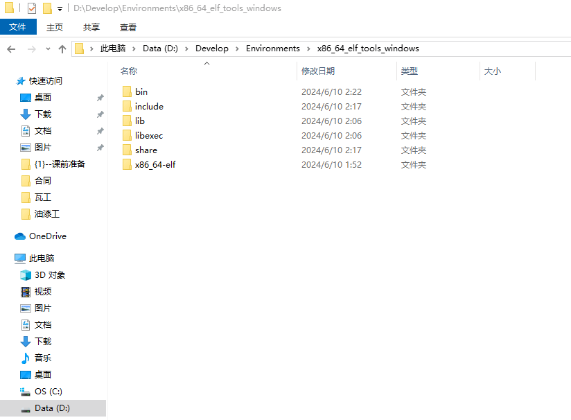
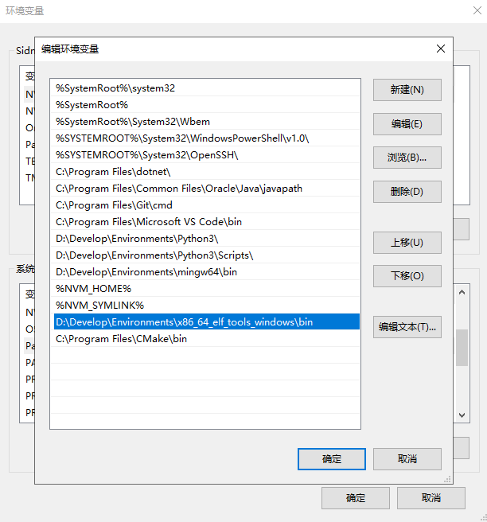
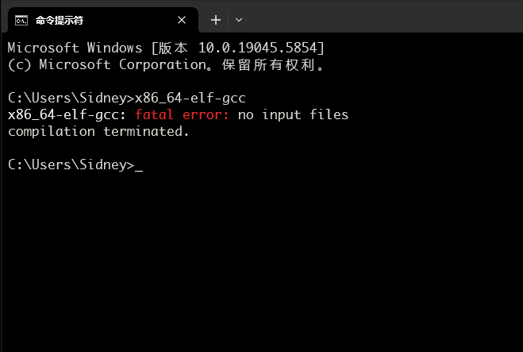
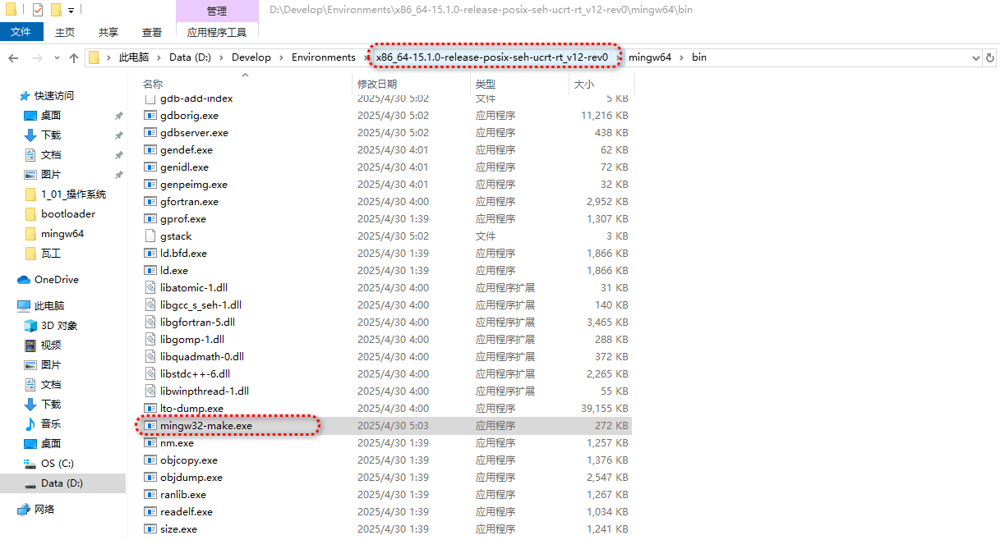
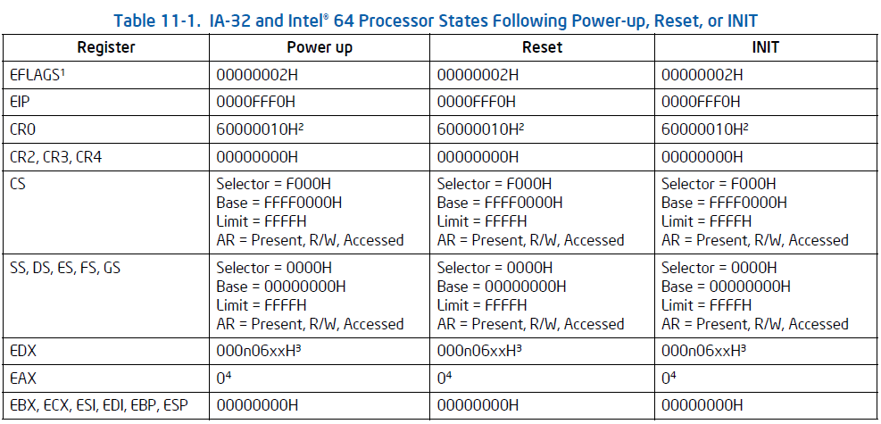
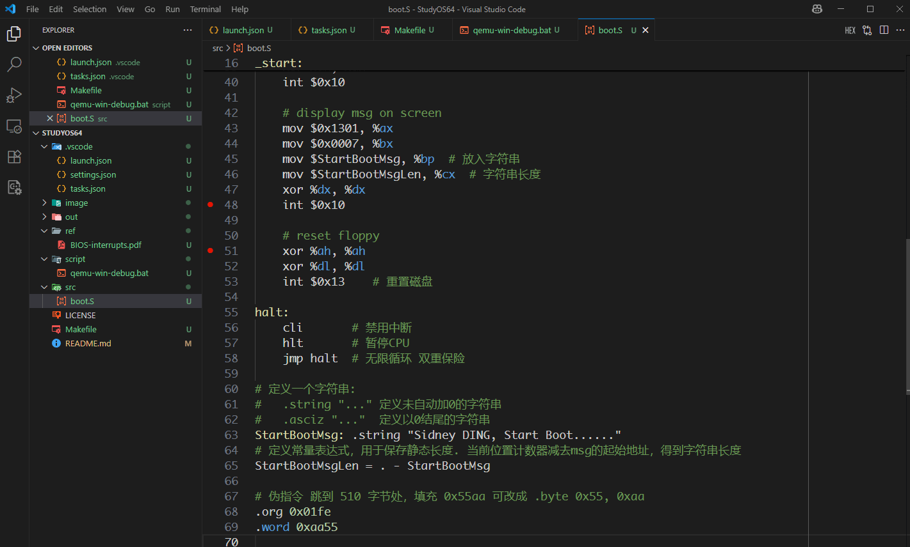

主要是受打击了..md..太多不会了，又重新拾起来了，这次为了方便也不搞什么虚拟机了，所有环境完全在Win10上，主要是笔记本有点破，再搞个虚拟机有点吃不消了..所以参考了下各种教程，最终使用vscode + gdb + qemu的组合..或许qemu会换成Bochs..

# 1 环境搭建

## 1.1 gcc工具链

可以去这个github：https://github.com/blessingwater/GCC_x86_64-elf-tools-windows 下载，解压之后添加环境变量即可

<!--more-->

| 解压                                                         | 设置环境变量                                                 | 命令行验证                                                   |
| ------------------------------------------------------------ | ------------------------------------------------------------ | ------------------------------------------------------------ |
|  |  |  |

TODO 有时间折腾一下交叉编译工具链：https://wiki.osdev.org/GCC_Cross-Compiler

## 1.2 CMake

去 https://cmake.org/download/ 下载Windwos版本安装即可，添加到系统环境变量，能执行`cmake --version`就可以了

## 1.3 安装GCC

主要是为了要make命令，去github下载、解压即可：https://github.com/niXman/mingw-builds-binaries/releases

解压后在bin目录有个可执行文件`mingw32-make.exe`，这个就是我们需要的`make`命令，改成`make.exe`加环境变量就好了



## 1.4 Qemu

去 https://qemu.eu/w64/ 下载最新的安装即可，记得添加的系统环境变量

TODO 自己下载源码编译：https://www.qemu.org/download/

## 1.4 Other

VS Code，Git啥的就不说了

# 2 操作系统启动

一篇老文档：[How Computers Boot Up | Many But Finite](https://manybutfinite.com/post/how-computers-boot-up/)

细节部分可以下载Intel手册：[Manuals for Intel® 64 and IA-32 Architectures](https://www.intel.cn/content/www/cn/zh/developer/articles/technical/intel-sdm.html)


x86_64系统上电后的启动流程（参考卷3：PROCESSOR MANAGEMENT AND INITIALIZATION）大致如下：

## 2.1 上电与硬件复位

电源供应稳定后，主板上的硬件复位电路会发出一个复位信号；

CPU强制进入一个已知的初始状态：将所有寄存器重置为预设值，消除系统断电或异常导致的随机状态，确保可预测的启动环境，同时大部分功能单元也会被禁用（如缓存、超线程、多核）；

控制寄存器CR0状态设置为`60000010H`，此时处理器进入**实地址模式**。下图是部分寄存器的初始值

注意几个重要的寄存器值：指令指针寄存器`EIP=0000FFF0H`，代码段寄存器CS的Selector为`F000H`，通用寄存器EDX表示处理器型号（0000B）、系列（1111B）、处理器类型（00B）。

## 2.2 处理器内置自检（BIST，Build-In Self Test）

这是**可选项**。硬件可要求在开机时执行BIST，若处理器通过了BIST，则将EAX寄存器置0H；非零值表示检测到处理器故障。如果未请求BIST，硬件复位后EAX内容亦为0H。

一般就是逻辑电路测试、内存测试、时序测试

## 2.3 执行第一条指令

上面提到了**实地址模式**，是CPU的一种工作模式，该模式下A20地址线默认被禁用，CPU只能通过20位地址线**直接访问物理内存**，即最大寻址空间为FFFFFH，1MB（$$2^{20}=1048576 B$$）。

CPU从复位状态释放后，根据预定义的初始设置（Intel和AMD规定固定物理地址`FFFFFFF0H`），从**固件**（BIOS或UEFI）的ROM芯片中读取第一条指令。

在实模式下，`物理地址 = CS.Selector << 4 + IP`，这里CS偏移4位刚好是20位。所以第一条指令物理地址为：`F000H << 4 + FFF0H = F0000H + FFF0H = FFFF0H`，计算出来的物理地址并不是实际执行的`FFFFFFF0H`。问题核心在于**硬件对地址空间的特殊映射**，**硬件强制高位地址线（A20~A31或更高）= 1**。

为什么要选择`FFFFFFF0H`作为第一条指令？一个兼容，另一个就是灵活。开机第一件事是读取固件（BIOS/UEFI），其实`FFFFFFF0H`的位置就是固件ROM的末尾，并且是一条跳转指令，**跳转到固件启动代码位置**。每家计算机生产厂商生产的机器外设不同，所以其固件程序大小不尽相同，有的可能是1K，有的可能是2K，如果把固件程序放在0x0000处，那么会造成在机器A上用户写的程序是从`0x0400`开始，机器B上用户写的程序就是`0x0800`开始，非常不统一。如果把这程序放在1M内存的顶部，再规定计算机第一条指令位置是`FFFFFFF0H`，然后就跳到各家固件开始处，那么用户写的程序都可以从`0x0000`开始了。

## 2.4 固件阶段（BIOS/UEFI）

开机自检(POST，Power-On Self-Test)：执行加电自检，检测关键硬件（CPU、内存、显卡、存储控制器）是否正常工作。如有故障，会通过蜂鸣码或LED灯报告。

硬件初始化：初始化芯片组、内存控制器、配置RAM（执行内存检测如MemTest，建立内存映射）、初始化基本显示输出（VGA/文本模式）、初始化基本输入（键盘控制器）、枚举PCI/PCIe设备、初始化存储控制器（SATA, NVMe）等。

固件运行时服务设置：建立供后续阶段（OS Loader）调用的服务接口。

启动设备选择：根据用户配置（Boot Order）或默认顺序，查找可启动设备（硬盘、SSD、USB、网络PXE等）。

加载并移交控制权：从选定的启动设备上找到并加载**第一阶段引导加载程序**（通常是磁盘上的 MBR 或 EFI 分区中的 `.efi` 文件）到内存，并将 CPU 控制权交给它。

BIOS：工作在16位实模式。启动设备查找基于磁盘的**主引导记录**。将MBR的512字节内容加载到物理地址 `0x7C00`。控制权交给`0x7C00`处的MBR代码。分区和文件系统认知有限（依赖MBR和VBR）、仅支持16位代码、寻址空间小、安全性差。

UEFI：大部分代码运行在**32位保护模式**或**64位长模式**（取决于固件实现）。使用**GUID分区表**。直接在EFI 系统分区上查找并加载**EFI应用程序**（通常是`\EFI\BOOT\BOOTX64.EFI` 或操作系统特定的加载器如 `\EFI\Microsoft\Boot\bootmgfw.efi`）。使用UEFI提供的**Boot Services**和**Runtime Services**进行硬件访问、内存分配、文件系统操作等。支持大容量磁盘、独立于文件系统的启动加载、模块化设计、安全启动、图形化界面、更快启动速度。

## 2.5 引导加载程序阶段

这个阶段的任务是**找到并加载操作系统内核**，并为其执行做好环境准备（特别是模式切换）。

BIOS：

- MBR（Stage 1）：位于磁盘第一个扇区（512字节）。主要职责是查找活动分区，将该分区的卷引导记录加载到内存（通常是`0x7C00`），并跳转执行。
- VBR（Stage 1.5/Stage 2）：位于活动分区起始扇区。包含更复杂的代码，能理解特定文件系统（如FAT32, NTFS, ext4）。它的职责是在文件系统中查找并加载第二阶段引导加载程序到内存并执行。
- 第二阶段引导加载程序（Stage 2）：提供用户界面（可选菜单）、加载配置文件、加载操作系统内核映像和初始内存盘到内存。它负责进行从16位实模式到32位保护模式再到64位长模式的切换。最终，准备好内核需要的参数（如命令行、内存布局信息），并跳转到内核的入口点。

UEFI：

- UEFI Boot Manager：根据NVRAM中的启动项配置，直接加载指定的OS Loader。这个加载器本身就是一个UEFI应用程序。
- OS Loader（EFI App）：由UEFI直接加载到内存并执行。它运行在UEFI提供的环境（保护模式/长模式）下。主要职责是：使用 UEFI Boot Services 访问文件系统，**加载操作系统内核映像**和**初始内存盘**；解析启动配置数据；为内核准备启动信息；通知UEFI固件，操作系统即将接管，UEFI会回收其占用的内存并将硬件控制权完全移交给OS Loader/内核；跳转到内核的入口点，此时CPU通常已由UEFI或OS Loader置于**64 位长模式**

## 2.6 操作系统内核初始化

CPU 控制权正式移交到**操作系统内核**的入口点（如Linux的`startup_64()`，Windows的`KiSystemStartup()`）。

**早期内核初始化**：设置内核自己的页表、建立终端描述符表、初始化内存管理子系统、解析bootloader传来的参数......

**中后期内核初始化**：解压并挂载初始内存盘、执行更全面的硬件探测和驱动程序初始化、挂载根文件系统、初始化进程管理和调度器、启动用户空间第一个进程

## 2.7 用户空间初始化

由第一个用户空间进程负责：读取系统配置文件、启动系统服务......

# 3 Hello MyOS

固件的东西不在本次考虑范围内了，系统制作仅从bootloader开始。Bootloader引导程序由两部构成：boot引导程序负责开机启动和加载loader引导程序；loader引导程序用于完成配置硬件工作环境、引导加载内核。


当BIOS自检结束后会根据启动选项设置去选择启动设备，即检测软盘的第0磁头第0磁道第1扇区，是否以`0x55aa`作为结尾。如果是，那么BIOS就认为这个扇区是一个引导扇区（Boot Sector），进而把这个扇区的数据复制到物理内存地址**0x7c00**处，随后将处理器的执行权移交给这段程序（跳转至`0x7c00`地址处执行）。

一个扇区的总容量仅有512B，去掉两字节`0x55aa`，就只剩下510字节，容量太小了只能作为一级引导程序来加载二级引导程序Loader。

写个Hello World试试手，文件树如下：



其中`image`是生成的用于加载的镜像，`out`是生成的中间文件以及elf等，`ref`放一些参考文件，`script`放一下好用的脚本，`src`就是系统的源码了


因为不是nasm来编译，而是`x86_64_elf_gcc`来编译，所以汇编语法略有变化，叫GAS汇编

```assembly
# 指定以下代码生成16位的机器指令，确保可以在实模式下运行
.code16

# 声明本地以下符号是全局的，在其他源文件中可以访问
.global _start

# 代码段地址开始
.section .text

_start:
    xor %ax, %ax  # ax = 0
    mov %ax, %ds
    mov %ax, %es
    mov %ax, %ss

    # 设置栈指针sp指向0x7c00 栈向低地址增长 0x7c00 -> 0x0000
    mov $_start, %sp
    
    # 设置显示模式为 80x25 16色文本模式
    mov $0x0003, %ax
    int $0x10

    # clear screen
    mov $0x0600, %ax
    mov $0x0700, %bx
    xor %cx, %cx
    mov $0x184f, %dx
    int $0x10

    # set focus
    mov $0x0200, %ax
    xor %bx, %bx
    xor %dx, %dx
    int $0x10

    # display msg on screen
    mov $0x1301, %ax
    mov $0x0007, %bx
    mov $StartBootMsg, %bp  # 放入字符串
    mov $StartBootMsgLen, %cx  # 字符串长度
    xor %dx, %dx
    int $0x10

    # reset floppy
    xor %ah, %ah
    xor %dl, %dl
    int $0x13    # 重置磁盘

halt:
    cli       # 禁用中断
    hlt       # 暂停CPU
    jmp halt  # 无限循环 双重保险

# 定义一个字符串:
#   .string "..." 定义未自动加0的字符串
#   .asciz "..."  定义以0结尾的字符串
StartBootMsg: .string "Sidney DING, Start Boot......"
# 定义常量表达式，用于保存静态长度. 当前位置计数器减去msg的起始地址，得到字符串长度
StartBootMsgLen = . - StartBootMsg

# 伪指令 跳到 510 字节处，填充 0x55aa 可改成 .byte 0x55, 0xaa
.org 0x01fe
.word 0xaa55
```

基本主要就是向屏幕输出了一串字符串，BIOS中断参考`ref/BIOS-interrupts.pdf`即可，然后此时的内存布局应当如下

| 地址范围            | 内容         | 大小     |
| :------------------ | :----------- | :------- |
| 0x00000-0x003FF     | 中断向量表   | 1KB      |
| 0x00400-0x004FF     | BIOS 数据区  | 256B     |
| 0x00500-0x07BFF     | 空闲内存     | ~30KB    |
| **0x07C00-0x07DFF** | **引导程序** | **512B** |
| 0x07E00-0x9FFFF     | 可用内存     | ~608KB   |


1. 为什么是`0x7c00`？

很久很久以前，这个值是`0x200`，关于这个`0x200`大概有三个原因：一是8086中断向量使用`0x0 - 0x3FF`，二是86-DOS从`0x400`加载，三是86-DOS不使用`0x200 - 0x3FF`之间的中断向量。这些原因意味着需要保留`0x200 - 0x3FF`，而且无论86-DOS或用户应用程序想在哪里加载，都不能妨碍操作系统。因此Tim Paterson（86-DOS开发者）选择`0x200`作为MBR加载地址。

`0x7C00`由IBM PC 5150 BIOS开发团队（David Bradley 博士）决定的。因为当时认为DOS1.0最少需要32KB，为了让操作系统有一个连续的内存空间，尽量把启动扇区的位置放到内存的尾部，启动扇区是512字节，除此之外启动扇区的堆栈/数据区还需空间，又预留了512字节。因此，`0x7c00 = 32K - 1024B`


2. 为什么是`0x55aa`？

首先，1字节不够可靠（可能随机出现），2字节组合概率：1/65536（足够安全）。这俩数字是完美的0、1交替序列`01010101 10101010`，早期软盘的物理表现：产生稳定的250KHz方波（对模拟电路友好）

> "我们需要一个不可能随机出现的模式。55 AA 的交替位模式在损坏时仍保留可识别特征，且电气特性上产生独特的电压波动，这对软盘驱动器识别扇区结束至关重要。"
> —— David Bradley, IBM PC BIOS 首席设计师
