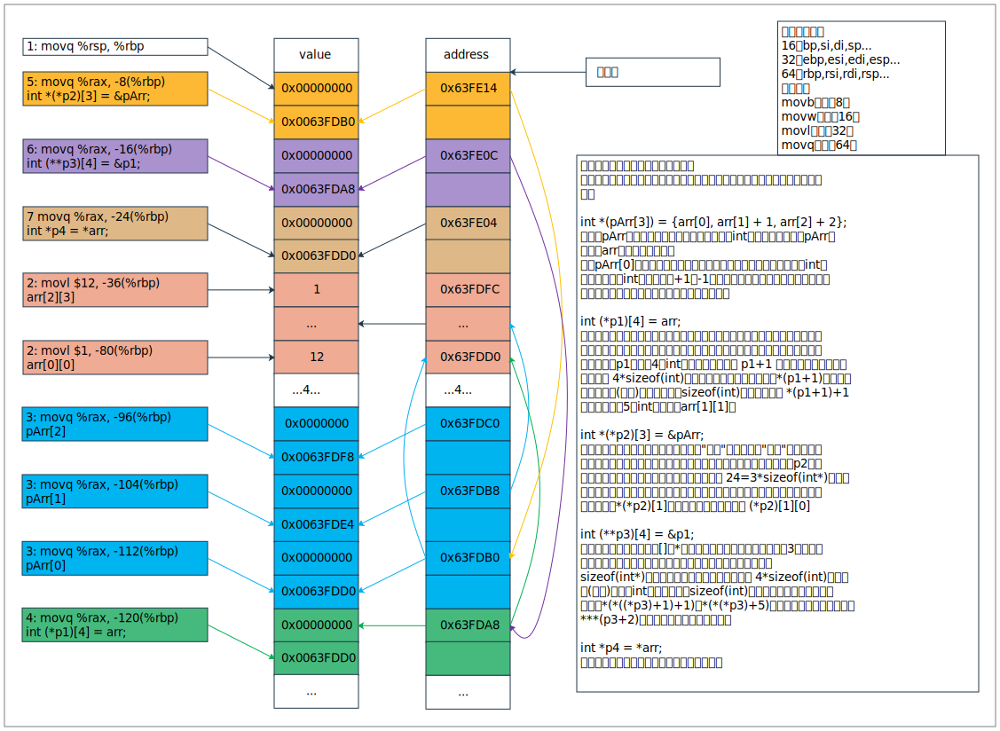
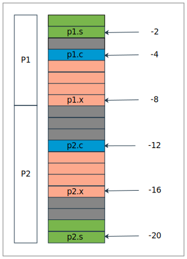

数组和指针一般不能分开，尤其是C语言里面，让人又爱又恨的东西..而一谈到这俩玩意就得画图..

# 1 数组

对数组下定义，抱歉，我不会。但是我有词典，a way of organizing and storing related data in a computer memory。这么一看就清晰多了

元素类型为char的数组可以如下声明

`int c[6];  // 可以存6个整数的数组`

在声明中`[]`表示xxx的数组，所有数组下标都是从0开始，计算机中很多东西都是从0开始，为什么？搜索一下吧。数组的大小，就是那个6，必须得是个常量表达式，这么看，数组一旦定义好了大小就定下来了呀

数组名也是标识符，也要符合规则，不能和其他变量重名

数组初始化的时候可以部分初始化，也可以整体初始化；赋值的时候不能整体赋值，只能单个元素得赋值(数组拷贝，那个不算)

<!--more-->

```c++
int arr[] = {1, 2, 3, 4, 5};  // 这样就是整体初始化，可以不用写数组大小
// arr = {5, 4, 3, 2, 1};  // 不带这样的赋值
arr[1] = 4;  // 只能单个赋值
```

另外有一点就是大家常说的，数组是在内存里面开辟一块连续的空间

```c++
int main() {
    int arr[5] = {1, 2, 3, 4, 5};
    for (int i = 0; i < 5; ++i) {
        printf("a[%d]'s addr is %p\n", i, &arr[i]);
    }
    return 0;
}
/* output
a[0]'s addr is 000000000062FE00
a[1]'s addr is 000000000062FE04
a[2]'s addr is 000000000062FE08
a[3]'s addr is 000000000062FE0C
a[4]'s addr is 000000000062FE10
*/
```

可以看到都是4个4个往上加的连续地址

再说多维数组，多维数组给我们的直观感受是这样的

```c++
// 比如这是个二维的，那就应该是个平面
int arr[2][3] = {
    {1, 2, 3},
    {4, 5, 6}
};
```

但是显然内存不是个平面，还是个线性的

```c++
int main() {
    int arr[2][3] = {
            {1, 2, 3},
            {4, 5, 6}
    };
    for (int i = 0; i < 2; ++i) {
        for (int j = 0; j < 3; ++j) {
            printf("a[%d][%d]'s addr is %p\n", i, j, &arr[i][j]);
        }
    }
    return 0;
}
/* output
a[0][0]'s addr is 000000000062FE00
a[0][1]'s addr is 000000000062FE04
a[0][2]'s addr is 000000000062FE08
a[1][0]'s addr is 000000000062FE0C
a[1][1]'s addr is 000000000062FE10
a[1][2]'s addr is 000000000062FE14
*/
```

汇编出来看看

```assembly
main:
    pushq    %rbp
    ...
    .seh_endprologue
    call    __main
    movl    $1, -32(%rbp)
    movl    $2, -28(%rbp)
    movl    $3, -24(%rbp)
    movl    $4, -20(%rbp)
    movl    $5, -16(%rbp)
    movl    $6, -12(%rbp)
    movl    $0, -4(%rbp)
    jmp    .L2
...
.L2:
    cmpl    $1, -4(%rbp)
    jle    .L5
    movl    $0, %eax
    addq    $64, %rsp
    popq    %rbp
    ret
```

现在对(%rbp)前面的数字就有那么点感觉了哈，`-8(%rbp)`去哪了？是j呀

数组里面还有一个特殊的，就是字符数组，在C语言里面就指望这个当字符串了

```c
int main() {
    char str[] = "hello world!";
    char arr[] = {'h', 'e', 'l', 'l', 'o', ' ', 'w', 'o', 'r', 'l', 'd', '!'};
    char tmp[] = {'h', '\0'};
    for (int i = 0; i < sizeof(str) / sizeof(char); ++i) {
        printf("(%c)", str[i]);
    }
    printf("\n%s\n", str);
    for (int i = 0; i < sizeof(arr) / sizeof(char); ++i) {
        printf("(%c)", arr[i]);
    }
    printf("\n%s\n", arr);
    return 0;
}
/* output
(h)(e)(l)(l)(o)( )(w)(o)(r)(l)(d)(!)( )
hello world!
(h)(e)(l)(l)(o)( )(w)(o)(r)(l)(d)(!)
hello world!hello world!
*/
```

汇编出来瞅瞅

```assembly
main:
    pushq    %rbp
    ...
    call    __main
    movabsq    $8031924123371070824, %rax  # 8个字节
    movq    %rax, -21(%rbp)
    movl    $560229490, -13(%rbp)  # 4个字节 和前面8个加起来就是 hello world!
    movb    $0, -9(%rbp)     # 最后面的\0 到这里为止应该是str的定义及声明
    movb    $104, -33(%rbp)  # h
    movb    $101, -32(%rbp)
    movb    $108, -31(%rbp)
    movb    $108, -30(%rbp)
    movb    $111, -29(%rbp)
    movb    $32, -28(%rbp)
    movb    $119, -27(%rbp)
    movb    $111, -26(%rbp)
    movb    $114, -25(%rbp)
    movb    $108, -24(%rbp)
    movb    $100, -23(%rbp)
    movb    $33, -22(%rbp)   # ! 到这里位置应该是arr的
    movb    $104, -35(%rbp) # h
    movb    $0, -34(%rbp)   # 这里就是tmp的了
    movl    $0, -4(%rbp)
    jmp    .L2
.L3:
```

从这段程序至少可以看出，字符数组要想编程字符串后面必须有`'\0'`，字符串不论何种形式，内存占的大小是一样的，但是用字符数组去初始化字符串通常会比较慢(好像每种指令执行速度不一样，这句话不一定对哦)

还有一个C和C++的字符串是不一样的，它们之间的转换

```c++
int main() {
    string cppString = "abc";
    //char* cString = "cstr";  // ISO C++ 11不允许这么干
    char cArr[] = "cArr";
    char *cString = cArr;

    const char *tmpStr = cppString.c_str();
    string aStr = cString;
    string bStr = cArr;
    string cStr = tmpStr;

    char *tmpCStr = static_cast<char *>(malloc(10));
    cppString.copy(tmpCStr, cppString.length(), 0);

    char tmpCArr[10];
    cppString.copy(tmpCArr, cppString.length(), 0);
    
    char *cDataStr = cppString.data();  // C++11报错 要const，C++17没事

    return 0;
}
```

数组单个玩没意思，还是需要结合指针玩

# 2 指针

先不要把这玩意想象成指针


就当成一个数据类型，这个数据类型是存地址的，地址是啥，就一串数字，说白了就是存了一串数字。从这里我们就知道了指针的大小了，地址是无符号数，那么32位的程序就是4个字节，64位的程序就是8个字节

```c++
// 下面三个输出都是8 我是64位的
printf("%llu\n", sizeof(char*));
printf("%llu\n", sizeof(int*));
printf("%llu\n", sizeof(long*));
```

再看指针的声明定义啥的

```c
int a = 10;
int* iP = &a;  // 我们称iP为 "指向"a的指针；&取地址符号只能应用于内存中的对象，不能用作表达式，常量，register的变量
printf("%d", *iP);  // 这里的*表示间接寻址或间接引用，访问指针所指向的对象
```

指针只能指向某个特定数据类型的对象，但是void型指针比较特殊，可以指向任意数据类型的对象，但它不能间接引用自身。注意读法<font color='red'>**"aa指向bb的指针"**</font>(读法来自K&R的《C程序设计语言》)，读不好，后面就得绕进去

## 2.1 指针和数组

通过数组下标所能完成的任何任务都能通过指针来实现。一般来说，用指针实现的程序比用数组下标实现的程序执行速度更快(现在优化得两者差不多了)

```c++
int main() {
    int arr[] = {1, 2, 3, 4, 5, 6, 7, 8, 9};
    int* pInt = &arr[0];
    int* pArr = arr;

    pInt = pInt + 1;
    pArr = pArr + 2;
    return 0;
}
```

汇编一下

```assembly
main:
    pushq    %rbp
    ...
    .seh_endprologue
    call    __main
    movl    $1, -64(%rbp)  # arr[0]
    movl    $2, -60(%rbp)
    movl    $3, -56(%rbp)
    movl    $4, -52(%rbp)
    movl    $5, -48(%rbp)
    movl    $6, -44(%rbp)
    movl    $7, -40(%rbp)
    movl    $8, -36(%rbp)
    movl    $9, -32(%rbp)
    leaq    -64(%rbp), %rax  # load effective address
    movq    %rax, -8(%rbp)   # pInt
    leaq    -64(%rbp), %rax
    movq    %rax, -16(%rbp)  # pArr
    addq    $4, -8(%rbp)     # 地址加立即数4，因为int是4字节的
    addq    $8, -16(%rbp)    # 地址加立即数8，两个4呀
    movl    $0, %eax
    addq    $96, %rsp
    popq    %rbp
    ret
```

所以从汇编的角度来看arr就是指向arr[0]的地址，指针加n，实际上就是`指针的值(地址) + n * sizeof(数据类型)`，那么减法应当也是一样咯，地址往前往后的区别。

知道这层关系之后，再来讨论一下指针和多维数组之间的关系

```java
int main() {
    int arr[3][4] = {
            {1, 2,  3,  4},
            {5, 6,  7,  8},
            {9, 10, 11, 12}
    };

    // pArr是指向int的指针的数组 指针数组 pArr是个存放int型指针的一维数组
    int *pArr[3] = {arr[0], arr[1] + 1, arr[2] + 2};
    // int *(pArr[3]) = {arr[0], arr[1] + 1, arr[2] + 2};
    // p1是指向4 int数组的指针 数组指针 p1是个指针，指向的是一个数组，这样说，可能有点不明白，换个方式。
    // 把arr当作一维数组，存的就是4个数组的首地址，现在再看p1是个指针，指向存有4个数组首地址的数组的首地址
    int (*p1)[4] = arr;
    // int (*p1)[] = arr;  // 4是可以去掉的，因为arr很明确
    // p2是指向指向3 int的指针的数组的指针 指向指针数组的指针
    int *(*p2)[3] = &pArr;
    // int* (*p2)[] = &pArr;
    // p3是指向 指向4 int数组的指针 的指针，指向数组指针的指针，二级指针
    int (**p3)[4] = &p1;
    // int (**p3)[] = &p1;

    // p4是指向int的指针 arr == &arr[0][0]
    int *p4 = *arr;
    // int* p2 = arr;  这会有warning initialization of 'int *' from incompatible pointer type 'int (*)[4]'

    printf("%d\n", *(pArr[1] + 0));       // 6
    printf("%d\n", *(*(p1 + 1) + 1));     // 6
    printf("%d\n", *(*(*(p2) + 1) + 0));  // 6
    printf("%d\n", *(*(*p3 + 1) + 1));    // 6
    printf("%d\n", *(p4 + 5));            // 6

    return 0;
}
```

汇编一下

```assembly
main:
    pushq    %rbp              # push当然是入栈的意思
    .seh_pushreg    %rbp
    movq    %rsp, %rbp        # rbp是堆栈基指针 rsp是栈顶指针 现在它俩对齐了
    .seh_setframe    %rbp, 0
    subq    $160, %rsp        # 给变量开辟空间 160个字节
    .seh_stackalloc    160
    .seh_endprologue
    call    __main
    movl    $1, -80(%rbp)     # arr[0][0]
    movl    $2, -76(%rbp)
    movl    $3, -72(%rbp)
    movl    $4, -68(%rbp)
    movl    $5, -64(%rbp)
    movl    $6, -60(%rbp)
    movl    $7, -56(%rbp)
    movl    $8, -52(%rbp)
    movl    $9, -48(%rbp)
    movl    $10, -44(%rbp)
    movl    $11, -40(%rbp)
    movl    $12, -36(%rbp)    # arr[2][3]
    leaq    -80(%rbp), %rax   # 将-80(%rbp)的地址存到%rax
    movq    %rax, -112(%rbp)  # pArr[0] = -112(%rbp) = -80(%rbp)的地址
    leaq    -80(%rbp), %rax
    addq    $16, %rax
    addq    $4, %rax
    movq    %rax, -104(%rbp)  # pArr[1] = -104(%rbp) = (-80 + 16 + 4)(%rbp)的地址
    leaq    -80(%rbp), %rax
    addq    $32, %rax
    addq    $8, %rax
    movq    %rax, -96(%rbp)   # pArr[2] = -96(%rbp) = (-80 + 32 + 8)(%rbp)的地址
    leaq    -80(%rbp), %rax
    movq    %rax, -120(%rbp)  # p1 = -120(%rbp) = -80(%rbp)的地址
    leaq    -112(%rbp), %rax
    movq    %rax, -8(%rbp)    # p2 = -8(%rbp) =  -112(%rbp)的地址
    leaq    -120(%rbp), %rax
    movq    %rax, -16(%rbp)   # p3 = -16(%rbp) = -120(%rbp)的地址
    leaq    -80(%rbp), %rax
    movq    %rax, -24(%rbp)   # p4 = -24(%rbp) = -80(%rbp)的地址
    movq    -104(%rbp), %rax
    movl    (%rax), %eax
    movl    %eax, %edx
    leaq    .LC0(%rip), %rcx
    call    printf
    movq    -120(%rbp), %rax
    addq    $16, %rax
    addq    $4, %rax
    movl    (%rax), %eax
    movl    %eax, %edx
    leaq    .LC0(%rip), %rcx
    call    printf
    movq    -8(%rbp), %rax
    addq    $8, %rax
    movq    (%rax), %rax
    movl    (%rax), %eax
    movl    %eax, %edx
    leaq    .LC0(%rip), %rcx
    call    printf
    movq    -16(%rbp), %rax
    addq    $8, %rax
    movq    (%rax), %rax
    addq    $16, %rax
    movl    (%rax), %eax
    movl    %eax, %edx
    leaq    .LC0(%rip), %rcx
    call    printf
    movl    $0, %eax
    addq    $160, %rsp
    popq    %rbp
    ret
```

再来一张图



这整个搞完，发现一个很重要的点，就是当前指针的步长是多少，当前指针存储地址是多少，这样就可以无限递归推算下去。

PS：没系统学过汇编，可能表述的有点问题..

## 2.2 指针运算

再探讨一下比较好玩的事，常量指针和指针常量

```java
// 没有const的话，我们读作 变量a；加了const，我们读作 常量a
const char a;
char const b;

// 变量p1是指向 常量char 的指针，变量p1，那么p1的值可以变，但是p1指向的值不能变
const char *p1;
// 变量p1是指向 char常量 的指针
char const *p1;
    
// 常量p2是指向 char变量 的指针，常量p2，那么p2的值不能变，但是p2指向的值可以变
char* const p2;

// 常量p3是指向 常量char 的指针，都是常量，那就是都不能变
const char* const p3;
char const * const p3;  // 看起来很奇怪对不对 但是能够读得通 那就没毛病

p1 = &a;  // OK
// *p1 = 'a';   Read-only variable is not assignable

// p2 = &a;  Cannot assign to variable 'p3' with const-qualified type 'char *const'
*p2 = 'a';  // OK
```

啥常量指针，指针常量，那第三个咋读？常量指针常量？精简就容易带来误解

好了，那只是个题外话，接下来说说，指针相关的计算，就是加减乘除啥的

**指针和基本数据类型**

从上面我们了解到，指针和int可以做加减，实际就是指针存储的值做偏移，比如下面的程序，一点毛病没有

```c++
int main() {
    int arr[] = {1, 2, 3};
    int *pArr = arr;
    pArr++;
    pArr--;

    return 0;
}
```

问题1：那有个好玩的数据类型，void，这个呢？可以与int做加减吗？根据搜索得知

> void* pvoid;
>
> pvoid++; // ANSI：错误
>
> pvoid += 1; // ANSI：错误
>
> 
>
> pvoid++; //GNU：正确
>
> pvoid += 1; //GNU：正确
>
> 
>
> (char *) pvoid++; // ANSI：正确；GNU：正确
>
> (char *) pvoid += 1; // ANSI：错误；GNU：正确

这么说，ANSI限制贼严格..切换成ANSI全报红了..还是GNU比较奔放。通过实验也可以发现，在GNU下，`sizeof(void)`的值是1

问题2：能和浮点数相加吗？能和char相加吗？能和long相加吗？

```c
int arr[] = {1,2,3};
int* pInt = arr;
// pInt += 2.1;  // Invalid operands to binary expression ('int *' and 'double')
pInt += '0';
pInt += 1L;
short s = 1;
pInt += s;
```

答案还是比较容易想到的

问题3：指针可以乘除吗？

Invalid operands to binary expression ('int *' and 'int')。我只能说隐式转换不成功

**指针和指针**

问题1：指针和指针相加会有什么特效？

Invalid operands to binary expression ('int *' and 'int *')

当然也不要想着乘除了，存在必合理，不存在那肯定就是不合理了

问题2：指针和指针相减会有什么特效？

```c
int arr[] = {1,2,3};
int* pInt1 = arr;
int* pInt2 = arr + 1;
long long diff = pInt2 - pInt1;
printf("%llu\n", diff);
printf("%lld", pInt1 - pInt2);  // 很容易想到吧
```

这是同类型的，那不同类型的呢？

```c
int a;
unsigned u;
char b;
long c;
double d;

int* pa = &a;
unsigned *pu = &u;
char* pb = &b;
long* pc = &c;
double* pd = &d;

// pa - pb;  'int *' and 'char *' are not pointers to compatible types
// pa - pu;
// pa - pc;
// pa - pd;
```

这报的错叫aa和bb不是指向兼容的指针，难道还有类型不一样，但是类型兼容的指针？指针减一下就知道是不是同类型的了，不是编译都过不了

**指针逻辑运算**

不打算研究那么多了，指针能够比较大小吗？

```c
int arr[] = {1, 2, 3};
int *pInt1 = arr;
int *pInt2 = arr + 1;
printf("%d\n", pInt1 < pInt2);
printf("%d\n", pInt1 < 0);
printf("%d\n", pInt1 < 0xFFFFFFFFFF);  // Ordered comparison between pointer and integer ('int *' and 'long long')
```

汇编一下

```assembly
main:
    pushq    %rbp
    .seh_pushreg    %rbp
    movq    %rsp, %rbp
    .seh_setframe    %rbp, 0
    subq    $64, %rsp
    .seh_stackalloc    64
    .seh_endprologue
    call    __main
    movl    $10, -28(%rbp)    # arr[0]
    movl    $2, -24(%rbp)     # arr[1]
    movl    $3, -20(%rbp)     # arr[2]
    leaq    -28(%rbp), %rax
    movq    %rax, -8(%rbp)   # pInt1
    leaq    -28(%rbp), %rax
    addq    $4, %rax
    movq    %rax, -16(%rbp)  # pInt2
    movq    -8(%rbp), %rax
    cmpq    -16(%rbp), %rax  # 直接拿存储的地址进行比较
    setb    %al
    movzbl    %al, %eax
    movl    %eax, %edx
    leaq    .LC0(%rip), %rcx
    call    printf
    movl    $0, %edx              # 这应该是被优化了 都不比较了
    leaq    .LC0(%rip), %rcx
    call    printf
    movabsq    $1099511627774, %rax
    cmpq    %rax, -16(%rbp)       # 拿地址和数字进行比较
    setbe    %al
    movzbl    %al, %eax
    movl    %eax, %edx
    leaq    .LC0(%rip), %rcx
    call    printf
    movl    $0, %eax
    addq    $64, %rsp
    popq    %rbp
    ret
```

总结一下

> 有效的指针运算包括相同类型指针之间的赋值运算；指针同整数之间的加法或减法运算；指向相同数组中元素的两个指针间的减法或比较运算；将指针赋值为0或指针与0之间的比较运算。其他所有形式的指针运算都是非法的，指针之间加减乘除，移位或屏蔽运算；指针同float或double类型之间的加法；不经强制类型转换而直接将指向一种类型对象的指针赋值给指向另一种类型对象的指针运算(两个指针之一是void*类型的情况除外)

至于函数指针，指针函数这俩玩意放到函数那块再讨论

# 3 引用

引用这个概念是Cpp的，C没有，在Cpp的世界里，指针与引用是分不开的

和指针类似，引用作为对象的别名存放的也是对象的机器地址，与指针相比，引用不会带来额外的开销，引用与指针的却别主要包括：

- 访问引用与访问对象本身从语法形式上是一样的

- 引用所引的永远是一开始初始化的那个对象

- 不存在“空引用”，我们可以认为引用一定对应着某个对象

引用实际上是对象的别名。引用最重要的用途是作为函数的实参或返回值，此外它也被用于重载运算符

左值引用：引用那些我们希望改变的对象

const引用：引用那些我们不希望改变值的对象(比如常量)

右值引用：所引对象的值在我们使用之后就无需保留了(比如临时变量)

前两种都叫做左值引用

## 3.1 左值引用

```c++
int main() {
    int i = 1;
    int& r = i;
    int ii = r;
    r = 4;
    printf("%d, %d, %d, %p\n", i, r, ii, &r);

    return 0;
}
/* output
4, 4, 1, 000000000064fe10
*/
```

说明引用是有地址的，引用和(*p)是很像的，但是引用这玩意比较智能一点，汇编一波

```assembly
main:
    pushq    %rbp
    ...
    .seh_endprologue
    call    __main
    movl    $1, -16(%rbp)     # int i = 1;
    leaq    -16(%rbp), %rax
    movq    %rax, -8(%rbp)    # int& r = i;
    movq    -8(%rbp), %rax
    movl    (%rax), %eax
    movl    %eax, -12(%rbp)   # int ii = r;
    movq    -8(%rbp), %rax
    movl    $4, (%rax)        # r = 4;
    movq    -8(%rbp), %rax
    movl    (%rax), %ecx      # i
    movl    -16(%rbp), %eax   # r
    movl    -12(%rbp), %r8d   # ii
    movq    -8(%rbp), %rdx
    movq    %rdx, 32(%rsp)    # &r
    movl    %r8d, %r9d
    movl    %ecx, %r8d
    movl    %eax, %edx
    leaq    .LC0(%rip), %rcx
    call    _ZL6printfPKcz
    movl    $0, %eax
    addq    $64, %rsp
    popq    %rbp
    ret
```

再把引用换成指针

```c++
#include "iostream"

int main() {
    int i = 1;
    int* r = &i;
    int ii = *r;
    *r = 4;
    printf("%d, %d, %d, %p\n", i, *r, ii, &(*r));  // 这才是引用的本质
    // printf("%d, %d, %d, %p\n", i, *r, ii, &r);  // 这样汇编会少一句 movl    %eax, %edx

    return 0;
}
/* output
4, 4, 1, 000000000064fe10
*/
```

汇编一下

```assembly
main:
    pushq    %rbp
    ...
    .seh_endprologue
    call    __main
    movl    $1, -16(%rbp)
    leaq    -16(%rbp), %rax
    movq    %rax, -8(%rbp)
    movq    -8(%rbp), %rax
    movl    (%rax), %eax
    movl    %eax, -12(%rbp)
    movq    -8(%rbp), %rax
    movl    $4, (%rax)
    movq    -8(%rbp), %rax
    movl    (%rax), %ecx
    movl    -16(%rbp), %eax
    movl    -12(%rbp), %r8d
    movq    -8(%rbp), %rdx
    movq    %rdx, 32(%rsp)
    movl    %r8d, %r9d
    movl    %ecx, %r8d
    movl    %eax, %edx
    leaq    .LC0(%rip), %rcx
    call    _ZL6printfPKcz
    movl    $0, %eax
    addq    $64, %rsp
    popq    %rbp
    ret
```

汇编出来的代码都一毛一样，所以，你懂我意思吧。

**为了确保引用对应某个对象，必须初始化引用**

再来看一个牛逼一点的常量引用

```c++
int main() {
    int i = 10;
    // 常量引用的本质 汇编代码是一样的
    const int& r = i;
    int* const p = &i;

    int t = 10;
    // r = &i;  Cannot assign to variable 'r' with const-qualified type 'const int &'
    // p = &t;  Cannot assign to variable 'p' with const-qualified type 'int *const'
    
    const int& r1 = 1;  // 这个稍微强一点 只不过是少写点代码而已

    return 0;
}
```

## 3.2 右值引用

右值引用对应一个临时对象，用户可以修改这个对象，并且认定这个对象以后不会用到了

```c++
int main() {
    // int a = 10;
    // int&& rr = a;  // Rvalue reference to type 'int' cannot bind to lvalue of type 'int'
    int && rr = 10;

    const int&& rr1 = 10;

    return 0;
}
```

rr是个临时变量，不允许绑定左值，只允许绑定右值。虽然可以声明定义const右值引用，但是一般不用，因为右值引用就是用来修改的，加了const就不能改了

右值引用和const左值引用都能绑定右值，但是它们的目标完全不同

- 右值引用实现了一种破坏性读取，某些数据本来需要拷贝，使用右值引用可以优化其性能

- const左值引用的目的是保护参数内容不被修改

为什么说提高性能

```c++
template<class T>
void swap1(T& a, T& b) {
    T tmp = static_cast<T&&>(a);
    a = static_cast<T&&>(b);
    b = static_cast<T&&>(tmp);
}

template<class T>
void swap2(T& a, T& b) {
    T tmp = std::move(a);
    a = std::move(b);
    b = std::move(tmp);
}
```

move函数并没有移动，而是将左值强转为右值。这里需要插播一下，何为左值，何为右值

> 右值是"不能作为左值的值"，比如像函数返回值一样的临时值。右值的定义多么清晰，只要知道什么是左值就行了。当考虑对象的寻址，拷贝，移动等操作时，有两种属性特别关键
>
> - 有身份，在程序中有对象的名字，或者指向该对象的指针，或该对象的引用，这样我们就能判断两个对象是否相等或对象值是否发生改变
> - 可移动，能把对象的内容移出来(比如，能把它的值移动到其他某处，剩下的对象处于合法但未指定状态，与拷贝是有差别的)
>
> 根据排列组合可知，有身份和可移动可以组合成四种形式，但是既没有身份又不可移动的对象不重要。
>
> 左值：有身份 && !可移动
>
> 特别值：有身份 && 可移动
>
> 纯右值：!有身份 && 可移动
> 其中左值和特别值又称泛左值(有身份)，纯右值和特别值又称右值(可移动)。在实际编程中考虑左值和右值就够了，一条表达式要么是左值，要么是右值，不可能两者都是

程序一：

```c++
int main() {
    int a = 1;
    int b = 2;
    int tmp = static_cast<int&&>(a);
    a = static_cast<int&&>(b);
    b = static_cast<int&&>(tmp);
    printf("%d, %d, %d\n", a, b, tmp);
    return 0;
}
/* output
2, 1, 1
*/
```

汇编一下

```assembly
main:
    pushq    %rbp
    movq    %rsp, %rbp
    subq    $48, %rsp
    call    __main
    movl    $1, -4(%rbp)       # int a = 1;
    movl    $2, -8(%rbp)       # int b = 2;
    movl    -4(%rbp), %eax     # %eax临时变量的角色 1
    movl    %eax, -12(%rbp)    # int tmp = 1;
    movl    -8(%rbp), %eax     # %eax的值换成了2
    movl    %eax, -4(%rbp)     # a = 2;
    movl    -12(%rbp), %eax    # 临时变量又换成了 1
    movl    %eax, -8(%rbp)     # b = 1;
    movl    -12(%rbp), %ecx
    movl    -8(%rbp), %edx
    movl    -4(%rbp), %eax
    movl    %ecx, %r9d
    movl    %edx, %r8d
    movl    %eax, %edx
    leaq    .LC0(%rip), %rcx
    call    _ZL6printfPKcz
    movl    $0, %eax
    addq    $48, %rsp
    popq    %rbp
    ret
```

程序二：

```c++
int main() {
    int a = 1;
    int b = 2;
    int tmp = a;
    a = b;
    b = tmp;
    printf("%d, %d, %d\n", a, b, tmp);
    return 0;
}
```

汇编一下

```assembly
main:
    pushq    %rbp
    movq    %rsp, %rbp
    subq    $48, %rsp
    call    __main
    movl    $1, -4(%rbp)
    movl    $2, -8(%rbp)
    movl    -4(%rbp), %eax
    movl    %eax, -12(%rbp)
    movl    -8(%rbp), %eax
    movl    %eax, -4(%rbp)
    movl    -12(%rbp), %eax
    movl    %eax, -8(%rbp)
    movl    -12(%rbp), %ecx
    movl    -8(%rbp), %edx
    movl    -4(%rbp), %eax
    movl    %ecx, %r9d
    movl    %edx, %r8d
    movl    %eax, %edx
    leaq    .LC0(%rip), %rcx
    call    _ZL6printfPKcz
    movl    $0, %eax
    addq    $48, %rsp
    popq    %rbp
    ret
```

和程序1的汇编代码是一毛一样的..难道右值引用只是个噱头？

程序三：

```c++
int main() {
    string s1 = "a";
    string s2 = "b";
    string tmp = s1;
    s1 = s2;
    s2 = tmp;

    printf("s1: %s\n", s1.c_str());
    printf("s2: %s\n", s2.c_str());
    printf("tmp: %s\n", tmp.c_str());
    return 0;
}
/* output
s1: b
s2: a
tmp: a
*/
```

程序四：

```c++
int main() {
    string s1 = "a";
    string s2 = "b";
    string tmp = static_cast<string&&>(s1);
    s1 = static_cast<string&&>(s2);
    s2 = static_cast<string&&>(tmp);

    printf("s1: %s\n", s1.c_str());
    printf("s2: %s\n", s2.c_str());
    printf("tmp: %s\n", tmp.c_str());
    return 0;
}
/* output
s1: b
s2: a
tmp:
*/
```

从结果来看，tmp里面的东西真的移走了，程序三个程序四的汇编代码很类似，只是程序四较程序三少一点东西

再来个程序看左引用和右引用

```c++
int main() {
    int&& rr = 10;

    int i = 10;
    int& r = i;

    return 0;
}
```

汇编一下

```assembly
main:
    pushq    %rbp
    ...
    call    __main
    movl    $11, %eax
    movl    %eax, -20(%rbp)  # 11也是有地址的
    leaq    -20(%rbp), %rax
    movq    %rax, -8(%rbp)   # int&& rr = 10;
    movl    $10, -24(%rbp)   # int i = 10
    leaq    -24(%rbp), %rax
    movq    %rax, -16(%rbp)  # r = &i;
    movl    $0, %eax
    addq    $64, %rsp
    popq    %rbp
    ret
```

事实上右值(临时变量)是有地址的，只是我们不知道存在哪罢了，并且这个右值与它的引用具有相同的生命周期。**临时变量根本上来说就是一个没有名字的变量而已**，有名字的10(i)和没名字的11的处理方式基本一致

## 3.3 引用的引用

如果用引用指向某类型的引用，那么得到还是该类型的引用，而非特殊的引用的引用类型。就是传说中的引用折叠(reference collapse)问题。

```c++
using rr_i = int&&;
using lr_i = int&;
using rr_rr_i = rr_i&&;  // int&& && 的类型是 int&&
using lr_rr_i = rr_i&;   // int&& &  的类型是 int&
using rr_lr_i = lr_i&&;  // int& &&  的类型是 int&
using lr_lr_i = lr_i&;   // int& &   的类型是 int&
```

永远是左值引用优先，不管怎么做都无法改变左值引用绑定左值的事实。

C++不允许`int&& &r = i;`的语法

# 4 结构

这个应该叫做自定义数据类型的，struct，enum，union，class等，这绝对是个大章节，想想就有很多知识点..

可别把结构体搞成这样

```c
// Declaration does not declare anything
struct {
    int a;
    int b;
};  // 声明成这样 让人咋用？
```

好歹给名字让人能叫出来名字

```c
// 形式1
struct POINT{
    int x;
    int y;
};
struct POINT p = {0, 0};

// 形式2
typedef struct {
    int x;
    int y;
} P;
P p1 = {1,2};

// 形式3
typedef struct P2 {
    int x;
    int y;
} P1;
struct P2 p2;
P1 p3;
```

我们来汇编一个结构，来看看在内存里面长啥样

```c
int main() {
    struct POINT {
        int x;
        char y;
        char z;
    };
    struct POINT p = {1, 'a', 'b'};

    printf("%p\n", &p);
    printf("%p\n", &p.x);
    printf("%p\n", &p.y);
    printf("%p\n", &p.z);

    return 0;
}
```

汇编一下

```assembly
main:
    pushq    %rbp
    ...
    .seh_endprologue
    call    __main
    movl    $1, -8(%rbp)       # p.x
    movb    $97, -4(%rbp)      # p.y
    movb    $98, -3(%rbp)      # p.z
    leaq    -8(%rbp), %rax     # 结构提名就是第一个元素的地址
    movq    %rax, %rdx
    leaq    .LC0(%rip), %rcx
    call    printf
    leaq    -8(%rbp), %rax     # 第一个元素的地址
    movq    %rax, %rdx
    leaq    .LC0(%rip), %rcx
    call    printf
    leaq    -8(%rbp), %rax
    addq    $4, %rax           # 第二个元素地址
    movq    %rax, %rdx
    leaq    .LC0(%rip), %rcx
    call    printf
    leaq    -8(%rbp), %rax
    addq    $5, %rax           # 第三个元素地址
    movq    %rax, %rdx
    leaq    .LC0(%rip), %rcx
    call    printf
    movl    $0, %eax
    addq    $48, %rsp
    popq    %rbp
    ret
```

貌似和数组一样，结构体名字不占空间，顺着基地址往上顶就完了，那么这里就来了第一个问题，结构体在内存大小的问题，

## 3.1 内存对齐

来看一个程序

```c
int main() {
    typedef struct P1 {
        int x;
        char c;
        short s;
    } P1;
    P1 p1 = {1, 2, 3};

    typedef struct P2 {
        char c;
        int x;
        short s;
    } P2;
    P2 p2 = {2, 1, 3};

    printf("sizeof(P1): %lld\n", sizeof(P1));
    printf("sizeof(P2): %lld\n", sizeof(P2));

    return 0;
}
/* output
sizeof(P1): 8
sizeof(P2): 12
*/
```

汇编一下

```assembly
main:
    pushq    %rbp
    ...
    .seh_endprologue
    call    __main
    movl    $1, -8(%rbp)    # p1.x
    movb    $2, -4(%rbp)    # p1.c
    movw    $3, -2(%rbp)    # p1.s
    movb    $2, -20(%rbp)   # p2.c
    movl    $1, -16(%rbp)   # p2.x
    movw    $3, -12(%rbp)   # p2.s
    movl    $8, %edx
    leaq    .LC0(%rip), %rcx
    call    printf
    movl    $12, %edx
    leaq    .LC1(%rip), %rcx
    call    printf
    movl    $0, %eax
    addq    $64, %rsp
    popq    %rbp
    ret
```

多么有意思，调个位置，占得内存大小就不一样了，画个图，很容易就能搞明白



灰色的就是被浪费了，为啥呢，因为要内存对齐，很多语言都有的特性。尽管内存是以字节为单位，但是大部分处理器并不是按字节块来存取内存的。它一般会以2字节，4字节，8字节，16字节甚至32字节为单位来存取内存。每个特定平台上的编译器都有自己的默认“对齐系数”（也叫对齐模数）。gcc中默认`#pragma pack(4)`，可以通过预编译命令`#pragma pack(n), n = 1,2,4,8,16`来改变这一系数。

1 对齐值

数据类型自身对齐值：基本数据类型的自身所占空间大小

指定对齐值：使用`#pragam pack(value)`时，指定的对齐值value

结构体或类的自身对齐值：其中成员对齐值最大的那个值

结构体和类的**有效对齐值**：自身对其值和指定对其值中较小的那个值，有效对齐值也叫**对齐单位**。

2 结构体第一个成员的**偏移量（offset）**为0，以后每个成员相对于结构体首地址的offset都是**该成员大小与有效对齐值中较小那个**的整数倍，如有需要编译器会在成员之间加上填充字节。

3 **结构体的总大小**为 有效对齐值 的**整数倍**，如有需要编译器会在最末一个成员之后加上填充字节。

分别解释一下P1和P2

```c
// P1，最长的数据类型是 int x; 是4，我电脑默认指定对齐值是8，那么有效对齐值就是4
// 第一个数据类型是 int x; offset是0，直接放进去内存
// 第二个数据类型是 char c; offset是成员大小(1)与有效对齐值(4)较小的那个整数倍，5比8小，紧挨着放
// 第三个数据类型是 short s; offset是成员大小(2)与有效对齐值(4)较小的那个整数倍，6比8小，放在6的位置，中间补个空，浪费掉
// 结构体总大小是有效对齐值的整数倍，此时P1的大小已经是4(x) + 1(c) + 1(补充) + 2(s) = 8 = 4 * 2，所以不用补充

// P2，最长的数据类型是 int x; 是4，我电脑默认指定对齐值是8，那么有效对齐值就是4
// 第一个数据是 short s; offset是0，直接放进去
// 第二个数据是 int x; offset是成员大小(4)与有效对齐值(4)较小的那个整数倍，那就是4，中间补2
// 第三个数据是 char c; offset是成员大小(1)与有效对齐值(4)较小的那个整数倍，5比8小，紧挨着放
// 结构体总大小是有效对齐值的整数倍，此时P2的大小是 2(s) + 2(补) + 4(x) + 1(c) = 9，对齐最小整数倍是 12 = 4 * 3，所以后面再补3
```

在程序中加了那个宏就不一样了

```c
int main() {
    typedef struct P1 {
        int x;
        char c;
        short s;
    } P1;
    P1 p1 = {1, 2, 3};

#pragma pack(2)  // 按2字节对齐
    typedef struct P2 {
        char c;
        int x;
        short s;
    } P2;
#pragma pack()  // 取消指定对齐，恢复默认对齐
    P2 p2 = {2, 1, 3};

    printf("sizeof(P1): %lld\n", sizeof(P1));
    printf("sizeof(P2): %lld\n", sizeof(P2));

    return 0;
}
/* output
sizeof(P1): 8
sizeof(P2): 8
*/
```

那么为啥要内存对齐？经过搜索我们知道了，和CPU读取数据的效率有关，假设CPU一次能读取4个字节的数据，这时候没有内存对齐，都揉在一起了，比如P2那种情况，想要获取中间的x值，先要读取前4个字节数据，并且还要把第一个字节数据剔除掉，因为那是char的，然后再读取后面的4个字节，完了还得把后面3个去掉，最后把前面3个和后面一个拼起来才是我们想要的x的值，这工作量太大了

**正确处理内存对齐**

数组：按照基本数据类型对齐，第一个对齐了后面的自然也就对齐了。 
联合：按其包含的长度最大的数据类型对齐。 
结构体：结构体中每个数据类型都要对齐。

建议非必要不修改默认对齐值

**什么时候需要设置对齐**

在设计不同CPU下的通信协议时，或者编写硬件驱动程序时寄存器的结构这两个地方都需要按一字节对齐。即使看起来本来就自然对齐的也要使其对齐，以免不同的编译器生成的代码不一样。

**针对字节对齐，我们在编程中如何考虑**

1 如果在编程的时候要考虑节约空间的话，那么基本的原则就是把结构中的变量按照类型大小从小到大声明，尽量减少中间的填补空间

2 以空间换取时间的效率，我们显示的进行填补空间进行对齐，比如：有一种使用空间换时间做法是显式的插入reserved成员

```c
struct A{
    char a;
    char reserved[3];  // 使用空间换时间
    int b;
}
```

reserved成员对我们的程序没有什么意义，它只是起到填补空间以达到字节对齐的目的，当然即使不加这个成员通常编译器也会给我们自动填补对齐，我们自己加上它只是起到显式的提醒作用

**如何修改编译器的默认对齐值**

除了上面用的`#pragma pack(n)`，还有另外一种方式，`__attribute((aligned (n)))`，让所作用的结构成员对齐在n字节自然边界上。如果结构中有成员的长度大于n，则按照最大成员的长度来对齐。`__attribute__ ((packed))`，取消结构在编译过程中的优化对齐，按照实际占用字节数进行对齐

```c
typedef struct P1 {
    int x;
    char c;
    short s;
} __attribute__ ((packed)) P1;
```

**字节对齐可能带来的隐患**

```c
unsigned int i = 0x12345678;
unsigned char *p = NULL;
unsigned short *p1 = NULL;

p = &i;
*p = 0x00;
p1 = (unsigned short *) (p + 1);
*p1 = 0x0000;
```

最后两句代码，从奇数边界去访问unsignedshort型变量，显然不符合对齐的规定

在x86上，类似的操作只会影响效率，但是在MIPS或者sparc上，可能就是一个error，因为它们要求必须字节对齐

## 3.2 位字段

位字段（bit-field）是一个由具有特定数量的位组成的整数变量

```c
typedef struct {
    unsigned x:1;
    unsigned y:1;
    unsigned z:1;
} flag;

flag f = {0b1, 0b1, 0b1};
// printf("%p", &(f.x));  error: Address of bit-field requested
```

这里就限制了x,y,z只有两种取值方式，0 or 1

位字段的声明格式为：`类型[成员名称]：宽度;`
各部分的详细描述如下：

(1) 类型
指定一个整数类型，用来决定该位字段值被解释的方式。类型可以是 _Bool、int、signed int、unsigned int，或者为所选实现版本所提供的类型。这里的类型也可以包含类型限定符。

具有 signed int 类型的位字段会被解释成有符号数；具有 unsigned int 类型的位字段会被解释成无符号数。具有 int 类型的位字段可以是有符号或无符号的类型，由编译器决定。

(2) 成员名称
成员名称是可选的（可以不写）。但是，如果声明了一个无名称的位字段，就没有办法获取它。没有名称的位字段只能用于填充（padding），以帮助后续的位字段在机器字中对齐到特定的地址边界。

(3) 宽度
位字段中位的数量。宽度必须是一个常量整数表达式，其值是非负的，并且必须小于或等于指定类型的位宽。无名称位字段的宽度可以是 0。在这种情况下，下一个声明的位字段就会从新的可寻址内存单元开始。

呃，感觉没啥好介绍的..

**字段不是数组，并且没有地址，因此不能对它们使用 & 运算符**

## 3.3 零长数组

看一个程序吧

```c
int main() {
    typedef struct {
        int len;
        char* data;
    } STR1;

    typedef struct {
        int len;
        char data[0];
    } STR2;

    STR1 str1 = {};
    STR2 str2 = {};

    printf("STR1: %llu\n", sizeof(STR1));
    printf("STR2: %llu\n", sizeof(STR2));

    return 0;
}
/* output
STR1: 16
STR2: 4
*/
```

这么一看，差距还挺大的，对不对，汇编一下

```assembly
main:
    pushq    %rbp
    ...
    .seh_endprologue
    call    __main
    movq    $0, -16(%rbp)  # STR1.len
    movq    $0, -8(%rbp)   # STR1.data
    movl    $0, -20(%rbp)  # STR2.len
    movl    $16, %edx
    leaq    .LC0(%rip), %rcx
    call    printf
    movl    $4, %edx
    leaq    .LC1(%rip), %rcx
    call    printf
    movl    $0, %eax
    addq    $64, %rsp
    popq    %rbp
    ret
```

为什么是16，能想得明白哈，中间补了4个。零长数组优点

第一，节省内存。从上面的例子中可以看出，零长度数组不占用内存空间，而指针却占用内存空间。

第二，方便内存释放。如果我们的代码是在一个给别人用的函数中，你在里面做了二次内存分配，并把整个结构体返回给用户。用户调用free可以释放结构体，但是用户并不知道这个结构体内的成员也需要free，所以你不能指望用户来发现这个事。所以，如果我们把结构体的内存以及其成员要的内存一次性分配好了，并返回给用户一个结构体指针，用户做一次free就可以把所有的内存也给释放掉。

第三，这样有利于访问速度。连续的内存有益于提高访问速度，也有益于减少内存碎片。

但是有个缺点，在结构体中，数组为0的数组必须在最后声明，使用上有一定限制。

我发现一个有意思的事情，下面这程序..

```c
int main() {
    typedef struct {
        char* data;
        int len;
    } STR1;

    typedef struct {
        int len;
        char data[0];
    } STR2;

    STR1 str1 = {};
    STR2 str2 = {};

    if(str1.data) return 0;
    printf("--before STR1--\n");
    printf("--%s\n", str1.data);
    printf("--before STR1--\n");

    if (!str2.data) return 0;
    printf("--before STR2--\n");
    printf("--%s\n", str2.data);
    printf("--before STR2--\n");

    return 0;
}
/* output
--before STR1--
--(null)
--before STR1--
--before STR2--
--
--before STR2--
*/
```

## 3.4 结构体指针

这个其实没啥好说的，主要就是认识一下两个运算符"."和"->"，正好使用一下0长数组

```c
int main() {
    typedef struct {
        int len;
        char data[0];
    } STR;

    STR *str = NULL;
    // 一次开辟
    if ((str = (STR *)malloc(sizeof(STR) + sizeof(char) * 10)) != NULL) {
        str->len = 10;
        memcpy(str->data, "hello!", str->len);
    }
    // 如果是结构体对象就用 . 如果是指针就用 ->
    printf("len: %d, data: %s\n", (*str).len, str->data);
    // 一次销毁
    free(str);
    str = NULL;

    return 0;
}
```

其他的，好像也没啥了

# 5 联合与枚举

union和enum，这俩

结构体和共用体的区别在于：结构体的各个成员会占用不同的内存，互相之间没有影响；而共用体的所有成员占用同一段内存，修改一个成员会影响其余所有成员。

```c
int main() {
    typedef union {
        int a;
        short b;
        char c;
    } U;

    U u = {1};
    printf("%d, %d, %d\n", u.a, u.b, u.c);
    u.b = 2;
    printf("%d, %d, %d\n", u.a, u.b, u.c);
    u.c = 3;
    printf("%d, %d, %d\n", u.a, u.b, u.c);
    printf("%p\n%p\n%p\n%p\n", &u, &u.a, &u.b, &u.c);

    return 0;
}
/* output
1, 1, 1
2, 2, 2
3, 3, 3
000000000063FE1C
000000000063FE1C
000000000063FE1C
000000000063FE1C
*/
```

汇编一下

```assembly
main:
    pushq    %rbp
    ...
    .seh_endprologue
    call    __main
    movl    $1, -4(%rbp)    # u.a = 1
    movzbl    -4(%rbp), %eax
    movsbl    %al, %ecx
    movzwl    -4(%rbp), %eax
    movswl    %ax, %edx
    movl    -4(%rbp), %eax
    movl    %ecx, %r9d
    movl    %edx, %r8d
    movl    %eax, %edx
    leaq    .LC0(%rip), %rcx
    call    printf
    movw    $2, -4(%rbp)     # u.b = 2
    ...
    movb    $3, -4(%rbp)      # u.c = 3
    ...
    movl    $0, %eax
    addq    $48, %rsp
    popq    %rbp
    ret
```

实际上union就是struct，只不过union所有的成员相对于基地址的偏移量都是0

再看enum

```c
enum week{ Mon, Tues, Wed, Thurs, Fri, Sat, Sun };
```

仅仅给出了名字，却没有给出名字对应的值，这是因为枚举值默认从0开始，往后逐个加（递增）；也就是说，week中的Mon、Tues ... Sun 对应的值分别为 0、1 ... 6。

枚举和宏其实非常类似：宏在预处理阶段将名字替换成对应的值，枚举在编译阶段将名字替换成对应的值。我们可以将枚举理解为编译阶段的宏

枚举列表中的 Mon、Tues、Wed 这些标识符的作用范围是全局的（严格来说是 main() 函数内部），不能再定义与它们名字相同的变量

Mon、Tues、Wed 等都是常量，不能对它们赋值，只能将它们的值赋给其他的变量

Mon、Tues、Wed 这些名字都被替换成了对应的数字。这意味着，Mon、Tues、Wed 等都不是变量，它们不占用数据区（常量区、全局数据区、栈区和堆区）的内存，而是直接被编译到命令里面，放到代码区，所以不能用`&`取得它们的地址。这就是枚举的本质