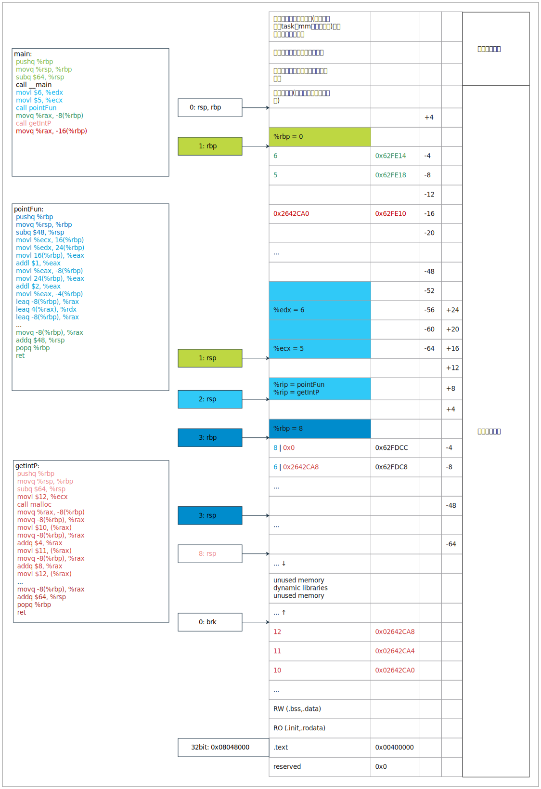

# 1 初始化

对象的声明可以通过初始化的过程获得初始值。主要就是见识一下C/Cpp里面几种初始化的形式，免得大惊小怪

```c++
// C语言的初始化还好，怎么着都得有个 =
int a[3] = {1, 2, 3};
int b = 0;
int c = {1};  // scalar initialization

typedef struct {int a[3], b;} MyType;
MyType mm = {{1}, 3};

char* ptr = malloc(10);

// Cpp多了一个花样
int a[3] {1, 2, 3};
int b {0};
typedef struct {int a[3], b;} MyType;
MyType mm {{1}, 3};
auto *m = new MyType;
auto *m1 {new MyType()};
```

<!--more-->

对于C来说，有显示初始化(Explicit initialization)，隐式初始化(Implicit initialization)，零初始化(Zero initialization)

显示的比较好理解，[scalar initialization](https://en.cppreference.com/w/c/language/scalar_initialization)，[array initialization](https://en.cppreference.com/w/c/language/array_initialization)，[struct initialization](https://en.cppreference.com/w/c/language/struct_initialization)，基本都没啥好说的，经常用

隐式初始化就是你没给它显示初始化，这个时候有两种现象，一种是静态的和thread local [storage duration](https://en.cppreference.com/w/c/language/storage_duration)(这四个单词我的理解是整个线程生命周期都存在的对象，全局变量？)一般会置为零初始化；还有一种automatic [storage duration](https://en.cppreference.com/w/c/language/storage_duration)(auto和register修饰的，局部变量？)一般是个不确定值(野指针)

零初始化(在内存的表现形式是0？)

- pointers are initialized to null pointer values of their types
- objects of integral types are initialized to unsigned zero
- objects of floating types are initialized to positive zero
- all elements of arrays, all members of structs, and the first members of unions are zero-initialized, recursively, plus all padding bits are initialized to zero

对于Cpp来说呢，有静态初始化和动态初始化一说

Depending on context, the initializer may invoke:

- [Value initialization](https://en.cppreference.com/w/cpp/language/value_initialization), e.g. [std::string](http://en.cppreference.com/w/cpp/string/basic_string) s{};
- [Direct initialization](https://en.cppreference.com/w/cpp/language/direct_initialization), e.g. [std::string](http://en.cppreference.com/w/cpp/string/basic_string) s("hello");
- [Copy initialization](https://en.cppreference.com/w/cpp/language/copy_initialization), e.g. [std::string](http://en.cppreference.com/w/cpp/string/basic_string) s = "hello";
- [List initialization](https://en.cppreference.com/w/cpp/language/list_initialization), e.g. [std::string](http://en.cppreference.com/w/cpp/string/basic_string) s{'a', 'b', 'c'};
- [Aggregate initialization](https://en.cppreference.com/w/cpp/language/aggregate_initialization), e.g. char a[3] = {'a', 'b'};
- [Reference initialization](https://en.cppreference.com/w/cpp/language/reference_initialization), e.g. char& c = a[0];

If no initializer is provided, the rules of [default initialization](https://en.cppreference.com/w/cpp/language/default_initialization) apply.

这里有个[default initialization](https://en.cppreference.com/w/cpp/language/default_initialization)，还有个[zero-initialized](https://en.cppreference.com/w/cpp/language/zero_initialization)和[constant initialization](https://en.cppreference.com/w/cpp/language/constant_initialization)

默认初始化呢，就当时默认构造函数好了。常量初始化呢，编译时期的。

# 2 函数

了解函数之前，得先了解语句，毕竟函数不就是把语句打包一下吗？这也是所有编程语言核心之处啊，这里不说编程语言，就说计算机语言，还是蛮简单的。赋值，选择，循环，跳转。

简单不代表容易呀

C/Cpp中选择if和switch，循环for，while和do-while，跳转goto，还有continue，break，空语句，几乎每种编程语言都有，感觉也没啥要注意的，main函数不就是个函数，和`y=f(x)`很像啊

函数定义形式如下

```c
返回值类型 函数名() {
    语句;
}

// C语言比较奔放 下面那就叫一个函数 CPP需要返回值类型
tmp(){}  // 适合C89，不适合C99
```

Cpp的函数比较复杂一点

```c++
struct S {
    [[noreturn]] virtual inline auto f(const unsigned long int * const) -> void const noexcept;
}
```

看到了，一个破函数能有这么多修饰..

**返回值**

返回值这东西我们知道，一般写在函数名前面，然而Cpp总能给你来点不一样的

```c++
string to_string(int a);   // 前置返回类型
auto to_string(int a) -> string;  // 后置返回类型
```

其中auto关键字就表示后置返回类型，后置返回类型的必要性来自于模板函数，因为返回类型依赖于参数

**inline和constexpr**

在函数声明或定义中函数返回类型前加上关键字inline即把函数指定为内联，函数固定为一个地址

关键字inline必须与函数定义体放在一起才能使函数成为内联，仅将inline 放在函数声明前面不起任何作用

定义在类声明之中的成员函数将自动地成为内联函数

如果函数体内的代码比较长，使用内联将导致内存消耗代价较高

如果函数体内出现循环，那么执行函数体内代码的时间要比函数调用的开销大

面对constexpr，胆子大一点，直接当成常量就ok了

**[[noreturn]]**

形如`[[...]]`被称为属性，属性可以置于Cpp语法的任何位置。`[[noreturn]]`放在函数声明语句开始位置，表示我们不希望函数返回任何结果

## 2.1 参数传递

当程序调用一个函数时，我们为该函数的形参申请内存空间，并用实参初始化形参。参数传递的语义与初始化的语义一致(严格来说是拷贝初始化)。**C中，所有函数参数都是"值传递"；Cpp中，除非形参是引用，其他情况函数参数也都是"值传递"**。所谓值传递，就是传入函数的是实参的副本，传递给被调用函数的参数值存放在临时变量中，而不是存放在原来的变量中，被调用函数不能直接修改主调函数中变量的值，而只能修改其私有的临时副本值。

**引用参数**

```c++
void f(int val, int& ref) {
    ++val;
    ++ref;
}
```

当调用函数f时，`++val`递增的是实参的副本，`++ref`递增的是实参本身

单从拷贝的角度来考虑，如果遇到大对象时，引用传递比值传递更有效。但是此时最好将引用类型的参数声明成const的，表明只是为了效率，而非想修改对象的值

```c++
void g(Large& arg);
```

对于小对象使用值传递方式；

对于无需修改的大对象使用const引用传递；

如需要返回计算结果，最好使用return而非通过参数修改对象；

使用右值实现移动和转发；

如果找不到合适的对象则传递指针(用nullptr表示没有对象)；

除非万不得已，否则不要使用引用传递，传递指针它不香吗？

**数组参数**

当数组作为参数时，实际传入的是指向该数组首元素的指针。也就是说，当数组作为参数传入函数时，`T[]`会转换成`T*`，所以也就没有长度一说，如果此时对数组元素赋值，则会改变该数组元素实际值。

```c
// 这叫复合字面量
fun((int[]) {1, 2, 3, 4});

int arr[] = {1, 2, 3, 4};
fun(arr);
```

**列表参数**

一个由{}限定的列表可以作为下述形参的实参

1 类型`std::initializer_list<T>`，其中列表的值能隐式地转换成T

2 能用列表中的值初始化的类型

3 T类型数组的引用，其中列表值能隐式地转换成T

```c++
template<class T>
void f1(std::initializer_list<T>);

struct S {
    int a;
    std::string str;
};
void f2(S);

template<class T, int N>
void f3(T (&&r)[N]);

void f4(int);

void g() {
    f1({1, 2, 3, 4});  // T是int，initializer_list大小是4
    f2({1, "cpp"});
    f3({1, 2, 3, 4});  // T是int，N是4
    f4({1});
}
```

如果存在二义性，则initializer_list参数的函数被优先考虑

**数量未定参数**

对于某些函数，很难明确指出调用时期望的参数数量和类型，要实现这样的接口：

1 使用可变模板，安全

2 使用initializer_list作为参数类型，安全

3 使用省略号(...)结束参数列表，不安全

**默认参数**

只能给参数列表中位置靠后的参数提供默认值

```c++
int tp1(int a, int b = 1);
// int tp2(int a = 1, int b);  // Missing default argument on parameter 'b'
int tp3(char* = nullptr);  // * 和 = 之间必须有空格，否则就是 *= 了

int tp4(int = 9);
// int tp4(int x = 8);  // Redefinition of default argument
int tp4(long x = 8);
```

## 2.2 函数重载

为不同数据类型的同一种操作起同一种名字称为重载。这个概念是Cpp的，C没有。重载发生在一组重载函数集的成员内部，也就是说重载函数应该位于同一个作用域。

**自动重载**

由编译器决定使用一组函数中的某一个，主要依据实参和哪个函数形参类型最匹配

```c++
void print(long l);
void print(double d);

void g() {
    print(1L);
    print(1.0);
    // print(1);  // Call to 'print' is ambiguous
}
```

1 精确匹配，无须类型转换或者仅需简单类型转换即可实现匹配

2 执行提升后匹配，执行了整数提升(bool转int，char转int..)

3 执行标准类型转换后实现匹配，比如int转double，double转int，`T*`转`void*`

4 执行用户自定义类型的转换后实现匹配

5 使用函数声明中的省略号进行匹配

**手动重载**

为了解决自动重载的二义性，方案一，增加一个函数版本；方案二，static_cast

**C的重载**

C语言真的没法重载了？不过是不能声明同样名字的函数罢了。参考：http://locklessinc.com/articles/overloading/

> 为什么Cpp可以重载而C不可以，从汇编的角度来看，Cpp汇编完了，总会在函数名字上加点什么，而C就不会

省略号

```c
int add(int a, ...);  // 着实有点僵硬，但也重载了一点，个数
```

你说要重载参数类型，我觉得划不来，多写太多代码了

```c
typedef struct {
    int param1;
    int param2;
} INT_PARAM;

typedef struct {
    double param1;
    double param2;
} DOUBLE_PARAM;

typedef void (ADDFUNC)(void *);

void int_add_func(void *wParam) {
    INT_PARAM *lParam = (INT_PARAM *) wParam;
    int res = lParam->param1 + lParam->param2;
    printf("result = %d\n", res);
}

void double_add_func(void *wParam) {
    DOUBLE_PARAM *lParam = (DOUBLE_PARAM *) wParam;
    double res = lParam->param1 + lParam->param2;
    printf("result = %f\n", res);
}

void add_func(ADDFUNC f, void *wParam) {
    f(wParam);
}

int main() {
    INT_PARAM val1 = {10, 20};
    DOUBLE_PARAM val2 = {30.5, 40.5};

    add_func(int_add_func, &val1);
    add_func(double_add_func, &val2);

    return 0;
}
```

还有

```c
float overload_float(float f)
{
    /* Use f */
    return f;
}

double overload_double(double d)
{
    /* Use d */
    return d;
}

#define overload(A)\
    ((sizeof(A) == sizeof(float))?overload_float(A):\
    (sizeof(A) == sizeof(double))?overload_double(A):(void)0)

-----------------------------------------------------------------
void cpp_overload1(int p1)
{
    printf("CPP One param: %d\n", p1);
}

void cpp_overload2(double *p1, const char *p2)
{
    printf("CPP Two params: %p (%f) %s\n", p1, *p1, p2);
}

void cpp_overload3(int p1, int p2, int p3)
{
    printf("CPP Three params: %c %d %d\n", p1, p2, p3);
}

#define CAT(A, B) CAT2(A, B)
#define CAT2(A, B) A ## B

#define cpp_overload(...)\
    CAT(cpp_overload, COUNT_PARMS(__VA_ARGS__))(__VA_ARGS__)
```

## 2.3 指针函数

看完参数，就该瞅瞅返回值了。基础类型的返回值没啥好看的，如果函数返回值是指针，数组，结构体..

```c
// int[] getArr();  // Function cannot return array type 'int []'

typedef struct {
    int x;
    int y;
} MY_POINT;

MY_POINT pointFun(int x, int y) {
    //return (MY_POINT) {x, y};  // 直接返回的话 就不会为这个函数分配栈空间了
    MY_POINT mp = {x + 1, y + 2};
    printf("pointFun: %p, %p\n", &(mp.x), &(mp.y));
    return mp;
}

int *getIntP() {
    // return (int[]) {1, 2, 3};  // 可不能返回一个局部数组 会出大事的
    int *p = (int *) malloc(sizeof(int) * 3);
    *p = 10;
    *(p + 1) = 11;
    *(p + 2) = 12;
    printf("getIntP: %p, %p, %p, %p\n", &p, p, p + 1, p + 2);
    return p;
}

int main() {
    MY_POINT point = pointFun(5, 6);
    int *p = getIntP();

    printf("point: %d, %d\n", point.x, point.y);
    printf("intP: %d, %d, %d\n", *p, *(p + 1), *(p + 2));
    printf("%p, %p, %p, %p\n", &p, p, p + 1, p + 2);
    printf("%p, %d\n", (&p + 1), (int) *(&p + 1));
    printf("%p, %d\n", &(point.x), point.x);

    return 0;
}
/*
pointFun: 000000000062FDC8, 000000000062FDCC
getIntP: 000000000062FDC8, 0000000000E72CA0, 0000000000E72CA4, 0000000000E72CA8
point: 6, 8
intP: 10, 11, 12
000000000062FE10, 0000000000E72CA0, 0000000000E72CA4, 0000000000E72CA8
000000000062FE18, 6
000000000062FE18, 6
*/
```

首先，C/Cpp函数不能直接返回一个`int[]`，或许是因为不知道大小吧。返回一个结构体似乎是没有问题的，而且貌似还能返回个局部变量。返回指针自然不必说，先不说有个指针函数的概念，我返回个地址咋不行了？

汇编瞅瞅，这次为了搞得更清楚一点呢，换一个新指令`gcc -S -fverbose-asm -O0 -m64 RetTest.c`，以"."开头指令基本是伪指令，可以删了，不用看

汇编的函数跳转过程，参考：[linux进程运行空间分析_ww188的专栏-CSDN博客](https://blog.csdn.net/ww188/article/details/82841617)

内存布局参考：https://www.kernel.org/doc/Documentation/x86/x86_64/mm.txt

```assembly
.LC0:
    .ascii "pointFun: %p, %p\12\0"
pointFun:
    # 函数建立栈空间 start
    pushq    %rbp     #
    movq    %rsp, %rbp     #,
    subq    $48, %rsp     #,
    # 函数建立栈空间 end
    movl    %ecx, 16(%rbp)     # 把参数拿出来 x
    movl    %edx, 24(%rbp)     # y
 # RetTest.c:16:     MY_POINT mp = {x + 1, y + 2};
    movl    16(%rbp), %eax     # x, tmp91
    addl    $1, %eax     #, _1
 # RetTest.c:16:     MY_POINT mp = {x + 1, y + 2};
    movl    %eax, -8(%rbp)     # _1, mp.x
 # RetTest.c:16:     MY_POINT mp = {x + 1, y + 2};
    movl    24(%rbp), %eax     # y, tmp92
    addl    $2, %eax     #, _2
 # RetTest.c:16:     MY_POINT mp = {x + 1, y + 2};
    movl    %eax, -4(%rbp)     # _2, mp.y
 # RetTest.c:17:     printf("pointFun: %p, %p\n", &(mp.x), &(mp.y));
    leaq    -8(%rbp), %rax     #, tmp93
    leaq    4(%rax), %rdx     #, tmp94
    leaq    -8(%rbp), %rax     #, tmp95
    movq    %rdx, %r8     # tmp94,
    movq    %rax, %rdx     # tmp95,
    leaq    .LC0(%rip), %rcx     #,
    call    printf     #
 # RetTest.c:18:     return mp;
    movq    -8(%rbp), %rax     # 把返回值放到rax中
 # RetTest.c:19: }
    addq    $48, %rsp     # 上面为这个函数开辟了48字节 现在收回去
    popq    %rbp     # 把当前rsp的值给rbp，此时rbp就是main的了，rsp再回去一个单位，还不是main的样子
    ret     # 先把rsp的值给rip，rip就指向了main调用函数的那块了，rsp再回去一个单位，是main的样子了
.LC1:
    .ascii "getIntP: %p, %p, %p, %p\12\0"
getIntP:
    pushq    %rbp     #
    movq    %rsp, %rbp     #,
    subq    $64, %rsp     #,
 # RetTest.c:23:     int *p = (int *) malloc(sizeof(int) * 3);
    movl    $12, %ecx     #,
    call    malloc     #
 # RetTest.c:23:     int *p = (int *) malloc(sizeof(int) * 3);
    movq    %rax, -8(%rbp)     # _1, p
 # RetTest.c:24:     *p = 10;
    movq    -8(%rbp), %rax     # p, p.0_2
 # RetTest.c:24:     *p = 10;
    movl    $10, (%rax)     #, *p.0_2
 # RetTest.c:25:     *(p + 1) = 11;
    movq    -8(%rbp), %rax     # p, p.1_3
    addq    $4, %rax     #, _4
 # RetTest.c:25:     *(p + 1) = 11;
    movl    $11, (%rax)     #, *_4
 # RetTest.c:26:     *(p + 2) = 12;
    movq    -8(%rbp), %rax     # p, p.2_5
    addq    $8, %rax     #, _6
 # RetTest.c:26:     *(p + 2) = 12;
    movl    $12, (%rax)     #, *_6
 # RetTest.c:27:     printf("getIntP: %p, %p, %p, %p\n", &p, p, p + 1, p + 2);
    movq    -8(%rbp), %rax     # p, p.3_7
    leaq    8(%rax), %rdx     #, _8
    movq    -8(%rbp), %rax     # p, p.4_9
    leaq    4(%rax), %r8     #, _10
    movq    -8(%rbp), %rcx     # p, p.5_11
    leaq    -8(%rbp), %rax     #, tmp101
    movq    %rdx, 32(%rsp)     # _8,
    movq    %r8, %r9     # _10,
    movq    %rcx, %r8     # p.5_11,
    movq    %rax, %rdx     # tmp101,
    leaq    .LC1(%rip), %rcx     #,
    call    printf     #
 # RetTest.c:28:     return p;
    movq    -8(%rbp), %rax     # p, _19
 # RetTest.c:29: }
    addq    $64, %rsp     #,
    popq    %rbp     #
    ret    
.LC2:
    .ascii "point: %d, %d\12\0"
.LC3:
    .ascii "intP: %d, %d, %d\12\0"
.LC4:
    .ascii "%p, %p, %p, %p\12\0"
.LC5:
    .ascii "%p, %d\12\0"
main:
    # 给函数建立栈空间 start
    pushq    %rbp     # 先将rsp向下增长一个单位(8bit)，把rbp压到栈中
    movq    %rsp, %rbp     # 让rbp指向当前的rsp
    subq    $64, %rsp     # rsp开辟64bit空间
    # 给函数建立栈空间
 # RetTest.c:31: int main() {
    call    __main     # 这个有时间再搞明白
 # RetTest.c:32:     MY_POINT point = pointFun(5, 6);
    movl    $6, %edx     # 参数2
    movl    $5, %ecx     # 参数1
    call    pointFun     # 先把rsp再增长一个单位，把rip的值压进栈，然后把pointFun值给rip 那么下一条指令就是pointFun的了
    movq    %rax, -8(%rbp)     # rax是pointFun的返回值
 # RetTest.c:33:     int *p = getIntP();
    call    getIntP     #
 # RetTest.c:33:     int *p = getIntP();
    movq    %rax, -16(%rbp)     # _1, p
 # RetTest.c:35:     printf("point: %d, %d\n", point.x, point.y);
    movl    -4(%rbp), %edx     # point.y, _2
    movl    -8(%rbp), %eax     # point.x, _3
    movl    %edx, %r8d     # _2,
    movl    %eax, %edx     # _3,
    leaq    .LC2(%rip), %rcx     #,
    call    printf     #
 # RetTest.c:36:     printf("intP: %d, %d, %d\n", *p, *(p + 1), *(p + 2));
    movq    -16(%rbp), %rax     # p, p.6_4
    addq    $8, %rax     #, _5
 # RetTest.c:36:     printf("intP: %d, %d, %d\n", *p, *(p + 1), *(p + 2));
    movl    (%rax), %ecx     # *_5, _6
 # RetTest.c:36:     printf("intP: %d, %d, %d\n", *p, *(p + 1), *(p + 2));
    movq    -16(%rbp), %rax     # p, p.7_7
    addq    $4, %rax     #, _8
 # RetTest.c:36:     printf("intP: %d, %d, %d\n", *p, *(p + 1), *(p + 2));
    movl    (%rax), %edx     # *_8, _9
    movq    -16(%rbp), %rax     # p, p.8_10
    movl    (%rax), %eax     # *p.8_10, _11
    movl    %ecx, %r9d     # _6,
    movl    %edx, %r8d     # _9,
    movl    %eax, %edx     # _11,
    leaq    .LC3(%rip), %rcx     #,
    call    printf     #
 # RetTest.c:37:     printf("%p, %p, %p, %p\n", &p, p, p + 1, p + 2);
    movq    -16(%rbp), %rax     # p, p.9_12
    leaq    8(%rax), %rdx     #, _13
    movq    -16(%rbp), %rax     # p, p.10_14
    leaq    4(%rax), %r8     #, _15
    movq    -16(%rbp), %rcx     # p, p.11_16
    leaq    -16(%rbp), %rax     #, tmp113
    movq    %rdx, 32(%rsp)     # _13,
    movq    %r8, %r9     # _15,
    movq    %rcx, %r8     # p.11_16,
    movq    %rax, %rdx     # tmp113,
    leaq    .LC4(%rip), %rcx     #,
    call    printf     #
 # RetTest.c:38:     printf("%p, %d\n", (&p + 1), (int) *(&p + 1));
    leaq    -16(%rbp), %rax     #, _17
    addq    $8, %rax     #, _17
 # RetTest.c:38:     printf("%p, %d\n", (&p + 1), (int) *(&p + 1));
    movq    (%rax), %rax     # *_17, _18
 # RetTest.c:38:     printf("%p, %d\n", (&p + 1), (int) *(&p + 1));
    movl    %eax, %edx     # _19, _20
    leaq    -16(%rbp), %rax     #, _21
    addq    $8, %rax     #, _21
    movl    %edx, %r8d     # _20,
    movq    %rax, %rdx     # _21,
    leaq    .LC5(%rip), %rcx     #,
    call    printf     #
 # RetTest.c:39:     printf("%p, %d\n", &(point.x), point.x);
    movl    -8(%rbp), %edx     # point.x, _22
    leaq    -8(%rbp), %rax     #, tmp114
    movl    %edx, %r8d     # _22,
    movq    %rax, %rdx     # tmp114,
    leaq    .LC5(%rip), %rcx     #,
    call    printf     #
 # RetTest.c:41:     return 0;
    movl    $0, %eax     #, _32
 # RetTest.c:42: }
    addq    $64, %rsp     #,
    popq    %rbp     #
    ret
```

这个鬼程序还是蛮长的，用张图翻译一下



基本上每个颜色就是一个步骤，还是比较容易理解的，所以说，指针函数就这样，没啥难度

再看看，为啥不能返回局部变量

```c
int *getArr() {
    // int arr[] = {1, 2, 3};
    // printf("getArr: %p, %p, %p\n", arr, arr + 1, arr + 2);
    // return arr;  // Address of stack memory associated with local variable 'arr' returned
    return (int[]) {5, 6, 7};  // 这仍然是个局部变量哦
}

void nothing() {  // 真的就是nothing
    int a = 8;
    int b = 9;
    int c = 10;
    printf("nothing: %p, %p, %p\n", &a, &b, &c);
}

int main() {
    int *arr = getArr();
    nothing();
    // 猜猜值是多少
    printf("main: %d, %d, %d\n", *arr, *(arr + 1), *(arr + 2));
    printf("main: %p, %p, %p, %p\n", &arr, arr, arr + 1, arr + 2);
    return 0;
}
/* output
nothing: 000000000062FDCC, 000000000062FDC8, 000000000062FDC4
main: 10, 9, 8
main: 000000000062FE18, 000000000062FDC4, 000000000062FDC8, 000000000062FDCC
*/
```

这个程序就不反汇编了，这种情况还是好的，能打印出来数据，更有甚者，程序可能会崩溃。所以**永远不要返回局部变量的地址**

> 指针和地址是一回事吗？通常是，但不完全是。我们这里都是用字节去划分内存，但是，如果是用字呢？

## 2.4 函数指针

之前指针的应用都是指向数据，而函数指针不过就是把指针指向代码。这种指针可以被赋值，存放在数组中，传递给函数以及作为函数的返回值等等。简单的例子

```c
int add(int a, int b) {
    return a + b;
}

int main() {
    int a = 3;
    int b = 5;
    int (*pFun)(int, int) = add;

    printf("%p, %p\n", &a, &b);
    printf("%d, %p\n", add(a, b), &add);
    printf("%d, %p, %p\n", pFun(a, b), pFun, &pFun);
    printf("%d, %p, %p\n", (*pFun)(a, b), pFun, &pFun);  // *pFun的 () 不能少！！！
    return 0;
}
/* output
000000000062FE0C, 000000000062FE08
8, 0000000000401FF0
8, 0000000000401FF0, 000000000062FE00
8, 0000000000401FF0, 000000000062FE00
*/
```

这个程序也没必要汇编了..函数add实际上存在text段的，指针pFun和a, b一样，都在栈中，只是存的值是add的地址，机制就是这么个机制。

还有就是有人喜欢把函数指针和typedef放一块看

```c
int add(int a, int b);
typedef (*FUN_POINT)(int, int);

// FUN_POINT point;
// point = add;  // 为什么不能这么玩？

int main() {
    FUN_POINT funPoint;
    funPoint = add;

    funPoint(1, 2);
    (*funPoint)(3, 4);

    return 0;
}
```

typedef就是重命名呀。好了，知道这么个机制，我们能做些什么？

**函数指针数组**

来看一个程序

```c
int create_cmd(int a, int b);
int retrieve_cmd(int a, int b);
int update_cmd(int a, int b);
int delete_cmd(int a, int b);

// 这就是函数指针数组
int (*crud_cmd[])(int, int) = {
        create_cmd,
        retrieve_cmd,
        update_cmd,
        delete_cmd
};

int main() {
    int a = crud_cmd[1](2, 4);
    int b = (*crud_cmd + 1)(2, 4);

    return 0;
}
```

把函数，指针，数组，三个词放一块还是很有意思的，比如实现一个状态机？

**多态**

多态是面向对象的概念，C语言是面向过程的语言(我觉得这句话不正确)。C语言就不能实现多态了？且看下面一个没有实质作用的程序

```c
// 抽象类 HUMANITY，基本特性 name，基本方法 intro
typedef struct HUMANITY {
    char *name;
    void (*intro)(struct HUMANITY *);
} HUMANITY;

// HUMANITY的子类 TEACHER，多了一个属性 teachNo
typedef struct {
    HUMANITY humanity;
    int teachNo;
} TEACHER;

// TEACHER特有的 intro
void teachIntro(HUMANITY *humanity) {
    TEACHER *t = (TEACHER *) humanity;  // 向下转型
    printf("I am a teacher. My name is %s and teachNo is %d\n", t->humanity.name, t->teachNo);
}

// HUMANITY的子类 STUDENT，多了一个属性 stuNo
typedef struct {
    HUMANITY humanity;
    long stuNo;
} STUDENT;

// STUDENT特有的 intro
void stuIntro(HUMANITY *humanity) {
    STUDENT *s = (STUDENT *) humanity;  // 向下转型
    printf("I am a student. My name is %s and stuNo is %ld\n", s->humanity.name, s->stuNo);
}

int main() {
    TEACHER *t = malloc(sizeof(TEACHER));  // 创建一个TEACHER对象
    t->humanity.name = malloc(12);
    strcpy(t->humanity.name, "Wang");
    t->humanity.intro = teachIntro;
    t->teachNo = 12;
    HUMANITY *teacher = (HUMANITY *) t;  // 向上转型
    (teacher->intro)(teacher);  // 实际上是 TEACHER 特有方法

    free(teacher->name);
    free(t);

    STUDENT *s = malloc(sizeof(STUDENT));
    s->humanity.name = malloc(20);
    strcpy(s->humanity.name, "Sidney Ding");
    s->humanity.intro = stuIntro;
    s->stuNo = 9999L;
    HUMANITY *student = (HUMANITY *) s;
    (student->intro)(student);

    free(s->humanity.name);
    free(s);

    return 0;
}

/* output
I am a teacher. My name is Wang and teachNo is 12
I am a student. My name is Sidney Ding and stuNo is 9999
*/
```

此时是不是发现C语言变得有趣多了？面向对象而已，C语言这么强大的语言必拿下。在这个例子中，不免要思考一件事，向上转型和向下转型？因为子类多余的属性是放在父类后面的，所谓的转型，我们就当是内存截断好了，父类前面的内容必然是符合的，至于后面内容，也不会丢，毕竟还是占内存的。此时再将这个父类向下转型，不过就是扩张而已，恰巧后面的就是子类多出的属性占的内存。

## 2.5 宏函数

这个没啥好说，`#define`这玩意本省就是编译时替换，所以注意多加括号就好了，至于宏的一些技巧，例如拼接，之前也说过了


所以，就到这里了，以后想到啥好玩的，再加进来吧！