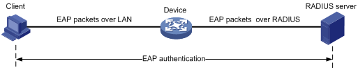
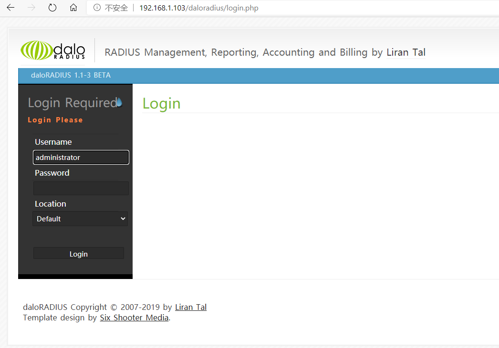
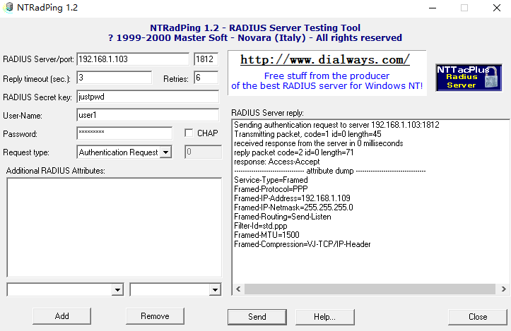

参考：

https://www.cnblogs.com/opsprobe/p/9420502.html

https://blog.csdn.net/lassewang/article/details/9159543

# 0 RADIUS

RADIUS：（Remote Authentication Dial In User Service）中文名为远程用户拨号认证服务，简称RADIUS，是目前应用最广泛的AAA协议（认证、授权和计费）



图中Device（例如交换机）向远程接入用户提供接入及与RADIUS服务器交互的服务。RADIUS服务器上则存储用户的身份信息、授权信息以及访问记录，对用户进行认证、授权和计费服务

**认证过程如下**

（1）客户端向接入设备发送一个EAPoL-Start报文，开始802.1x认证接入；

（2）接入设备向客户端发送EAP-Request/Identity报文，要求客户端将用户名送上来；

<!-- more -->

（3）客户端回应一个EAP-Response/Identity给接入设备的请求，其中包括用户名；

（4）接入设备将EAP-Response/Identity报文封装到RADIUS Access-Request报文中，发送给认证服务器；

（5）认证服务器产生一个Challenge，通过接入设备将RADIUS Access-Challenge报文发送给客户端，其中包含有EAP-Request/MD5-Challenge；

（6）接入设备通过EAP-Request/MD5-Challenge发送给客户端，要求客户端进行认证；

（7）客户端收到EAP-Request/MD5-Challenge报文后，将密码和Challenge做MD5算法后的Challenged-Pass-word，在EAP-Response/MD5-Challenge回应给接入设备；

（8）接入设备将Challenge，Challenged Password和用户名一起送到RADIUS服务器，由RADIUS服务器进行认证；

（9）RADIUS服务器根据用户信息，做MD5算法，判断用户是否合法，然后回应认证成功/失败报文到接入设备。如果成功，携带协商参数，以及用户的相关业务属性给用户授权。如果认证失败，则流程到此结束；

（10）如果认证通过，用户通过标准的DHCP协议 (可以是DHCP Relay) ，通过接入设备获取规划的IP地址；

（11）如果认证通过，接入设备发起计费开始请求给RADIUS用户认证服务器；

（12）RADIUS用户认证服务器回应计费开始请求报文，用户上线完毕。

freeradius是GNU/GPL（通用公共许可证）的原则下，开发的高性能开源radius服务器。常见的radius服务器种类不多，比较强大的当属开源的freeradius，世界上大部分的radius服务器都是基于freeradius开发而来的。

freeradius可以对支持radius协议的网络设备进行账户认证、授权和记账管理，常见的开源路由器操作系统：如Openwrt，DD-wrt等，都支持radius协议，常见的电信运营商的宽带账户，上网账户管理，记账，也都是使用的radius服务器进行鉴权记账的。

RADIUS服务器和NAS服务器通过UDP协议进行通信，RADIUS服务器的1812端口负责认证，1813端口负责计费工作。采用UDP的基本考虑是因为NAS和RADIUS服务器大多在同一个局域网中，使用UDP更加快捷方便，而且UDP是无连接的，会减轻RADIUS的压力，也更安全。

以下均在Ubuntu18上操作的，Ubuntu16上坑太多..看网上教程，CentOS更多..

# 1 安装Apache Web Server和PHP

在Ubuntu上安装Apache，运行以下命令安装Apache Web服务器：

```bash
sudo apt-get install apache2
```

要在Ubuntu 18.04上安装PHP，请运行(**直接运行可能会不成功，因为没这个源**)

```bash
sudo apt-get install php libapache2-mod-php php-gd php-common php-mail \
    php-mail-mime php-mysql php-pear php-db php-mbstring php-xml php-curl
```

PHP安装：

1 添加PHP PPA

添加ondrej/php，它包含PHP包和其他必需的PHP扩展

```bash
sudo apt-get install software-properties-common
sudo add-apt-repository ppa:ondrej/php
sudo apt-get update
```

通过复制以下代码并将其添加到系统的软件源中，可以手动将此PPA添加到系统中

```bash
# Ubuntu 18.04 拷贝
deb http://ppa.launchpad.net/ondrej/php/ubuntu bionic main 
deb-src http://ppa.launchpad.net/ondrej/php/ubuntu bionic main

# 添加源
sudo vim /etc/apt/sources.list
sudo apt update && sudo apt upgrade

# 安装PHP
sudo apt-get install php libapache2-mod-php php-gd php-common php-mail \
    php-mail-mime php-mysql php-pear php-db php-mbstring php-xml php-curl

# 验证
php -v
```

# 2 安装MariaDB并创建数据库

MariaDB是MySQL的一个分支，目前最新稳定版是10.5，以下是安装步骤

```bash
# 安装software-properties-common
sudo apt-get install software-properties-common
# 导入MariaDB gpg密钥
ssudo apt-key adv --fetch-keys 'https://mariadb.org/mariadb_release_signing_key.asc'
# 添加apt存储库
sudo add-apt-repository 'deb [arch=amd64,arm64,ppc64el] https://mirrors.tuna.tsinghua.edu.cn/mariadb/repo/10.5/ubuntu bionic main'
# 安装MariaDB Server
sudo apt update
sudo apt -y install mariadb-server mariadb-client
```

安装并运行后，为FreeRADIUS创建一个数据库，这将在稍后阶段使用：

数据库名称：radius

数据库用户：radius

数据库用户密码：radiuspassword

如果你有专用数据库服务器，请将localhost替换为源FreeRadius服务器的IP：

```bash
# 第一次使用，初始化MariaDB
sudo mysql_secure_installation
# 大致会经历这几个阶段
Switch to unix_socket authentication [Y/n] >> [直接Enter] 切换到unix_socket身份验证
Change the root password? [Y/n] y
New password: 
Re-enter new password:
Remove anonymous users? [Y/n] >> [直接Enter] 是否删除匿名用户
Disallow root login remotely? [Y/n]  >> [直接Enter] 禁止远程root角色登录
Remove test database and access to it? [Y/n] >> [直接Enter] 是否删除test数据库
Reload privilege tables now? [Y/n] >> [直接Enter] 是否重新加载权限表

# 登录
mysql -u root -p
# 输入密码 登录成功后在MariaDB中创建数据库
CREATE DATABASE radius;
# 设置通过root:password可以在任何PC上访问数据库 方便其他电脑上用navicat或datagrip
GRANT ALL ON *.* TO 'root'@'%' IDENTIFIED BY "password";
# 设置通过 radius:radiuspassword 访问radius数据库
GRANT ALL ON radius.* TO 'radius'@'localhost' IDENTIFIED BY "radiuspassword";
# 重新载入权限
flush privileges;
# 退出MariaDB
\q
```

> 完全卸载MySQL/MariaDB
>
> 首先删除mysql:
> `sudo apt-get remove mysql-*`
> 然后清理残留的数据
> `dpkg -l |grep ^rc|awk '{print $2}' |sudo xargs dpkg -P`
>
> 
>
> - 查看状态 `sudo systemctl status mysql`
> - 启动 `sudo systemctl start mysql`
> - 重启 `sudo systemctl restart mysql`
> - 关闭 `sudo systemctl stop mysql`

# 3 安装和配置FreeRADIUS

```bash
# 在Ubuntu 18.04上安装的FreeRADIUS版本是v3.0，使用以下命令从官方Ubuntu apt存储库安装
sudo apt-get install freeradius freeradius-mysql freeradius-utils
# 检测是否安装成功
ps -ef | grep freeradius

# 查看普通用户是否有读取文件权限
ll /etc/freeradius/3.0/mods-config/sql/main/mysql/schema.sql
# 改权限
sudo chmod 666 /etc/freeradius/3.0/mods-config/sql/main/mysql/schema.sql
# 导入freeradius MySQL数据库方案
mysql -u root -p radius < /etc/freeradius/3.0/mods-config/sql/main/mysql/schema.sql
# 查看创建的表
mysql -u root -p -e "use radius; show tables;"
+------------------+
| Tables_in_radius |
+------------------+
| nas              |
| radacct          |
| radcheck         |
| radgroupcheck    |
| radgroupreply    |
| radpostauth      |
| radreply         |
| radusergroup     |
+------------------+

# 在/etc/freeradius/3.0/mods-enabled/下为sql模块创建一个软链接
sudo ln -s /etc/freeradius/3.0/mods-available/sql /etc/freeradius/3.0/mods-enabled/

# 配置SQL模块并更改数据库连接参数以适合你的环境
sudo vim /etc/freeradius/3.0/mods-enabled/sql
   # 修改
    sql {
        driver = "rlm_sql_mysql"
        dialect = "mysql"
        # Connection info:
        server = "localhost"
        port = 3306
        login = "radius"
        password = "radiuspassword"
        # Database table configuration for everything except Oracle
        radius_db = "radius"

        # Set to ‘yes’ to read radius clients from the database (‘nas’ table)
        # Clients will ONLY be read on server startup.
        read_clients = yes
        # Table to keep radius client info
        client_table = "nas"
    }
# 更改/etc/freeradius/3.0/mods-enabled/sql的组权限
sudo chgrp -h freerad /etc/freeradius/3.0/mods-available/sql
sudo chown -R freerad:freerad /etc/freeradius/3.0/mods-enabled/sql

# 重启freeradius服务
sudo systemctl restart freeradius.service
```

# 4 安装和配置Daloradius

我们需要安装Daloradius才能获得FreeRADIUS Web管理界面

```bash
# 下载Daloradius
wget https://github.com/lirantal/daloradius/archive/master.zip
unzip master.zip
mv daloradius-master/ daloradius
cd daloradius
# 配置daloradius，现在导入Daloradius mysql表
mysql -u root -p radius < contrib/db/fr2-mysql-daloradius-and-freeradius.sql
mysql -u root -p radius < contrib/db/mysql-daloradius.sql
# 配置daloRADIUS数据库连接详细信息
cd ..
sudo mv daloradius /var/www/html/
# 更改http文件夹的权限并为daloradius配置文件设置正确的权限
sudo chown -R www-data:www-data /var/www/html/daloradius/
sudo chmod 664 /var/www/html/daloradius/library/daloradius.conf.php
# 修改filedaloradius.conf.php以调整数据库信息 对应/etc/freeradius/3.0/mods-enabled/sql
sudo vim /var/www/html/daloradius/library/daloradius.conf.php
    # 主要是
    CONFIG_DB_USER
    CONFIG_DB_PASS
    CONFIG_DB_NAME
# 重新启动freeradius和apache2
systemctl restart freeradius apache2
```

打开浏览器，访问**`http://ip-address/daloradius/login.php`**



默认的管理员账户密码是 administrator:radius

> 查看syslog和daloradius.log时，可能会报错，修改syslog权限为644即可，加到用户组或许效果更好；至于daloradius.log去Config>Logging Settings中把想要监听的log设置成yes就好了

# 5 修改FreeRADIUS测试账户

FreeRADIUS的配置默认是文件，打开测试账户

```bash
sudo vim /etc/freeradius/3.0/users
    # 找到下面这段信息 注释全打开
    73     steve   Cleartext-Password := "testing"
    74     Service-Type = Framed-User,
    75     Framed-Protocol = PPP,
    76     Framed-IP-Address = 172.16.3.33,
    77     Framed-IP-Netmask = 255.255.255.0,
    78     Framed-Routing = Broadcast-Listen,
    79     Framed-Filter-Id = "std.ppp",
    80     Framed-MTU = 1500,
    81     Framed-Compression = Van-Jacobsen-TCP-IP
```

配置路由器或交换机的账号

```bash
sudo vim /etc/freeradius/3.0/clients.conf
    # 按照这个格式 里面有个localhost 用作本机测试的
    client x.x.x.x {  # 路由器或交换机的ip
        ipaddr = x.x.x.x  # 路由器或交换机的ip
        secret = xxxxx  # 路由器或交换机访问radius的密码
    }
```

重新开一终端

```bash
# 修改了配置文件 需要重启一下服务
service freeradius restart
# 测试账户 接收到 Received Access-Accept 就表示没问题了
radtest steve testing localhost 1812 testing123
# radtest 账号 密码 client_ip radius端口 client_secret
```

这也确实，表明FreeRADIUS是通过文件进行配置的，接下来将其改为sql模式，上面改得差不多了，再改俩就行

修改配置文件`/etc/freeradius/3.0/sites-enabled/default`

1 找到`authorize {`(273行)，注释其中的`files`，并将`sql`去掉注释或`-`

2 找到`preacct {`(555行)，注释其中的`files`

3 找到`accounting {`(608行)，去掉`sql`的注释或`-`

4 找到`session {`(677行)，去掉`sql`的注释或`-`

5 找到`post-auth {`(689行)，去掉`sql`的注释或`-`

6 找到`pre-proxy {`(861行)，注释掉`files`

修改配置文件`/etc/freeradius/3.0/sites-enabled/inner-tunnel`，和上面一样，注释掉`files`，去掉`sql`的注释或`-`

```bash
# 重启一下相关的服务
service mysql restart
service apache2 restart
service freeradius restart
```

----

下面进行测试，直接进入MySQL可以通过Navicat或者直接终端(`mysql -u root -p; use radius;`)，输入下面的sql语句

```sql
# 创建用户组
INSERT INTO radius.radgroupreply (groupname, attribute, op, `value`) VALUES ('locahost', 'Service-Type', ':=', 'Framed-User');
INSERT INTO radius.radgroupreply (groupname, attribute, op, `value`) VALUES ('locahost', 'Framed-Protocol', ':=', 'PPP');
INSERT INTO radius.radgroupreply (groupname, attribute, op, `value`) VALUES ('locahost', 'Framed-IP-Address', ':=', '192.168.1.109');
INSERT INTO radius.radgroupreply (groupname, attribute, op, `value`) VALUES ('locahost', 'Framed-IP-Netmask', ':=', '255.255.255.0');
INSERT INTO radius.radgroupreply (groupname, attribute, op, `value`) VALUES ('locahost', 'Framed-Routing', ':=', 'Broadcast-Listen');
INSERT INTO radius.radgroupreply (groupname, attribute, op, `value`) VALUES ('locahost', 'Framed-Filter-Id', ':=', '"std.ppp"');
INSERT INTO radius.radgroupreply (groupname, attribute, op, `value`) VALUES ('locahost', 'Framed-MTU', ':=', '1500');
INSERT INTO radius.radgroupreply (groupname, attribute, op, `value`) VALUES ('locahost', 'Framed-Compression', ':=', 'Van-Jacobsen-TCP-IP');

# 创建用户
INSERT INTO radius.radcheck (username, attribute, op, `value`) VALUES ('user1', 'Cleartext-Password', '==', 'password1');

# 将用户加入组
INSERT INTO radius.radusergroup (username, groupname) VALUES ('user1', 'locahost');
```

执行完之后，另打开一个终端进行本地测试

```bash
# 能接收到 Received Access-Accept 就表示没问题
radtest user1 password1 localhost 1812 testing123
```

由于没有路由器和交换机，就只能再开一个Win虚拟机，进行测试，首先向`/etc/freeradius/3.0/clients.conf`添加Win虚拟机的信息

```bash
sudo vim /etc/freeradius/3.0/clients.conf
    # 按照这个格式 里面有个localhost 用作本机测试的
    client 192.168.1.109 {  # Win虚拟机ip
        ipaddr = 192.168.1.109  # Win虚拟机ip
        secret = justpwd  # Win虚拟机访问radius的密码
    }
```

好了，这时候，Win虚拟机上需要一个软件，NTRadPing，测试手法如下

天翼云：https://cloud.189.cn/t/AFJnYfy6Jbq2（访问码：kb1q）

蓝奏云：https://sidneygod.lanzous.com/iHcxEfxkqgf



RADIUS Server/port就填安装freeradius的ip和freeradius的默认端口1812

Reply timeout这一行就这样

RADIUS Secret key就是上面配置的secret值

User-Name和Password还是之前的user1和password1

其余不用管，点击send，右侧就会得到服务器返回的数据

-------

毕竟我们有前端页面了，所以添加用户组和用户什么的，肯定不用手动去输MySQL语句，不友好。

添加用户组：Management > Profiles

添加用户：Management > Users

其实这些页面应该对应着数据库的操作..没咋研究，但是像client似乎比如通过配置文件，毕竟路由器没那么多吧..

还有，关于路由器和交换机的配置，由于手头没设备，没法玩..看教程，tplink的wap2能设置radius服务器信息

# 6 拾遗

## 6.1 环境问题

用Ubuntu16搞了一上午，php和MariaDB都不行，然后果断选择Ubuntu18，基本上没出啥错，哦，用的是清华源，不知道和这个有没有关系，本来觉得阿里源挺好，但是16上用的就是，想着换一下..

```bash
# 备份
sudo cp /etc/apt/sources.list /etc/apt/sources.list.bak
# 把里面内容全换了
sudo gedit /etc/apt/sources.list

# 清华源
deb https://mirrors.tuna.tsinghua.edu.cn/ubuntu/ bionic main restricted universe multiverse
deb-src https://mirrors.tuna.tsinghua.edu.cn/ubuntu/ bionic main restricted universe multiverse
deb https://mirrors.tuna.tsinghua.edu.cn/ubuntu/ bionic-updates main restricted universe multiverse
deb-src https://mirrors.tuna.tsinghua.edu.cn/ubuntu/ bionic-updates main restricted universe multiverse
deb https://mirrors.tuna.tsinghua.edu.cn/ubuntu/ bionic-backports main restricted universe multiverse
deb-src https://mirrors.tuna.tsinghua.edu.cn/ubuntu/ bionic-backports main restricted universe multiverse
deb https://mirrors.tuna.tsinghua.edu.cn/ubuntu/ bionic-security main restricted universe multiverse
deb-src https://mirrors.tuna.tsinghua.edu.cn/ubuntu/ bionic-security main restricted universe multiverse
deb https://mirrors.tuna.tsinghua.edu.cn/ubuntu/ bionic-proposed main restricted universe multiverse
deb-src https://mirrors.tuna.tsinghua.edu.cn/ubuntu/ bionic-proposed main restricted universe multiverse

# 完了之后记得更新源
sudo apt-get update && sudo apt upgrade
```

## 6.1 重启服务报错

用systemctl或者service进行重启freeradius时，有时候会报错，说启动不了。大概长这样子

```bash
Job for freeradius.service failed because the control process exited with error code.
See "systemctl status freeradius.service" and "journalctl -xe" for details.
```

**直接reboot就好**，当然了，实在启动不了，也可以执行`sudo freeradius -X`，可以看到调试信息

## 6.1 关于log

daloradius有个Reports模块，默认显示四种log：daloRADIUS Log，Radius Log，System Log，Boot Log。其中前俩正常，就是后俩，syslog有这个文件，但是没权限；Boot Log显示的是dmesg，但Ubuntu18上却不是`/var/log/dmesg`这个文件，而是`/var/log/kern.log`

于是，修改文件：`/var/www/html/daloradius/library/exten-boot_log.php`，加三句话

```diff
 $logfile_loc1 = '/var/log/dmesg';
 $logfile_loc2 = '/usr/local/var/log/dmesg';
 + $logfile_loc3 = '/var/log/kern.log';
  
 if (file_exists($logfile_loc1))
     $logfile = $logfile_loc1;
 else if (file_exists($logfile_loc2))
     $logfile = $logfile_loc2;
 + else if (file_exists($logfile_loc3))
 +     $logfile = $logfile_loc3;
 else { 
```

但是呢，还是有权限问题，因为`syslog`和`kern.log`，要是把这俩文件权限改为644倒是没问题，问题是重启就又不行了。顺带一提，mysql，apache2，freeradius都是开机自启的。不是syslog用户或adm组是没有读文件权限的，于是就把`www-data`加到adm用户组了，问题解决

```bash
sudo gpasswd -a www-data adm
```

如果`/var/log/`下连syslog，kern.log..都没有，查看`/etc/rsyslog.d/50-default.conf`，是不是把那些log给禁用了，打开注释就好了

## 6.1 证书配置

参考：https://blog.csdn.net/lassewang/article/details/9159543