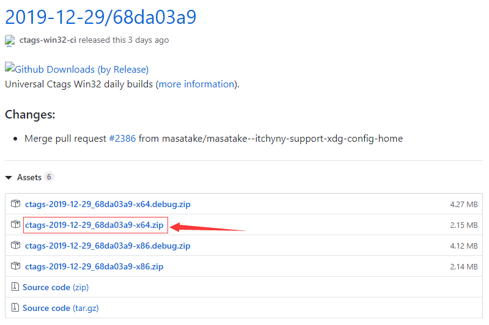
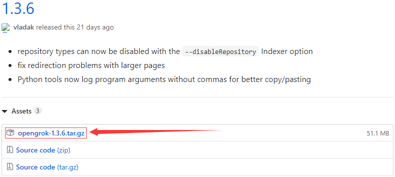
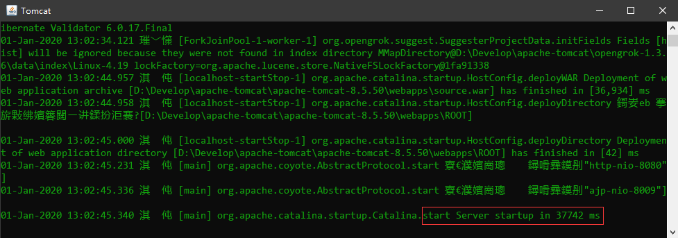
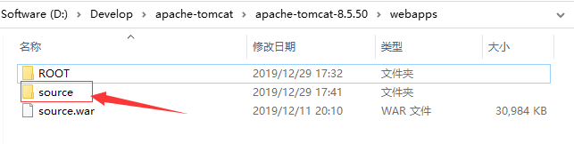
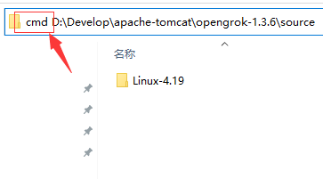
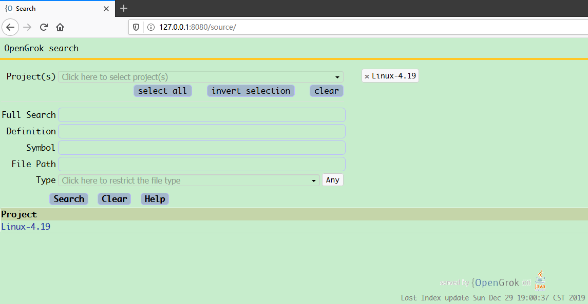
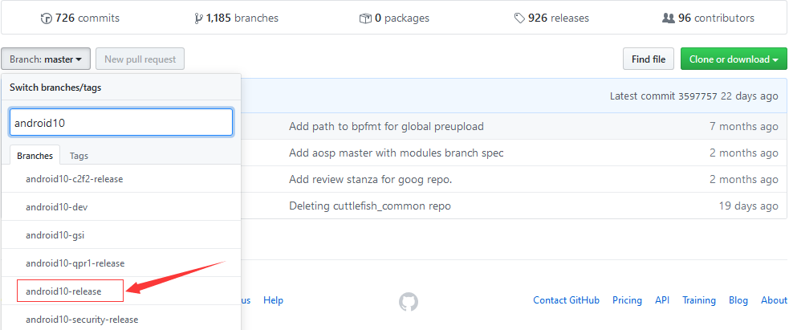
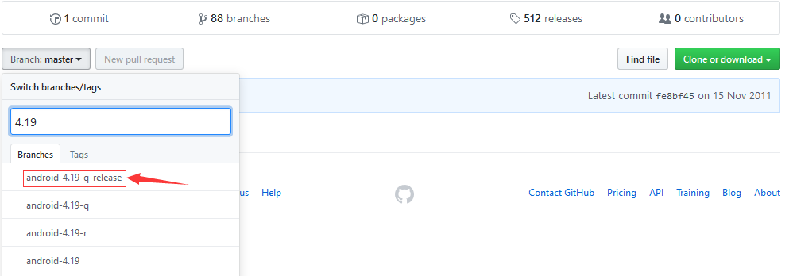

# 0 缘起

之前看代码都是非常少的, 所以基本就用IDE啦, 还能调试, 后来接触Android, 源码量太大了, 导入IDE去看太慢了..然后开始搜神器, 就有了Source Insight, Understand..说不出来哪不好, 反正就是不爽, 最后觉得还是OpenGrok好用..那就动手搭建一个吧, 官方文档: https://github.com/oracle/opengrok/wiki/How-to-setup-OpenGrok

# 1 搭环境

首先, 我在Win10和CentOS7.6上都试验成功了, 但是个人建议看有关Linux的代码还是用Linux比较好, 在后面下源码的时候会说为啥, 但是鉴于Windows用得比较多(我就是..), 所以整理了两份文档, 废话不多说, 开始..

<!-- more -->

## 1.1 Windows

首先在Windows环境下搭建..

### 1.1.1 prepare

需要准备以下几样东西:

1. **JDK(版本要大于8)**

下载地址: https://www.oracle.com/technetwork/java/javase/downloads/jdk8-downloads-2133151.html

安装好后记得配置一下环境变量, 不再赘述

```text
JAVA_HOME : D:\Develop\JDK\jdk1.8.0_211
JRE_HOME : D:\Develop\JDK\jre1.8.0_211
CLASSPATH : .;%JAVA_HOME%\lib\dt.jar;%JAVA_HOME%\lib\tools.jar;

%JAVA_HOME%\bin
%JRE_HOME%\bin
```

2. **Tomcat(版本大于8)**

关于容器的选择, 并不一定要Tomcat, 其它的也可以, 比如jetty, 我用的是Tomcat8, [点此下载](http://mirrors.tuna.tsinghua.edu.cn/apache/tomcat/tomcat-8/v8.5.50/bin/apache-tomcat-8.5.50-windows-x64.zip)

下载好后, 解压即可, 个人比较喜欢用压缩版的而不是安装版的, 然后记得配置一下环境变量

```text
CATALINA_HOME : D:\Develop\apache-tomcat\apache-tomcat-8.5.50

%CATALINA_HOME%\bin
%CATALINA_HOME%\lib
```

3. **Universal-ctags**

这个是必须的, OpenGork依赖这个东西, 由于是Windows, 直接下载release版本就好了, 下载地址: https://github.com/universal-ctags/ctags-win32/releases 选择对应的版本, 我这里选的是64bit



解压到相应的文件夹下

4. **OpenGrok**

和Universal-ctags一样, 直接下release版本就好了, 不要下源码, 下载地址: https://github.com/oracle/opengrok/releases 



没得选, 不用选..

5. 下载源码

我主要是为了看Android源码, 这个如何下载放到后面说..现在假设已经下载好了

### 1.1.2 indexing

在使用OpenGrok之前是需要建立索引的, 这一点和Source Insight一样, 是一个漫长的等待时间..

1. 运行Tomcat

进入到Tomcat的bin目录, 我这里是`D:\Develop\apache-tomcat\apache-tomcat-8.5.50\bin`, 双击`startup.bat`启动Tomcat, 一般Windows启动成功都是有个命令窗口的, 类似这样



2. 拷贝`source.war`

将OpenGrok目录下的`lib/source.war`拷贝至Tomcat的webapps目录下, 我这边分别是`D:\Develop\apache-tomcat\opengrok-1.3.6\lib\source.war`和`D:\Develop\apache-tomcat\apache-tomcat-8.5.50\webapps`, 如果正常的话, `source.war`会自动解压成一个文件夹..



我这里将tomcat原有的其他不相干的文件夹全删了..因为用不上..

3. 创建软链接

首先在OpenGrok文件夹下, 建两个文件夹`index`和`source`, 分别用于存储索引文件和项目源码的软链接(这似乎是Linux概念, 问题不大, 且这么表述)

首先到source文件夹下(`D:\Develop\apache-tomcat\opengrok-1.3.6\source`), 然后如图所示



就能出现出现cmd窗口了, 且在当前路径, 然后再执行下面这个命令给源码创建一个软链接

```bash
# 链接名 和 源码绝对路径
mklink /J android10-release E:\FuckSource\android10-release
```

执行完之后, 该目录下就会多出个文件夹了, 看起来和复制过来的一样, 其实只是个链接

4. 建立索引

第一次使用OpenGrok需要建立索引, 这个时间很长的, 要有心理准备..其实做起来很简单, 在cmd窗口执行一条命令即可, 在此之前先修改一下OpenGrok的配置, 到Tomcat的webapps文件下, 进入source文件夹, 接着按着这个路径找`WEB-INF\web.xml`, 我这边的路径是`D:\Develop\apache-tomcat\apache-tomcat-8.5.50\webapps\source\WEB-INF\web.xml`, 打开这个文件

```xml
<?xml version="1.0" encoding="UTF-8"?>
<web-app xmlns="http://xmlns.jcp.org/xml/ns/javaee"
         xmlns:xsi="http://www.w3.org/2001/XMLSchema-instance"
         xsi:schemaLocation="http://xmlns.jcp.org/xml/ns/javaee
         http://xmlns.jcp.org/xml/ns/javaee/web-app_3_1.xsd"
         version="3.1">

    <display-name>OpenGrok</display-name>
    <description>A wicked fast source browser</description>
    <context-param>
        <description>Full path to the configuration file where OpenGrok can read its configuration</description>
        <param-name>CONFIGURATION</param-name>
        <!-- 修改成你要存放配置文件的地方 -->
        <param-value>D:/Develop/apache-tomcat/opengrok-1.3.6/index/configuration.xml</param-value>
    </context-param>
```

这些做完后, 再执行下面这条命令

```bash
java -Xmx524m -jar "D:\\Develop\\apache-tomcat\\opengrok-1.3.6\\lib\\opengrok.jar" -W "D:\\Develop\\apache-tomcat\\opengrok-1.3.6\\index\\configuration.xml" -P -S -v -s "D:\\Develop\\apache-tomcat\\opengrok-1.3.6\\source" -d "D:\\Develop\\apache-tomcat\\opengrok-1.3.6\\index"

# 分析一下
# -jar 跟的是 OpenGrok下的lib/opengrok.jar
# -W 跟的是 配置文件位置
# -P -S -v 照着加就是了
# -s 跟的是 源码位置
# -d 跟的是 索引位置
# 还有更多配置选项可以使用 java -jar /path/to/opengrok.jar 查看
```

经过漫长的等待, 索引建立完成了, 就可以打开浏览器, 通过 http://127.0.0.1:8080/source 进行访问了, 如果以后代码有更新, 可以再用这条命令进行增量建立索引



如果你打开的和我不一样, 是白底的不用慌张, 因为我魔改了一下css文件, 样式表在`D:\Develop\apache-tomcat\apache-tomcat-8.5.50\webapps\source\default\style.min.css`, 想自定义的格式可以配合浏览器的检查元素, 魔改一波..

## 1.2 Linux

和Windows的搭建方法很类似, 既然都用Linux了, 那废话不多说了, 敬你是个高手, 我直接搬文档了

### 1.2.1 Requirements

1. [JDK](http://www.oracle.com/technetwork/java/) 1.8 or higher

2. OpenGrok '''binaries''' from https://github.com/OpenGrok/OpenGrok/releases (**.tar.gz file** with binaries, not the source code tarball !)

3. https://github.com/universal-ctags for analysis (avoid Exuberant ctags, they are not maintained anymore)

这个有必要解释一下, 先把本地的ctags卸了, 具体见命令行

```bash
# 1 卸载
## Ubuntu
sudo apt-get remove ctags
sudo apt-get autoremove
sudo apt-get install autoconf
sudo apt-get install automake
## CentOS
yum list installed | grep ctags
yum -y remove ctags  # 因为我的环境本就没有 所以不知道具体啥名

# 2 安装辅助工具
## Ubuntu
sudo apt-get install autoconf
sudo apt-get install automake
## CentOS
yum install autoconf automake

# 3 安装universal-ctags
git clone https://github.com/universal-ctags/ctags.git
cd ctags
./autogen.sh 
./configure
make
make install
```

4. A servlet container like [GlassFish](https://glassfish.dev.java.net/) or **[Tomcat](http://tomcat.apache.org) 8.0** or later also running with Java at least 1.8 配一个容器

5. 下载源码..如有需要, 看第二章

### 1.2.2 Creating the index

总结一下目前情况: Tomcat配置好了, 并且正在运行中; OpenGrok解压好了; universal-ctags安装好了

```bash
# 1 安装辅助工具
cd /root/MyApp/opengrok-1.3.6/tools/
python3 -m pip install opengrok-tools.tar.gz  # 必须是python3
# 2 创建两个文件夹
mkdir /root/MyApp/opengrok-1.3.6/index  # 存储索引
mkdir /root/MyApp/opengrok-1.3.6/source  # 存储源码软链接
# 3 创建源码软链接
cd /root/MyApp/opengrok-1.3.6/source
ln -s /root/FuckSource/android10-release/ android10-release
# 4 将OpenGrok下lib下的source.war拷贝到Tomcat下webapps下
cp /root/MyApp/opengrok-1.3.6/lib/source.war /usr/local/apps/apache-tomcat-8.5.45/webapps/  # 拷贝后会自动解压出一个 source文件夹
# 5 修改配置文件
vim /usr/local/apps/apache-tomcat-8.5.45/webapps/source/WEB-INF/web.xml
    # 找到这个
    <context-param>
        <description>Full path to the configuration file where OpenGrok can read its configuration</description>
        <param-name>CONFIGURATION</param-name>
        # 把这个目录修改一下 这是存放配置的 很重要
        <param-value>/root/MyApp/opengrok-1.3.6/index/configuration.xml</param-value>
    </context-param>
# 6 执行建立索引命令
opengrok-indexer \
    -J=-Djava.util.logging.config.file=/root/MyApp/opengrok-1.3.8/doc/logging.properties \
    -a "/root/MyApp/opengrok-1.3.8/lib/opengrok.jar" -- \
    -c "/usr/local/bin/ctags" \
    -s "/root/MyApp/opengrok-1.3.8/source/" \
    -d "/root/MyApp/opengrok-1.3.8/index/" -H -P -S -G -v \
    -W "/root/MyApp/opengrok-1.3.8/index/configuration.xml" \
    -U http://localhost:80/source
 ## 第一次执行这个命令 时间很长
 ## -a 接 opengrok.jar位置
 ## -c 接 ctags位置 [可忽略]
 ## -s 接 存源码软链接位置
 ## -s 接 存索引位置
 ## -W 接 存配置文件位置
 ## -H -P -S -G -v 就照抄吧
 ## 还有更多配置选项
 ## 使用 opengrok-indexer -a /root/MyApp/opengrok-1.3.8/lib/opengrok.jar -- -h 查看
# 7 如果以后源码有更新, 可以再次使用该命令进行增量建立索引
```

等命令执行完毕后, 就可以访问了, 我这边是没问题的 http://101.132.124.174/source

# 2 下源码

下Android源码, Android官网上就有, 不过要翻墙, 所以一般用清华源: https://mirrors.tuna.tsinghua.edu.cn/help/AOSP/ 如果要下载完整的源码, 这里写的非常清楚, 但是条件就是Linux, 如果这符合你的需求, 你就可以按照这个方法做了, 下面是我另有所图

情况1, 我用的是Windows, repo不好用; 情况2, 磁盘容量小, 只想下载自己需要的源码

首先github上是有aosp镜像仓库的: https://github.com/aosp-mirror

知道有这么个镜像不是为了下源码, 当然, 也可以, 不过我觉得清华源应该会快一点, 其实我只是为了看有哪些分支, 打开manifest仓库: https://github.com/aosp-mirror/platform_manifest



比如我就选`android10-release`这个分支了, 那就在本地创建一个文件夹android10-release, 打开git终端

```bash
# clone我们想要的分支的manifest文件 不想要全部的 其实也无所谓 只要default.xml就够了 其他可以删了
git clone -b android10-release --single-branch https://aosp.tuna.tsinghua.edu.cn/platform/manifest.git
```

这一步完成之后, 就会看到一个manifest文件夹, 打开这个文件夹里面的`default.xml`文件, 大概是这个样子的

```xml
<?xml version="1.0" encoding="UTF-8"?>
<manifest>
  <remote  name="aosp"
           fetch=".."
           review="https://android-review.googlesource.com/" />
  <!-- 这个default应该就是默认配置 revision就是默认分支, 表示下面的所有的project的分支如果没有指定, 就是这个分支 -->
  <default revision="android10-release"
           remote="aosp"
           sync-j="4" />
  <!-- 每个project就是一个git, 就是一个目录, 但是显然, 如果仅仅是阅读源码, 并不需要android所有的project, 因为看不过来 -->
  <project path="build/make" name="platform/build" groups="pdk" >
    <copyfile src="core/root.mk" dest="Makefile" />
    <linkfile src="CleanSpec.mk" dest="build/CleanSpec.mk" />
    ...略
  </project>
  <project path="build/blueprint" name="platform/build/blueprint" groups="pdk,tradefed" />
  <project path="build/kati" name="platform/build/kati" groups="pdk,tradefed" />
  <project path="build/soong" name="platform/build/soong" groups="pdk,tradefed" >
  略.略.略..
```

这些只是Android的源码, 并不包含kernel的源码, 不信你找找kernel的project

```xml
<!-- 编译相关 配置相关 测试相关 源码呢? -->
<project path="kernel/build" name="kernel/build" />
<project path="kernel/configs" name="kernel/configs" groups="vts,pdk" />
<project path="kernel/tests" name="kernel/tests" groups="vts,pdk" />
```

其实kernel的源码单独放了, 由于Linux的原因, 各大厂商的内核源码应该是开源的, 于是你想看的

小米内核: https://github.com/MiCode/Xiaomi_Kernel_OpenSource

华为: https://consumer.huawei.com/en/opensource/detail/

一加: https://github.com/OnePlusOSS

当然了, 是不是真的完全开了, 不得而知..不过Google的common内核应该全开了, 其它的应该都是从这个演化的吧, 只是我的猜测

再通过github看分支: https://github.com/aosp-mirror/kernel_common



我选的是`android-4.19-q-release`分支, 我参考了一下kernel的manifest, 然后融合一下, 得出了下main这个变体

```xml
<project path="kernel/common" name="kernel/common" revision="q-common-android-4.19" />
```

把这一句加到`default.xml`文件中, 我的大概长这样

```xml
服了..这hexo有bug吧..再不行 放弃..
<?xml version="1.0" encoding="UTF-8"?>
<manifest>

  <remote  name="aosp"
           fetch=".."
           review="https://android-review.googlesource.com/" />
  <default revision="android10-release"
           remote="aosp"
           sync-j="4" />

  <project path="art" name="platform/art" groups="pdk" />
  <project path="bionic" name="platform/bionic" groups="pdk" />
  <project path="bootable/recovery" name="platform/bootable/recovery" groups="pdk" />
  <project path="device/common" name="device/common" groups="pdk-cw-fs,pdk" />
  <project path="device/generic/arm64" name="device/generic/arm64" groups="pdk" />
  <project path="device/generic/armv7-a-neon" name="device/generic/armv7-a-neon" groups="pdk" />
  <!--
  <project path="device/generic/car" name="device/generic/car" groups="pdk" />
  -->
  <project path="device/generic/common" name="device/generic/common" groups="pdk" />
  <project path="device/generic/goldfish" name="device/generic/goldfish" groups="pdk" />
  <project path="device/generic/goldfish-opengl" name="device/generic/goldfish-opengl" groups="pdk" />
  <project path="device/generic/opengl-transport" name="device/generic/opengl-transport" groups="pdk" />
  <project path="device/generic/qemu" name="device/generic/qemu" groups="pdk" />
  <project path="device/generic/trusty" name="device/generic/trusty" groups="pdk" />
  <project path="device/generic/uml" name="device/generic/uml" groups="device,pdk" />
  <project path="device/generic/x86" name="device/generic/x86" groups="pdk" />
  <project path="device/generic/x86_64" name="device/generic/x86_64" groups="pdk" />
  <project path="device/google/contexthub" name="device/google/contexthub" groups="device,marlin,pdk" />
  <project path="device/google/cuttlefish" name="device/google/cuttlefish" groups="device,pdk" />
  <project path="device/google/cuttlefish_common" name="device/google/cuttlefish_common" groups="device,pdk" />
  <project path="device/google/cuttlefish_kernel" name="device/google/cuttlefish_kernel" groups="device,pdk" clone-depth="1" />
  <project path="device/google/cuttlefish_vmm" name="device/google/cuttlefish_vmm" groups="device,pdk" clone-depth="1" />
  <project path="device/google/vrservices" name="device/google/vrservices" groups="pdk" clone-depth="1" />
  <project path="frameworks/av" name="platform/frameworks/av" groups="pdk" />
  ...
  <project path="frameworks/opt/calendar" name="platform/frameworks/opt/calendar" groups="pdk-cw-fs,pdk-fs" />
 
  <project path="frameworks/opt/chips" name="platform/frameworks/opt/chips" groups="pdk-cw-fs,pdk-fs" />
  ...
  <project path="frameworks/rs" name="platform/frameworks/rs" groups="pdk" />
  <project path="frameworks/wilhelm" name="platform/frameworks/wilhelm" groups="pdk-cw-fs,pdk-fs" />
  
  <project path="hardware/google/apf" name="platform/hardware/google/apf" groups="pdk" />
  ...
  <project path="hardware/qcom/media" name="platform/hardware/qcom/media" groups="qcom,pdk-qcom" />
  
  <project path="hardware/qcom/neuralnetworks/hvxservice" name="platform/hardware/qcom/neuralnetworks/hvxservice" groups="wahoo" />
  <project path="hardware/qcom/power" name="platform/hardware/qcom/power" groups="qcom,pdk-qcom" />
  
  <project path="hardware/qcom/wlan" name="platform/hardware/qcom/wlan" groups="qcom_wlan,pdk-qcom" />
  <project path="hardware/ril" name="platform/hardware/ril" groups="pdk" />
  <project path="hardware/ti/am57x" name="platform/hardware/ti/am57x" groups="pdk" />

  添加kernel的代码
  <project path="kernel/common" name="kernel/common" revision="android-4.19-q-release"/>

  <project path="libcore" name="platform/libcore" groups="pdk" />
  <project path="libnativehelper" name="platform/libnativehelper" groups="pdk" />

  <project path="packages/apps/OneTimeInitializer" name="platform/packages/apps/OneTimeInitializer" groups="pdk-fs" />
  为配合下面python脚本这里path最好修改为 packages/apps/PackageInstaller
  <project path="packages/apps/PermissionController" name="platform/packages/apps/PackageInstaller" groups="pdk-cw-fs,pdk-fs" />
  <project path="packages/apps/PhoneCommon" name="platform/packages/apps/PhoneCommon" groups="pdk-cw-fs,pdk-fs" />
  <project path="system/vold" name="platform/system/vold" groups="pdk" />

  <repo-hooks in-project="platform/tools/repohooks" enabled-list="pre-upload" />

</manifest>
```

不需要的全部注释掉, 当需要的时候再打开

然后再配合下面这个python脚本即可完成clone代码和更新代码 **注意: 这是Win下的**

```python
import xml.dom.minidom
import os
 
# 1 设置源码保存路径
rootdir = "E:/FuckSource/android10-release"
 
# 2 设置git安装的路径 注意Win上这样最好 否则空格很麻烦的
git = '"D:/Program Files/Git/bin/git.exe"'

# 3 设置manifest中default.xml路径
manifest = "E:/FuckSource/android10-release/manifest/default.xml"
dom = xml.dom.minidom.parse(manifest)
root = dom.documentElement
default_revision = root.getElementsByTagName("default")[0].getAttribute("revision")
default_revision = default_revision[default_revision.rfind("/") + 1:]

# 4 设置下载源
prefix = git + " clone"
source = " https://aosp.tuna.tsinghua.edu.cn/"
#source = " https://android.googlesource.com/"
suffix = ".git"

# 切换目录
def change_dir(d):
    if not os.path.exists(d):
        os.makedirs(d)
    os.chdir(d)

for node in root.getElementsByTagName("project"):
    change_dir(rootdir)
    # 设置当前project的infix  为了节省空间 只保留最后一次commit --depth=1
    current_revision = node.getAttribute("revision")
    revision = current_revision if current_revision else default_revision
    infix = " -b " + revision + " --single-branch --depth=1"
    
    path = node.getAttribute("path")
    last = path.rfind("/")
    # .git所在目录的上层目录
    git_p = rootdir + "/" + path[:last]
    # .git所在目录
    git_d = rootdir + "/" + path
    if last != -1:
        change_dir(git_p)

    if not os.path.exists(git_d): # 没有执行过git clone
        cmd = prefix + infix + source + node.getAttribute("name") + suffix
        print(cmd)
    else:
        os.chdir(git_d)
        cmd = git + " pull --depth=1"
        print(cmd, path)
    os.system(cmd)
```

用这个脚本的时候最好修改一个project的path, 因为是根据目录有无来判断是否执行过clone操作的

```xml
<!-- 为配合下面python脚本这里path最好修改为 packages/apps/PackageInstaller -->
<project path="packages/apps/PermissionController" name="platform/packages/apps/PackageInstaller" groups="pdk-cw-fs,pdk-fs" />
```

当执行完脚本都是git pull时, 表示想要的源码都下载好了, 否则就一直执行脚本, 直至下载完所有源码为止

# 3 报错

完成整个操作可能出现的错误

## 3.1 CONFIGURATION parameter has not been configured in web.xml

打开网页报以下错

```text
There was an error!
CONFIGURATION parameter has not been configured in web.xml! Please configure your webapp.
Unable to determine source root path. Missing configuration?
java.io.FileNotFoundException: Unable to determine source root path. Missing configuration?
at org.opensolaris.opengrok.web.PageConfig.checkSourceRootExistence(PageConfig.java:1562)
at org.apache.jsp.index_jsp._jspService(index_jsp.java:222)
at org.apache.jasper.runtime.HttpJspBase.service(HttpJspBase.java:70)
at javax.servlet.http.HttpServlet.service(HttpServlet.java:742)
at org.apache.jasper.servlet.JspServletWrapper.service(JspServletWrapper.java:443)
at org.apache.jasper.servlet.JspServlet.serviceJspFile(JspServlet.java:385)
at org.apache.jasper.servlet.JspServlet.service(JspServlet.java:329)
at javax.servlet.http.HttpServlet.service(HttpServlet.java:742)
```

检查一下Tomcat的web.xml文件指定的OpenGrok的配置文件`D:/Develop/apache-tomcat/opengrok-1.3.6/index/configuration.xml`是否存在, 是否是执行建立索引后生成的

## 3.2 Failed to get xref file

我把源码给删了，然后再同步一下源码，建立一次索引，再打开opengrok，页面没代码，就出现这个，这里有个链接或许能解决，https://github.com/oracle/opengrok/issues/2774

我没尝试过，我直接重装了Tomcat和OpenGrok..

## 3.3 Caused by: java.net.ConnectException: Connection refused (Connection refused)

再建立索引的时候报这个错，可能Tomcat挂了，或者OpenGrok挂了？不清楚，重启Tomcat就好了