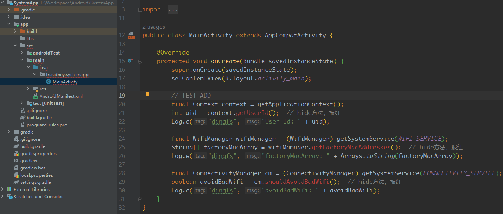
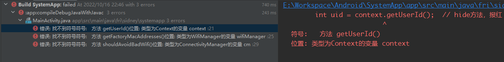
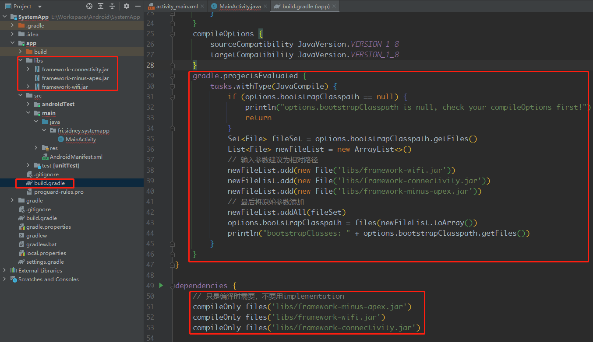
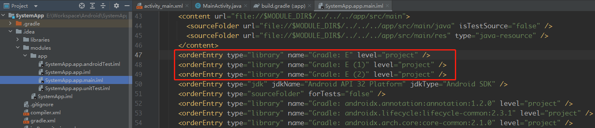
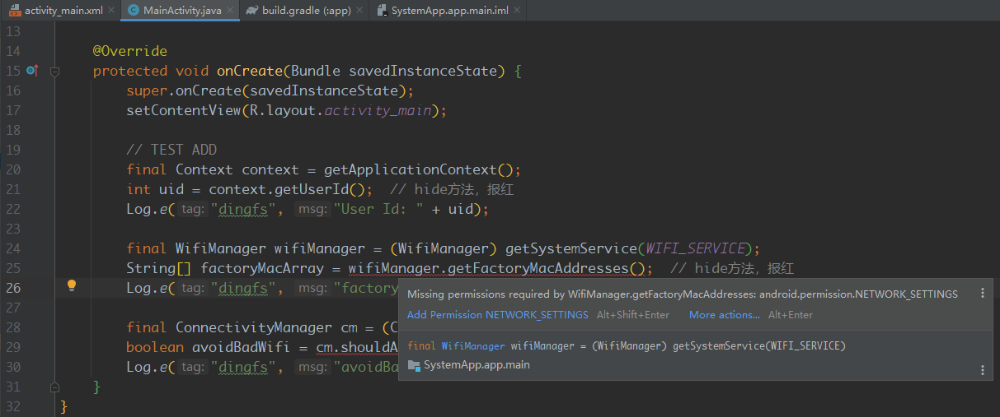
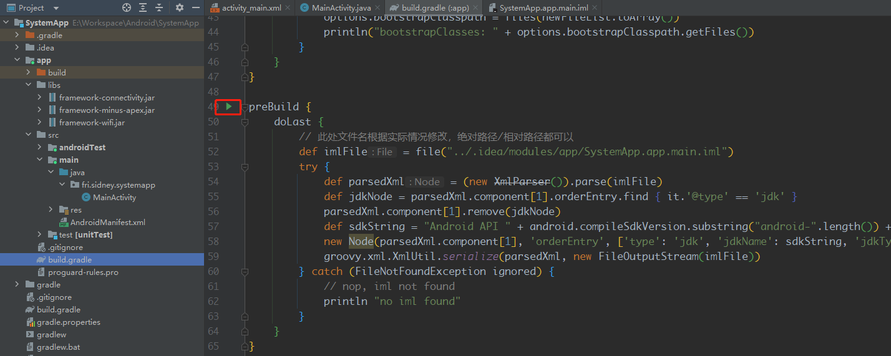
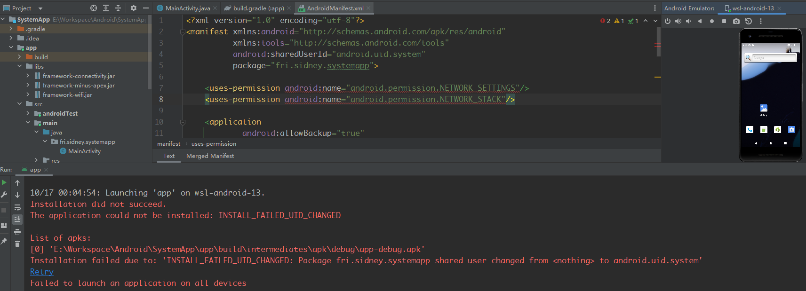
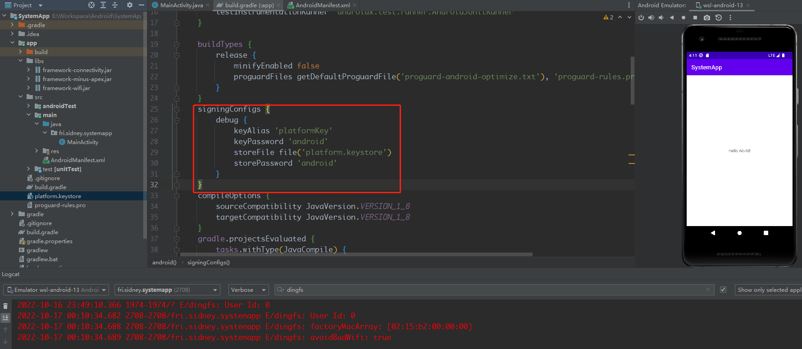
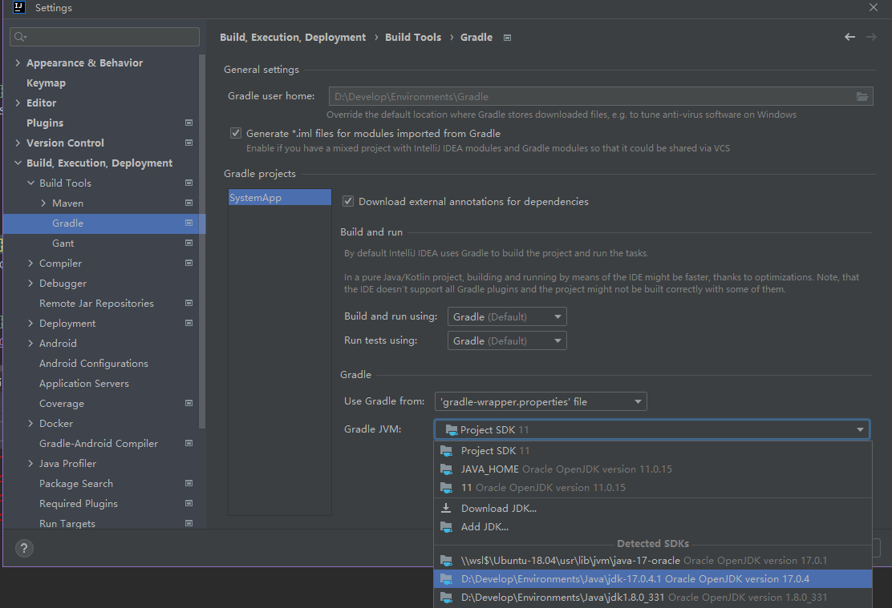

作为OS研发，在framework加点api，写个apk验证想法是常有的事，什么系统api，隐藏api更是想用就用，怎么能被`@hide`限制？所以一般的写的apk都是集成在系统源码里面，比如Settings，加上系统签名，这样确实没有`@hide`限制了，但是这样基本都是基于记事本开发，没有IDE的提示来得舒服，但是用Android Studio打开，由于原生sdk的限制，调用隐藏的api或咱们自己加的api会报红，这代码写起来就不爽。所以咱就是要整个两者兼得的方法，核心是两点，一是系统的jar包，也就是sdk；二是platform签名，没有签名认证，是安装不了的

关于sdk，咱们手上有源码是可以自己编译的，直接`lunch sdk-eng`，整编就好了，出来个啥，不大清楚，没用过，这里不用这个法子，此处选择用哪个模块导入哪个模块的jar包；系统签名相信就按着步骤来生成就好了

<!--more-->

# 1 创建APP工程

用AS创建app工程没啥好说的，创建完毕后在`MainActivity`的`onCreate`方法中写几个hide调用

```java
protected void onCreate(Bundle savedInstanceState) {
    super.onCreate(savedInstanceState);
    setContentView(R.layout.activity_main);

    // TEST ADD
    final Context context = getApplicationContext();
    int uid = context.getUserId();  // hide方法，报红
    Log.e("dingfs", "User Id: " + uid);

    final WifiManager wifiManager = (WifiManager) getSystemService(WIFI_SERVICE);
    String[] factoryMacArray = wifiManager.getFactoryMacAddresses();  // hide方法，报红
    Log.e("dingfs", "factoryMacArray: " + Arrays.toString(factoryMacArray));

    final ConnectivityManager cm = (ConnectivityManager) getSystemService(CONNECTIVITY_SERVICE);
    boolean avoidBadWifi = cm.shouldAvoidBadWifi();  // hide方法，报红
    Log.e("dingfs", "avoidBadWifi: " + avoidBadWifi);
}
```

此时这几个方法肯定是会报红的



如果此时点击build会直接报错



所以目前遇到的是两个问题，不能编译和报红，接下来解决这俩问题

# 2 添加jar包

这个三个hide api在Android 13上对应的分别是framework，wifi，connectivity模块下的，虽然我们不用整编sdk，但是这三个模块的还是得编译一下

```bash
source build/envsetup.sh
lunch sdk_phone_x86_64-eng

make framework-minus-apex -j8
make com.android.wifi -j8  # 编译 framework-wifi 应该就ok
make com.android.tethering.inprocess -j8  # 编译 framework-connectivity 应该就ok
```

这里简单说下怎么找到编译的模块名字，规律还是比较好找的

对于framework，作为Android OS开发应当不陌生，只是换个名字而已，bp文件：`frameworks/base/Android.bp`

```
370 // This "framework" module is NOT installed to the device. It's
371 // "framework-minus-apex" that gets installed to the device. Note that
372 // the filename is still framework.jar (via the stem property) for
373 // compatibility reason. The purpose of this module is to provide
374 // framework APIs (both public and private) for bundled apps.
375 // "framework-minus-apex" can't be used for the purpose because 1)
376 // many apps have already hardcoded the name "framework" and
377 // 2) it lacks API symbols from updatable modules - as it's clear from
378 // its suffix "-minus-apex".
379 java_library {
380     name: "framework",
```

对于WiFi和Connectivity，编译apex和sdk library都行，毕竟apex需要sdk library，只是所在的bp的文件不同，这里看sdk library，其实只要在bp文件中找java_sdk_library就好了

```
// 一般提供api的都是framework

// packages/modules/Wifi/framework/Android.bp
135 // post-jarjar version of framework-wifi
136 java_sdk_library {
137     name: "framework-wifi",

// packages/modules/Connectivity/framework/Android.bp
118 java_sdk_library {
119     name: "framework-connectivity",
```

编译完成后，在out目录找对应的jar包，并导入到AndroidStudio中，这个规律很好找的，**`out/soong/.intermediates/<模块路径>/combined/<模块名>.jar`**，所以只需要

```bash
# 利用find命令就好了，找准combined
sidney@SidneyGod:~/FuckSourceCode/1-android13-dev$ find out/soong/.intermediates/frameworks/ -name "framework-minus-apex.jar"
out/soong/.intermediates/frameworks/base/framework-minus-apex/android_common/dex/framework-minus-apex.jar
...
out/soong/.intermediates/frameworks/base/framework-minus-apex/android_common/combined/framework-minus-apex.jar
...
# 拷贝出来
sidney@SidneyGod:~/FuckSourceCode/1-android13-dev$ cp out/soong/.intermediates/frameworks/base/framework-minus-apex/android_common/combined/framework-minus-apex.jar /mnt/d/Develop/Android/sdk/

# 就找combined的
sidney@SidneyGod:~/FuckSourceCode/1-android13-dev$ find out/soong/.intermediates/packages/modules/Wifi/ -name "framework-wifi.jar"
out/soong/.intermediates/packages/modules/Wifi/framework/framework-wifi/android_common_apex30/dex/framework-wifi.jar
...
out/soong/.intermediates/packages/modules/Wifi/framework/framework-wifi/android_common_apex30/combined/framework-wifi.jar
...
# 拷贝出来
sidney@SidneyGod:~/FuckSourceCode/1-android13-dev$ cp out/soong/.intermediates/packages/modules/Wifi/framework/framework-wifi/android_common_apex30/combined/framework-wifi.jar /mnt/d/Develop/Android/sdk/

# 区别不大 哪个都行
sidney@SidneyGod:~/FuckSourceCode/1-android13-dev$ find out/soong/.intermediates/packages/modules/Connectivity/ -name "framework-connectivity.jar"
out/soong/.intermediates/packages/modules/Connectivity/Tethering/apex/com.android.tethering-bootclasspath-fragment/android_common_apex30/hiddenapi-modular/encoded/framework-connectivity.jar
...
out/soong/.intermediates/packages/modules/Connectivity/framework/framework-connectivity/android_common/combined/framework-connectivity.jar
...
out/soong/.intermediates/packages/modules/Connectivity/framework/framework-connectivity/android_common_apex30/combined/framework-connectivity.jar
...
# 我选第一个
sidney@SidneyGod:~/FuckSourceCode/1-android13-dev$ cp out/soong/.intermediates/packages/modules/Connectivity/framework/framework-connectivity/android_common/combined/framework-connectivity.jar /mnt/d/Develop/Android/sdk/
```

然后将这个三个jar包拷贝出来，放到项目的`app/libs/`目录下，然后在app目录下`build.gradle`中加点东西

```groovy
android {
    compileSdk 32
    ...
    compileOptions {
        sourceCompatibility JavaVersion.VERSION_1_8
        targetCompatibility JavaVersion.VERSION_1_8
    }
    // 下面这一坨的意思就是将三个jar包扩展为bootstrap级别
    // 这里的options就是上面的compileOptions，版本不是1.8的话bootstrapClasspath为null..
    gradle.projectsEvaluated {
        tasks.withType(JavaCompile) {
            if (options.bootstrapClasspath == null) {
                println("options.bootstrapClasspath is null, check your compileOptions first!")
                return
            }
            Set<File> fileSet = options.bootstrapClasspath.getFiles()
            List<File> newFileList = new ArrayList<>()
            // 输入参数建议为相对路径
            newFileList.add(new File('libs/framework-wifi.jar'))
            newFileList.add(new File('libs/framework-connectivity.jar'))
            newFileList.add(new File('libs/framework-minus-apex.jar'))
            // 最后将原始参数添加
            newFileList.addAll(fileSet)
            options.bootstrapClasspath = files(newFileList.toArray())
            println("bootstrapClasses: " + options.bootstrapClasspath.getFiles())
        }
    }
}

dependencies {
    // 只是编译时需要，不要用implementation
    compileOnly files('libs/framework-minus-apex.jar')
    compileOnly files('libs/framework-wifi.jar')
    compileOnly files('libs/framework-connectivity.jar')

    implementation 'androidx.appcompat:appcompat:1.5.1'
    ...
}
```

如下图所示位置



修改完毕后，sync一下gradle文件，此时虽然那三个隐藏api还是报红的，但是编译已经不报错了，apk也能编出装手机上了，但是apk起不来，看看log

```
E/AndroidRuntime: FATAL EXCEPTION: main
    Process: fri.sidney.systemapp, PID: 1974
    java.lang.RuntimeException: Unable to start activity ComponentInfo{fri.sidney.systemapp/fri.sidney.systemapp.MainActivity}: java.lang.SecurityException: App not allowed to get Wi-Fi factory MAC address (uid = 10115)
        at android.app.ActivityThread.performLaunchActivity(ActivityThread.java:3676)
```

显然是缺少了权限，解决完报红IDE应该会提示我们添加对应的权限

# 3 解决报红

这里因为hide api还是红色的，所以IDE没给咱提示，让咱们添加对应的权限。而报红的原因就是对原生sdk的依赖优先级比后添加的几个jar包高，导致IDE优先用sdk的类，而原生sdk中关键系统类和隐藏属性和方法都是不允许我们直接引用的，所以看起来仍然是can not find symbol，解决方法是修改项目中的文件`.idea/modules/app/SystemApp.app.main.iml`，这里的路径名根据项目名不同而不同，不是固定的，打开文件会看到如下内容，找到咱们的jar包，并挪到Android SDK上面就好了

```xml
    <orderEntry type="jdk" jdkName="Android API 32 Platform" jdkType="Android SDK" />
    <orderEntry type="sourceFolder" forTests="false" />
    <orderEntry type="library" name="Gradle: androidx.annotation:annotation:1.3.0" level="project" />
    ...
    <!-- 将下面这三个jar包挪到 Android SDK上面就好了 -->
    <orderEntry type="library" name="Gradle: ./app/libs/framework-minus-apex.jar" level="project" />
    <orderEntry type="library" name="Gradle: ./app/libs/framework-wifi.jar" level="project" />
    <orderEntry type="library" name="Gradle: ./app/libs/framework-connectivity.jar" level="project" />
```

还有长得比较恶心的，是这样的..



反正长得奇怪的就是咱的..修改好保存下，此时再看，隐藏api已经不报红了，并且提示咱们需要添加权限



直接点击提示就添加就好啦，但是这两个权限普通app加了是没用的"Permission is only granted to system apps"，此时app仍然起不来，还是会报权限问题


还有个问题，这个iml文件每次改动下gradle文件都得手动改下，很是费劲，为了解决这个问题，咱们可以在app的gradle文件中加点东西，一劳永逸

```groovy
preBuild {
    doLast {
        // 此处文件名根据实际情况修改，绝对路径/相对路径都可以
        def imlFile = file("../.idea/modules/app/SystemApp.app.main.iml")
        try {
            def parsedXml = (new XmlParser()).parse(imlFile)
            def jdkNode = parsedXml.component[1].orderEntry.find { it.'@type' == 'jdk' }
            parsedXml.component[1].remove(jdkNode)
            def sdkString = "Android API " + android.compileSdkVersion.substring("android-".length()) + " Platform"
            new Node(parsedXml.component[1], 'orderEntry', ['type': 'jdk', 'jdkName': sdkString, 'jdkType': 'Android SDK'])
            groovy.xml.XmlUtil.serialize(parsedXml, new FileOutputStream(imlFile))
        } catch (FileNotFoundException ignored) {
            // nop, iml not found
            println "no iml found"
        }
    }
}

dependencies {
    ...
```

编译前点一下这个preBuild就好了



# 4 系统签名

最后便是来解决这个系统签名，既然有些权限只能是系统app才能添加，那就将咱们的app变成系统app

## 4.1 成为系统app

成为系统app很简单，在`AndroidManifest.xml`加上`android:sharedUserId="android.uid.system"`就ok了

```xml
<manifest xmlns:android="http://schemas.android.com/apk/res/android"
          xmlns:tools="http://schemas.android.com/tools"
          android:sharedUserId="android.uid.system"  <!-- 系统uid -->
          package="com.xiaomi.systemapp">

    <uses-permission android:name="android.permission.NETWORK_SETTINGS"/>
    <uses-permission android:name="android.permission.NETWORK_STACK"/>
```

这个编译没问题，但是安装不上去了



是的uid变了，需要系统签名

## 4.2 生成系统签名

一般签名分为正式签名和测试签名，签名这东西可以直接从源码提取，步骤如下，主要为了生成keystore或jks文件

```bash
# 1 源码目录build/target/product/security 取platform.pk8 platform.x509.pem放到一个目录下
cp build/target/product/security/platform.* ~/temp/

# 2 生成platform.priv.pem
openssl pkcs8 -inform DER -nocrypt -in platform.pk8 -out platform.priv.pem

# 3 生成platform.p12，这里证书密码格式 -password pass:<android> 这里 -name <alias> 就是别名
openssl pkcs12 -export -in platform.x509.pem -out platform.p12 -inkey platform.priv.pem -password pass:android -name platformKey

# 4 生成platform.keystore，这里-deststorepass要与上面证书密码一致 -srcstorepass为了方便写成一样吧
keytool -importkeystore -deststorepass android -destkeystore platform.keystore -srckeystore platform.p12 -srcstoretype PKCS12 -srcstorepass android
```

到这里咱们的签名就制作好了，就是那个`platform.keystore`文件，拷贝值app目录下，再次修改app下的`build.gradle`文件

```groovy
android {
    compileSdk 32
...
    buildTypes {
        release {
            minifyEnabled false
            proguardFiles getDefaultProguardFile('proguard-android-optimize.txt'), 'proguard-rules.pro'
        }
    }
    // 就是下面这个签名配置
    signingConfigs {
        debug {
            keyAlias 'platformKey'
            keyPassword 'android'
            storeFile file('platform.keystore')
            storePassword 'android'
        }
    }
    compileOptions {
        sourceCompatibility JavaVersion.VERSION_1_8
        targetCompatibility JavaVersion.VERSION_1_8
    }
...
}
```

这个时候再编译，就没问题了，成功打印出了咱们的log




PS：

如果这个时候编不过，提示"Algorithm HmacPBESHA256 not available"，这是因为java版本问题，将gradle的java版本换成jdk17就好了，再编译就没有问题了，可以愉快的用系统级api开发了

Android Studio修改gradle Java版本：`File | Settings | Build, Execution, Deployment | Build Tools | Gradle`


