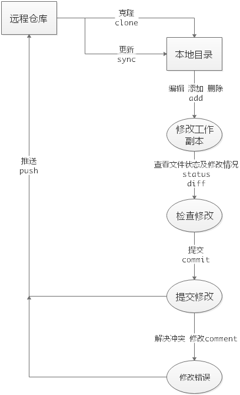
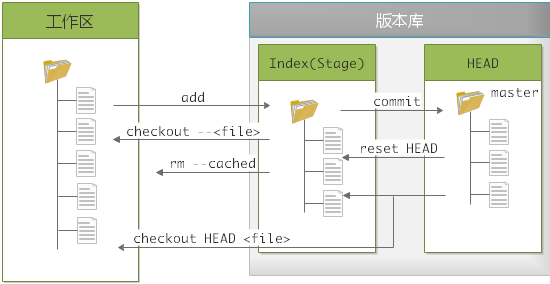
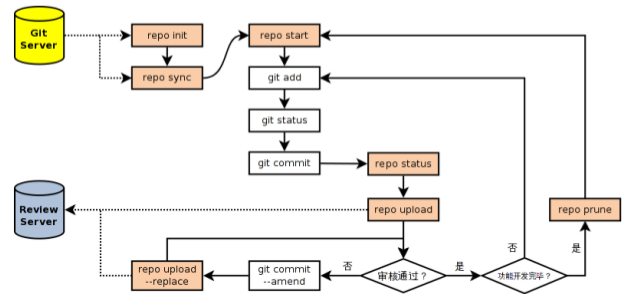

# 0 初始化

每台计算机只需配置一次，升级时会保留配置信息。

Git自带一个 git config 的工具帮助设置控制Git外观和行为的配置变量，这些变量存在于三个不同的位置：

- /etc/gitconfig：包含系统上每一个用户的及他们仓库的通用配置。如果带有`--system`选项的git config时，会从此文件读写变量
- \~/.gitconfig或\~/.config/git/config：只针对当前用户。使用`--global`选项读写此文件
- 当前仓库目录中的config(.git/config)：针对该仓库

每一级别覆盖上一级别

**基本配置**

```shell
# 配置用户名和邮箱
git config --global user.name "Sidney Ding"
git config --global user.email "dingfs0527@thundersoft.com"
# 文本编辑器 根据喜好
git config --glonal core.editor vim
# 检查配置信息
git config --list
git config user.name
# 获取帮助
git help <verb>
git <verb> --help
man git-<verb>
```

<!-- more -->

# 1 基础

Git使用基本流程



## 1.1 获取git仓库

获取仓库的方法有两种

### 1.1.1 现有目录初始化

```shell
# 进入项目目录
cd <ProjectDir>
# 初始化 会创建一个.git子目录
git init
```

### 1.1.2 克隆现有仓库

```shell
# RepoUrl根据协议不同 地址类型也不近相同
git clone <RepoUrl>
# 会在当前目录下创建testRepo目录 并初始化出一个.git文件夹
git clone https://github.com/userName/testRepo
# 创建的目录变为MyRepo
git clone https://github.com/userName/testRepo MyRepo
```

## 1.2 忽略文件

```shell
$ cat .gitignore
*.[oa]
*~
```

- 所有空行或以`#`开头的行都会被git忽略
- 可以使用标准的glob模式匹配
- 匹配模式可以以`/`开头防止递归
- 匹配模式可以以`/`结尾指定目录
- 要忽略指定模式以外的文件或目录，可以在模式前加`!`取反

glob模式：shell中简化的正则

- `*`：匹配零个或任意多个字符
- `[abc]`：匹配a,b,c之间任意一个字符
- `?`：匹配任意一个字符
- [0-9]：表示匹配0-9之间人一个数字
- `a/**/z`：匹配任意中间目录，例：a/b/z,/a/b/c/z...
- more: https://github.com/github/gitignore

## 1.3 本地文件管理



- 工作区：未隐藏的部分
- 版本库：`.git`目录
  - Index：`.git/index`，暂存区
  - HEAD：`.git/HEAD`，是一个指针，指向当前分支的版本
  - master：只是一个存放40位sha-1的文件而已

```shell
# 用暂存区的文件替换工作区的文件 撤销修改
git checkout -- <file>
git checkout .
# 将文件加到暂存区
git add <file>
# 可以查看文件的状态
git status
# 查看文件的详细状态
git diff
git diff --staged
# 撤销暂存区的修改
git reset HEAD <file>
# 删除暂存区的文件 工作区的文件不做修改
git rm --cached <file>
# 改名字 等价于三条命令 mv README.md README | git rm README.md | git add README
git mv README.md README
# 将暂存区的目录树写到版本库中HEAD指向的分支
git commit
# 修改commit信息
git commit --amend
# 撤销上一次提交 其实并不是撤销 其实保留了上一次提交 只是copy了上上次提交的状态
git revert -m 1 HEAD
git revert -m commitId
# 查看提交历史 由近及远
git log
git log -p
git log -3
git log --pretty=oneline
# 回退到前一个版本 1可以改为任意版本内的数字
git reset --hard HEAD~1
# 回到任意的提交版本 commitId不必写全 HEAD确实是一个指针
git reset --hard <commitId>
# 命令历史
git reflog
```

后悔药使用指南:

git checkout .  还没有add

git reset

## 1.4 远程仓库

```shell
# 显示所有的读写远程仓库
git remote -v
# 添加一个远程仓库
git remote add <shortname> <url>
# 从远程仓库获取数据
git fetch [remoteName]
# 抓取数据并尝试自动合并
git pull
# 推送到远程仓库
git push [remoteName] [branchName]
git push origin master
git push origin HEAD:refs/for/<branchName>
# 查看远程仓库信息
git remote show [remoteName]
# 重命名远程仓库
git remote rename <oldRemoteName> <newRemoteName>
git remote rm <remoteName>
# 清除本地远程分支 远程分支可能不存在了 但是本地还有
git remote prune origin
```

## 1.5 打标签

```shell
# 列出所有的标签
git tag
git tag -l 'v1.8*'
# 打附注标签
git tag -a v1.9 -m 'Version 1.9'
# 打轻量标签
git tag v1.9-lw
# 后期打标签
git tag -a v1.7 <commitId>
# 默认标签不会传送到远程仓库
git push origin [tagname]
git push origin --tags  # 一次性传很多标签
# 删除tag
git tag -d <tagName>
```

## 1.5 别名

可以给命令起别名 简化操作

```shell
# 之后可以用 git co 代替 git checkout
git config --global alias.co checkout
git config --global alias.br branch
git config --global alias.ci commit
git config --global alias.st status
# 使用git last 查看上一次提交
git config --global alias.last 'log -a HEAD'
```

## 1.7 other

```shell
# 修改author
git commit --amend --author="author name..."
```

# 2 分支

简单来说就是时间线，每条时间线上有很多时间点(commit)

```shell
# 创建分支 dev
git branch dev
# 切换到 dev 分支
git checkout dev
# 创建并切换到分支 dev
git checkout -b dev
# 查看当前分支
git branch
# 查看所有分支
git branch -a
# 合并制定分支到当前分支 fast-forward 代表只是向上游移动
git merge dev
# 删除分支
git branch -d dev
```

## 2.1 冲突

当合并分支不再是 fast-forward 模式时，Git只是试图将各自修改的部分合并起来，但这种合并会有冲突

```shell
$ git merge feature1
Auto-merging testFile.txt
CONFLICT (content): Merge conflict in testFile.txt
Automatic merge failed; fix conflicts and then commit the result.
```

Git提示我们需要手动解决冲突后再提交，通过`git status`也可以知道冲突的文件

在解决冲突时，可以使用`meld fileName`

```shell
<<<<<<< HEAD
Creating a new branch is quick & simple.
=======
Creating a new branch is quick AND simple.
>>>>>>>
```

<<<<<<<，\==\==\===，>>>>>>> 标记出不同分支的内容，需要手动去解决，比如手动修改后：

```shell
Creating a new branch is quick and simple.
```

这样就可以再进行提交了

通过`git log --graph --pretty=oneline --abbrev-commit`可以查看分支合并情况

中断合并`git merge --abort`

## 2.2 bug分支

背景：当前正在`dev`进行工作，且进行到一半，还没法提交，预计还需要1天完成，此时来了一个bug，这个bug必须在两小时内修复

Git提供了`stash`功能，可以把当前工作现场存储起来，等以后恢复后继续工作

```shell
$ git stash
Saved working directory and index state WIP on dev: f52c633 and merge
```

此时使用`git status`可以看到工作区是干净的，可以放心创建分支来修复bug。比如现在在master上创建分支修复bug

```shell
git checkout master
git checkout -b issue-101
# 进行一系列复杂操作 修复了bug 提交
git commit -m "fix bug 101"
# 切换回master分支
git checkout master
# 合并分支 --no-ff 表示禁用fast-forward模式
git merge --no-ff -m "merge bug fix 101" issue-101
# 删除bug分支
git branch -d issue-101
# 切回dev分支继续干活
git checkout dev
# 查看工作现场
git stash list
# 恢复工作现场同时删除工作现场
git stash pop
```

还可以使用`git stash apply stash@{0}`恢复，然后现场还在，需要通过`git stash drop stash@{0}`删除

> 注意：git stash之前，一定要先用git status看一下，是否有Untrackted files。如果有，需要先add。因为git stash不能将untrakcted file压栈
>
> 没有commit切换分支是会报错的
>
> 工作区和暂存区是一个公开的平台，任何一个分支都会用到

## 2.3 Feature分支

开发时，每添加一个新功能最好新建一个feature分支，因为这个功能的代码可能是实验性质的，不能把主分支搞乱。

新建Feature分支，开发，合并，删除Feature分支

开发到一半，觉得这个不行，可以使用`git branch -D fearture`进行强行删除

## 2.4 多人协作

首先，试图使用`git push origin <branchName>`推送自己的修改

如果推送失败，则因为远程分支比你新，需要先用`git pull`试图合并

若果有冲突，则解决冲突，并在本地提交

没有冲突或者解决冲突后，再用`git push origin <branchName>`推送就能成功

> 如果`git pull`提示`no tracking information`，则说明本地分支和远程分支的链接关系没有创建，用命令`git branch --setupstream-to=origin/branch-name branch-name`建立本地分支与远程分支的关联
>
> 本地新建分支如果不推送到远程，对其他人就是不可见的，于是可以随便玩..
>
> `git pull` = `git fetch` + `git merge`

## 2.5 变基rebase

合并分支的一种方式

- rebase操作可以把本地未push的分叉提交历史整理成直线
- 目的是为了我们在查看历史提交的变化时更容易，因为分叉的提交需要三方对比
- 变基有风险！

# 3 Patch

- 创建补丁

`git diff > my.patch`

`git diff --no-prefix > my.patch`

`git diff master > my.patch`

```shell
# 将最近的三次提交 变为patch文件 -s 表示加上当前用户签名
$ git format-patch -s HEAD~3..HEAD
0001-Fix-typo-help-to-help.patch
0002-Add-I18N-support.patch
0003-Translate-for-Chinese.patch
```

- 通过邮件发送补丁

```shell
git send-email *.patch
```

`git am`应用来自邮箱的补丁，特别是被mbox格式化过的

- 应用补丁

```shell
# 基于HEAD~3创建一个分支
git checkout -b branch1 HEAD~3
# 应用补丁
git apply *.patch
# 如果apply一个patch出错，报error: patch failed: drivers/usb/host/xhci.c:918之类的错误，那么是因为本地已经有这个patch了，所以不能够apply

```

- cherry-pick

```shell
# 引入特性分支的某个提交
git cherry-pick commitId
```

# 4 Repo

repo就是通过Python对git的一个封装，用于管理多个Git版本库

## 4.1 安装repo

```shell
# 下载repo的引导脚本
curl https://storage.googleapis.com/git-repo-downloads/repo > ~/bin/repo
# 将repo脚本设置为可执行
chmod a+x ~/bin/repo
```

## 4.2 初始化

```shell
mkdir work-dir
cd work-dir
# 初始化清单文件 就是一个.git文件
repo init -u <gitUrl>
repo init -u <gitUrl> -b <branchName>
# 表示优先从本地的mirror同步 提高下载速度
repo init -u <gitUrl> -b <branchName> --reference=<localServerMirror>

```

此时工作目录就会有个`.repo`文件夹，其中有个`manifest.xml`文件，这文件里面包含了Android各项目的信息

> 代码库本地镜像 `repo init --mirror -u <gitUrl>`

## 4.3 同步

```shell
# 同步代码到本地
repo sync -j6
# 其中
# -j 多任务 过多会起反作用
# -c 只下载当前代码
# -d 让工程回退到manifest制定的版本
# -f 如果某个工程同步失败 继续同步

# 也可以只同步感兴趣的代码
repo sync platform/build
```

## 4.4 常用命令

```shell
# 获取帮助
repo help <command>
```

- repo init

- repo sync

  相当于`git clone`或`git update` + `git rebase origin/branch`

- repo start

  对`git checkout -b`的封装

  `repo start <newBranchName> [--all | <project>...]`

- repo checkout

  对`git checkout`的封装

- repo status

  ```shell
  project system/core/                            (*** NO BRANCH ***)
   -m     fs_mgr/fs_mgr_fstab.cpp
  ```
  

每个小节的首行显示项目名称,以及所在分支名称

之后显示该项目中文件变更状态。头两个字母显示变更状态,后面显示文件名或者其
  他变更信息

第一个字母表示暂存区的文件修改状态

- \- :没有改变
  - A :添加 (不在HEAD中, 在暂存区)
  - M :修改 (在HEAD中, 在暂存区, 内容不同)
  - D :删除 (在HEAD中, 不在暂存区)
  - R :重命名 (不在HEAD中, 在暂存区, 路径修改 )
  - C :拷贝 (不在HEAD中, 在暂存区, 从其他文件拷贝)
  - T :文件状态改变 (在HEAD中, 在暂存区, 内容相同)
  - U :未合并, 需要冲突解决
  

第二个字母表示工作区文件的更改状态

- \- :新/未知 (不在暂存区, 在工作区)
  - m :修改 (在暂存区, 在工作区,被修改)
  - d :删除 (在暂存区,不在工作区)
  

两个表示状态的字母后面,显示文件名信息。如果有文件重命名还会显示改变前后的
  文件名以及文件的相似度

- repo diff [\<project>...]

  是对`git diff`命令的封装,用以分别显示各个项目工作区下的文件差异



# 5 Gerrit

先加ssh-key

Gerrit下的Git服务器只允许用户向特殊的引用`ref/for/<branchName>`推送，这样才会创建一个reviewId