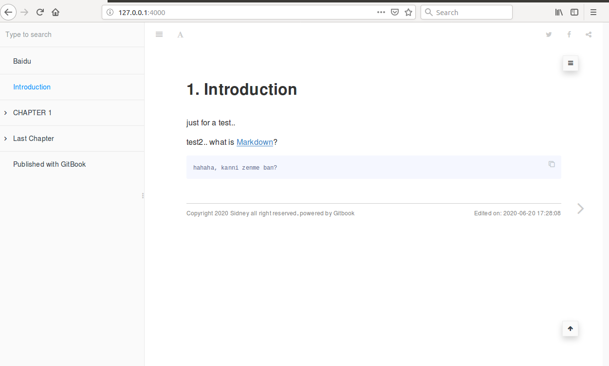

# 0 start

感觉最近看的不少东西都是用gitbook写的，看起来也确实怪舒服的，举个例子：[https://lingcoder.github.io/OnJava8/#/sidebar](https://lingcoder.github.io/OnJava8/#/sidebar)，既能当博客又能当Wiki，于是我准备自己搭建一个。参考网上的步骤：

1. 文档编写采用统一标准，都用Markdown格式的，最后可以用gitbook自动生成静态网页；

2. 分配好各阶段（版本）相关责任人编写的文档，待文档编写完成后统一上传到git；

3. jenkins负责拉取正式版本（release开头）的文档，用gitbook编译后，同步到云端文档服务器

4. 云端服务器制作一个入口页面，页面里面可以指引各个版本文档；http服务用nginx，指引到这个页面；

其中第三步我觉得没必要用Jenkins，直接设置一个定时任务就好了。。其实搭建一个从零开始搭建一个完整Gitbook还是比较麻烦的，详情参考下方的参考文档。我既然说了快速，那必然是简单而又傻瓜式的搭建了..Let's go!

<!-- more -->

参考文档：

[Gitbook + Jenkins + Gitlab 搭建内网自动构建的 Gitbook](http://huaqianlee.github.io/2019/05/05/Git/gitlab-jenkins-gitbook-to-create-LAN-gitbook/)

[Gitbook使用教程](http://gitbook.zhangjikai.com/installation.html)

[Gitbook学习笔记](https://www.bookstack.cn/read/yangzh-gitbook/f515035a29711964.md)

[Gitbook插件整理](GitBook插件整理)

[利用gitbook+git+jenkins+nodejs搭建起一套多版本说明的文档网站](https://blog.zhenglin.work/other/devops_practices_gitbook_web.html#%E5%88%A9%E7%94%A8gitbookgitjenkinsnodejs%E6%90%AD%E5%BB%BA%E8%B5%B7%E4%B8%80%E5%A5%97%E5%A4%9A%E7%89%88%E6%9C%AC%E8%AF%B4%E6%98%8E%E7%9A%84%E6%96%87%E6%A1%A3%E7%BD%91%E7%AB%99)

# 1 准备环境

## 1.1 设置root密码

准备环境这一步很基础也很重要，我使用的是Ubuntu16的虚拟机，打开虚拟机后**先确保root用户是有密码**的，不是sudo的密码，可以在终端试试`su`能不能切换到root，如果不行，先给root设置密码

```bash
sidney@ubuntu:~$ sudo passwd root  # 设置一次密码就好了 以后就可以用su切换root了
[sudo] password for sidney: 
Enter new UNIX password: 
Retype new UNIX password: 
passwd: password updated successfully
sidney@ubuntu:~$ 
```

## 1.2 创建git用户

为了不影响当前的环境，我们先创建一个git用户，这个git也可以换成其他喜欢的字符

```bash
sidney@ubuntu:~$ sudo adduser git
Adding user `git' ...
Adding new group `git' (1001) ...
Adding new user `git' (1001) with group `git' ...
Creating home directory `/home/git' ...
Copying files from `/etc/skel' ...
Enter new UNIX password: 
Retype new UNIX password: 
passwd: password updated successfully
Changing the user information for git
Enter the new value, or press ENTER for the default
	Full Name []: 
	Room Number []: 
	Work Phone []: 
	Home Phone []: 
	Other []: 
Is the information correct? [Y/n] y
sidney@ubuntu:~$ 
```

创建好git用户后，应该就有`/home/git`目录了，如果没有的话..自己想办法吧..

## 1.3 下载环境

这里用我打包好的环境，省时省力，解压改点东西就能用了，下载链接：

蓝奏云：https://sidneygod.lanzous.com/iwOFzdwazyj
密码:sidney

天翼云：https://cloud.189.cn/t/eAnyamUNBrum
访问码：jtv3

没错，就是不提供百度云..这里先把git和openssh-server安装了，顺便当前用户生成个公钥

```bash
sidney@ubuntu:~$ sudo apt-get install git  # 安装git 我安装过了 所以结果不一样
Reading package lists... Done
Building dependency tree       
Reading state information... Done
git is already the newest version (1:1.9.1-1ubuntu0.10).
0 upgraded, 0 newly installed, 0 to remove and 1 not upgraded.
sidney@ubuntu:~$ sudo apt-get install openssh-server  # 安装openssh-server
Reading package lists... Done
Building dependency tree       
Reading state information... Done
openssh-server is already the newest version (1:6.6p1-2ubuntu2.13).
0 upgraded, 0 newly installed, 0 to remove and 1 not upgraded.
sidney@ubuntu:~$ ssh-keygen  # 生成公钥 这个我也生成过了..
Generating public/private rsa key pair.
Enter file in which to save the key (/home/sidney/.ssh/id_rsa): 
/home/sidney/.ssh/id_rsa already exists.
Overwrite (y/n)? y
Enter passphrase (empty for no passphrase): 
Enter same passphrase again: 
Your identification has been saved in /home/sidney/.ssh/id_rsa.
Your public key has been saved in /home/sidney/.ssh/id_rsa.pub.
The key fingerprint is:
cd:f8:18:9a:8b:de:91:d0:e0:ce:d3:5c:93:5a:37:dc sidney@ubuntu
The key's randomart image is:
+--[ RSA 2048]----+
|                 |
|                 |
|    .            |
|   . o   * .     |
|    o . S * E    |
|   o + B * .     |
|    + O . .      |
|     + o         |
|   .o o          |
+-----------------+
sidney@ubuntu:~$ sudo vim /etc/ssh/ssh_config  # 大概在39行 把Port 22注释打开 默认端口
sidney@ubuntu:~$ sudo /etc/init.d/ssh stop  # 重启一下ssh服务
[ ok ] Stopping ssh (via systemctl): ssh.service.
sidney@ubuntu:~$ sudo /etc/init.d/ssh start
[ ok ] Starting ssh (via systemctl): ssh.service.
sidney@ubuntu:~$
```

哦，对了，如果没配置git，顺便把git配置一下

```bash
git config --global user.name "Sidney Ding"
git config --global user.email "sidneyding183@gmail.com"
```

这个环境配置的差不多了..接下来该处理我们下载下来的文件`git.zip`了

## 1.4 解压git.zip

首先，在终端切换用户到git，并把git.zip拷贝到`/home/git`下，然后来一个一个配置..

```bash
sidney@ubuntu:~$ su git  # 切换用户
Password: 
git@ubuntu:/home/sidney$ cd ~  # 进入git的home目录
git@ubuntu:~$ ll git.zip 
-rw-r--r-- 1 root root 96128663 Jun 21 00:20 git.zip
git@ubuntu:~$ sudo chmod 666 git.zip  # 改变模式失败..
[sudo] password for git: 
git is not in the sudoers file.  This incident will be reported.
git@ubuntu:~$ 
```

在git中调用`sudo`，不出意外都会报这个错的`git is not in the sudoers file.  This incident will be reported.`，接下来的操作，**<font color='red'>一定要确保root有密码！一定要确保root有密码！一定要确保root有密码！</font>**

```bash
git@ubuntu:~$ su  # 切换到root用户
Password: 
root@ubuntu:/home/git# ll /etc/sudoers  # 查看文件权限
-r--r----- 1 root root 755 Jun 20 23:54 /etc/sudoers
root@ubuntu:/home/git# chmod 0660 /etc/sudoers  # 加个可以写的权限
root@ubuntu:/home/git# vim /etc/sudoers  # 在这个文件中加一句  git ALL=(ALL) ALL 
root@ubuntu:/home/git# chmod 0440 /etc/sudoers  # 一定要把权限改回去 不然大家都不能用sudo了
root@ubuntu:/home/git# ll /etc/sudoers
-r--r----- 1 root root 773 Jun 21 00:30 /etc/sudoers
root@ubuntu:/home/git# exit  # 退出root
exit
git@ubuntu:~$ sudo chmod 666 git.zip  # 再次修改git.zip权限
[sudo] password for git: 
git@ubuntu:~$ ll git.zip 
-rw-rw-rw- 1 root root 96128663 Jun 21 00:20 git.zip  # 没毛病
git@ubuntu:~$ 
```

如果你在这不小心，用sudo改了`/etc/sudoers`的模式，然后你还没有root密码..作孽啊，用下面的方法试试能不能救..不然重装系统吧

[sudo: /etc/sudoers is world writable sudo: no valid sudoers sources found](https://www.cnblogs.com/sea-stream/p/9852478.html)

终于可以解压了..

```bash
git@ubuntu:~$ unzip git.zip 
Archive:  git.zip
   creating: book/
  inflating: book/serve.log          
  inflating: book/book.json          
  inflating: book/package-lock.json  
  inflating: book/commands.txt
  ...
git@ubuntu:~$ ll  # 解压完的目录应该是这样的
total 93932
drwxr-xr-x 7 git  git      4096 Jun 21 00:38 ./
drwxr-xr-x 4 root root     4096 Jun 21 00:02 ../
-rw------- 1 git  git       100 Jun 21 00:24 .bash_history
-rw-r--r-- 1 git  git       220 Jun 21 00:02 .bash_logout
-rw-r--r-- 1 git  git      3771 Jun 21 00:02 .bashrc  # 这个必须在
drwxrwxr-x 6 git  git      4096 Jun 20 22:39 book/  # 必须
drwxrwxr-x 7 git  git      4096 Jun 20 09:10 book.git/  # 必须
-rw-r--r-- 1 git  git      8980 Jun 21 00:02 examples.desktop
-rw-rw-rw- 1 root root 96128663 Jun 21 00:20 git.zip
drwxrwxr-x 6 git  git      4096 Jun 20 22:45 nginx/  # 必须
drwxr-xr-x 9 git  git      4096 Jun 20 22:30 nginx-1.18.0/
drwxr-xr-x 7 git  git      4096 Jun 20 09:30 node-v12.18.1-linux-x64/  # 必须
-rw-r--r-- 1 git  git       655 Jun 21 00:02 .profile  # 必须
```

如果缺了必须的文件，是一件很麻烦的事..

## 1.5 配置环境

接下来要配置的就不多了

### 1.5.1 node.js

```bash
# 配置node.js环境变量
git@ubuntu:~$ cd node-v12.18.1-linux-x64/bin
git@ubuntu:~/node-v12.18.1-linux-x64/bin$ pwd
/home/git/node-v12.18.1-linux-x64/bin  # 注意这个路径
git@ubuntu:~/node-v12.18.1-linux-x64/bin$ vim ~/.bashrc  # 主要是把那个路径添加到环境变量
    # node.js
    export PATH=/home/git/node-v12.18.1-linux-x64/bin:$PATH
git@ubuntu:~/node-v12.18.1-linux-x64/bin$ source ~/.bashrc
git@ubuntu:~/node-v12.18.1-linux-x64/bin$ node -v
v12.18.1  # 能正确显示版本 说明没问题
git@ubuntu:~/node-v12.18.1-linux-x64/bin$
```

### 1.5.2 gitbook

先去看看gitbook能不能用

```bash
git@ubuntu:~/node-v12.18.1-linux-x64/bin$ cd ~/book
git@ubuntu:~/book$ gitbook -V  # 耐心等一会，需要安装点东西
CLI version: 2.3.2
Installing GitBook 3.2.3
...
GitBook version: 3.2.3
git@ubuntu:~/book$ gitbook serve  # 先爽一下 报error不用管 那个是我故意写错的 一个插件导致的
Live reload server started on port: 35729
Press CTRL+C to quit ...
...
Starting server ...
Serving book on http://localhost:4000
```

这个时候，打开浏览器，访问`http://127.0.0.1:4000`应该是能访问的，如下图



### 1.5.3 git

再配置一下我们的仓库

```shell
git@ubuntu:~/book$ cd docs/
git@ubuntu:~/book/docs$ ifconfig  # 先看一下本机ip 毕竟要大家一起玩嘛..
ens33     Link encap:Ethernet  HWaddr 00:0c:29:6b:c5:06  
          inet addr:192.168.1.109  Bcast:192.168.1.255  Mask:255.255.255.0
          ...

git@ubuntu:~/book/docs$ vim .git/config
    [remote "origin"]
            url = git@192.168.1.109:/home/git/book.git  # 重点是这句 自行修改一下
            fetch = +refs/heads/*:refs/remotes/origin/*
# 如果没问题的话 我们更新一下代码试试
git@ubuntu:~/book/docs$ git pull origin master  # 更新代码应该是没问题的 并且是最新的
The authenticity of host '192.168.1.109 (192.168.1.109)' can't be established.
ECDSA key fingerprint is 0a:0a:d6:c8:7d:cf:b1:75:8e:c4:fe:ac:13:16:aa:f8.
Are you sure you want to continue connecting (yes/no)? yes
Warning: Permanently added '192.168.1.109' (ECDSA) to the list of known hosts.
git@192.168.1.109's password: 
From 192.168.1.109:/home/git/book
 * branch            master     -> FETCH_HEAD
Already up-to-date.
git@ubuntu:~/book/docs$ vim README.md  # 我们修改一下README.md  干掉那个error
git@ubuntu:~/book/docs$ git diff
diff --git a/README.md b/README.md
index 71a64d2..7119efd 100644
--- a/README.md
+++ b/README.md
@@ -3,4 +3,7 @@ just for a test..
 
 test2..
 what is Markdown?
+'''bash  # 主要是把这里的txt换成一种语言
+hahaha, kanni zenme ban?
+'''
git@ubuntu:~/book/docs$ git add README.md  # 下面是验证一笔提交..
git@ubuntu:~/book/docs$ git commit -m "change txt to bash"

*** Please tell me who you are.

Run

  git config --global user.email "you@example.com"
  git config --global user.name "Your Name"

to set your account's default identity.
Omit --global to set the identity only in this repository.

fatal: empty ident name (for <git@ubuntu.(none)>) not allowed
# 忘了配置git了..
git@ubuntu:~/book/docs$ git config --global user.email "sidneyding183@gmail.com"
git@ubuntu:~/book/docs$ git config --global user.name "SidneyGod"
git@ubuntu:~/book/docs$ git commit -m "change txt to bash"
[master 3906bd7] change txt to bash
 1 file changed, 3 insertions(+)
git@ubuntu:~/book/docs$ git push origin master  # 说明push也没有问题
git@192.168.1.109's password: 
Counting objects: 5, done.
Delta compression using up to 4 threads.
Compressing objects: 100% (3/3), done.
Writing objects: 100% (3/3), 350 bytes | 0 bytes/s, done.
Total 3 (delta 1), reused 0 (delta 0)
To git@192.168.1.109:/home/git/book.git
   f242669..3906bd7  master -> master
git@ubuntu:~/book/docs$ 
git@ubuntu:~/book/docs$ cd ../
git@ubuntu:~/book$ gitbook build && gitbook serve  # 这次就不会报error了
info: 29 plugins are installed 
info: 24 explicitly listed
...
```

这一步其实是为了确定仓库是好的，我才不会用`gitbook serve`呢！

### 1.5.4 nginx

这东西也不用了解太多，用就完事了..

```bash
git@ubuntu:~/book$ cd ../nginx
git@ubuntu:~/nginx$ pwd
/home/git/nginx
git@ubuntu:~/nginx$ vim conf/nginx.conf  # 先看一下第29行配置对不对
    alias /home/git/book/_book;  # 如果_book不在这个目录 修改一下
git@ubuntu:~/nginx$ 
git@ubuntu:~/nginx$ sudo ./sbin/nginx -p /home/git/nginx  # 运行nginx
[sudo] password for git: 
git@ubuntu:~/nginx$ ls  # 运行完 多几个temp才是正常的
client_body_temp  conf  fastcgi_temp  html  logs  proxy_temp  sbin  scgi_temp  uwsgi_temp
```

这个时候应该可以通过`http://192.168.1.109/book`来访问了，访问成改表示nginx配置成功，`http://192.168.1.109/`就可以用来"**制作一个入口页面，页面里面可以指引各个版本文档**"，多本gitbook才是最终目标

### 1.5.5 git hook

之前用的定时..感觉还是不行，不好用，于是发现git新大陆，叫git hook，先到`book.git`仓库看看吧

```bash
git@ubuntu:~/book.git/hooks$ pwd  # 注意这个目录
/home/git/book.git/hooks
git@ubuntu:~/book.git/hooks$ vim post-receive  # 创建post-receive文件 当有push就会执行
git@ubuntu:~/book.git/hooks$ chmod a+x post-receive  # 加可执行权限
```

以下是`post-receive`内容

```shell
#!/bin/bash
#set -e  # 这两句调试用的
#set -x

PATH=/home/git/node-v12.18.1-linux-x64/bin/:$PATH  # 这里路径

IS_BARE=$(git rev-parse --is-bare-repository)
if [ -z "$IS_BARE" ]; then
    echo >&2 "fatal: post-receive: IS_NOT_BARE"
    exit 1
fi

unset GIT_DIR
cd '/home/git/book/docs'  # 注意这里的路径
echo "deploying the gitbook.."
result=`git pull origin master`
[[ $result = "Already up-to-date." ]] && exit 0 || echo "File updated"
cd '/home/git/book'  # 还有这里
gitbook build
```

这样就特别完美了..哈哈..比定时任务高大上多了..

### ~~1.5.6 crontab~~

其实到这里就已经好了，让nginx一直在后台运行就好了，如果`/home/git/book/docs`有变动，比如新的文档啥的，就在`/home/git/book`目录下执行一次`gitbook build`就好了，但是怎么说呢？太累。写完文档push完了，你还得再去pull一次，麻烦，所以才有上面的Jenkins监听push行为，然后自动进行更新docs，并执行`gitbook build`，我觉得这太大材小用了，webhookit或许不错，不过我最终还是觉得定时任务最方便..

```bash
# 首先 把本机的公钥加到.ssh/authorized_keys中
git@ubuntu:~/book$ ssh-keygen
git@ubuntu:~/book$ cat ~/.ssh/id_rsa.pub
git@ubuntu:~/book$ vim ~/.ssh/authorized_keys  # 什么没有这个文件 那建一个呗
# 然后写一个简单的脚本..
git@ubuntu:~/book$ vim build.sh  # 简单的更新并build的脚本
    #!/bin/bash
    set -e
    set -x

    PATH=/home/git/node-v12.18.1-linux-x64/bin/:$PATH
    cd '/home/git/book/docs'
    result=`git pull origin master`
    [[ $result = "Already up-to-date." ]] && exit 0 || echo "File updated"
    cd '/home/git/book'
    gitbook build
git@ubuntu:~/book$ chmod a+x build.sh
# 设置定时任务
git@ubuntu:~/book$ crontab -e

Select an editor.  To change later, run 'select-editor'.
  1. /bin/ed
  2. /bin/nano        <---- easiest
  3. /usr/bin/vim.basic

Choose 1-3 [2]: 3
    # 加了这么一句 一分钟执行一次脚本，并输出log..
    */1 * * * * /bin/bash /home/git/book/build.sh >> /home/git/book/crontab.log 2>&1
crontab: installing new crontab
git@ubuntu:~/book$ service cron restart  # 重启cron服务
```

可算是大功告成了！

# 2 多人协作

要git本就是为了多人协作，这时候再开一个终端，查看另一个用户的公钥

```bash
sidney@ubuntu:~$ cat .ssh/id_rsa.pub  # 注意 这里不是 git@ubuntu了
ssh-rsa AAAAB3NzaC1yc2EAAAADAQABAAABAQDkdVqvsdIjn28XEA4wC29SyiQALP9eLyOXC/WRuPR4WHagVCu8JO415oHgUo8uAlXIQAS2AcAQA+1bzuipSmCEo2RtIgLovjoI1Iqw475NP+ExlkRjw4Z sidney@ubuntu

# 将sidney的公钥加到git的.ssh/authorized_keys中
git@ubuntu:~$ vim ~/.ssh/authorized_keys  # 注意这里是git@ubuntu
```

接下来呢，当然是要尝试拉代码和推代码了，哦不，是文档..

```bash
sidney@ubuntu:~$ cd Downloads/
# 克隆仓库 没有问题..
sidney@ubuntu:~/Downloads$ git clone git@192.168.1.109:/home/git/book.git
Cloning into 'book'...
remote: Counting objects: 46, done.
remote: Compressing objects: 100% (35/35), done.
remote: Total 46 (delta 11), reused 0 (delta 0)
Receiving objects: 100% (46/46), 4.94 KiB | 0 bytes/s, done.
Resolving deltas: 100% (11/11), done.
Checking connectivity... done.
sidney@ubuntu:~/Downloads$ cd book/
sidney@ubuntu:~/Downloads/book$ ls
ch1  GLOSSARY.md  last_ch  README.md  SUMMARY.md
sidney@ubuntu:~/Downloads/book$ vim README.md  # 修改README.md
sidney@ubuntu:~/Downloads/book$ git status
On branch master
Your branch is up-to-date with 'origin/master'.

Changes not staged for commit:
  (use "git add <file>..." to update what will be committed)
  (use "git checkout -- <file>..." to discard changes in working directory)

	modified:   README.md

no changes added to commit (use "git add" and/or "git commit -a")
sidney@ubuntu:~/Downloads/book$ git diff
diff --git a/README.md b/README.md
index aae20fc..a35bf2b 100644
--- a/README.md
+++ b/README.md
@@ -1,4 +1,5 @@
 # Introduction
+我是最棒的！
 just for a test..
 
 test2..
sidney@ubuntu:~/Downloads/book$ git add README.md
sidney@ubuntu:~/Downloads/book$ git commit -m "test"
[master 7f99d72] test
 1 file changed, 1 insertion(+)
sidney@ubuntu:~/Downloads/book$ git push origin master  # 推也没问题
Counting objects: 5, done.
Delta compression using up to 4 threads.
Compressing objects: 100% (3/3), done.
Writing objects: 100% (3/3), 366 bytes | 0 bytes/s, done.
Total 3 (delta 1), reused 0 (delta 0)
To git@192.168.1.109:/home/git/book.git
   3906bd7..7f99d72  master -> master
sidney@ubuntu:~/Downloads/book$ git pull origin master  # 拉代码也没问题
From 192.168.1.109:/home/git/book
 * branch            master     -> FETCH_HEAD
Already up-to-date.
sidney@ubuntu:~/Downloads/book$
```

耐心等待个一两分钟..再刷新页面，应该是能看到变化的，如果没变化，那么可能是定时任务出问题了，或者脚本有问题..这么看的话，多人协作是没有问题的了

# 3 gitbook使用

想知道详细信息的可以百度或者看上面我提供的几条链接

```bash
git@ubuntu:~/book$ tree -L 1
.
├── _book  # gitbook生成的静态网页的地方
├── book.json  # gitbook配置文件 包括安装插件什么的 我已经安装差不多了
├── build.sh  # 自己写的更新脚本
├── commands.txt  # 常用命令记录
├── docs  # 存储源文档仓库
├── node_modules  # 安装的插件
├── package-lock.json  # 安装的插件列表/信息
├── serve.log
└── style  # 自定义样式表
```

由于配置啥的我已经弄得差不多了，直接说说怎么用

```bash
git@ubuntu:~/book$ tree docs/
docs/
├── ch1
│   ├── ch1.1
│   │   └── ch1.1.md
│   └── Chapter1.md
├── GLOSSARY.md
├── last_ch
│   └── last_ch.md
├── README.md
└── SUMMARY.md

3 directories, 6 files
```

## 3.1 SUMMARY.md

概要文件主要存放 GitBook 的文件目录信息，左侧的目录就是根据这个文件来生成的，默认对应的文件是 SUMMARY.md，可以在book.json重新定义该文件的对应值。它通过Markdown中的**列表语法**(其实就是**通过缩进**)来表示文件的父子关系，下面是一个简单的示例：

```markdown
# Summary

* [Introduction](README.md)

---
# PART I  <!-- 这个懂吧 -->
* [CHAPTER 1](./ch1/Chapter1.md)
    * [ch1.1](./ch1/ch1.1/ch1.1.md)  <!-- 支持文档做子目录 -->

------  <!-- 章节分割线 -->
* [Last Chapter](./last_ch/last_ch.md)
    * [title1](./last_ch/last_ch.md#title1)  <!-- 也支持文件中的锚点做目录 -->
    * [title2](./last_ch/last_ch.md#title2)
        * [title2.1](./last_ch/last_ch.md#title2-1)
            * [title2.1](./last_ch/last_ch.md#title2-1-1)
        * [title2.2](./last_ch/last_ch.md#title2-2)
```

可以对比着看

## 3.2 GLOSSARY.md

专业词汇表文件，默认对应的文件是 `GLOSSARY.md`。该文件主要存储词汇信息，如果在其他页面中出现了该文件中的词汇，鼠标放到词汇上会给出词汇示意，看一下基本格式

```markdown
## Markdown
简洁优雅的排版语言,简化版的 `HTML`,加强版的 `TXT`,详情请google

## git
分布式版本控制系统,详情请google
```

## 3.3 book.json

这个是全局的额配置文件，节选部分

```json
{
    "root": "./docs",  // 定义文档的根目录
    "links": {
        "sidebar": {
            "Baidu": "https://www.baidu.com/"  // 这个是侧边栏的链接
        }
    },
    "language": "en",  // 定义语言
    "description": "No description!",
    "isbn": "978-0-13-601970-1",
    "author": "SidneyGod",
    "title": "A Book with Gitbook",

    "plugins": [  // 安装的插件列表
        "-lunr", "-search", "search-pro",
        ...,
        "anchor-navigation-ex"
    ],
    "pluginsConfig": {  // 插件配置
        "chart": {
            "type": "c3"
        },
        ...,
        "prism": {
            "css": [
                "prism-themes/themes/prism-base16-ateliersulphurpool.light.css"
            ]
        },
    },

    "styles": {  // 自定义样式表
        "website": "styles/website.css",
        "ebook": "styles/ebook.css",
        "pdf": "styles/pdf.css",
        "mobi": "styles/mobi.css",
        "epub": "styles/epub.css"
    }
}
```

## 3.4 new doc

添加新文档，我建议还是一条目录一个markdown文件比较好，文件夹分级与`SUMMARY.md`保持一致，我安装了很多插件，基本上所有的效果都能实现。尽情用markdown挥洒吧..

关于之前的`gitbook serve`报error问题，是因为prsim插件不识别`txt`语言导致，就是写代码块指定prsim认识的语言才不会报错，不过报错也不影响使用。prsim目前支持218种语言：https://prismjs.com/#supported-languages

其他问题，自行Google..局域网中可以访问，没毛病..