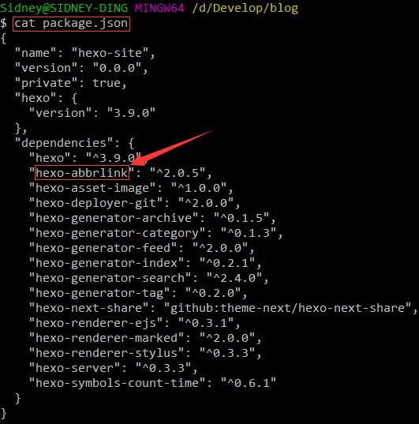
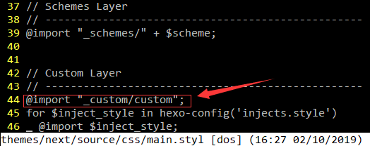
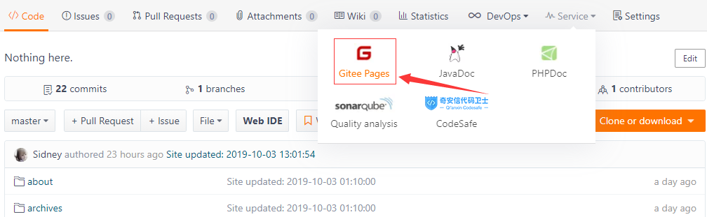
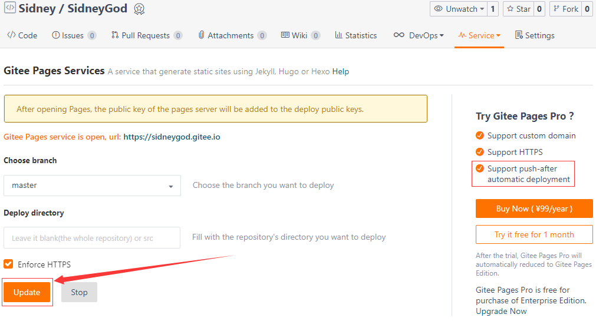
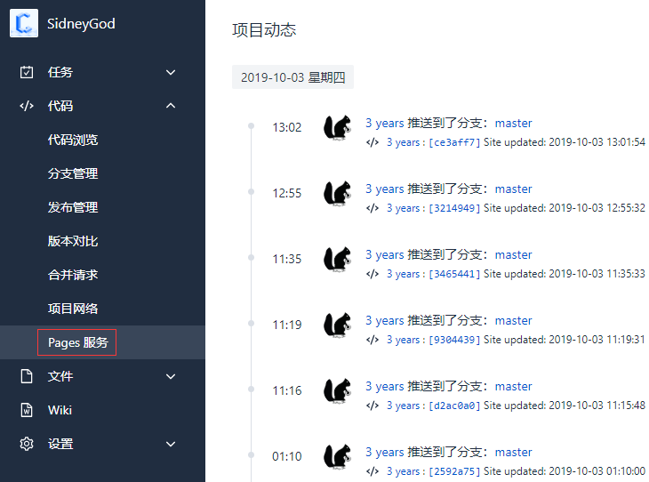
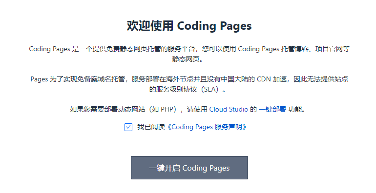

# 1 Getting Started

首先跟着hexo官方文档走一遍：https://hexo.io/docs/

1. 安装git：https://hexo.io/docs/#Install-Git

2. 安装Node.js：https://hexo.io/docs/#Install-Node-js

3. 安装hexo

   ```bash
   # Win下 找个目录右键 Git Bash Here
   npm install -g hexo-cli
   ```

   <!--more-->

4. 初始化blog

   ```bash
   # 创建blog目录
   mkdir blog
   # 进入blog目录
   cd blog
   # 初始化
   hexo init
   ```

   初始化好后，目录下有这么些东西

   `_config.yml`：blog的配置文件，yaml语言

   `package.json`：存储的是一些blog安装信息，比如一些dependencies

   `scaffolds`：存储新建页面的模板

   `source`：blog的主要文件，hexo会渲染这里面的文件，隐藏文件，文件或文件夹名以`_`开头不会进行渲染，`_post`文件夹除外

   `themes`：主题文件夹，最需折腾的一个地方

   其实到这里再运行一下`hexo g && hexo s`就可以在本地欣赏你的blog了，默认地址是：[https://localhost:4000](https://localhost:4000)，但是问题是，样式有点丑，折腾theme吧

5. 修改theme

   这里我采用的是既然大家都在用，那我也来用用的NexT主题，是的我们要换一个官方文档了：https://theme-next.org/docs/

   安装theme：https://theme-next.org/docs/getting-started/installation

   ```bash
   # 可能忘了说了 git安装好了 你要配置一下哈
   git clone https://github.com/theme-next/hexo-theme-next themes/next
   ```

   好了，准备工作做好了，开始配置吧

# 2 Configuration

## 2.1 hexo

打开hexo的配置文件我们来欣赏一下配置文件

```bash
# 确定当前在blog目录下哈 很少需要切换目录的
vim _config.yml
```

欣赏优雅的配置文件，还好这文件不算太长，我就一句一句加注释吧，参考官网：https://hexo.io/docs/configuration

```yaml
# Hexo Configuration
## Docs: https://hexo.io/docs/configuration.html
## Source: https://github.com/hexojs/hexo/

# Site
title: Sidney God  # 网站标题
subtitle: Keep quiet time for time  # 网站副标题
description: You laugh at me for being different, but I laugh at you for being the same.  # 网站描述
keywords: Sidney, Ding, Sidney Ding  # 关键词
author: Sidney Ding  # 您的名字
language: en  # 网站使用的语言 中文是zh-Hans
timezone: Asia/Shanghai  # 设置时区

# URL
## If your site is put in a subdirectory, set url as 'http://yoursite.com/child' and root as '/child/'
url: https://sidneygod.coding.me  # 网址 可以不写
root: /  # 网站根目录
permalink: posts/:abbrlink/  # 文章的永久链接格式 先用默认值 我的做了修改 后来说
permalink_defaults:

# Directory 下面是默认目录 不要动 没意义
source_dir: source
public_dir: public
tag_dir: tags
archive_dir: archives
category_dir: categories
code_dir: downloads/code
i18n_dir: :lang
skip_render: README.md  # 跳过渲染的文件 可以不要

# Writing
new_post_name: :title.md # File name of new posts
default_layout: post
titlecase: false # Transform title into titlecase
auto_spacing: false  # 中文和英文之间加空格
external_link: true # Open external links in new tab
filename_case: 0
render_drafts: false
post_asset_folder: true  # 启动asset文件夹 如果文章图片多的话 建议开启
relative_link: false
future: true
highlight:
  enable: true  # 代码块高亮
  line_number: true  # 显示行号
  auto_detect: false  # 自动检测语言
  tab_replace: true  # tab自动转空格
  
# Home page setting
# path: Root path for your blogs index page. (default = '')
# per_page: Posts displayed per page. (0 = disable pagination)
# order_by: Posts order. (Order by date descending by default)
index_generator:
  path: ''
  per_page: 10
  order_by: -date
  
# Category & Tag
default_category: uncategorized
category_map:
tag_map:

# Date / Time format
## Hexo uses Moment.js to parse and display date
## You can customize the date format as defined in
## http://momentjs.com/docs/#/displaying/format/
date_format: YYYY-MM-DD
time_format: HH:mm:ss

# Pagination
## Set per_page to 0 to disable pagination
per_page: 10
pagination_dir: page

# Themes: https://hexo.io/themes/
theme: next  # 当前主题名称 当然是要换成刚下载的了

# Deployment
## Docs: https://hexo.io/docs/deployment.html
deploy:
  type: git
  repo:
    # 这个部署就按照这个样式 GitHub的仓库 <用户名>.github.io
    github: git@github.com:SidneyGod/SidneyGod.github.io.git
    # 码云的仓库 <用户名> 码云比较坑 需要手动更新
    gitee: git@gitee.com:SidneyGod/SidneyGod.git
    # coding的仓库 <用户名>
    coding: git@git.dev.tencent.com:SidneyGod/SidneyGod.git
  branch: master

# Extensions 下面是一些插件 每个插件我都给了地址 具体怎么安装 可打开那些地址
## Plugins: https://hexo.io/plugins/
### Feed Atom https://github.com/hexojs/hexo-generator-feed
feed:
  type: atom
  path: atom.xml
  limit: 20
  order_by: -date
  icon: icon.png
  autodiscovery: true

### Local Search https://github.com/wzpan/hexo-generator-search
search:
  path: search.xml
  field: post
  format: html
  limit: 999

### https://github.com/theme-next/hexo-symbols-count-time
symbols_count_time:
  symbols: true
  time: true
  total_symbols: true
  total_time: true
  exclude_codeblock: false

### https://github.com/Rozbo/hexo-abbrlink
abbrlink:
  alg: crc32  #support crc16(default) and crc32
  rep: hex    #support dec(default) and hex
```

好了，hexo的配置文件完了，再举个例子，怎么安装依赖吧，就举那个abbrlink吧

先打开上面那个地址：https://github.com/Rozbo/hexo-abbrlink

然后跟着他的步骤走一遍

```bash
# 安装
npm install hexo-abbrlink --save
# 修改配置文件
vim _config.yml
```

一个是`permalink: posts/:abbrlink/`，如果你把它修改成`permalink: p/:abbrlink/`和简书的地址长得就很像了:joy:

另一个就是在下面添加

```yaml
# abbrlink config
abbrlink:
  alg: crc32  #support crc16(default) and crc32
  rep: hex    #support dec(default) and hex
```

嗯，安装好了，下一个...很简单，对不对，那么问题来了，如果安装了一个插件，然后觉得不好了，咋卸了它呢？直接执行

```bash
npm uninstall hexo-abbrlink
# 然后把你修改过的地方 改回来
```

要是忘了这个插件名，怎么办？丢个图，自己体会



好了hexo的配置告一段落

关于评论的配置，参考：https://www.jianshu.com/p/f4658df66a15

## 2.2 NexT

接下来看next的配置文件，我们还接着一行一行注释吧，不！我拒绝，1000来行呢，我愿意，这看着也不舒服。丢个网址自己看：https://theme-next.org/docs/theme-settings/

说说插件吧，其实套路都一样

```bash
# Post wordcount display settings
# Dependencies: https://github.com/theme-next/hexo-symbols-count-time
symbols_count_time:
  separated_meta: true
  item_text_post: true
  item_text_total: true
  awl: 4
  wpm: 275
```

看到没，上面又有地址，这摆明了让你打开它，不打开它都不对不起它对你招了又招的小手：https://github.com/theme-next/hexo-symbols-count-time

然后你看到了吧，又是安装

```bash
npm install hexo-symbols-count-time --save
```

然后改配置

```yaml
symbols_count_time:
  separated_meta: true
  item_text_post: true
  item_text_total: false
  awl: 4  # 中文建议改成 2
  wpm: 275  # 中文建议改成 300
  suffix: mins.
```

要勇于尝试，还有看到别人家有的特效，都可以找找，不过特效越多，加载可能就会慢一点，毕竟文件多了嘛

# 3 Beautify

有了物质基础，当然要享受了，关于美化NexT的文章多得不得了，但是大多针对的是之前的NexT，有的美化可能需要修改`*.styl`文件什么的，其实没必要，新版本的NexT已经集成了那些特性，修改配置文件就有了

我比较懒，推荐几篇文档：

[hexo的next主题个性化配置教程](http://shenzekun.cn/hexo的next主题个性化配置教程.html)

[NexT主题的优化定制修改指南](https://blog.csdn.net/u012195214/article/details/79204088)

[如何给个人博客换上专属免费域名](https://leflacon.github.io/59f6b91c/)

还有自己搜索去吧...

对前端有了解的话，肯定知道，静态页面咋改都行，浏览器慢慢调试就是咯，NexT之前是有预留`_custom.styl`给用户自己修改css样式的，现在需要加点东西

```bash
vim themes/next/source/css/main.styl
```

首先说明，我并不懂这语法，也不想学，但是按照模样修改还是可以的



就加了那句红框，然后在这个目录下创建`_custom`目录，再创建`custom.styl`文件，下面给出我的自定义css样式

```css
// Custom styles.
// 文章内链接文本样式
.post-body p a{
  color: #0593d3;
  border-bottom: none;
  border-bottom: 1px solid #0593d3;
  &:hover {
    color: #fc6423;
    border-bottom: none;
    border-bottom: 1px solid #fc6423;
  }
}

// 文章背景半透明
.content {
  border-radius: 20px; //文章背景设置圆角
  padding: 10px 50px 20px 50px;
  background:rgba(255, 255, 255, 0.8) none repeat scroll !important;
}

.post-block {
  margin-top: 10px;
  background: rgba(255, 255, 255, 0) none repeat scroll !important;
}

.post {
  background: rgba(255, 255, 255, 0) none repeat scroll !important;
  box-shadow: 0 0 0 0 rgba(0, 0, 0, 0), 0 0 0 0 rgba(0, 0, 0, 0), 0 0 0 0 rgba(0, 0, 0, 0);
}

.page {
  background: rgba(255, 255, 255, 0) none repeat scroll !important;
  box-shadow: 0 0 0 0 rgba(0, 0, 0, 0), 0 0 0 0 rgba(0, 0, 0, 0), 0 0 0 0 rgba(0, 0, 0, 0);
}

// 去除页面底部页码上面的横线
.pagination {
    border: none;
    margin: 0px;
}
// 去掉图片边框
.posts-expand .post-body img {
    border: none;
    padding: 0px;
}
.post-gallery .post-gallery-img img {
    padding: 3px;
}
.posts-expand .post-title {
    font-size: 26px;
    font-weight: 700;
    letter-spacing: 1px;
}

// 去除在页面文章之间的分割线
.posts-expand .post-eof {
    margin: 0px;
    background-color: rgba(255, 255, 255, 0);
}

// 选中文字部分的样式
::selection {
    background-color: #222222;
    color: #fced6d;
}

// 鼠标样式
* {
  cursor: url("/./cursor/pointer.ico"),auto!important
}
:active {
  cursor: url("/./cursor/click.ico"),auto!important
}

// fonts
@font-face {
  font-family: 'DFGirlFull';
  src: url('/fonts/DFGirlFull.ttf');
  font-weight: 400;
}
@font-face {
  font-family: 'ModernAntiqua';
  src: url('/fonts/ModernAntiqua.ttf');
  font-weight: 400;
}
@font-face {
  font-family: 'Monaco';
  src: url('/fonts/Monaco.ttf');
  font-weight: 400;
}
```

这个文件中的鼠标样式和字体需要自己提供，置于位置，记住`blog/themes/next/source`就是根目录，然后放哪，你开心就好，这其实就是主题的核心样式位置，还有个布局格式在`blog/themes/next/layout`，难度不大

# 4 Deploy

## 4.1 写篇文章

一切都做好了，终于可以开始愉快的写blog了，新建一篇blog

```bash
hexo new "Article Name"
```

然后就会在`blog/source/_posts`新建一个`Article Name.md`文件，打开这个文件你就可以写blog了。问题来了，这以后blog文章一旦多了，找md文件多费事，能不能在new完自动打开这个文件？当然能！hexo作者这点还是想到了的

首先在`hexo`目录的`scripts`目录中创建一个JavaScript文件，文件名随意，如果没有`scripts`那就创建一个，然后在js文件中添加这么段代码

Win：

```javascript
var spawn = require('child_process').exec;

// Hexo 3 用户复制这段
hexo.on('new', function(data){
  // 这是我打开markdown文件软件的路径
  spawn('start  "D:\Program Files\Typora\Typora.exe" ' + data.path);
});
```

Mac：

```javascript
var exec = require('child_process').exec;

// Hexo 3 用户复制这段
hexo.on('new', function(data){
    exec('open -a "markdown编辑器绝对路径.app" ' + data.path);
});
```

## 4.2 发布

写好了，那就发布吧

### 4.2.1 安装插件

```bash
# 安装插件
npm install hexo-deployer-git --save
# 修改hexo配置文件
vim _config.yml
```

上面说过的

```yaml
# Deployment
## Docs: https://hexo.io/docs/deployment.html
deploy:
  type: git
  repo:
    # 这个部署就按照这个样式 GitHub的仓库 <用户名>.github.io
    github: git@github.com:SidneyGod/SidneyGod.github.io.git
    # 码云的仓库 <用户名> 码云比较坑 需要手动更新
    gitee: git@gitee.com:SidneyGod/SidneyGod.git
    # coding的仓库 <用户名>
    coding: git@git.dev.tencent.com:SidneyGod/SidneyGod.git
  branch: master
```

### 4.2.2 创建仓库

**github**

创建好`<用户名>.github.io`仓库，git地址也是对的，就可以直接部署了，每次更新，github也会自动更新

毕竟github不在国内，可能访问速度有点慢

**码云**

创建好同名仓库，然后需要以下操作

1. 进入仓库 > Service > Gitee Pages

   

2. 点击Update

   

**这不是只要做一次，而是你每次更新页面都需要手动去更新!!!**

~~**coding**~~

创建好同名仓库，只需要做一次，之后会自动同步

1. 进入仓库 > 代码 > Pages 服务

   

2. 一键开启

   

已经被腾讯买了

### 4.2.3 hexo命令

这个时候就可以通过

```bash
# 清空public目录 没必要每次都做 除非安装了新插件什么的
hexo clean
# 生成文件
hexo g # hexo generate
# 部署到git仓库
hexo d # hexo deploy
```

这时候就可以通过

https://sidneygod.github.io/

~~https://sidneygod.coding.me/~~

https://sidneygod.gitee.io/

访问blog了